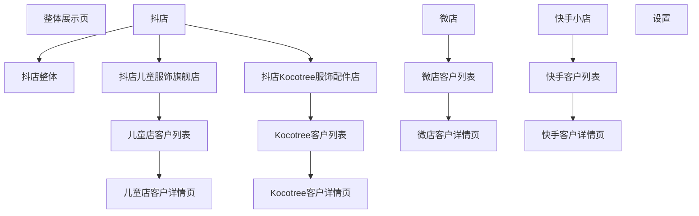

# AI客户看板静态前端设计思路

> 文档状态：**设计已确认；第一版静态页面已完成**  
> 输出目录：`D:\实习\AI客户看板\8.11\`  
> 原型依据：用户提供的整体页面结构图、客户列表详情页结构图  
> 本阶段目标：确认页面层级、模块内容、客户ID跳转逻辑和静态交互是否符合业务想法。  
> 文件约束：后续生成的HTML、CSS、JavaScript、图片及说明文档全部保存在`8.11`文件夹下。

## 一、我对整体需求的理解

看板包含五个一级入口：

1. 整体展示页
2. 微店
3. 抖店
4. 快手小店
5. 设置

其中抖店包含三个二级入口：

1. 抖店整体
2. 抖店儿童服饰旗舰店
3. 抖店Kocotree服饰配件店

所有业务页面围绕三个模块展开：

- 销售模块
- 客户模块
- 商品模块

但不同页面的客户模块功能不同：

- 整体展示页和抖店整体页：客户模块只展示客户健康度，不展示客户列表。
- 微店、抖店儿童服饰旗舰店、抖店Kocotree服饰配件店、快手小店：客户模块同时展示健康度和客户列表。
- 客户列表中的客户ID可以点击；点击后跳转到该客户的独立详情页。

## 二、页面信息架构



## 三、整体页面布局

### 1. 左侧导航栏

页面左侧使用固定导航栏，菜单结构如下：

```text
AI客户看板
├── 整体展示页
├── 微店
├── 抖店
│   ├── 整体
│   ├── 抖店儿童服饰旗舰店
│   └── 抖店Kocotree服饰配件店
├── 快手小店
├── 上传
└── 设置
```

交互规则：

- 当前页面菜单高亮。
- 点击“抖店”可以展开或收起三个二级菜单。
- 点击菜单后切换到相应静态页面或静态视图。
- 客户详情页仍保留左侧导航，并通过面包屑显示所属平台和店铺。

### 2. 顶部区域

主内容区顶部显示：

- 当前页面名称。
- 当前平台或店铺名称。
- 数据更新时间。
- 当前统计日期。默认使用最新有数据的日期，修改日期后联动顶部指标、销售、退货退款、客户健康度、商品、客户列表和微店预售模块。

### 3. 主内容区域

主内容区按照“销售模块、客户模块、商品模块、退货退款模块”的顺序排列；微店额外展示预售模块。桌面端优先采用卡片和图表结合的布局，避免把所有信息直接堆成一张大表。

## 四、整体展示页

整体展示页用于查看所有平台的总体情况，不进入具体客户名单。

### 1. 销售模块

支持以下时间维度切换：

- 日
- 周
- 月
- 季度
- 半年

主要展示：

- 当前时间维度销售额。
- 对应时间趋势图。
- 日维度可展示日销售额、近7日销售额和近30日销售额。
- 周维度展示周销售额及周环比。
- 月维度展示月销售额及月环比。
- 季度维度展示季度销售额。
- 半年维度展示半年销售额。

### 2. 客户模块

整体展示页的客户模块只关注业务半年客户健康度，不展示客户列表。

主要展示：

- 高活跃客户数量。
- 活跃客户数量。
- 稳定客户数量。
- 观察客户数量。
- 风险客户数量。
- 流失预警客户数量。
- 流失客户数量。

建议采用健康状态分布图和状态数量卡片。

### 3. 商品模块

商品模块只使用业务半年维度，展示半年高频商品：

- 商品数量最高的5种商品。
- 交易金额最高的5种商品。
- 同一商品同时进入两个榜单时，只展示一次。

### 4. 退货退款模块

所有平台和整体汇总页均展示退款金额信息。经数据库核对，现有退款表只包含周期开始、周期结束和退款金额，因此页面只支持周、月、季度、半年，并展示所选周期退款金额、上一周期退款金额、两期金额变化及真实历史趋势；不展示数据库中不存在的退款订单数、退款率和退款原因。

## 五、微店页面

微店页面包含销售模块、客户模块、商品模块、退货退款模块和微店专属预售模块。

### 1. 销售模块

支持日、周、月、季度、半年时间维度，展示对应时间维度的整体销售信息。

### 2. 客户健康度

只使用业务半年维度，展示微店客户健康状态分布。

### 3. 客户列表

客户列表使用业务半年维度：

- 默认按照当前选中业务半年的销售额从高到低排序。
- 默认第一页显示销售额排名前20的客户。
- 每页20条，支持分页查看后续客户。
- 支持输入客户ID进行精确筛选。
- 客户ID显示为可点击链接。
- 点击客户ID后跳转到该客户的独立详情页。

客户列表建议字段：

| 字段 | 说明 |
|---|---|
| 客户ID | 可点击，进入客户详情页 |
| 客户昵称 | 客户显示名称 |
| 半年销售额 | 当前业务半年销售额 |
| 半年拿货次数 | 当前业务半年拿货次数 |
| 健康度得分 | 当前业务半年健康度分数 |
| 健康状态 | 高活跃、活跃、稳定、观察、风险、流失预警或流失 |

### 4. 商品模块

只使用业务半年维度，展示商品数量Top5和交易金额Top5。

### 5. 退货退款模块

展示当前统计日期对应的周、月、季度或半年退款金额、上一周期金额和金额变化趋势。

### 6. 预售模块

仅微店页面展示。经数据库核对，预售表支持月、季度、半年，页面展示预售交易金额、预售商品数量、预售商品种数，以及当前周期金额Top5商品；不展示数据库中不存在的预售订单数、待发货订单数和完成率。

## 六、抖店页面

### 1. 抖店整体页

抖店整体页读取两家抖店总体汇总结果。

页面模块：

- 销售模块：日、周、月、季度、半年。
- 客户模块：只展示业务半年健康度，不显示客户列表。
- 商品模块：只展示业务半年数量Top5和金额Top5商品。
- 退款金额模块：支持周、月、季度、半年。

对应当前`doudian` Schema中的7张总体汇总表。

### 2. 抖店儿童服饰旗舰店页面

页面模块：

- 销售模块：日、周、月、季度、半年。
- 客户健康度：只使用业务半年维度。
- 客户列表：按半年销售额排序，每页20条，支持客户ID筛选。
- 商品模块：只使用业务半年维度。
- 退款金额模块：支持周、月、季度、半年。

点击客户列表中的客户ID后，进入儿童服饰旗舰店客户详情页。

### 3. 抖店Kocotree服饰配件店页面

页面模块和儿童店一致：

- 销售模块：日、周、月、季度、半年。
- 客户健康度：只使用业务半年维度。
- 客户列表：按半年销售额排序，每页20条，支持客户ID筛选。
- 商品模块：只使用业务半年维度。
- 退款金额模块：支持周、月、季度、半年。

点击客户列表中的客户ID后，进入Kocotree客户详情页。

## 七、快手小店页面

快手小店页面结构与微店页面一致：

- 销售模块：日、周、月、季度、半年。
- 客户健康度：只使用业务半年维度。
- 客户列表：按半年销售额排序，每页20条，支持客户ID筛选。
- 商品模块：只使用业务半年维度。
- 退款金额模块：支持周、月、季度、半年；不展示预售模块。

点击客户列表中的客户ID后，进入快手客户详情页。

## 八、客户列表与客户ID跳转规则

### 1. 列表默认状态

- 默认选中最新业务半年。
- 默认按半年销售额倒序排列。
- 第一页展示销售额最高的20名客户。
- 翻页后继续展示后续客户。

### 2. 客户ID筛选

- 页面提供客户ID输入框。
- 输入完整客户ID后执行精确筛选。
- 筛选范围为该店铺的全部客户，不只限制在当前第一页的20名客户中。
- 清空筛选条件后恢复半年销售额排序列表。

### 3. 客户ID点击

客户ID采用链接样式，并具有明显的悬停效果。点击后跳转到对应平台或店铺的客户详情页。

建议路由形式：

```text
/weidian/customers/{customerId}
/doudian/children/customers/{customerId}
/doudian/kocotree/customers/{customerId}
/kuaishou/customers/{customerId}
```

客户详情页通过路由中的平台、店铺和客户ID确定展示对象，避免不同平台的相同客户ID发生混淆。

## 九、客户列表详情页

客户详情页是在客户列表中点击客户ID后进入的独立页面，不采用原列表中的弹窗。

### 1. 页面顶部

展示：

- 返回客户列表按钮。
- 面包屑，例如“抖店 / 儿童服饰旗舰店 / 客户列表 / 客户ID”。
- 客户ID。
- 客户昵称。
- 当前平台和店铺。
- 当前健康状态。

### 2. 详情页主体布局

桌面端使用左右布局：

```text
┌────────────────────────────────────┬──────────────┐
│ 客户各时间维度数据                 │ AI交流模块   │
│                                    │              │
│ 日数据                             │ 对话记录     │
│ 周数据                             │ 问题输入框   │
│ 月数据                             │ 发送按钮     │
│ 季度数据                           │              │
│ 半年数据                           │              │
└────────────────────────────────────┴──────────────┘
```

左侧数据区域约占页面宽度的70%—75%，右侧AI交流模块约占25%—30%。

### 3. 日维度区域

展示：

- 日销售额。
- 近7日销售额。
- 近30日销售额。
- 日商品销售额。

建议使用指标卡和日趋势图，并支持查看当日商品明细。

### 4. 周维度区域

展示：

- 周销售额。
- 周拿货次数。

### 5. 月维度区域

展示：

- 月销售额。
- 月拿货次数。
- 月商品拿货情况。

月商品拿货情况建议展示商品编码、商品数量和对应金额，以覆盖原型图中的“月商品拿货次数”信息。

### 6. 季度维度区域

展示：

- 季度销售额。
- 季度拿货次数。
- 季度商品销售额。

### 7. 半年维度区域

展示：

- 半年销售额。
- 半年拿货次数。
- 半年商品销售额。
- 半年健康度得分和健康状态。

### 8. AI交流模块

静态前端阶段先制作视觉和交互样式，不连接真实AI服务。

静态效果包括：

- 固定的欢迎语。
- 两至三条示例问答。
- 问题输入框。
- 发送按钮。
- 点击发送后在本地显示一条模拟回复。

示例问题：

- “这个客户最近的销售表现怎么样？”
- “这个客户为什么被判断为风险？”
- “该客户近半年主要销售哪些商品？”

## 九-A、上传页面

左侧“上传”进入独立数据文件上传页，支持`.xlsx`和`.csv`：

- 微店：1个上传入口。
- 抖店儿童服饰旗舰店：1个独立上传入口。
- 抖店Kocotree服饰配件店：1个独立上传入口。
- 快手小店：1个上传入口。

抖店两家店铺的文件不可混用，必须分别选择。当前静态版本提供文件选择、拖放、格式判断、文件名称和大小展示以及确认操作，不读取文件内容、不写入数据库。后续接入后端时继续沿用“一次性全部成功或全部失败”的原子上传原则。

## 十、设置页面

设置页面包含两个区域：

### 1. 客户状态规则设置

默认展示高活跃、活跃、稳定、观察、风险、流失预警、流失7种客户分类，每条规则均包含：

- 客户状态。
- 状态说明。
- 建议跟进动作。

客户状态名称固定为以上7类，不能新增、删除或改名；用户只编辑“状态说明”和“建议跟进动作”。当前版本先展示前端编辑形态，后续保存按钮与后端规则表接口对接。

### 2. AI大模型设置

页面只保留两个字段：

- `api_key`：使用密码输入框展示。
- `base_url`：AI服务基础地址。

两个参数分别使用“左侧字段名、右侧输入框”的上下两行布局。

正式接入时由后端加密保存`api_key`，前端只展示掩码，不直接读取密钥明文。

## 十一、视觉设计方向

整体采用偏业务看板的深色风格，与用户原型图保持一致，但不保留原型图中的网格背景。

建议视觉规范：

- 页面背景：深蓝黑或深灰色。
- 导航栏：比页面背景更深一层。
- 主要卡片：深灰蓝色，使用轻微边框和圆角。
- 主色：蓝色或青蓝色，用于选中状态、链接和主要按钮。
- 正常或健康状态：绿色。
- 观察状态：黄色。
- 风险和流失预警：橙色、红色。
- 数据卡片突出数字，说明文字降低视觉权重。
- 客户ID使用蓝色链接样式，明确表达“可以点击”。

## 十二、静态页面交互范围

静态版本计划实现：

- 左侧菜单切换。
- 抖店二级菜单展开和收起。
- 日、周、月、季度、半年标签切换。
- 业务半年选择。
- 客户ID输入筛选。
- 客户列表分页。
- 点击客户ID进入独立详情页。
- 返回客户列表。
- 商品数量Top5和金额Top5切换或并列展示。
- AI交流模块的本地模拟对话。
- 设置表单的本地交互效果。

静态版本暂不实现：

- 真实数据库连接。
- 真实登录和权限控制。
- 真实AI接口调用。
- 设置数据持久化。
- 后端接口和自动刷新。

## 十三、后续静态前端文件规划

用户确认本文后，再在`8.11`文件夹中生成前端文件。建议结构：

```text
8.11/
├── AI客户看板静态前端设计思路.md
└── frontend/
    ├── index.html
    ├── customer-detail.html
    ├── css/
    │   └── styles.css
    ├── js/
    │   ├── mock-data.js
    │   ├── app.js
    │   └── customer-detail.js
    └── assets/
```

静态页面可以直接双击`index.html`打开查看，不要求启动后端服务。

## 十四、建议制作顺序

```text
1. 创建统一页面框架和左侧导航
2. 完成整体展示页
3. 完成微店页面
4. 完成抖店整体页
5. 完成抖店两个具体店铺页面
6. 完成快手小店页面
7. 完成客户列表、客户ID筛选和分页
8. 完成独立客户详情页
9. 完成AI交流模块静态效果
10. 完成设置页面
11. 统一响应式布局和视觉细节
12. 浏览器逐页检查跳转和交互
```

## 十五、审核清单

请将确认项从`[ ]`修改为`[x]`；如需调整，可直接编辑本文对应内容。

- [x] 确认所有输出文件统一放在`8.11`文件夹下。
- [x] 确认左侧一级菜单为整体展示页、微店、抖店、快手小店和设置。
- [x] 确认抖店包含整体、儿童服饰旗舰店和Kocotree服饰配件店三个二级页面。
- [x] 确认销售模块支持日、周、月、季度和半年。
- [x] 确认整体展示页和抖店整体页的客户模块只展示健康度。
- [x] 确认微店、两个抖店店铺和快手页面显示健康度及客户列表。
- [x] 确认客户列表默认按半年销售额倒序，每页20条并支持分页。
- [x] 确认客户ID筛选范围为当前店铺的全部客户。
- [x] 确认点击客户ID跳转到独立客户详情页，而不是弹窗。
- [x] 确认客户详情页展示日、周、月、季度和半年数据。
- [x] 确认客户详情页右侧保留AI交流模块。
- [x] 确认客户模块和商品模块只使用业务半年维度。
- [x] 确认高频商品为半年商品数量Top5和交易金额Top5。
- [x] 确认静态页面暂不连接真实数据库和真实AI服务。
- [x] 确认整体采用深色业务看板风格。

## 十六、当前进度

| 项目 | 状态 |
|---|---|
| 两张原型图阅读 | 已完成 |
| 页面层级理解 | 已完成 |
| 客户ID跳转逻辑设计 | 已完成 |
| 客户详情页内容设计 | 已完成 |
| 可编辑Markdown设计稿 | 已完成并确认 |
| 第一版静态前端页面 | 已完成 |
| 抖店儿童服饰旗舰店看板 | 已完成 |
| 客户ID筛选和详情页跳转 | 已完成 |
| 客户详情页AI交流静态效果 | 已完成 |
| 整体、微店、抖店、快手及设置页切换 | 已完成静态视图 |
| 顶部统计日期及下方模块联动 | 已完成静态交互 |
| 全平台退货退款模块 | 已完成 |
| 微店预售模块 | 已完成 |
| 微店、两家抖店和快手文件上传入口 | 已完成静态交互 |

## 十七、第一版静态页面实际结果

第一版静态页面位于：

```text
D:\实习\AI客户看板\8.11\frontend\
```

本版已实现：

- 深色业务看板视觉风格。
- 左侧完整平台导航、选中态及抖店三级菜单展开。
- 整体展示页、微店、抖店整体、两家抖店、快手小店之间的页面切换。
- 每个平台页面独立显示标题、面包屑与静态指标卡。
- 抖店儿童服饰旗舰店销售概览。
- 日、周、月、季度、半年销售标签切换。
- 顶部统计日期选择，并联动销售、客户、商品和业务模块的周期与静态指标。
- 半年客户健康度分布。
- 半年商品数量Top5和金额Top5切换。
- 所有平台基于真实退款表字段的周、月、季度、半年退款金额板块。
- 微店基于真实预售表字段的月、季度、半年商品预售板块。
- 左侧独立上传页面：微店1个入口、抖店2个店铺入口、快手1个入口，支持`.xlsx`和`.csv`格式校验。
- 真实静态样例客户Top20列表。
- 客户ID输入筛选。
- 点击客户ID进入独立详情视图。
- 客户详情地址保留所属平台，返回后回到原平台客户列表。
- 客户详情页日、周、月、季度、半年信息。
- 右侧AI交流区及本地模拟回复。
- 设置页7类可编辑客户状态规则，以及`api_key`、`base_url`配置原型。
- 桌面、平板和手机宽度的响应式布局。

页面已通过正式构建和自动检查。本版只用于确认视觉与交互方向，不连接真实数据库和真实AI服务。
