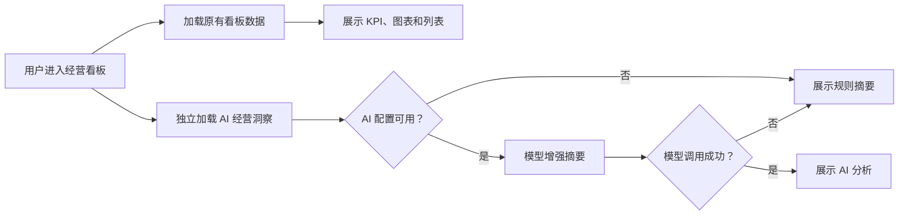

# PR：AI 经营洞察——规则摘要与模型增强

> 状态：已实施并完成自动验证，待用户页面审查
> 功能批次：AI 智能看板第 1 个功能
> 数据库：沿用 PostgreSQL `weidian`，只读现有业务表，不新增业务数据库或数据表
> 实施范围：登录后的经营看板、后端洞察接口、规则摘要、可选的大模型增强、测试与前后端重启验收

## 1. PR 目标

在现有经营看板中增加一个“AI 经营洞察”区域，把已经展示的销售、退款、客户健康度、商品排行和趋势数据转换成简短、可执行的经营结论。

本功能必须满足以下原则：

1. 用户没有配置 `api_key` 时，功能仍可使用，由后端规则引擎生成“规则摘要”。
2. 用户登录后在“AI 设置”中保存了可用的 `api_key`、`base_url` 和 `model_name` 时，在规则证据基础上调用大模型增强文字表达。
3. 大模型不可用、超时或返回异常时，自动降级为规则摘要，不能影响原有看板加载。
4. 所有数字均来自后端查询结果，大模型不得自行计算、补造或修改经营指标。
5. 本 PR 只实现“AI 经营洞察”，不同时开发全局问数、客户详情 AI、上传分析、AgentSwarm 或自动执行经营动作。

## 2. 用户使用流程

### 2.1 未配置 AI 的用户

1. 用户正常登录并进入经营看板。
2. 看板先按现有逻辑加载，不等待 AI 接口。
3. “AI 经营洞察”区域请求后端洞察接口。
4. 后端读取经营数据并生成规则摘要。
5. 前端展示“规则摘要”标识、经营结论、数据证据和建议动作。
6. 区域内展示“前往 AI 设置”按钮；用户可以继续使用规则摘要，也可以进入设置页配置模型。

### 2.2 已配置 AI 的用户

1. 用户正常登录并进入经营看板。
2. 后端先生成可信的规则证据和候选结论。
3. 后端读取当前登录用户所属角色的 AI 配置。
4. 后端将规则证据发送给已配置的大模型，只允许模型润色和归纳摘要。
5. 前端展示“AI 分析”标识及增强后的经营摘要；指标证据和建议动作仍以后端规则结果为准。

### 2.3 模型异常时

1. 模型请求超时、鉴权失败、限流或响应格式异常。
2. 后端记录请求日志，不返回模型密钥和完整敏感请求内容。
3. 后端立即返回规则摘要，并附加“AI 服务暂不可用，已展示规则分析”的非阻断提示。
4. 原看板和洞察区域均可继续使用。

## 3. 页面设计与整合位置

在现有 `DashboardPage` 顶部标题区域之后、核心 KPI 卡片之前增加独立的 `AiInsightPanel`。

面板内容包括：

- 标题：`AI 经营洞察`。
- 模式标签：`规则摘要`、`AI 分析` 或 `已降级`。
- 一句话结论：当前最值得关注的经营变化。
- 摘要正文：2 至 4 句，说明趋势、风险和机会。
- 数据证据：最多 4 条，每条必须包含指标名称、数值、比较口径和数据日期。
- 建议动作：最多 3 条，使用“建议检查/建议关注/建议跟进”等辅助性表达，不自动执行。
- 更新时间：展示 `as_of` 和洞察生成时间。
- 未配置状态操作：`前往 AI 设置`。
- 手动刷新：只刷新洞察，不强制刷新整个页面。

组件必须与现有深色看板风格一致，不改变已有 KPI、图表、客户列表和导航结构。

## 4. 页面状态

| 状态 | 展示方式 | 是否影响原看板 |
| --- | --- | --- |
| 加载中 | 面板骨架屏或“正在分析经营数据” | 否 |
| 未配置 AI | 展示规则摘要和“前往 AI 设置”按钮 | 否 |
| AI 配置可用 | 展示 AI 增强摘要，证据仍来自规则引擎 | 否 |
| 模型调用失败 | 展示规则摘要和降级提示 | 否 |
| 当前范围无数据 | 展示“当前范围暂无足够数据”，不生成虚假结论 | 否 |
| 登录失效 | 沿用现有统一登录失效处理 | 是，由现有鉴权逻辑处理 |
| 接口异常 | 面板内展示重试按钮 | 否 |

## 5. 数据库与数据来源

### 5.1 使用的数据库

本功能只连接现有 PostgreSQL 数据库：

- 数据库名：`weidian`。
- 连接方式：复用后端当前数据库连接池和配置，不增加前端直连数据库能力。
- 权限要求：只读查询现有经营数据；本 PR 不新增表、不写入经营表。

### 5.2 使用的店铺 Schema

按照当前角色和范围权限读取现有 9 个店铺 Schema：

| 业务类型 | Schema |
| --- | --- |
| 达人渠道 | `weidian`、`doudianChildren`、`doudianKocotree`、`kuaishouxiaodian` |
| 私域渠道 | `qijian`、`muyinqijian`、`kuaituantuan` |
| 分销渠道 | `alibaba`、`jushuitan` |

后端继续通过现有 `resolve_scope` 约束用户可查看的 Schema，不允许前端提交任意 Schema 名称。

### 5.3 使用的现有业务表

| 洞察内容 | 表或表族 | 主要用途 |
| --- | --- | --- |
| 销售规模与趋势 | `daily_sales`、`weekly_sales`、`monthly_sales`、`quarterly_sales`、`half_year_sales` | 判断销售额、订单量及环比趋势 |
| 客户贡献与健康度 | `customer_*_sales`、`customer_health_detail` | 判断客户贡献、健康分层和风险数量 |
| 商品表现 | `*_product_sales` | 识别销售排名靠前的商品及集中度 |
| 退款风险 | `weekly_refunds`、`monthly_refunds`、`quarterly_refunds`、`half_year_refunds` | 判断退款变化和异常风险 |
| 预售表现 | `weidian.*_product_presales` | 仅在微店范围内提供预售相关证据 |

说明：实际查询继续复用现有 `DashboardRepository`、`DashboardService` 的口径。若实现中发现某项现有返回数据不足，只允许增加只读聚合查询，并在实施记录中写清表、字段、过滤条件和聚合方式。

### 5.4 AI 配置来源

AI 配置不从上述业务表读取。后端复用现有登录后角色级配置：

- `AI_MANAGER_API_KEY`、`AI_MANAGER_BASE_URL`、`AI_MANAGER_MODEL_NAME`
- `AI_TALENT_API_KEY`、`AI_TALENT_BASE_URL`、`AI_TALENT_MODEL_NAME`
- `AI_PRIVATE_API_KEY`、`AI_PRIVATE_BASE_URL`、`AI_PRIVATE_MODEL_NAME`
- `AI_DISTRIBUTION_API_KEY`、`AI_DISTRIBUTION_BASE_URL`、`AI_DISTRIBUTION_MODEL_NAME`

前端不读取、不缓存、不回显完整 `api_key`。洞察接口由后端根据当前登录用户的角色选择配置。

## 6. 后端接口设计

### 6.1 新增接口

`POST /api/v1/ai/dashboard-insight`

请求示例：

```json
{
  "scope_key": "all",
  "as_of": "2026-08-14",
  "trend_grain": "week",
  "refund_grain": "week"
}
```

字段约束：

- `scope_key`：只能是当前用户被授权的范围键，由后端再次校验。
- `as_of`：可选；为空时沿用当前看板可用数据日期规则。
- `trend_grain`：只允许现有看板支持的趋势粒度。
- `refund_grain`：只允许现有看板支持的退款粒度。

响应示例：

```json
{
  "success": true,
  "data": {
    "mode": "rule_summary",
    "configured": false,
    "degraded": false,
    "headline": "本周销售保持增长，但退款变化需要关注",
    "summary": "销售额较上一周期上升，核心商品贡献较集中。退款指标同步上升，建议优先检查高退款商品和相关订单。",
    "evidence": [
      {
        "key": "sales_change",
        "label": "销售额环比",
        "value": "+8.2%",
        "period": "本周较上周",
        "source": "weekly_sales"
      }
    ],
    "actions": [
      {
        "priority": "high",
        "title": "检查退款上升原因",
        "description": "优先核对退款贡献较高的商品和订单。"
      }
    ],
    "warnings": [],
    "scope_key": "all",
    "as_of": "2026-08-14",
    "generated_at": "2026-08-14T10:30:00+08:00",
    "request_id": "..."
  }
}
```

### 6.2 接口独立性

洞察使用独立接口，不合并到现有看板接口中，原因如下：

- 原有看板数据可以先展示，不受模型延迟影响。
- 洞察失败只影响一个面板，不会造成整个页面报错。
- 用户可以单独刷新洞察。
- 后续可单独设置超时、限流和缓存策略。

## 7. 后端实现方案

### 7.1 数据读取流程

1. 校验当前登录会话，获取 `current_user`。
2. 通过现有范围解析逻辑校验 `scope_key`，得到允许访问的 Schema 集合。
3. 调用现有 `DashboardService.dashboard()` 或其可复用的内部查询，取得与页面一致的经营快照。
4. 将快照标准化为洞察上下文，包括销售趋势、退款趋势、客户健康度、商品排行和预售数据。
5. 不接受前端传入销售额、退款额等业务数字，避免篡改后诱导模型生成错误结论。

### 7.2 规则摘要生成器

新增独立的规则洞察服务，建议职责如下：

- 计算当前周期与上一周期的变化率。
- 对销售增长、销售下降、退款上升、风险客户数量、商品集中度等进行阈值判断。
- 每条结论必须关联一条或多条 `evidence`。
- 按“风险优先、变化幅度、业务影响”排序，最多输出 4 条证据。
- 根据证据映射最多 3 条建议动作。
- 当样本不足、上一周期为零或数据日期不完整时，增加 `warnings`，不强行计算百分比。

首版建议规则：

| 规则 | 触发条件 | 结论方向 |
| --- | --- | --- |
| 销售增长 | 当前周期销售额高于上一周期 | 说明增长幅度并提示主要表现 |
| 销售下降 | 当前周期销售额低于上一周期 | 标记经营下滑并建议检查渠道/商品 |
| 退款风险 | 退款额或退款率明显上升 | 提醒检查退款商品与订单原因 |
| 客户风险 | 风险客户数或占比上升 | 提醒安排客户跟进 |
| 商品集中 | 头部商品贡献占比过高 | 提醒关注单品依赖风险 |
| 数据不足 | 当前或对比周期缺少有效记录 | 只提示数据不足，不输出方向性结论 |

具体阈值在代码中集中配置并写明注释，避免散落在接口和页面中。首版不把阈值做成数据库配置页面。

### 7.3 AI 增强流程

1. 使用现有 `SettingsService.api_setting(user, include_secret=True)` 获取当前用户角色对应的 AI 配置。
2. 配置不完整时跳过模型调用，直接返回 `mode=rule_summary`、`configured=false`。
3. 配置完整时调用现有 AI Provider。
4. Prompt 只包含经过后端整理的证据、规则结论、时间范围和输出要求，不包含 `api_key`、数据库连接信息或其他用户敏感字段。
5. 模型只生成 `summary` 的增强文本；`headline`、`evidence`、`actions` 和所有数值由规则服务生成。
6. 模型响应必须限制长度，并移除 Markdown 代码块等不适合直接展示的内容。
7. 调用失败时返回规则摘要，设置 `degraded=true` 并附加提示。

### 7.4 超时与错误处理

- AI 请求使用明确的短超时，避免长期占用接口。
- AI 异常不能向前端暴露完整供应商响应、密钥或内部堆栈。
- 数据库查询异常按现有统一错误规范返回。
- 无数据属于正常业务状态，接口返回成功和空数据提示，不返回伪造内容。
- 沿用现有 `request_id` 方便定位日志，本 PR 不新增 AI 审计表。

## 8. 前端实现方案

### 8.1 计划新增或修改

- 新增 `AiInsightPanel` 组件，负责加载态、内容态、降级态、无数据态和重试。
- 在前端 API 模块中增加 `dashboardInsight` 请求方法及响应类型。
- 在 `DashboardPage` 中传入当前 `scope_key`、日期和趋势粒度。
- 当范围、日期或相关粒度变化时重新请求洞察，并取消已过期请求，避免旧响应覆盖新范围。
- 通过现有页面切换回调进入对应角色的“AI 设置”，不新增硬编码外链。
- 在现有样式文件中补充面板样式，保持移动端和桌面端布局可用。

### 8.2 与现有看板的加载关系



原有看板请求与洞察请求并行且相互独立。洞察区域不得成为页面首屏渲染的阻塞条件。

## 9. 权限与安全要求

1. 洞察接口必须要求登录，沿用现有 Cookie/会话鉴权。
2. 后端必须再次校验 `scope_key`，不能仅依赖前端菜单权限。
3. 前端、响应体、日志和 Prompt 均不得出现完整 `api_key`。
4. 前端禁止直接连接 PostgreSQL 或直接调用外部大模型。
5. 外部模型只能看到聚合后的经营证据，不发送数据库凭据、系统配置和不必要的客户隐私字段。
6. 模型输出视为辅助建议，不允许自动修改订单、客户状态、配置或经营数据。
7. 模型输出按普通文本渲染，不使用未清洗的 HTML。

## 10. 预计修改文件

最终实施时预计涉及以下文件，实际以仓库结构为准：

- `8.11/backend/app/main.py`：新增洞察路由。
- `8.11/backend/app/services.py`：新增洞察编排和规则摘要服务。
- `8.11/backend/app/repositories.py`：仅在现有快照数据不足时增加只读聚合查询。
- `8.11/backend/app/ai_provider.py`：复用现有模型请求；必要时增加受控的洞察调用封装。
- `8.11/frontend/app/page.tsx`：在看板中接入洞察面板和设置页跳转。
- `8.11/frontend/lib/api.ts`：增加洞察接口类型和请求方法。
- `8.11/frontend/app/globals.css`：增加洞察面板样式。
- `8.11/frontend/tests/rendered-html.test.mjs`：增加页面结构和状态测试。
- 后端对应测试文件：增加接口、权限、规则和降级测试。

如实施前发现上述文件存在用户未提交修改，将保留并绕开无关改动，不覆盖现有工作。

## 11. 测试计划

### 11.1 后端测试

- 未登录请求返回现有鉴权错误。
- 无权限的 `scope_key` 被拒绝。
- 未配置 AI 时不调用外部模型，返回规则摘要。
- 已配置 AI 且模型成功时返回 AI 增强摘要。
- 模型超时、401、429、5xx 和格式异常时降级为规则摘要。
- 无数据、上一周期为零、部分表无数据时不出现除零错误或虚假百分比。
- 所有证据数值可从模拟的数据库查询结果中复核。
- 响应中不包含完整 `api_key`。

### 11.2 前端测试

- 面板出现在 KPI 区域之前。
- 加载、规则摘要、AI 分析、降级、无数据和失败重试状态正确。
- 未配置时显示“前往 AI 设置”。
- 切换范围或日期时触发新请求，旧请求不会覆盖新状态。
- 洞察接口失败不影响原有 KPI、图表和客户内容展示。
- 桌面端与窄屏布局不溢出。

### 11.3 回归测试

- 登录、退出和登录失效行为不变。
- 原看板、客户管理、文件上传和 AI 设置功能不受影响。
- 后端完整测试通过。
- 前端构建和现有渲染测试通过。

## 12. 开发与人工审查流程

本功能严格按以下顺序执行：

1. **PR 文件审查**：用户先审查本文件，明确回复同意后才开始修改业务代码。
2. **单功能开发**：只实现本 PR 描述的“AI 经营洞察”，不夹带其他 AI 功能。
3. **自动测试**：完成后运行后端测试、前端测试和构建检查。
4. **安全重启后端**：
   - 先检查 `127.0.0.1:8000` 的监听进程、命令行和工作目录。
   - 仅停止确认属于本项目的后端进程，不批量结束 Python 进程。
   - 在 `8.11/backend` 使用指定环境启动：

     ```powershell
     D:\Anaconda\envs\AIFrontOutloook\python.exe -m uvicorn app.main:app --host 127.0.0.1 --port 8000
     ```

   - 请求 `http://127.0.0.1:8000/api/v1/health`，确认健康检查成功。
5. **安全重启前端**：
   - 先检查前端端口监听进程、命令行和工作目录。
   - 仅停止确认属于 `8.11/frontend` 的前端进程，不批量结束 Node 进程。
   - 在 `8.11/frontend` 执行 `npm run dev`。
   - 等待开发服务器输出实际访问地址，默认预期为 `http://localhost:3000`。
6. **保持服务运行**：重启成功后保持前后端运行，供用户进行页面审查。
7. **用户审查场景**：
   - 登录后原有看板正常显示。
   - 未配置 AI 的角色显示规则摘要和设置入口。
   - 在 AI 设置中完成测试并保存配置后，返回看板显示 AI 分析模式。
   - 模拟或遇到模型故障时，面板自动降级且原看板不受影响。
   - 切换查看范围、日期和粒度后，洞察与当前看板一致。
8. **反馈处理**：记录用户审查意见；收到明确修改意见后再调整，不自动扩展功能范围。

## 13. 验收标准

以下条件全部满足才视为本功能完成：

- 登录用户能在看板顶部看到“AI 经营洞察”。
- 未配置 `api_key` 时仍能获得有数据依据的规则摘要。
- 配置有效 AI 参数后能获得增强摘要。
- 模型异常时自动降级，不阻断看板。
- 洞察数字与当前范围、日期及原看板数据一致。
- 不越权读取其他角色或店铺数据。
- 不在页面、接口响应或日志中泄露完整密钥。
- 后端测试、前端测试和构建检查通过。
- 前后端按本 PR 流程安全重启，健康检查通过。
- 用户已实际登录并完成页面效果审查。

## 14. 本 PR 明确不做的内容

- 不新增数据库或 AI 向量库。
- 不新增 AI 审计表、反馈表或对话历史表。
- 不实现自然语言自由查询 SQL。
- 不实现 AgentSwarm、多智能体自动协作。
- 不实现自动改价、自动触达客户、自动操作订单等写入动作。
- 不重构现有登录、权限、客户管理和上传模块。
- 不改变现有角色 AI 配置由登录后设置和后端保存的机制。

## 15. 回滚方案

本功能使用独立接口和独立前端面板。若上线后出现问题，可移除 `AiInsightPanel` 的页面接入并停用洞察路由，原有看板接口和业务表均不需要回滚数据。本 PR 不执行数据库迁移，因此不存在新增表回滚。

## 16. 审查结论

本功能已按批准内容完成代码实施、自动测试和前后端重启，当前等待用户登录页面进行效果审查。

实施验证结果：

- 后端完整测试：64 项通过。
- 前端构建与渲染测试：8 项通过。
- 新增洞察组件单独 ESLint 检查通过。
- 后端健康检查：`UP`，数据库为 `weidian`。
- 未配置 AI 的真实登录账号验证：返回 `rule_summary`、4 条数据库证据和 2 条建议动作。
- 未登录访问洞察接口：返回 `AUTH_REQUIRED`。
- 前端已重启并运行于 `http://localhost:3000`。
- 后端已重启并运行于 `http://127.0.0.1:8000`。

请重点审查：

1. 未配置 AI 时先使用规则摘要，是否符合预期。
2. 大模型只增强摘要文字，数字和建议由规则引擎控制，是否符合预期。
3. 面板位于现有看板 KPI 上方，是否符合预期。
4. 开发完成后必须重启前后端并保持运行供人工审查，是否符合预期。

本 PR 已在用户明确批准后进入实施阶段；当前最后一项未完成验收为用户页面效果审查。
