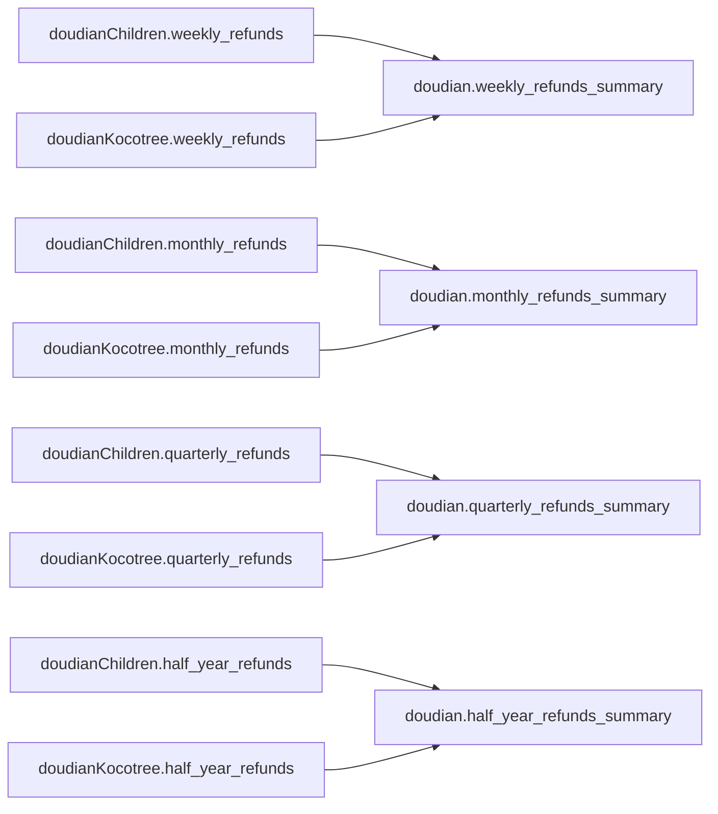

# PR：抖店整体4张退款汇总表建库

> 状态：已实施，待审核  
> 数据库：`weidian`  
> 目标Schema：`doudian`  
> 实施日期：2026-08-12  
> 迁移文件：`backend/migrations/002_doudian_refund_summaries.sql`

## 1. 目标

在现有`doudian`抖店整体Schema中补齐周、月、季度和半年4张退款汇总表，使抖店整体销售汇总与退款汇总具备相同的周期层级。

本次仅建设数据库实体表、装载现有数据并完成对账，不修改前端页面、后端查询接口或上传流程。

## 2. 新增对象

| 表名 | 粒度 | 直接上游 | 当前行数 |
|---|---|---|---:|
| `doudian.weekly_refunds_summary` | 自然周 | 两家抖店`weekly_refunds` | 79 |
| `doudian.monthly_refunds_summary` | 自然月 | 两家抖店`monthly_refunds` | 18 |
| `doudian.quarterly_refunds_summary` | 业务季度 | 两家抖店`quarterly_refunds` | 6 |
| `doudian.half_year_refunds_summary` | 业务半年 | 两家抖店`half_year_refunds` | 3 |

建库后，`doudian` Schema由7张实体表增加为11张实体表。

## 3. 数据依赖



每张总体表只读取相同时间粒度的两张店铺表，不通过周表反推月表，也不重新解析`raw_data`中的售后状态。

统一公式：

```text
抖店整体周期退款金额
= 儿童服饰旗舰店同周期退款金额
+ Kocotree服饰配件店同周期退款金额
```

某周期只有一家店存在退款时保留该周期；两家店均无退款时不生成0金额空记录。

## 4. 表结构

4张表统一包含：

| 字段 | 类型 | 说明 |
|---|---|---|
| `id` | `BIGINT GENERATED ALWAYS AS IDENTITY` | 自增主键 |
| `period_start` | `DATE` | 完整周期开始日期 |
| `period_end` | `DATE` | 完整周期结束日期 |
| 对应退款金额字段 | `NUMERIC(18,2)` | 两家店退款金额之和 |
| `created_at` | `TIMESTAMPTZ` | 默认当前时间 |
| `updated_at` | `TIMESTAMPTZ` | 默认当前时间 |

退款金额字段分别为：

- `weekly_refund_amount`
- `monthly_refund_amount`
- `quarterly_refund_amount`
- `half_year_refund_amount`

## 5. 约束

每张表均已建立4类约束：

1. `id`主键。
2. `period_start + period_end`业务唯一约束。
3. 周期边界检查约束。
4. 退款金额非负检查约束。

周期边界规则：

| 粒度 | 规则 |
|---|---|
| 周 | 周一至周日，`period_end = period_start + 6` |
| 月 | 每月1日至月末 |
| 季度 | 2—4月、5—7月、8—10月、11月—次年1月 |
| 半年 | 2—7月、8月—次年1月 |

4张表及其Identity对象的所有者均为`root`。

## 6. 建库与装载方式

迁移在一个PostgreSQL事务中执行：

1. 对两家店8张直接上游退款表加共享锁。
2. 创建4张退款汇总表及约束。
3. 将表OWNER设置为`root`。
4. 使用`UNION ALL`合并两家店同粒度记录。
5. 按`period_start + period_end`分组汇总。
6. 执行事务内双向差异校验。
7. 校验4种粒度退款总额一致。
8. 所有检查通过后统一提交。

正式执行前已使用同一份迁移进行回滚式试运行，建表、装载和校验全部通过，试运行没有留下数据库对象。

## 7. 正式数据库验证结果

| 目标表 | 行数 | 最早周期 | 最晚周期 | 金额合计 | 业务键重复 | 与上游差异 |
|---|---:|---|---|---:|---:|---:|
| `weekly_refunds_summary` | 79 | 2025-01-27 | 2026-08-02 | 17,830,935.75 | 0 | 0 |
| `monthly_refunds_summary` | 18 | 2025-02-01 | 2026-07-31 | 17,830,935.75 | 0 | 0 |
| `quarterly_refunds_summary` | 6 | 2025-02-01 | 2026-07-31 | 17,830,935.75 | 0 | 0 |
| `half_year_refunds_summary` | 3 | 2025-02-01 | 2026-07-31 | 17,830,935.75 | 0 | 0 |

独立验证结论：

- `doudian`实体表数量为11。
- 4张表OWNER均为`root`。
- 每张表均有主键、周期唯一、周期边界和金额非负4类约束。
- 4张表退款金额总计完全一致。
- 每张目标表与两家店对应粒度上游执行双向`EXCEPT`，差异均为0。

最新5个自然周数据：

| 周期开始 | 周期结束 | 抖店整体退款金额 |
|---|---|---:|
| 2026-07-27 | 2026-08-02 | 151,270.37 |
| 2026-07-20 | 2026-07-26 | 372,181.27 |
| 2026-07-13 | 2026-07-19 | 81,066.86 |
| 2026-07-06 | 2026-07-12 | 230,666.75 |
| 2026-06-29 | 2026-07-05 | 1,105,133.17 |

## 8. 后续上传刷新位置

儿童店或Kocotree店铺完成自身4张退款表刷新后，需要继续刷新本次新增的4张抖店整体表：

```text
店铺raw_data
  → 店铺weekly/monthly/quarterly/half_year_refunds
  → doudian对应4张refunds_summary
  → daren对应4张退款表
  → qudao对应4张退款表
```

本次只完成初次建库和现有数据装载，尚未把上述刷新动作接入上传服务。

## 9. 对现有系统的影响

- 没有修改两家店任何原始表或已有业务表。
- 没有修改`daren`和`qudao`现有退款表。
- 没有修改前端UI和后端API。
- 当前后端抖店整体退款仍可直接相加两家店退款表；后续可决定是否改为读取本次新增的抖店整体表。
- 若后续让`daren`改为从抖店整体退款表取数，必须移除对两家抖店退款表的重复累加，避免重复计算。

## 10. 审核清单

- [x] 4张表建立在`weidian.doudian`。
- [x] 表名与既有设计一致。
- [x] 周、月、季度、半年周期边界符合业务规则。
- [x] 只保存周期边界和退款金额，不新增退款次数或退款率。
- [x] 目标表与两家店上游逐周期对平。
- [x] 4种粒度总额均为17,830,935.75元。
- [x] 4张表在同一个事务中创建、装载和校验。
- [ ] 审核后确认上传服务采用全量刷新还是受影响周期增量刷新。
- [ ] 审核后确认抖店整体页面是否改为直接读取这4张汇总表。

## 11. 本PR未包含

- Kocotree或儿童店文件正式上传能力。
- 上传后自动刷新本次4张表的后端代码。
- `daren`和`qudao`级联刷新代码。
- 前端接口改造。
- 上传日志、批次追踪和失败重试。
