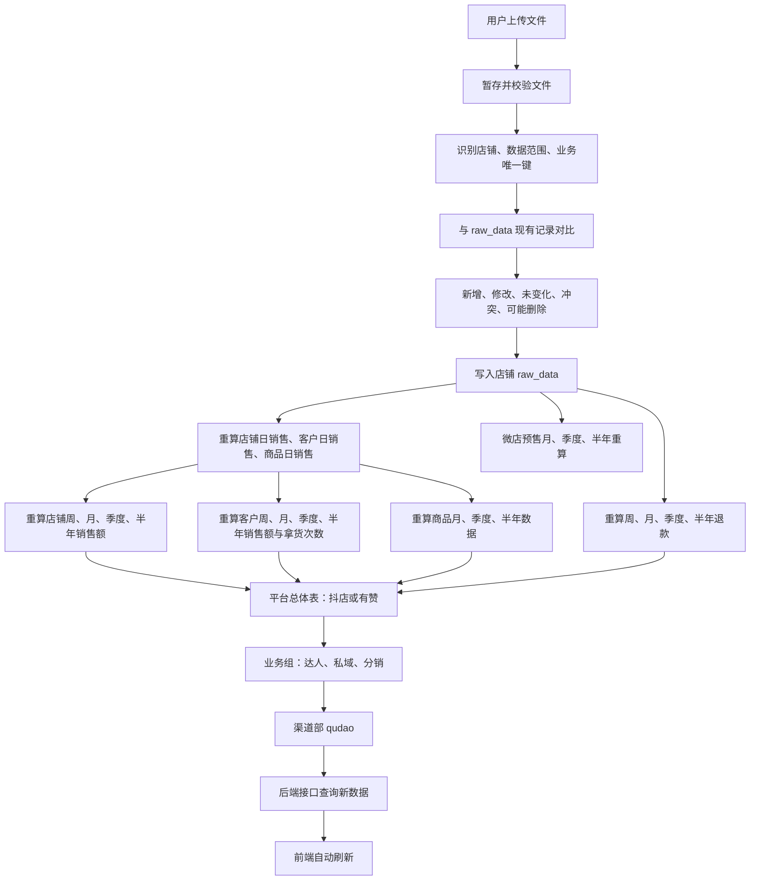

# 上传数据重复时间与周月指标联动设计

## 1. 设计目标

本方案用于补全上传功能中的两类关键问题：

1. 解决用户重复上传同一时间段数据时的重复入库、重复累计和历史数据修正问题。
2. 确保周销售额、月销售额、周拿货次数、月拿货次数，以及季度、半年、平台总体、业务组和渠道汇总表都能正确联动更新。
3. 销售导出文件中的退款记录同时进入退款链路，后续独立退款文件只更新已有原始记录。

总体原则：

> 完整销售日期快照 + 混合退款识别 + 受影响周期重算 + 上下游级联刷新

## 2. 完整数据更新链路



## 3. 重复时间上传处理

同一个时间段被重复上传属于正常业务情况，例如：

- 8 月 1 日上传了 7 月数据；
- 8 月 5 日又上传了一份包含 7 月和 8 月的数据；
- 原订单金额被平台修正；
- 原订单从“待发货”变成“已完成”；
- 原订单后来发生退款；
- 用户误操作，连续上传了两次相同文件。

系统不能简单使用“这个时间段已经上传过”作为拒绝条件，而应分别在文件和业务记录两个层面防重。

### 3.1 文件级防重

每个上传文件计算文件指纹并记录在上传批次中。

如果文件内容完全相同：

- 不重新导入；
- 不重复执行下游刷新；
- 返回“该文件已经上传过”；
- 展示原上传批次、上传人和上传时间。

文件名相同但内容不同，应当允许继续上传。

### 3.2 销售记录按日期防重

当前已确认销售导出包含它所列交易日期的完整数据，因此不用不稳定的订单联合键判断唯一性，而是把每个交易日期作为完整快照处理。

| 文件日期与数据库关系 | 处理方式 |
|---|---|
| 数据库不存在该交易日期 | 插入文件中该日期的全部记录 |
| 数据库已存在该交易日期 | 删除该日期全部旧记录，再插入文件中该日期全部最新记录 |
| 同一订单包含多个商品明细 | 全部保留，不按订单号去重 |
| 文件同时包含新增日期和重复日期 | 各日期独立判断，分别新增或覆盖 |
| 支付日期为空 | 不进入销售日期快照，预览中单独报告 |

这样可以保证一个日期只保留最新完整版本，同时不会因为同一个订单含多种商品而误删明细。

### 3.3 销售文件中的退款

销售文件并不纯粹，其中出现退款状态时必须同时进入退款统计：

- 有效销售状态仍计入毛销售额；
- 售后状态符合退款规则时，同时计入退款额；
- 同一条记录可以同时属于销售和退款，两项指标分别保存；
- 不直接用退款金额冲减销售额；
- 店铺周、月、季度、半年退款表与销售表在同一批次刷新。

后续独立退款文件只更新`raw_data`中已存在的订单记录，不新增销售记录。无法匹配的退款记录进入异常审核，避免退款文件意外制造新订单。

### 3.4 上传预览

正式保存前，前端应展示本次上传和历史数据的比较结果。

| 项目 | 示例 |
|---|---:|
| 文件覆盖范围 | 2026-07-01 至 2026-08-10 |
| 新增日期 | 2026-08-01 至 2026-08-10 |
| 覆盖日期 | 2026-07-01 至 2026-07-31 |
| 覆盖前旧记录 | 8,320 |
| 文件待写入记录 | 9,570 |
| 文件有效销售行 | 7,260 |
| 文件退款行 | 860 |
| 文件毛销售额 | 1,250,000.00元 |
| 文件退款额 | 126,000.00元 |
| 无交易日期行 | 2 |

预览还必须按自然周、自然月、业务季度、业务半年展示：当前金额、被替换旧金额、文件金额、差额和预计金额，并同步展示店铺、平台、业务组、渠道的逐层变化。

只有校验通过后才允许正式提交。

## 4. 上传模式

### 4.1 完整销售日期快照模式

这是当前销售文件的默认模式。系统对文件中的每个有效交易日期独立执行“新增日期”或“覆盖日期”，随后重算所有受影响周期和上层汇总。

### 4.2 退款更新模式

后续独立退款文件采用仅更新模式：

1. 先按平台确认的订单标识匹配已有`raw_data`；
2. 只更新退款状态、退款金额等允许变化的字段；
3. 不插入新的销售订单；
4. 匹配不到、匹配多条或字段冲突时暂停该记录并提示审核；
5. 更新完成后重算受影响的退款周期和上层汇总。

## 5. 受影响范围计算

当订单内容被修正时，不能只根据修改后的记录计算影响范围。

例如，订单原付款时间为 7 月 31 日，重新上传后修正为 8 月 1 日，则需要同时更新：

- 原日期 7 月 31 日；
- 新日期 8 月 1 日；
- 原自然周和新自然周；
- 7 月和 8 月；
- 原业务季度和新业务季度；
- 原业务半年和新业务半年；
- 原客户和新客户；
- 原商品和新商品。

计算原则：

```text
受影响范围 = 修改前范围 ∪ 修改后范围
```

如果只重算新周期，旧周期会残留修改前的金额和次数。

## 6. 周、月销售额更新链路

### 6.1 店铺层

以 Kocotree 为例，文件写入 `doudianKocotree.raw_data` 后，应先更新基础日表，再更新周期表。

| 层级 | 更新表 | 计算方式 |
|---|---|---|
| 日销售 | `daily_sales` | 按有效交易日期汇总金额 |
| 周销售 | `weekly_sales` | 对受影响自然周的 `daily_sales` 重新求和 |
| 月销售 | `monthly_sales` | 对受影响自然月的 `daily_sales` 重新求和 |
| 季度销售 | `quarterly_sales` | 对受影响业务季度重新求和 |
| 半年销售 | `half_year_sales` | 对受影响业务半年重新求和 |

周销售额不能在旧汇总值上直接增加本次上传金额，正确处理方式是：

1. 确定本次上传影响的自然周；
2. 删除或覆盖店铺该周的旧汇总记录；
3. 从更新完成后的有效明细或日表重新聚合；
4. 写回这一周的最终结果。

月、季度和半年销售额使用相同原则处理。这样即使重复上传相同文件，也不会重复累计金额。

### 6.2 抖店总体层

Kocotree 更新后，需要继续更新抖店总体表。

| 店铺表 | 抖店总体表 |
|---|---|
| 两家抖店的 `weekly_sales` | `doudian.weekly_sales_summary` |
| 两家抖店的 `monthly_sales` | `doudian.monthly_sales_summary` |
| 两家抖店的 `quarterly_sales` | `doudian.quarterly_sales_summary` |
| 两家抖店的 `half_year_sales` | `doudian.half_year_sales_summary` |

计算关系：

```text
抖店总体某周期销售额
= Kocotree该周期销售额
+ 儿童服饰旗舰店该周期销售额
```

### 6.3 达人组和渠道层

抖店总体更新完成后继续向下刷新：

```text
doudianKocotree
  → doudian总体
  → daren达人组
  → qudao渠道部
```

达人组不能同时把“抖店总体”和“两家抖店店铺”重复相加。建议统一采用：

```text
达人组
= 微店
+ 抖店总体
+ 快手小店
```

渠道部采用：

```text
渠道部
= 达人组
+ 私域组
+ 分销组
```

## 7. 周、月拿货次数更新链路

### 7.1 当前项目口径

现有项目已经采用以下口径：

> 拿货次数 = 客户在指定周期内发生有效拿货的天数，而不是订单行数。

`customer_daily_sales` 的业务粒度为：

```text
交易日期 + 客户ID
```

所以：

```text
weekly_purchase_count
= 客户在该自然周 customer_daily_sales 中的记录数

monthly_purchase_count
= 客户在该自然月 customer_daily_sales 中的记录数
```

### 7.2 对应数据表

| 粒度 | 表 | 金额字段 | 拿货次数字段 |
|---|---|---|---|
| 日 | `customer_daily_sales` | `transaction_amount` | 无独立次数字段，每个客户每天最多一条 |
| 周 | `customer_weekly_sales` | `weekly_transaction_amount` | `weekly_purchase_count` |
| 月 | `customer_monthly_sales` | `monthly_transaction_amount` | `monthly_purchase_count` |
| 季度 | `customer_quarterly_sales` | `quarterly_transaction_amount` | `quarterly_purchase_count` |
| 半年 | `customer_half_year_sales` | `half_year_transaction_amount` | `half_year_purchase_count` |

### 7.3 计算示例

客户 A 在 8 月 3 日有 3 个有效子订单，8 月 5 日有 1 个有效子订单：

```text
customer_daily_sales：
8月3日：客户A，金额600元
8月5日：客户A，金额200元
```

这一周的结果为：

```text
周销售额 = 800元
周拿货次数 = 2次
```

拿货次数不是 4 次，因为当前口径统计的是有效拿货天数。

### 7.4 重复上传对拿货次数的影响

| 上传变化 | 销售额变化 | 拿货次数变化 |
|---|---:|---:|
| 同一天同一客户新增一笔订单 | 增加 | 不变 |
| 客户本日第一笔有效订单 | 增加 | 加 1 |
| 订单金额修正 | 重新计算 | 通常不变 |
| 当天最后一笔有效订单被取消 | 减少 | 减 1 |
| 订单日期从周日改到周一 | 原周减少、新周增加 | 原周和新周分别重算 |
| 完全相同记录重复上传 | 不变 | 不变 |

因此，不能把本次上传的文件行数直接累加为拿货次数。

## 8. 抖店总体客户指标的缺口

当前数据库中，两家抖店各自具备：

- `customer_weekly_sales`；
- `customer_monthly_sales`；
- `customer_quarterly_sales`；
- `customer_half_year_sales`。

但 `doudian` 总体 Schema 当前主要包含总体销售、退款、商品和半年健康度表，没有完整的总体客户周、月、季度、半年销售与拿货次数表。

如果前端只展示两个店铺各自的客户指标，现有表可以满足。

如果前端需要展示“抖店总体客户周/月销售额和拿货次数”，不能直接把两张店铺客户表的次数相加。同一客户可能在同一天同时在两家抖店拿货，按照当前拿货天数口径，总体只能计算一次。

正确计算方式：

```text
两家店 customer_daily_sales
→ 按 customer_id + transaction_date 合并
→ 同一天的交易金额相加
→ 按周、月、季度、半年汇总金额
→ COUNT(客户有效交易日期)作为拿货次数
```

后续可以在以下两种方式中选择：

1. 后端查询时临时合并两家店的数据；
2. 在 `doudian` Schema 中补充总体客户周、月、季度、半年汇总表。

为了保证数据联动、查询性能和口径稳定，建议采用第二种方式，但需要单独确认表结构后再实施。

## 9. Kocotree 上传后的完整执行顺序

1. 创建上传批次，文件进入暂存区。
2. 校验列名、字段类型、所属店铺、日期和业务唯一键。
3. 检查同一文件内部重复、历史记录重复和时间范围重叠。
4. 展示新增、未变化、修改、异常和可能删除的记录数量。
5. 对 `doudianKocotree.raw_data` 执行幂等写入。
6. 记录修改前和修改后共同影响的日期、客户、商品和周期。
7. 重算 `daily_sales`。
8. 重算 `weekly_sales` 和 `monthly_sales`。
9. 重算季度和半年销售表。
10. 重算 `customer_daily_sales`。
11. 重算 `customer_weekly_sales` 中的周销售额和周拿货次数。
12. 重算 `customer_monthly_sales` 中的月销售额和月拿货次数。
13. 重算客户季度、半年销售额和拿货次数。
14. 重算商品周期表、高频商品和客户健康度。
15. 重算店铺周、月、季度、半年退款。
16. 重算 `doudian` 总体销售、退款、商品和客户健康度。
17. 重算 `daren` 对应周期、商品和客户指标。
18. 重算 `qudao` 对应周期指标。
19. 验证上下游金额、次数和周期是否一致。
20. 全部成功后提交；任意一步失败则整批不生效。
21. 前端重新请求后端接口并展示数据库最新结果。

## 10. 提交前校验规则

每个上传批次至少执行以下校验：

- 原始表业务唯一键不能重复；
- 同一客户同一天在 `customer_daily_sales` 中最多一条记录；
- 周销售额等于该自然周日销售额之和；
- 月销售额等于该自然月日销售额之和；
- 客户周销售额和客户日销售重算结果一致；
- 客户月销售额和客户日销售重算结果一致；
- 周拿货次数不能超过该周实际覆盖天数；
- 月拿货次数不能超过该月实际覆盖天数；
- 抖店总体金额等于两家抖店金额之和；
- 达人组金额等于微店、抖店总体、快手小店之和；
- 渠道金额等于达人组、私域组、分销组之和；
- 如果某周期重算后已经没有有效记录，必须删除旧汇总，不能保留失效汇总数据。

需要注意：抖店客户表只包含符合客户识别规则的数据，例如精选联盟达人，因此客户销售总额不一定等于店铺全部销售额。校验客户指标时必须使用相同的客户筛选条件，不能直接和店铺总销售额比较。

## 11. 待确认与后续任务

### 11.1 待确认事项

1. 拿货次数是否继续采用现有的“有效拿货天数”口径，还是改为“订单次数”。
2. 是否在 `doudian` Schema 中建立总体客户周、月、季度、半年汇总表。
3. 各个没有稳定业务唯一键的平台，采用何种组合键或完整范围替换规则。

### 11.2 尚未实施的内容

- 上传批次表；
- 上传暂存表；
- 上传预览和差异比较；
- 店铺级刷新程序；
- 平台、业务组、渠道级刷新协调程序；
- 抖店总体客户周期汇总表；
- 前端上传确认和进度展示；
- 数据库事务、并发锁和失败回滚；
- 全链路自动校验。

