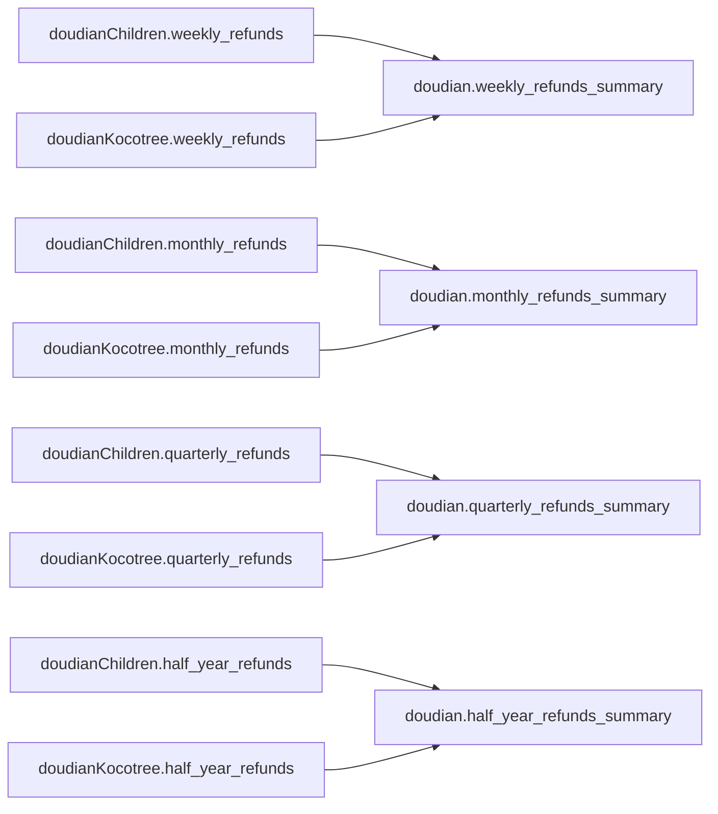

# 抖店总体退款汇总4张表设计审核草稿

> 文档状态：待审核，尚未建表、尚未上传数据  
> 目标数据库：`weidian`  
> 目标Schema：`doudian`  
> 设计日期：2026-08-11  
> 说明：本文件可直接编辑。审核通过后再创建表和写入正式数据。

---

## 一、建设目标

目前`doudian` Schema已经有7张抖店总体汇总表，包含日、周、月、季度、半年销售汇总、半年客户健康度和半年高频商品，但缺少总体退款分析。

本次新增4张退款汇总表：

| 新序号 | 表名 | 中文名称 | 时间粒度 |
|---:|---|---|---|
| 8 | `weekly_refunds_summary` | 抖店总体周退款汇总表 | 自然周 |
| 9 | `monthly_refunds_summary` | 抖店总体月退款汇总表 | 自然月 |
| 10 | `quarterly_refunds_summary` | 抖店总体季度退款汇总表 | 自定义业务季度 |
| 11 | `half_year_refunds_summary` | 抖店总体半年退款汇总表 | 自定义业务半年 |

完成后，`doudian` Schema将由7张表增加到11张表。

---

## 二、实际数据库核对结果

本设计已经只读核对两家店正式数据库中的8张直接上游表。

| 店铺Schema | 上游表 | 正式行数 | 日期范围 | 退款金额合计 |
|---|---|---:|---|---:|
| `doudianChildren` | `weekly_refunds` | 79 | 2025-01-27—2026-08-02 | 17,365,160.38元 |
| `doudianChildren` | `monthly_refunds` | 18 | 2025-02-01—2026-07-31 | 17,365,160.38元 |
| `doudianChildren` | `quarterly_refunds` | 6 | 2025-02-01—2026-07-31 | 17,365,160.38元 |
| `doudianChildren` | `half_year_refunds` | 3 | 2025-02-01—2026-07-31 | 17,365,160.38元 |
| `doudianKocotree` | `weekly_refunds` | 25 | 2026-01-12—2026-07-05 | 465,775.37元 |
| `doudianKocotree` | `monthly_refunds` | 6 | 2026-01-01—2026-06-30 | 465,775.37元 |
| `doudianKocotree` | `quarterly_refunds` | 3 | 2025-11-01—2026-07-31 | 465,775.37元 |
| `doudianKocotree` | `half_year_refunds` | 2 | 2025-08-01—2026-07-31 | 465,775.37元 |

两家店退款总额：

```text
17,365,160.38 + 465,775.37 = 17,830,935.75元
```

周、月、季度、半年4张总体退款表的退款金额合计都必须等于17,830,935.75元。

---

## 三、统一退款口径

### 3.1 本次汇总不重新解释原始退款状态

4张总体表直接读取两家店已经建成并校验通过的退款周期表，不直接读取`raw_data`，也不重新判断售后状态。

这样可以保证总体退款结果与两家店各自看板中的退款金额完全一致。

### 3.2 两家店当前退款规则

两家店上游退款表当前统一使用以下规则：

1. `售后状态`先去除首尾空白。
2. 售后状态为空白、`-`、`换货成功`或`补寄成功`时不计退款。
3. 除上述情况外，其他所有非空售后状态均按退款处理。
4. 退款表不限制订单状态。
5. 源文件没有独立的实际退款金额字段，退款金额暂按该条子订单的`订单应付金额`计算。
6. 退款周期依据`支付完成时间`归属，不代表实际退款完成日期。

### 3.3 总体汇总规则

```text
总体周期退款金额
= 儿童店同周期退款金额
+ Kocotree店同周期退款金额
```

实现方式：

1. 使用`UNION ALL`纵向合并两家店相同时间维度的退款记录。
2. 按`period_start + period_end`分组。
3. 对两家店的退款金额执行`SUM`。
4. 某个周期只有一家店有退款记录时，直接保留该店金额，另一家店贡献视为0。
5. 两家店都没有退款记录的周期不生成空记录。

### 3.4 本次不新增的字段

本次4张表只汇总当前数据库中真实存在的退款金额，不新增以下字段：

- 不新增退款单数：两家店现有退款周期表没有保存退款订单数量。
- 不新增退款率：退款率需要进一步明确使用毛销售额、净销售额还是支付订单金额作为分母。
- 不新增环比字段：当前需求是退款记录汇总，先保持表结构简洁。
- 不新增店铺字段：这是抖店总体表；需要查看分店金额时直接查询两家店各自退款表。

---

## 四、周期划分

### 4.1 自然周

- 周一为`period_start`。
- 周日为`period_end`。
- `period_end = period_start + 6天`。
- 自然周可能跨月、跨季度或跨年。

### 4.2 自然月

- `period_start`为每月1日。
- `period_end`为该月最后一天。
- 月表直接汇总两家店的月退款表，不能通过周退款表相加生成，因为自然周可能跨月。

### 4.3 自定义业务季度

| 业务季度 | `period_start` | `period_end` |
|---|---|---|
| 2—4月 | 2月1日 | 4月30日 |
| 5—7月 | 5月1日 | 7月31日 |
| 8—10月 | 8月1日 | 10月31日 |
| 11月—次年1月 | 11月1日 | 次年1月31日 |

### 4.4 自定义业务半年

| 业务半年 | `period_start` | `period_end` |
|---|---|---|
| 2—7月 | 2月1日 | 7月31日 |
| 8月—次年1月 | 8月1日 | 次年1月31日 |

---

## 五、表依赖关系



每张总体退款表只读取同时间维度的两张店铺退款表，不跨维度累计。

---

## 六、第8张表：抖店总体周退款汇总表

表名：`doudian.weekly_refunds_summary`

备注：保存两家抖店在每个自然周的总体退款金额。

### 6.1 字段设计

| 字段名 | PostgreSQL类型 | 是否为空 | 说明 |
|---|---|---|---|
| `id` | `BIGINT GENERATED ALWAYS AS IDENTITY` | 否 | 自增主键 |
| `period_start` | `DATE` | 否 | 自然周周一 |
| `period_end` | `DATE` | 否 | 自然周周日 |
| `weekly_refund_amount` | `NUMERIC(18,2)` | 否 | 两家店本周退款金额合计 |
| `created_at` | `TIMESTAMPTZ` | 否 | 插入时的北京时间 |
| `updated_at` | `TIMESTAMPTZ` | 否 | 插入或更新时的北京时间 |

主键：`id`。

业务唯一键：`period_start + period_end`。

周期约束：`period_start`必须是周一，`period_end = period_start + 6`。

### 6.2 直接上游

- `"doudianChildren".weekly_refunds`
- `"doudianKocotree".weekly_refunds`

### 6.3 建表流程

1. 分别读取两张上游表的`period_start`、`period_end`和`weekly_refund_amount`。
2. 使用`UNION ALL`合并记录。
3. 按`period_start + period_end`分组。
4. 对`weekly_refund_amount`求和。
5. 按`period_start`升序写入目标表。

### 6.4 预计算结果

| 指标 | 预计算值 |
|---|---:|
| 预计行数 | 79 |
| 最早周期开始 | 2025-01-27 |
| 最晚周期结束 | 2026-08-02 |
| 退款金额合计 | 17,830,935.75元 |

---

## 七、第9张表：抖店总体月退款汇总表

表名：`doudian.monthly_refunds_summary`

备注：保存两家抖店在每个自然月的总体退款金额。

### 7.1 字段设计

| 字段名 | PostgreSQL类型 | 是否为空 | 说明 |
|---|---|---|---|
| `id` | `BIGINT GENERATED ALWAYS AS IDENTITY` | 否 | 自增主键 |
| `period_start` | `DATE` | 否 | 自然月第一天 |
| `period_end` | `DATE` | 否 | 自然月最后一天 |
| `monthly_refund_amount` | `NUMERIC(18,2)` | 否 | 两家店本月退款金额合计 |
| `created_at` | `TIMESTAMPTZ` | 否 | 插入时的北京时间 |
| `updated_at` | `TIMESTAMPTZ` | 否 | 插入或更新时的北京时间 |

主键：`id`。

业务唯一键：`period_start + period_end`。

周期约束：`period_start`必须是当月1日，`period_end`必须是当月最后一天。

### 7.2 直接上游

- `"doudianChildren".monthly_refunds`
- `"doudianKocotree".monthly_refunds`

### 7.3 建表流程

1. 分别读取两张上游表的`period_start`、`period_end`和`monthly_refund_amount`。
2. 使用`UNION ALL`合并记录。
3. 按`period_start + period_end`分组。
4. 对`monthly_refund_amount`求和。
5. 按`period_start`升序写入目标表。

### 7.4 预计算结果

| 指标 | 预计算值 |
|---|---:|
| 预计行数 | 18 |
| 最早周期开始 | 2025-02-01 |
| 最晚周期结束 | 2026-07-31 |
| 退款金额合计 | 17,830,935.75元 |

---

## 八、第10张表：抖店总体季度退款汇总表

表名：`doudian.quarterly_refunds_summary`

备注：保存两家抖店在每个自定义业务季度的总体退款金额。

### 8.1 字段设计

| 字段名 | PostgreSQL类型 | 是否为空 | 说明 |
|---|---|---|---|
| `id` | `BIGINT GENERATED ALWAYS AS IDENTITY` | 否 | 自增主键 |
| `period_start` | `DATE` | 否 | 业务季度开始日期 |
| `period_end` | `DATE` | 否 | 业务季度结束日期 |
| `quarterly_refund_amount` | `NUMERIC(18,2)` | 否 | 两家店本业务季度退款金额合计 |
| `created_at` | `TIMESTAMPTZ` | 否 | 插入时的北京时间 |
| `updated_at` | `TIMESTAMPTZ` | 否 | 插入或更新时的北京时间 |

主键：`id`。

业务唯一键：`period_start + period_end`。

周期约束：`period_start`月份只能为2、5、8、11，且`period_end = period_start + 3个月 - 1天`。

### 8.2 直接上游

- `"doudianChildren".quarterly_refunds`
- `"doudianKocotree".quarterly_refunds`

### 8.3 建表流程

1. 分别读取两张上游表的`period_start`、`period_end`和`quarterly_refund_amount`。
2. 使用`UNION ALL`合并记录。
3. 按`period_start + period_end`分组。
4. 对`quarterly_refund_amount`求和。
5. 按`period_start`升序写入目标表。

### 8.4 预计算结果

| 指标 | 预计算值 |
|---|---:|
| 预计行数 | 6 |
| 最早周期开始 | 2025-02-01 |
| 最晚周期结束 | 2026-07-31 |
| 退款金额合计 | 17,830,935.75元 |

---

## 九、第11张表：抖店总体半年退款汇总表

表名：`doudian.half_year_refunds_summary`

备注：保存两家抖店在每个自定义业务半年的总体退款金额。

### 9.1 字段设计

| 字段名 | PostgreSQL类型 | 是否为空 | 说明 |
|---|---|---|---|
| `id` | `BIGINT GENERATED ALWAYS AS IDENTITY` | 否 | 自增主键 |
| `period_start` | `DATE` | 否 | 业务半年开始日期 |
| `period_end` | `DATE` | 否 | 业务半年结束日期 |
| `half_year_refund_amount` | `NUMERIC(18,2)` | 否 | 两家店本业务半年退款金额合计 |
| `created_at` | `TIMESTAMPTZ` | 否 | 插入时的北京时间 |
| `updated_at` | `TIMESTAMPTZ` | 否 | 插入或更新时的北京时间 |

主键：`id`。

业务唯一键：`period_start + period_end`。

周期约束：`period_start`月份只能为2或8，且`period_end = period_start + 6个月 - 1天`。

### 9.2 直接上游

- `"doudianChildren".half_year_refunds`
- `"doudianKocotree".half_year_refunds`

### 9.3 建表流程

1. 分别读取两张上游表的`period_start`、`period_end`和`half_year_refund_amount`。
2. 使用`UNION ALL`合并记录。
3. 按`period_start + period_end`分组。
4. 对`half_year_refund_amount`求和。
5. 按`period_start`升序写入目标表。

### 9.4 预计算结果

| 指标 | 预计算值 |
|---|---:|
| 预计行数 | 3 |
| 最早周期开始 | 2025-02-01 |
| 最晚周期结束 | 2026-07-31 |
| 退款金额合计 | 17,830,935.75元 |

---

## 十、预览样例

以下结果由当前正式上游表只读预计算得到。正式建表时`id`、`created_at`和`updated_at`由数据库生成，因此本节只展示业务字段。

### 10.1 周退款样例

| `period_start` | `period_end` | `weekly_refund_amount` |
|---|---|---:|
| 2026-07-27 | 2026-08-02 | 151,270.37 |
| 2026-07-20 | 2026-07-26 | 372,181.27 |
| 2026-07-13 | 2026-07-19 | 81,066.86 |
| 2026-07-06 | 2026-07-12 | 230,666.75 |
| 2026-06-29 | 2026-07-05 | 1,105,133.17 |

### 10.2 月退款样例

| `period_start` | `period_end` | `monthly_refund_amount` |
|---|---|---:|
| 2026-07-01 | 2026-07-31 | 1,542,714.83 |
| 2026-06-01 | 2026-06-30 | 3,589,308.84 |
| 2026-05-01 | 2026-05-31 | 493,890.61 |
| 2026-04-01 | 2026-04-30 | 772,996.57 |
| 2026-03-01 | 2026-03-31 | 562,824.05 |

### 10.3 季度退款样例

| `period_start` | `period_end` | `quarterly_refund_amount` |
|---|---|---:|
| 2026-05-01 | 2026-07-31 | 5,625,914.28 |
| 2026-02-01 | 2026-04-30 | 1,392,797.90 |
| 2025-11-01 | 2026-01-31 | 765,614.09 |
| 2025-08-01 | 2025-10-31 | 1,160,536.20 |
| 2025-05-01 | 2025-07-31 | 5,487,592.93 |

### 10.4 半年退款样例

| `period_start` | `period_end` | `half_year_refund_amount` |
|---|---|---:|
| 2026-02-01 | 2026-07-31 | 7,018,712.18 |
| 2025-08-01 | 2026-01-31 | 1,926,150.29 |
| 2025-02-01 | 2025-07-31 | 8,886,073.28 |

---

## 十一、首次建表与上传顺序

4张表没有相互依赖关系，可在同一个PostgreSQL事务中依次执行：

```text
BEGIN
1. 锁定两家店8张直接上游退款表，防止汇总过程中数据变化
2. 创建weekly_refunds_summary
3. 创建monthly_refunds_summary
4. 创建quarterly_refunds_summary
5. 创建half_year_refunds_summary
6. 将4张表OWNER设置为root
7. 写入4张表数据
8. 完成全部强制校验
COMMIT
```

任何一张表创建、写入或校验失败，整个事务回滚，不保留部分成功表。

---

## 十二、新文件上传后的刷新逻辑

当儿童店或Kocotree店上传新文件并刷新各自退款表后，总体退款表按以下顺序刷新：

1. 两家店先在各自Schema内完成退款表刷新和校验。
2. 确认两家店上游事务均成功。
3. 在`doudian` Schema内开启新的总体汇总事务。
4. 清空4张总体退款表并重置Identity。
5. 重新合并两家店对应时间维度的退款表。
6. 完成金额、周期、业务键和字段校验。
7. 所有校验通过后一次性提交。

本次采用全量刷新方式，原因是当前正式数据量较小，逻辑直接、容易对账，并能避免跨月自然周或跨年业务周期的增量边界问题。

---

## 十三、数据校验规则

正式建表时至少执行以下校验：

1. `doudian` Schema新增表名必须与本设计一致。
2. 4张表OWNER必须为`root`。
3. 字段顺序、数据类型、可空性和Identity主键必须与设计一致。
4. `period_start + period_end`业务键重复数必须为0。
5. 周表开始日期必须为周一，结束日期必须为周日。
6. 月表周期必须覆盖完整自然月。
7. 季度开始月份只能是2、5、8、11。
8. 半年开始月份只能是2、8。
9. 退款金额不能为空且不得为负数。
10. 每张总体表必须与对应两张上游表逐周期双向重算，差异为0。
11. 4张表退款金额总计必须完全一致。
12. 4张表退款金额总计必须等于两家店退款金额之和17,830,935.75元。
13. 初次生成预计行数必须为周79行、月18行、季度6行、半年3行。
14. 建表完成后，`doudian` Schema应恰好包含11张正式表。

---

## 十四、与已有销售汇总表的对应关系

| 销售汇总表 | 新增退款汇总表 | 时间粒度 |
|---|---|---|
| `weekly_sales_summary` | `weekly_refunds_summary` | 自然周 |
| `monthly_sales_summary` | `monthly_refunds_summary` | 自然月 |
| `quarterly_sales_summary` | `quarterly_refunds_summary` | 自定义业务季度 |
| `half_year_sales_summary` | `half_year_refunds_summary` | 自定义业务半年 |

销售汇总表继续保存毛销售额，退款汇总表独立保存退款金额。两类金额不在数据库汇总表中自动相减。

---

## 十五、需要用户审核确认

- [ ] 确认4张表建立在`doudian` Schema中。
- [ ] 确认表名使用`weekly_refunds_summary`、`monthly_refunds_summary`、`quarterly_refunds_summary`、`half_year_refunds_summary`。
- [ ] 确认每张表只保存周期边界和退款金额，不新增退款次数、退款率或环比字段。
- [ ] 确认总体退款金额等于两家店对应周期退款金额之和。
- [ ] 确认某周期只有一家店有退款记录时，仍生成该周期总体记录。
- [ ] 确认两家店都没有退款记录的周期不生成0金额空记录。
- [ ] 确认退款周期继续以原始订单的`支付完成时间`归属，不表示实际退款完成日期。
- [ ] 确认季度继续使用2—4月、5—7月、8—10月、11月—次年1月。
- [ ] 确认半年继续使用2—7月、8月—次年1月。
- [ ] 确认4张表在同一事务中一次性创建、上传和校验。
- [ ] 最终确认：允许依据本设计创建4张正式表并上传数据。

---

## 十六、当前进度

| 工作项 | 状态 |
|---|---|
| 两家店8张退款上游表结构核对 | 已完成 |
| 两家店退款金额和周期范围核对 | 已完成 |
| 4张总体退款表只读预计算 | 已完成 |
| 可编辑设计文档 | 已完成，待审核 |
| 正式建表 | 尚未开始 |
| 正式上传数据 | 尚未开始 |
| 正式数据库校验 | 尚未开始 |
