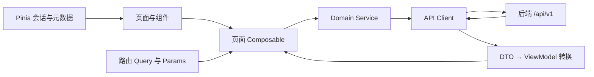

# AI 客户经营看板前端工程化设计文档

> 对应效果稿：`前端页面效果预览.html`  
> 配套接口文档：`docs/AI客户经营看板前后端接口文档.md`  
> 文档版本：V1.0  
> 编制日期：2026-08-04  
> 适用对象：前端、后端、测试、产品

---

## 1. 文档目的

本文档用于把当前单文件 HTML 效果稿转换为可维护、可测试、可与后端联调的正式前端工程。文档规定：

- 工程技术基线和目录结构。
- 页面、路由、组件、状态与权限边界。
- 静态模拟逻辑替换方式。
- 前端与后端的数据职责。
- 加载、空数据、错误和无权限状态。
- 开发、联调、测试和验收标准。

本文档不重新定义销售、同比/环比、客户健康度和跟进提醒算法。前端只展示后端已经计算完成的结果。

### 1.1 依据和优先级

本次工程化以以下内容为基线：

1. `前端页面效果预览.html`：页面结构、视觉和现有交互基线。
2. 当前后端原型 `8.4/src/backend/`：平台编码、角色编码、日期规则和数据仓储现状。
3. 已有业务资料：用于补充权限、时间和字段口径，但不得覆盖当前页面已经明确的结构。
4. 本文档及配套接口文档：正式工程和联调的直接执行基线。

如旧文档与本文档冲突，以本文档和配套接口文档为准。

### 1.2 本次范围裁定

当前 HTML 只提供销售数据上传页，没有客户名单上传页面。为保证“按当前网页工程化”的范围清晰，V1 前端只实现销售数据上传。客户名单上传保留为待产品确认的后续能力，不进入本次页面、路由和接口验收范围。

---

## 2. 当前原型与正式工程的差异

| 能力 | 当前 HTML | 正式工程要求 |
|---|---|---|
| 页面组织 | 单 HTML 文件，字符串模板渲染 | 独立路由页面和可复用组件 |
| 页面跳转 | `state.route` 内存切换 | Vue Router，支持刷新、前进和后退 |
| 用户身份 | 手动切换主管端/组长端 | 登录会话决定角色，不允许手动切换 |
| 数据 | 页面内硬编码和循环生成 | 全部通过 `/api/v1` 接口获取 |
| 筛选排序分页 | 浏览器内处理模拟数组 | 查询条件提交后端，后端排序分页 |
| 客户详情定位 | 页面内客户名称 | 路由编码后的客户名称，后端再次校验数据范围 |
| 文件上传 | 只校验扩展名并显示文件名 | multipart 上传、任务查询、错误明细和上传记录 |
| 权限 | 前端条件判断 | 前端控制入口，后端强制校验权限 |
| 异常状态 | 基本缺失 | 加载、空、部分成功、无权限、失败和重试 |
| 数据类型 | 数字和中文文案混用 | DTO、枚举、金额、比例和日期统一类型 |

正式工程必须删除以下原型逻辑：

- `customerSeeds`、`uploadRecords` 和页面中的固定指标数据。
- `currentCustomers()` 循环生成 86 条客户数据的逻辑。
- `filteredCustomers()` 中的业务筛选、排序和分页。
- 前端拼接风险原因、建议动作和自定义比较适用性的逻辑。
- `switchView()` 角色模拟切换。
- `handleUpload()` 中“选择即成功”的模拟反馈。

---

## 3. 技术方案

### 3.1 推荐技术基线

| 类别 | 选型 | 作用 |
|---|---|---|
| 构建工具 | Vite | 本地开发、构建和环境变量管理 |
| 前端框架 | Vue 3 | 页面与组件开发 |
| 语言 | TypeScript | 固化接口 DTO、枚举和组件属性 |
| 路由 | Vue Router | 页面路由、权限守卫和返回状态 |
| 全局状态 | Pinia | 只保存登录会话和稳定元数据 |
| HTTP | Axios | 请求实例、超时、取消和统一错误映射 |
| 样式 | 原生 CSS + CSS Variables | 最大程度复用当前页面视觉，不引入整套 UI 主题 |
| 单元测试 | Vitest + Vue Test Utils | 工具函数、组件和状态测试 |
| 端到端测试 | Playwright | 登录、查询、详情、权限和上传主链路 |

当前页面以卡片、表格和 CSS 趋势条为主，不要求引入图表库。如果后续确认自定义时间销售柱状图，再单独引入 ECharts，避免当前阶段增加无效依赖。

### 3.2 浏览器和设备范围

- 桌面端优先，支持当前主流 Chromium 浏览器。
- 1180px 以下进入单列布局，复用原型断点。
- 720px 以下进入窄屏布局。
- 大字段表格允许横向滚动，不强制在手机宽度内压缩所有列。
- 不以移动端管理后台体验作为 V1 核心验收范围。

### 3.3 架构原则



核心约束：

- 页面组件不直接调用 Axios。
- 页面组件不读取后端原始数据库字段。
- 所有 API 字段在 `services/mappers` 中转换为前端展示模型。
- 会话和组织元数据是全局状态；业务查询结果是页面状态。
- 筛选、排序和分页以 URL Query 为准，便于刷新和返回恢复。
- 后端返回的权限范围是唯一可信来源，前端不自行扩大范围。

---

## 4. 正式工程目录

```text
frontend/
├── public/
├── src/
│   ├── app/
│   │   ├── App.vue
│   │   ├── router.ts
│   │   ├── route-guards.ts
│   │   └── bootstrap.ts
│   ├── assets/
│   │   └── styles/
│   │       ├── tokens.css
│   │       ├── reset.css
│   │       ├── global.css
│   │       └── utilities.css
│   ├── components/
│   │   ├── layout/
│   │   │   ├── AppSidebar.vue
│   │   │   ├── AppHeader.vue
│   │   │   └── PageToolbar.vue
│   │   ├── common/
│   │   │   ├── AppButton.vue
│   │   │   ├── StatusTag.vue
│   │   │   ├── EmptyState.vue
│   │   │   ├── ErrorState.vue
│   │   │   ├── LoadingSkeleton.vue
│   │   │   └── AppPagination.vue
│   │   ├── dashboard/
│   │   │   ├── SalesSummaryTable.vue
│   │   │   ├── TrendMetrics.vue
│   │   │   └── CustomerDistributionCard.vue
│   │   ├── customer/
│   │   │   ├── CustomerFilters.vue
│   │   │   ├── CustomerTable.vue
│   │   │   ├── CustomerBasicInfo.vue
│   │   │   ├── CustomerSalesMetrics.vue
│   │   │   └── ProductTrendTable.vue
│   │   └── upload/
│   │       ├── UploadPlatformTabs.vue
│   │       ├── SalesUploadPanel.vue
│   │       ├── UploadTaskResult.vue
│   │       └── UploadRecordTable.vue
│   ├── composables/
│   │   ├── useDashboardQuery.ts
│   │   ├── useCustomerListQuery.ts
│   │   ├── useCustomerDetailQuery.ts
│   │   └── useSalesUpload.ts
│   ├── domain/
│   │   ├── auth/
│   │   ├── organization/
│   │   ├── dashboard/
│   │   ├── customer/
│   │   └── upload/
│   ├── pages/
│   │   ├── LoginPage.vue
│   │   ├── OverviewPage.vue
│   │   ├── GroupAnalysisPage.vue
│   │   ├── CustomerListPage.vue
│   │   ├── CustomerDetailPage.vue
│   │   ├── SalesUploadPage.vue
│   │   ├── UploadRecordsPage.vue
│   │   ├── ForbiddenPage.vue
│   │   └── NotFoundPage.vue
│   ├── services/
│   │   ├── http.ts
│   │   ├── auth-api.ts
│   │   ├── meta-api.ts
│   │   ├── dashboard-api.ts
│   │   ├── customer-api.ts
│   │   ├── upload-api.ts
│   │   └── mappers/
│   ├── stores/
│   │   ├── session.ts
│   │   └── metadata.ts
│   ├── types/
│   │   ├── api.ts
│   │   ├── auth.ts
│   │   ├── dashboard.ts
│   │   ├── customer.ts
│   │   └── upload.ts
│   ├── utils/
│   │   ├── date.ts
│   │   ├── format.ts
│   │   ├── query.ts
│   │   └── validation.ts
│   └── main.ts
├── tests/
│   ├── unit/
│   └── e2e/
├── .env.development
├── .env.production
├── index.html
├── package.json
├── tsconfig.json
└── vite.config.ts
```

`pages` 负责页面组合，`components` 负责展示，`composables` 负责请求生命周期，`services` 负责接口和 DTO 转换，`domain` 负责枚举及展示模型。禁止按页面复制同一套销售表、趋势条和客户卡片。

---

## 5. 业务编码统一

### 5.1 小组编码

当前 HTML 使用 `talent` 表示达人组，后端代码使用 `influencer`。正式工程统一使用后端编码：

| API/正式前端编码 | 中文名 | HTML 旧编码 |
|---|---|---|
| `private` | 私域组 | `private` |
| `influencer` | 达人组 | `talent` |
| `distribution` | 分销组 | `distribution` |

工程化迁移时，应把 HTML 中的 `talent` 全部替换为 `influencer`。不得在不同页面同时保留两套编码。

### 5.2 平台编码

| 平台编码 | 页面名称 | 所属小组 |
|---|---|---|
| `youzan` | 有赞 | `private` |
| `kuaituantuan` | 快团团 | `private` |
| `doudian` | 抖店 | `influencer` |
| `kuaishouxiaodian` | 快手小店 | `influencer` |
| `weidian` | 微店 | `influencer` |
| `jushuitan` | 聚水潭线上平台 | `distribution` |
| `alibaba` | 阿里巴巴平台 | `distribution` |

前端提交编码，后端返回 `display_name`。前端不得把中文平台名作为查询参数或权限判断依据。

### 5.3 角色编码

正式工程使用后端已有角色编码：

- `supervisor`
- `private_leader`
- `influencer_leader`
- `distribution_leader`

前端可通过 `role === 'supervisor'` 判断主管，其余三类统一视为组长，同时使用会话返回的 `group_key` 确定数据范围。

---

## 6. 路由设计

| 路由 | 页面 | 主管 | 对应组长 |
|---|---|---:|---:|
| `/login` | 登录页 | 可访问 | 可访问 |
| `/overview` | 渠道总览 | 可访问 | 禁止 |
| `/groups/:groupKey/analysis` | 组别分析 | 全部小组 | 仅所属小组 |
| `/groups/:groupKey/customers` | 客户列表 | 全部小组 | 仅所属小组 |
| `/groups/:groupKey/customers/:customerName` | 客户详情 | 全部小组 | 仅所属小组 |
| `/groups/:groupKey/uploads/sales` | 销售上传 | 禁止 | 仅所属小组 |
| `/upload-records` | 全部上传记录 | 只读 | 禁止 |
| `/403` | 无权限 | 可访问 | 可访问 |
| `/:pathMatch(.*)*` | 404 | 可访问 | 可访问 |

### 6.1 登录落点

- 主管登录成功：`/overview`。
- 三个组长登录成功：各自 `/groups/{group_key}/analysis`。
- 已登录用户访问 `/login`：跳转到其默认落点。

### 6.2 路由守卫

路由守卫只做体验层拦截：

1. 无会话时请求 `GET /auth/session`。
2. 仍未登录则跳转 `/login`，携带 `redirect`。
3. 校验目标页面是否在 `permissions` 中。
4. 组长访问非所属 `groupKey` 时跳转 `/403`。
5. 主管访问上传页时跳转 `/403`。

后端仍必须对每次接口请求重新执行权限校验。

### 6.3 客户列表 URL Query

```text
?period=day
&reference_date=2026-08-03
&platform=youzan
&activity_level=risk
&follow_status=pending
&keyword=杭州
&sort_by=sales_amount
&sort_order=desc
&page=1
&page_size=20
```

从详情返回列表时，保留完整 Query。路由跳转前记录表格滚动位置，返回后在数据渲染完成时恢复。

---

## 7. 页面与组件设计

### 7.1 全局布局

保持效果稿的固定侧边栏与主内容区：

- 桌面侧边栏宽度：280px。
- 主内容区：`minmax(0, 1fr)`，表格自行横向滚动。
- 侧边栏从会话和元数据生成，不再包含角色切换按钮。
- 页面标题从路由元信息和当前小组元数据生成。
- 导航展开状态可以保存在 `sessionStorage`，不属于业务状态。

### 7.2 登录页

当前 HTML 未提供登录页，但正式工程必须有登录入口。V1 只包含：

- 账号、密码输入。
- 登录按钮。
- 登录中禁用重复提交。
- 账号或密码错误提示。
- 登录成功后按角色跳转。

不实现注册、找回密码、修改密码和账号管理。

### 7.3 渠道总览页

仅主管访问。页面对应原型 `renderOverviewLike('overview')`，包括：

1. 时间工具栏。
2. 销售指标二维表：整体、私域组、达人组、分销组。
3. 趋势指标。
4. 客户分类展示：整体和三个小组。

请求 `GET /dashboard/overview`。页面只负责把响应按模块传给子组件，不自行合计小组金额。

### 7.4 组别分析页

主管和对应组长访问。页面结构与渠道总览复用同一组件，作用域改为：

- 当前小组整体。
- 当前小组下的平台。

请求 `GET /groups/{group_key}/dashboard`。切换小组时取消旧请求，清空旧平台状态，避免旧数据闪现。

### 7.5 客户列表页

筛选字段：

- 时间维度和日期。
- 平台。
- 活跃程度。
- 跟进状态。
- 客户名称关键字。

排序字段：销售额、近 7 日销售额、近 30 日销售额、同比及当前比较指标。所有排序由后端完成。

表格保持原型字段：

- 客户名称、平台。
- 销售额、近 7 日销售额、近 30 日销售额。
- 拿货次数、最近拿货时间。
- 同比、适用环比。
- 活跃程度、跟进状态、建议跟进动作。

规则：

- 默认页码 1，默认每页 20 条。
- 任意筛选或排序改变后回到第 1 页。
- 搜索输入按 Enter 或点击查询触发，不在每次输入时请求。
- 请求期间保留表头和筛选区，表格主体显示骨架。
- 空列表显示“暂无数据”，不显示伪造行。
- 客户名用后端返回值做 `encodeURIComponent` 后进入详情。

### 7.6 客户详情页

请求由当前小组、客户名称和继承的时间条件组成。页面包括：

- 客户基础信息。
- 当前销售金额、近 7 日、近 30 日、平均单次拿货金额。
- 同比、日/周/月环比。
- 日、周、月产品拿货趋势表。
- 活跃程度、风险原因和建议动作。

风险原因和建议动作必须直接展示后端文本，不允许使用 `includes('风险')` 等页面规则临时拼接。

客户不存在返回 404；客户存在但越权返回 403；部分指标缺失时只影响对应卡片。

### 7.7 销售数据上传页

仅组长访问。页面包括：

- 当前小组平台标签。
- 业务数据日期，最大值为北京时间昨日。
- CSV/XLSX 文件选择。
- 上传提交、进度状态、成功结果或错误明细。
- 当前用户最近上传记录。

前端校验仅用于快速反馈：文件存在、扩展名、文件大小和日期。文件内容、字段、权限和重复数据必须由后端校验。

上传状态机：

```text
idle → selected → uploading → queued → processing → success
                                      └→ failed
```

平台或数据日期改变时清空已选文件和上次校验结果。上传中禁止重复提交。任务创建成功后按接口返回的 `poll_after_ms` 查询状态。

### 7.8 上传记录页

- 主管：`/upload-records` 查看全部小组记录，只读。
- 组长：上传页内只查看自己的记录。
- 不提供历史文件下载。
- 展示失败记录和失败原因摘要。

当前原型没有主管上传记录入口，正式工程需要在主管侧边栏增加“上传记录”。

---

## 8. 时间设计

### 8.1 页面枚举

```ts
type Period = 'day' | 'week' | 'month' | 'custom';
```

### 8.2 统一规则

- 使用北京时间（Asia/Shanghai）。
- 默认 `reference_date` 为北京时间昨日。
- 不允许选择当天和未来日期。
- 可查询数据最早日期为 2025-02-01。
- `custom` 必须同时提供 `start_date` 和 `end_date`。
- API 的开始、结束日期均为包含边界；后端进入数据库查询时自行转换为 `[start, end + 1 day)`。
- 近 7 日和近 30 日包含参考日。
- 前端不得自行计算同比/环比时间窗口，只提交筛选条件。

### 8.3 日期校验

前端校验与后端保持一致，但后端校验结果优先。发现以下情况不发请求：

- 开始日期晚于结束日期。
- 开始日期早于 2025-02-01。
- 参考日期或结束日期晚于昨日。
- `custom` 缺少任一日期。

---

## 9. 状态管理和请求生命周期

### 9.1 Pinia 全局状态

`sessionStore`：

- `user`
- `role`
- `groupKey`
- `permissions`
- `initialized`

`metadataStore`：

- 小组和平台元数据。
- 活跃程度和跟进状态枚举。
- 上传允许类型和文件大小限制。

业务列表、看板和详情结果不放入 Pinia，避免跨页面缓存失效复杂化。

### 9.2 URL 状态

以下内容进入路由 Query：

- 时间维度和日期。
- 平台、活跃程度、跟进状态、关键字。
- 排序字段和方向。
- 页码和每页数量。

Query 解析时执行白名单校验；非法枚举恢复默认值，而不是直接传给接口。

### 9.3 页面请求状态

```ts
type AsyncState<T> =
  | { status: 'idle'; data: null; error: null }
  | { status: 'loading'; data: T | null; error: null }
  | { status: 'success'; data: T; error: null }
  | { status: 'empty'; data: T; error: null }
  | { status: 'error'; data: T | null; error: AppError };
```

每个请求使用 `AbortController` 或 Axios cancellation。新请求发出时取消同页面旧请求，并通过请求序号防止旧响应覆盖新条件。

### 9.4 缓存和刷新

- 组织元数据在会话期间缓存。
- 看板和客户数据默认以当前页面请求结果为准。
- 上传成功后使当前小组看板、客户列表和数据新鲜度缓存失效。
- 浏览器刷新时从 URL 和会话接口恢复页面。

---

## 10. API 适配层

### 10.1 目录职责

- `http.ts`：baseURL、超时、Cookie、请求 ID、401 处理。
- `*-api.ts`：声明端点和 DTO。
- `mappers`：DTO 转换为页面 ViewModel。
- `composables`：控制 loading、empty、error、retry 和取消。

### 10.2 数据格式

- 金额由 API 返回两位小数字符串，例如 `"88420.00"`。
- 比例由 API 返回小数，例如 `0.125` 表示 12.5%。
- 不可比较的比例返回 `null`，同时返回 `comparable=false` 和原因。
- 日期为 `YYYY-MM-DD`。
- 时间为带时区的 ISO 8601，例如 `2026-08-04T12:30:00+08:00`。
- 枚举使用英文编码，中文只作为 `label`。

### 10.3 格式化职责

前端允许：

- 人民币符号和千位分隔。
- 小数转百分比。
- 正负值颜色。
- `null` 比率显示“暂无”。

前端禁止：

- 汇总金额和客户数量。
- 计算平均单次拿货金额。
- 计算同比、环比、健康度或风险。
- 根据中文文案推断业务状态。

---

## 11. 视觉迁移

### 11.1 CSS 变量

从原型提取到 `tokens.css`：

```css
:root {
  --color-bg: #f5f7fb;
  --color-panel: rgba(255, 255, 255, 0.92);
  --color-text: #172033;
  --color-muted: #64748b;
  --color-line: #e5e7eb;
  --color-primary: #2563eb;
  --color-primary-dark: #1d4ed8;
  --color-primary-soft: #e8f0ff;
  --color-success: #10b981;
  --color-warning: #f59e0b;
  --color-danger: #ef4444;
  --sidebar-width: 280px;
  --radius-panel: 22px;
  --shadow-panel: 0 18px 45px rgba(15, 23, 42, 0.08);
}
```

### 11.2 组件状态

按钮、标签、输入框和表格必须包含：

- default
- hover
- focus-visible
- active
- disabled
- loading
- error

标签颜色不得只依赖文字字符串，必须由枚举到主题的映射函数生成。

### 11.3 响应式

- `>1180px`：固定侧边栏，多列卡片。
- `721px–1180px`：侧边栏变为顶部普通流，卡片最多两列。
- `<=720px`：单列，主内容左右 14px，工具栏换行。
- 客户表最小宽度保留，外层横向滚动。

---

## 12. 统一页面状态

| 状态 | 展示规则 |
|---|---|
| 首次加载 | 与目标模块形状接近的骨架屏 |
| 条件切换 | 保留旧布局，数据区显示轻量 loading |
| 无数据 | 金额/数量显示 0；列表显示“暂无数据” |
| 无可比数据 | 显示“暂无”，可展示后端原因 |
| 规则待确认 | 显示“规则待确认”，不得显示 0 冒充结果 |
| 部分数据 | 正常展示成功模块，失败模块单独提示和重试 |
| 401 | 清空会话并跳转登录 |
| 403 | 显示无权限页，不泄露目标数据是否存在 |
| 404 | 显示客户或页面不存在 |
| 5xx/网络失败 | 当前模块错误提示、请求 ID和重试按钮 |

空状态、0 值和不可比较是三种不同状态，不得混用。

---

## 13. 安全设计

- 推荐使用 HttpOnly、Secure、SameSite Cookie 保存会话，前端 JavaScript 不读取会话凭证。
- 登录和上传接口均使用 HTTPS。
- 所有小组、平台和上传操作由后端重新授权。
- 客户名称和后端文本通过 Vue 文本插值渲染，禁止 `v-html`。
- 文件类型不能只根据扩展名判断，后端检查文件签名和可解析性。
- 文件名仅作展示，禁止拼接服务器文件路径。
- 生产环境不向页面返回 SQL、堆栈、磁盘路径或数据库结构。
- 前端日志不得记录密码、会话 Cookie 或上传文件内容。

---

## 14. 性能设计

- 路由页面按需加载。
- 元数据只加载一次；失败时允许重试。
- 客户列表由后端分页，默认 20 条。
- 大表格使用横向滚动；当前每页 20 条不需要强制虚拟滚动。如果后续提高页大小，再启用行虚拟化。
- 搜索只在确认后请求，不做每键请求。
- 切换筛选时取消旧请求。
- 上传轮询使用后端提供的间隔，任务结束后立即停止。
- 生产构建开启资源压缩和静态资源长期缓存，入口 HTML 不使用长期缓存。

---

## 15. 环境与配置

建议环境变量：

```text
VITE_API_BASE_URL=/api/v1
VITE_REQUEST_TIMEOUT_MS=15000
VITE_UPLOAD_TIMEOUT_MS=120000
```

规则：

- 代码中不得硬编码测试域名。
- 开发环境通过 Vite proxy 将 `/api` 代理到后端。
- 生产环境优先由同域反向代理转发 `/api`，减少 CORS 和 Cookie 配置复杂度。
- `.env.*` 只存非敏感前端配置，不存账号、密码和密钥。

---

## 16. 测试方案

### 16.1 单元测试

- 金额、比例、日期格式化。
- Query 解析、默认值和非法枚举回退。
- 小组、角色和平台映射。
- DTO 到 ViewModel 转换。
- 不可比较、规则待确认和部分成功状态映射。

### 16.2 组件测试

- 时间工具栏各模式。
- 销售表和客户卡片的 0/null/正常值。
- 客户筛选、表头排序和分页事件。
- 上传文件类型、大小和重复提交控制。
- 主管、组长导航差异。

### 16.3 端到端测试

1. 主管登录进入渠道总览。
2. 主管进入三个小组的分析、列表和详情。
3. 主管无法进入上传页。
4. 组长登录进入所属小组，无法访问其他小组。
5. 客户筛选、排序、分页和返回状态恢复。
6. 无可比数据展示“暂无”。
7. 销售文件上传成功、失败和任务轮询。
8. 401 会话失效和 403 权限不足。

### 16.4 契约测试

- 前端使用接口文档中的 JSON 示例建立 mock。
- 后端响应结构通过 OpenAPI 或 JSON Schema 校验。
- 联调前固定枚举值、金额类型、日期边界和错误码。

---

## 17. 从单文件 HTML 到工程的实施顺序

### 阶段 1：工程壳与视觉迁移

1. 初始化 Vue + TypeScript + Vite 工程。
2. 提取 CSS Variables、全局样式和响应式断点。
3. 拆分全局布局和通用组件。
4. 建立全部路由，先使用静态 fixture 验证视觉一致性。

### 阶段 2：页面拆分

1. 渠道总览和组别分析共用看板组件。
2. 拆分客户列表、筛选、表格和分页。
3. 拆分客户详情模块。
4. 拆分销售上传与上传记录。

### 阶段 3：会话与权限

1. 接入登录、会话和退出接口。
2. 删除角色预览切换。
3. 接入路由守卫和权限菜单。

### 阶段 4：真实接口替换

1. 接入元数据。
2. 接入总览和组别分析。
3. 接入客户列表和详情。
4. 接入销售上传、任务查询和上传记录。
5. 删除所有 fixture 和模拟生成逻辑。

### 阶段 5：联调和验收

1. 逐接口校验类型和错误状态。
2. 校验权限和日期边界。
3. 校验页面之间指标一致性。
4. 执行端到端回归和生产构建验证。

---

## 18. 前后端职责分工

| 内容 | 前端 | 后端 |
|---|---|---|
| 登录 | 收集账号密码、展示结果 | 验证账号、创建会话、返回权限 |
| 时间 | 选择并做基础校验 | 北京时间校验、确定统计窗口 |
| 销售指标 | 格式化展示 | 查询、汇总和计算 |
| 同比环比 | 格式和状态展示 | 计算、判断可比性和原因 |
| 客户分类 | 标签和数量展示 | 规则计算和汇总 |
| 客户列表 | 提交条件、渲染分页 | 筛选、排序、分页、总数 |
| 客户详情 | 页面组合 | 聚合基础信息、销售、趋势和风险 |
| 权限 | 隐藏入口、路由拦截 | 强制校验角色、小组和平台 |
| 上传 | 选择文件、提交、轮询和展示错误 | 校验、解析、入库、刷新指标和记录日志 |
| 异常 | 模块级提示和重试 | 稳定错误码、请求 ID和安全错误信息 |

---

## 19. 验收标准

### 19.1 工程验收

- 可通过统一命令启动、构建和测试。
- TypeScript 无类型错误，生产构建成功。
- 路由刷新、前进、后退工作正常。
- 不再存在全局字符串模板 `innerHTML` 页面渲染。
- 不再存在模拟客户、固定指标和伪上传逻辑。

### 19.2 页面验收

- 导航、布局、颜色、卡片、表格和响应式与原型保持一致。
- 主管和三个组长显示正确页面和数据范围。
- 时间、筛选、排序和分页能形成正确请求。
- 从详情返回列表可恢复原条件和页码。
- 空、0、暂无、部分失败和系统异常有明确区别。

### 19.3 接口验收

- 接口字段、枚举和错误码符合配套接口文档。
- 金额不发生前端浮点精度错误。
- 日期最大值为北京时间昨日。
- 用户修改 URL 或请求参数无法越权。
- 上传成功后可查询任务和记录，失败时可定位错误行和字段。

---

## 20. 开发前待确认事项

以下事项不阻塞工程壳和静态页面拆分，但会阻塞对应真实数据验收：

1. 活跃程度最终使用当前 HTML 的 7 档，还是规则文档的 4 档健康等级。
2. 同比、日/周/月环比及自定义比较的最终公式。
3. 跟进状态数据来源和最终枚举。
4. 风险原因、建议动作和规则版本的最终输出结构。
5. 客户详情中的合作开始时间和主要产品数据来源。
6. 客户名称重名、改名后是否仍接受“当前小组 + 客户名称”定位。
7. 同名文件重复上传的覆盖范围和事务规则。
8. 主管上传记录入口是否最终保留。
9. 客户名单上传是否重新进入 V1；当前工程化基线不包含。

对于未确认的算法字段，后端应返回 `RULE_PENDING`，前端显示“规则待确认”，不得使用模拟值顶替。
