# 抖店儿童服饰旗舰店35张表建设过程汇总

> 数据库：`weidian`  
> Schema：`"doudianChildren"`（名称区分大小写，SQL中必须使用双引号）  
> 数据源：`D:\实习\AI客户看板\data\抖店\儿童服饰旗舰店\`  
> 范围：第1—35张表，包括原始数据表、客户列表表和33张业务表  
> 用途：记录每张表的字段、上游数据、筛选条件、分组方式、计算公式、依赖关系和刷新流程，方便后续重建、增量刷新及问题排查。  
> 当前状态：35张表均已正式建立、上传并完成数据校验。

## 一、统一建设规则

### 1. 原始数据导入规则

- 数据来自23个`.xlsx`文件，共880,014条明细。
- 每条原始记录对应一个子订单；当前`子订单编号`全局唯一，文件内部及文件之间的重复数均为0。
- 90个源字段保持Excel中的中文字段名和原始顺序，不做英文映射，统一使用`TEXT`保存，防止订单编号、手机号、商品编码、前导零或特殊字符失真。
- 在90个原始字段外新增`id`、`created_at`、`updated_at`三个技术字段。
- 上传前校验文件表头、字段数量、重复文件和重复子订单；整批校验通过后才允许写入。

### 2. 销售口径

- 有效订单状态：`已完成`、`已发货`、`待发货`。
- `已关闭`不进入任何销售表。
- 交易日期：将`支付完成时间`解析后取北京时间自然日；为空或无法解析时不进入销售聚合。
- 交易金额：使用`订单应付金额`，转换为`NUMERIC(18,2)`后汇总。
- 商品数量：使用`商品数量`，转换为整数后汇总。
- 销售表保存毛销售额，不直接扣减退款；退款在独立退款表中统计。
- 平台整体销售表不筛选`流量来源`；客户相关表必须额外执行客户筛选规则。

### 3. 客户口径

客户相关表中的记录必须同时满足：

1. `流量来源 = '精选联盟'`；
2. `达人ID`去除首尾空格后不是空白、`-`、`0`或`0.0`；
3. 数值形式的达人ID去除无意义的尾部`.0`，结果作为`customer_id`；
4. `达人昵称`去除首尾空格后作为`customer_nickname`，空昵称允许保存为`NULL`。

`customer_id_mapping`不限制订单状态，用于保留所有曾出现过的有效精选联盟达人。同一客户存在多个昵称时，选择支付时间最新记录中的最后一个非空昵称。

### 4. 商品编码口径

- 商品编码统一使用`商家编码`，去除首尾空格和制表符后保存为`product_code`。
- `商家编码`为空白或`-`时，该记录不进入任何商品维度表。
- 不使用`商品ID`或其他字段替代无效的商家编码。

### 5. 退款口径

- 退款日期使用原订单的`支付完成时间`，不是售后发起或结束时间。
- 退款金额使用该条子订单的`订单应付金额`；原文件没有独立的实际退款金额字段，因此按整条子订单应付金额计算。
- 退款表不限制`订单状态`。
- `售后状态`为空白、`-`、`换货成功`或`补寄成功`时，不计退款。
- 除上述四类外，其他所有非空售后状态都计入退款，包括当前数据中的`退款成功`、`已全额退款`、`售后关闭`、`待退货`、`待收退货`、`售后待处理`、`换货待收货`、`售后已拒绝`和`补寄待发货`。
- 只有支付日期和订单应付金额均可解析的记录才能进入退款聚合。

### 6. 时间周期口径

- 自然日：北京时间00:00:00至23:59:59。
- 自然周：星期一至星期日。
- 自然月：每月1日至月末。
- 业务季度：2—4月、5—7月、8—10月、11月—次年1月。
- 业务半年：2—7月、8月—次年1月。
- 周期表使用`period_start`和`period_end`保存完整周期边界，即使源数据只覆盖周期的一部分，也不缩短边界。

### 7. 公共字段、精度和事务规则

- 每张表均包含`id`、`created_at`、`updated_at`。
- `id`为`BIGINT GENERATED ALWAYS AS IDENTITY PRIMARY KEY`。
- `created_at`和`updated_at`为`TIMESTAMPTZ`，数据库会话时区固定为`Asia/Shanghai`。
- 金额统一使用`NUMERIC(18,2)`。
- 商品数量和拿货次数统一使用`BIGINT`。
- 同比、环比统一使用`NUMERIC(12,2)`；健康度得分使用`NUMERIC(5,2)`，均保留2位小数。
- 对比期不存在或对比期金额为0时，同比、环比统一写`0.00`。
- 首次建表及后续整批上传遵循“一次性全部成功或一次性全部失败”：建表、写入、刷新和校验均由事务保护，任一必要步骤失败即回滚。
- 当前35张表的OWNER均为`root`。

## 二、表依赖与建设顺序

```mermaid
flowchart TD
    R["1 raw_data"] --> C2["2 customer_id_mapping"]
    R --> D3["3 daily_sales"]
    R --> D4["4 daily_product_sales"]
    R --> D5["5 daily_customer_sales"]
    R --> RF["退款记录解析"]
    D3 --> W6["6 weekly_sales"]
    RF --> W7["7 weekly_refunds"]
    D4 --> W8["8 weekly_product_sales"]
    D5 --> W9["9 weekly_customer_sales"]
    D3 --> M10["10 monthly_sales"]
    RF --> M11["11 monthly_refunds"]
    D4 --> M12["12 monthly_product_sales"]
    D5 --> M13["13 monthly_customer_sales"]
    D3 --> Q14["14 quarterly_sales"]
    RF --> Q15["15 quarterly_refunds"]
    D4 --> Q16["16 quarterly_product_sales"]
    D5 --> Q17["17 quarterly_customer_sales"]
    D3 --> H18["18 half_year_sales"]
    RF --> H19["19 half_year_refunds"]
    D4 --> H20["20 half_year_product_sales"]
    D5 --> H21["21 half_year_customer_sales"]
    D3 --> X22["22 daily_sales_metrics"]
    W6 --> X23["23 weekly_sales_metrics"]
    M10 --> X24["24 monthly_sales_metrics"]
    D5 --> C25["25 customer_daily_sales"]
    C25 --> C26["26 customer_daily_sales_metrics"]
    R --> C27["27-30 客户周期销售与拿货次数"]
    R --> C31["31 customer_daily_product_sales"]
    C31 --> C32["32 customer_monthly_product_sales"]
    C31 --> C33["33 customer_quarterly_product_sales"]
    C31 --> C34["34 customer_half_year_product_sales"]
    C30 --> C35["35 customer_health_detail"]
```



## 三、原始表和客户列表表

### 1）原始数据表：`raw_data`

备注：原样保存抖店导出的子订单明细，每个子订单一行。

字段：`id`、90个Excel原始字段、`created_at`、`updated_at`，共93个字段。

90个原始字段顺序：

```text
主订单编号、子订单编号、选购商品、商品规格、商品数量、商品ID、商家编码、商品单价、订单应付金额、运费、
优惠总金额、平台优惠、商家优惠、达人优惠、商家改价、支付优惠、红包抵扣、支付方式、手续费、收件人、
收件人手机号、省、市、区、街道、详细地址、是否修改过地址、地址修改时段、买家留言、订单提交时间、
旗帜颜色、商家备注、订单完成时间、支付完成时间、APP渠道、流量来源、订单状态、承诺发货时间、订单类型、
鲁班落地页ID、达人ID、达人昵称、所属门店ID、售后状态、取消原因、预约发货时间、仓库ID、仓库名称、序列号、
是否安心购、广告渠道、流量类型、流量体裁、流量渠道、发货主体、发货主体明细、发货时间、降价类优惠、
平台实际承担优惠金额、商家实际承担优惠金额、达人实际承担优惠金额、预计送达时间、是否平台仓自流转、车型、
商品69码、发货SN码、发货IMEI码1、发货IMEI码2、是否福袋订单、福袋采购订单号、福袋采购订单状态、
福袋采购订单采购方ID、福袋采购订单采购方名称、福袋采购订单创建时间、福袋采购订单支付时间、
福袋采购订单订单应付金额、福袋采购订单订单实际付款金额、福袋采购订单订单优惠金额、福袋采购订单商品ID、
福袋采购订单商品名称、福袋采购订单商品单价、福袋采购订单商品数量、福袋采购订单核销数量、
福袋采购订单结算数量、预约送达时间、建议发货时间（起）、建议发货时间（止）、物流SN码、物流IMEI码1、物流IMEI码2
```

流程：

1. 遍历数据目录中的23个`.xlsx`文件并校验表头完全一致。
2. 检查文件重叠、文件内部重复和跨文件重复的`子订单编号`。
3. 以文本方式读取90个原始字段，不改字段名，不对值做业务转换。
4. 在同一事务中批量写入，并生成自增ID及北京时间戳。
5. 为`子订单编号`、`支付完成时间`、`订单状态`、`售后状态`、`流量来源`、`达人ID`和`商家编码`建立查询索引。
6. 业务唯一标识使用规范化后的`子订单编号`；新批次若与已有记录冲突，整批上传失败并回滚。

### 2）客户列表表：`customer_id_mapping`

备注：保存所有出现过的有效精选联盟达人，每个客户一行。

字段：`id`、`customer_id`、`customer_nickname`、`created_at`、`updated_at`。

流程：

1. 从`raw_data`读取`流量来源`、`达人ID`、`达人昵称`和`支付完成时间`。
2. 只保留`流量来源='精选联盟'`且达人ID有效的记录，不限制订单状态。
3. 规范化达人ID后写入`customer_id`，规范化达人昵称后写入`customer_nickname`。
4. 按`customer_id`去重；昵称冲突时取支付时间最新记录中的最后一个非空昵称。
5. 业务唯一键为`customer_id`。

## 四、按时间维度建设的基础销售表

### 3）日销售额表：`daily_sales`

备注：保存平台每个自然日的毛销售额。

字段：`id`、`transaction_date`、`transaction_amount`、`created_at`、`updated_at`。

流程：从`raw_data`筛选有效销售状态，解析`支付完成时间`和`订单应付金额`，按`transaction_date`分组并对金额求和。业务唯一键为`transaction_date`。

### 4）日商品销售额表：`daily_product_sales`

备注：保存平台每个自然日、每个商品编码的销售金额和商品数量。

字段：`id`、`transaction_date`、`product_code`、`transaction_amount`、`product_quantity`、`created_at`、`updated_at`。

流程：从`raw_data`筛选有效销售状态，排除空白或`-`商家编码；按`transaction_date + product_code`分组，对`订单应付金额`和`商品数量`分别求和。业务唯一键为交易日期和商品编码。

### 5）日客户销售额表：`daily_customer_sales`

备注：保存每个自然日、每个有效精选联盟客户的毛销售额；分组描述为先日期、后客户。

字段：`id`、`transaction_date`、`customer_id`、`transaction_amount`、`created_at`、`updated_at`。

流程：从`raw_data`筛选有效销售状态、`流量来源='精选联盟'`及有效达人ID；按`transaction_date + customer_id`分组，对`订单应付金额`求和。所有客户ID必须能在`customer_id_mapping`中找到。

### 6）周销售额表：`weekly_sales`

备注：保存每个自然周的平台毛销售额。

字段：`id`、`period_start`、`period_end`、`weekly_transaction_amount`、`created_at`、`updated_at`。

流程：读取`daily_sales`，将交易日期映射到所在自然周的星期一和星期日，按周期汇总`transaction_amount`。业务唯一键为`period_start + period_end`。

### 7）周退款额表：`weekly_refunds`

备注：保存每个自然周的退款金额。

字段：`id`、`period_start`、`period_end`、`weekly_refund_amount`、`created_at`、`updated_at`。

流程：从`raw_data`按统一退款规则筛选记录，以`支付完成时间`所在自然周为周期，对`订单应付金额`求和。业务唯一键为周期边界。

### 8）周商品销售额表：`weekly_product_sales`

备注：保存每个自然周、每个商品编码的销售金额和数量。

字段：`id`、`period_start`、`period_end`、`product_code`、`weekly_transaction_amount`、`weekly_product_quantity`、`created_at`、`updated_at`。

流程：读取`daily_product_sales`，将交易日期映射到自然周，按周期和`product_code`分组，汇总金额和商品数量。业务唯一键为周期边界和商品编码。

### 9）周客户销售额表：`weekly_customer_sales`

备注：保存每个自然周、每个客户的销售金额，不保存拿货次数。

字段：`id`、`period_start`、`period_end`、`customer_id`、`weekly_transaction_amount`、`created_at`、`updated_at`。

流程：读取`daily_customer_sales`，将交易日期映射到自然周，按周期和`customer_id`分组并汇总交易金额。业务唯一键为周期边界和客户ID。

### 10）月销售额表：`monthly_sales`

备注：保存每个自然月的平台毛销售额。

字段：`id`、`period_start`、`period_end`、`monthly_transaction_amount`、`created_at`、`updated_at`。

流程：读取`daily_sales`，将日期映射到当月1日和月末，按自然月汇总交易金额。业务唯一键为周期边界。

### 11）月退款额表：`monthly_refunds`

备注：保存每个自然月的退款金额。

字段：`id`、`period_start`、`period_end`、`monthly_refund_amount`、`created_at`、`updated_at`。

流程：从`raw_data`复用统一退款规则，将支付日期映射到自然月并汇总退款金额。不能直接相加周退款表，因为自然周可能跨月。

### 12）月商品销售额表：`monthly_product_sales`

备注：保存每个自然月、每个商品编码的销售金额和数量。

字段：`id`、`period_start`、`period_end`、`product_code`、`monthly_transaction_amount`、`monthly_product_quantity`、`created_at`、`updated_at`。

流程：读取`daily_product_sales`，按自然月和`product_code`分组，分别汇总交易金额和商品数量。

### 13）月客户销售额表：`monthly_customer_sales`

备注：保存每个自然月、每个客户的销售金额，不保存拿货次数。

字段：`id`、`period_start`、`period_end`、`customer_id`、`monthly_transaction_amount`、`created_at`、`updated_at`。

流程：读取`daily_customer_sales`，按自然月和`customer_id`分组，汇总客户交易金额。

### 14）季度销售额表：`quarterly_sales`

备注：保存每个业务季度的平台毛销售额。

字段：`id`、`period_start`、`period_end`、`quarterly_transaction_amount`、`created_at`、`updated_at`。

流程：将`daily_sales`中的日期映射到2—4月、5—7月、8—10月、11月—次年1月，按业务季度汇总交易金额。

### 15）季度退款额表：`quarterly_refunds`

备注：保存每个业务季度的退款金额。

字段：`id`、`period_start`、`period_end`、`quarterly_refund_amount`、`created_at`、`updated_at`。

流程：从`raw_data`筛选退款记录，将支付日期映射到自定义业务季度并汇总退款金额。

### 16）季度商品销售额表：`quarterly_product_sales`

备注：保存每个业务季度、每个商品编码的销售金额和数量。

字段：`id`、`period_start`、`period_end`、`product_code`、`quarterly_transaction_amount`、`quarterly_product_quantity`、`created_at`、`updated_at`。

流程：读取`daily_product_sales`，按业务季度和`product_code`分组，汇总交易金额和商品数量。

### 17）季度客户销售额表：`quarterly_customer_sales`

备注：保存每个业务季度、每个客户的销售金额，不保存拿货次数。

字段：`id`、`period_start`、`period_end`、`customer_id`、`quarterly_transaction_amount`、`created_at`、`updated_at`。

流程：读取`daily_customer_sales`，按业务季度和`customer_id`分组，汇总客户交易金额。

### 18）半年销售额表：`half_year_sales`

备注：保存每个业务半年的平台毛销售额。

字段：`id`、`period_start`、`period_end`、`half_year_transaction_amount`、`created_at`、`updated_at`。

流程：将`daily_sales`中的日期映射到2—7月或8月—次年1月，按业务半年汇总交易金额。

### 19）半年退款额表：`half_year_refunds`

备注：保存每个业务半年的退款金额。

字段：`id`、`period_start`、`period_end`、`half_year_refund_amount`、`created_at`、`updated_at`。

流程：从`raw_data`筛选退款记录，将支付日期映射到自定义业务半年并汇总退款金额。

### 20）半年商品销售额表：`half_year_product_sales`

备注：保存每个业务半年、每个商品编码的销售金额和数量。

字段：`id`、`period_start`、`period_end`、`product_code`、`half_year_transaction_amount`、`half_year_product_quantity`、`created_at`、`updated_at`。

流程：读取`daily_product_sales`，按业务半年和`product_code`分组，汇总交易金额和商品数量。

### 21）半年客户销售额表：`half_year_customer_sales`

备注：保存每个业务半年、每个客户的销售金额，不保存拿货次数。

字段：`id`、`period_start`、`period_end`、`customer_id`、`half_year_transaction_amount`、`created_at`、`updated_at`。

流程：读取`daily_customer_sales`，按业务半年和`customer_id`分组，汇总客户交易金额。

## 五、平台综合指标表

### 22）日销售指标表：`daily_sales_metrics`

备注：在平台日销售额基础上增加同比、近7日销售额和近30日销售额。

字段：`id`、`transaction_date`、`transaction_amount`、`year_over_year_rate`、`rolling_7_day_transaction_amount`、`rolling_30_day_transaction_amount`、`created_at`、`updated_at`。

流程：

1. 读取`daily_sales`。
2. 同比公式为`(当日金额 - 上年同一自然日金额) / 上年同一自然日金额 × 100`。
3. 上年同日不存在或金额为0时，`year_over_year_rate=0.00`。
4. 近7日金额为当前日期及前6个自然日的销售额之和。
5. 近30日金额为当前日期及前29个自然日的销售额之和。
6. 缺失自然日按金额0参与窗口，但只有`daily_sales`中实际存在的日期生成指标行。
7. 业务唯一键为`transaction_date`。

### 23）周销售指标表：`weekly_sales_metrics`

备注：在自然周销售额基础上增加周环比。

字段：`id`、`period_start`、`period_end`、`weekly_transaction_amount`、`week_over_week_rate`、`created_at`、`updated_at`。

流程：读取`weekly_sales`，用当前自然周与上一自然周的金额计算`(本周金额 - 上周金额) / 上周金额 × 100`。上一自然周不存在或金额为0时写`0.00`。业务唯一键为周期边界。

### 24）月销售指标表：`monthly_sales_metrics`

备注：在自然月销售额基础上增加月环比。

字段：`id`、`period_start`、`period_end`、`monthly_transaction_amount`、`month_over_month_rate`、`created_at`、`updated_at`。

流程：读取`monthly_sales`，用当前自然月与上一自然月的金额计算`(本月金额 - 上月金额) / 上月金额 × 100`。上一自然月不存在或金额为0时写`0.00`。业务唯一键为周期边界。

## 六、按客户维度建设的表

### 25）客户日销售额表：`customer_daily_sales`

备注：表示客户在日维度上的销售数据；数值和业务键与`daily_customer_sales`一致，展示与处理顺序改为先客户、后日期。

字段：`id`、`transaction_date`、`customer_id`、`transaction_amount`、`created_at`、`updated_at`。

流程：读取`daily_customer_sales`，按`customer_id + transaction_date`组织并写入。业务唯一键为客户ID和交易日期。

### 26）客户日销售指标表：`customer_daily_sales_metrics`

备注：表示每个客户在每个交易日的当日、近7日和近30日销售额。

字段：`id`、`transaction_date`、`customer_id`、`transaction_amount`、`rolling_7_day_transaction_amount`、`rolling_30_day_transaction_amount`、`created_at`、`updated_at`。

流程：读取`customer_daily_sales`，对每个客户分别计算当前日期及前6个自然日、当前日期及前29个自然日的金额之和；不同客户不得互相累计。业务唯一键为`customer_id + transaction_date`。

### 27）客户周销售额表：`customer_weekly_sales`

备注：保存客户在自然周维度上的销售金额和拿货次数。

字段：`id`、`period_start`、`period_end`、`customer_id`、`weekly_transaction_amount`、`weekly_purchase_count`、`created_at`、`updated_at`。

流程：读取`customer_daily_sales`；先按`customer_id`分组，再按交易日期所在自然周分组；交易金额求和，并以客户ID在日表中的记录数计算拿货次数。日表每个客户每天最多一行，因此该值等于有效拿货天数，周最大为7。业务唯一键为客户ID和周期边界。

### 28）客户月销售额表：`customer_monthly_sales`

备注：保存客户在自然月维度上的销售金额和拿货次数。

字段：`id`、`period_start`、`period_end`、`customer_id`、`monthly_transaction_amount`、`monthly_purchase_count`、`created_at`、`updated_at`。

流程：读取`customer_daily_sales`；先按客户ID、再按自然月分组；交易金额求和，拿货次数按客户ID在日表中的记录数计算，最大不超过当月自然日数。

### 29）客户季度销售额表：`customer_quarterly_sales`

备注：保存客户在业务季度维度上的销售金额和拿货次数。

字段：`id`、`period_start`、`period_end`、`customer_id`、`quarterly_transaction_amount`、`quarterly_purchase_count`、`created_at`、`updated_at`。

流程：读取`customer_daily_sales`；先按客户ID、再按业务季度分组；交易金额求和，拿货次数按客户ID在日表中的记录数计算。业务季度使用2—4月、5—7月、8—10月、11月—次年1月。

### 30）客户半年销售额表：`customer_half_year_sales`

备注：保存客户在业务半年维度上的销售金额和拿货次数，是客户健康度表的直接上游。

字段：`id`、`period_start`、`period_end`、`customer_id`、`half_year_transaction_amount`、`half_year_purchase_count`、`created_at`、`updated_at`。

流程：读取`customer_daily_sales`；先按客户ID、再按业务半年分组；交易金额求和，拿货次数按客户ID在日表中的记录数计算。业务半年使用2—7月、8月—次年1月。

### 31）客户日商品销售额表：`customer_daily_product_sales`

备注：保存每个客户在每个自然日购买每个商品编码的金额和数量。

字段：`id`、`transaction_date`、`customer_id`、`product_code`、`transaction_amount`、`product_quantity`、`created_at`、`updated_at`。

流程：

1. 从`raw_data`筛选有效销售状态、`流量来源='精选联盟'`及有效达人ID。
2. 排除空白或`-`商家编码。
3. 先按`customer_id`分组，再按`transaction_date`分组，最后按`product_code`分组。
4. 对订单应付金额和商品数量分别求和。
5. 业务唯一键为`customer_id + transaction_date + product_code`。

### 32）客户月商品销售额表：`customer_monthly_product_sales`

备注：保存每个客户在每个自然月购买每个商品编码的金额和数量。

字段：`id`、`period_start`、`period_end`、`customer_id`、`product_code`、`monthly_transaction_amount`、`monthly_product_quantity`、`created_at`、`updated_at`。

流程：读取`customer_daily_product_sales`，先按客户ID、再按自然月、最后按商品编码分组，对金额和数量分别求和。业务唯一键为客户ID、周期边界和商品编码。

### 33）客户季度商品销售额表：`customer_quarterly_product_sales`

备注：保存每个客户在每个业务季度购买每个商品编码的金额和数量。

字段：`id`、`period_start`、`period_end`、`customer_id`、`product_code`、`quarterly_transaction_amount`、`quarterly_product_quantity`、`created_at`、`updated_at`。

流程：读取`customer_daily_product_sales`，先按客户ID、再按业务季度、最后按商品编码分组，对金额和数量分别求和。

### 34）客户半年商品销售额表：`customer_half_year_product_sales`

备注：保存每个客户在每个业务半年购买每个商品编码的金额和数量。

字段：`id`、`period_start`、`period_end`、`customer_id`、`product_code`、`half_year_transaction_amount`、`half_year_product_quantity`、`created_at`、`updated_at`。

流程：读取`customer_daily_product_sales`，先按客户ID、再按业务半年、最后按商品编码分组，对金额和数量分别求和。

### 35）客户健康度明细表：`customer_health_detail`

备注：按业务半年分别判断每个客户的健康程度，不把不同半年合并计算。

字段：`id`、`period_start`、`period_end`、`customer_id`、`half_year_purchase_count`、`half_year_purchase_amount`、`customer_health_score`、`customer_health_status`、`risk_reason`、`follow_up_action`、`created_at`、`updated_at`。

流程：

1. 读取`customer_half_year_sales`中的客户、业务半年、拿货次数和拿货金额。
2. 拿货次数得分：4次及以上为100分，3次为80分，1—2次为60分，0次为20分。
3. 拿货金额得分：55万元及以上100分；40万—不足55万元80分；20万—不足40万元70分；10万—不足20万元60分；5万—不足10万元40分；1万—不足5万元20分；不足1万元10分。
4. 综合得分公式：`customer_health_score = 拿货次数得分 × 40% + 拿货金额得分 × 60%`，保留2位小数。
5. 状态映射：90分及以上为高活跃；80—不足90为活跃；70—不足80为稳定；50—不足70为观察；40—不足50为风险；20—不足40为流失预警；不足20为流失。
6. `risk_reason`和`follow_up_action`目前没有已确认的自动生成规则，统一保存为`NULL`。
7. 业务唯一键为`customer_id + period_start + period_end`。

## 七、后续新数据上传后的刷新顺序

```text
1. 在临时区遍历并校验本批Excel文件
2. 校验90个原始字段、数据类型可转换性、重复文件和重复子订单编号
3. 开启总事务并新增raw_data
4. 刷新customer_id_mapping
5. 找出受影响的自然日、自然周、自然月、业务季度和业务半年
6. 刷新daily_sales、daily_product_sales、daily_customer_sales
7. 重新解析受影响记录的退款资格和refund_amount
8. 刷新周、月、季度、半年销售表、商品表、客户表和退款表
9. 刷新平台日/周/月指标表
10. 刷新customer_daily_sales和客户滚动指标表
11. 刷新客户周/月/季度/半年销售额与拿货次数表
12. 刷新客户日/月/季度/半年商品销售额表
13. 刷新customer_health_detail
14. 校验字段、业务键、周期、金额、数量、拿货次数、指标和健康度
15. 全部通过后COMMIT；任一步失败则ROLLBACK
```

## 八、重建或刷新时的最低校验要求

- 目标表字段名称、顺序、类型及可空性必须与本文一致。
- 每张表的主键唯一，业务联合键重复数必须为0。
- `raw_data`中的子订单编号不得与已有有效记录重复。
- 周、月、业务季度和业务半年边界必须符合统一时间规则。
- 客户相关表只能包含精选联盟且达人ID有效的记录。
- 客户相关表中的客户ID必须能在`customer_id_mapping`中找到。
- 商品相关表不得出现空白或`-`商品编码。
- 销售金额使用毛销售额，不能在销售表内直接扣减退款。
- 四张退款周期表的金额总计必须与符合退款规则的原始记录金额总计一致。
- 各时间层级汇总后的金额和数量必须与其直接上游或原始记录逐业务键重算一致。
- 客户拿货次数必须等于同一客户在指定周期内出现在`customer_daily_sales`中的次数；周、月、季度、半年次数均不得超过对应周期的自然日数。
- 同比、环比和健康度得分必须保留2位小数。
- 客户滚动指标必须在每个客户内部独立计算。
- 客户健康度必须按每个客户、每个业务半年分别计算。
- 所有表的OWNER必须为`root`。
- 任一断言失败时，整批建表或刷新事务必须回滚。

## 九、当前正式数据结果

| 检查项 | 正式结果 |
|---|---:|
| 正式表数量 | 35 |
| `raw_data` | 880,014行 |
| `customer_id_mapping` | 5,250行 |
| 平台销售日期 | 543天 |
| 平台自然周 | 79周 |
| 平台自然月 | 18月 |
| 平台业务季度 | 6个 |
| 平台业务半年 | 3个 |
| 平台毛销售总额 | 28,621,596.13 |
| 退款总额 | 17,365,160.38 |
| 客户维度毛销售总额 | 24,694,396.46 |
| 客户日销售记录 | 31,324行 |
| 客户日商品销售记录 | 101,513行 |
| 客户健康度记录 | 5,237行 |
| 客户孤立映射 | 0 |
| 业务键重复 | 0 |
| Stage Schema残留 | 无 |

正式发布采用Stage并行构建与单事务原子迁移：33张派生业务表全部验证通过后一次性进入`"doudianChildren"`，未产生部分成功或半成品表。

## 2026-08-11客户拿货次数口径修正

客户周、月、季度、半年拿货次数已由“周期内去重子订单数”改为“客户ID在`customer_daily_sales`中的出现次数”，即有效拿货天数。4张周期表和`customer_health_detail`已在同一事务中清空并重新写入，任一校验失败都会整体回滚。

| 表名 | 行数 | 拿货次数合计 | 单周期最大值 | 交易金额合计 |
|---|---:|---:|---:|---:|
| `customer_weekly_sales` | 14,879 | 31,324 | 7 | 24,694,396.46元 |
| `customer_monthly_sales` | 8,617 | 31,324 | 31 | 24,694,396.46元 |
| `customer_quarterly_sales` | 6,256 | 31,324 | 91 | 24,694,396.46元 |
| `customer_half_year_sales` | 5,237 | 31,324 | 177 | 24,694,396.46元 |

`customer_health_detail`重新生成5,237行。逐业务键重算差异为0，所有周期拿货次数均未超过对应周期自然日数。
