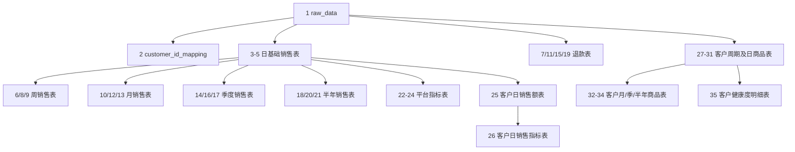

# 抖店—儿童服饰旗舰店 35 张表设计审核草稿

> 文档状态：**待用户审阅、待修改、尚未建表、尚未上传**  
> 目标数据库：`weidian`  
> 目标 Schema：`"doudianChildren"`（PostgreSQL 中需要保留双引号）  
> 数据源目录：`D:\实习\AI客户看板\data\抖店\儿童服饰旗舰店\`  
> 生成日期：2026-08-10（北京时间）  
> 本文档用途：先确认字段、筛选条件、统计口径和依赖关系；确认前不执行任何 DDL、INSERT 或刷新操作。

---

## 1. 本次源数据复核结果

### 1.1 文件与重复数据

| 检查项 | 复核结果 |
|---|---:|
| 当前 `.xlsx` 文件数 | 23 |
| 数据记录总数（不含表头） | 880,014 |
| 去重后的子订单编号数 | 880,014 |
| 文件内部重复子订单编号 | 0 |
| 文件之间交叉重复子订单编号 | 0 |
| 临时锁文件 | 0 |
| 工作表表头位置 | 全部为第 1 行 |
| 每个文件的原始字段数 | 90 |
| 23 个文件的表头是否完全一致 | 是 |

逐文件记录数如下：

| 序号 | 文件名 | 数据记录数 | 文件内重复子订单编号 |
|---:|---|---:|---:|
| 1 | `2025.02.01.xlsx` | 43 | 0 |
| 2 | `2025.02.02.xlsx` | 79 | 0 |
| 3 | `2025.02.03.xlsx` | 61 | 0 |
| 4 | `2025.02.04.xlsx` | 90 | 0 |
| 5 | `2025.02.05.xlsx` | 274 | 0 |
| 6 | `2025.02.06.xlsx` | 152 | 0 |
| 7 | `2025.02.07.xlsx` | 212 | 0 |
| 8 | `2025.02.08.xlsx` | 286 | 0 |
| 9 | `2025.02.09.xlsx` | 189 | 0 |
| 10 | `2025.02.10.xlsx` | 358 | 0 |
| 11 | `2025.02.11.xlsx` | 441 | 0 |
| 12 | `2025.02.12.xlsx` | 325 | 0 |
| 13 | `2025.02.13.xlsx` | 310 | 0 |
| 14 | `2025.02.14.xlsx` | 231 | 0 |
| 15 | `2025.02.15.xlsx` | 330 | 0 |
| 16 | `2025.02.16.xlsx` | 387 | 0 |
| 17 | `2025.02.17.xlsx` | 826 | 0 |
| 18 | `儿童服饰旗舰店2025.02.18-2025.02.28.xlsx` | 14,769 | 0 |
| 19 | `儿童服饰旗舰店2025.03月.xlsx` | 84,383 | 0 |
| 20 | `儿童服饰旗舰店2025.04.01-2025.08.31.xlsx` | 408,168 | 0 |
| 21 | `儿童服饰旗舰店2025.09.01-2026.1.29.xlsx` | 84,099 | 0 |
| 22 | `儿童服饰旗舰店2026.07.01-2026.07.28.xlsx` | 52,481 | 0 |
| 23 | `儿童服饰旗舰店2026.1.30-2026.06.30.xlsx` | 231,520 | 0 |
| **合计** | **23 个文件** | **880,014** | **0** |

已删除且当前目录中不存在的重复文件：

- `2025.02.18.xlsx`
- `2025.02.19.xlsx`

当前目录保留了覆盖上述日期的区间文件：`儿童服饰旗舰店2025.02.18-2025.02.28.xlsx`。

### 1.2 源数据中已识别的业务值

以下值来自对 23 个文件的字段检查；分类数量为抽样检查结果，只用于证明字段中确实存在这些值，不作为最终建表后的正式统计结果。

| 字段 | 已识别的值 |
|---|---|
| `订单状态` | `已完成`、`已关闭`、`已发货`、`待发货` |
| `售后状态` | 空白或 `-`、`退款成功`、`已全额退款`、`换货成功`、`补寄成功`、`售后关闭`、`待退货`、`待收退货`、`售后待处理` |
| `流量来源` | `精选联盟`、`小店自卖`、空白或 `-` |

---

## 2. 35 张表总览

| 序号 | 英文表名 | 中文名称 | 主要上游表 | 数据粒度 |
|---:|---|---|---|---|
| 1 | `raw_data` | 原始数据表 | Excel 原文件 | 每个子订单明细一行 |
| 2 | `customer_id_mapping` | 客户列表表 | `raw_data` | 每个客户一行 |
| 3 | `daily_sales` | 日销售额表 | `raw_data` | 每日一行 |
| 4 | `daily_product_sales` | 日商品销售额表 | `raw_data` | 每日、每商品一行 |
| 5 | `daily_customer_sales` | 日客户销售额表 | `raw_data` | 每日、每客户一行 |
| 6 | `weekly_sales` | 周销售额表 | `daily_sales` | 每自然周一行 |
| 7 | `weekly_refunds` | 周退款额表 | `raw_data` | 每自然周一行 |
| 8 | `weekly_product_sales` | 周商品销售额表 | `daily_product_sales` | 每自然周、每商品一行 |
| 9 | `weekly_customer_sales` | 周客户销售额表 | `daily_customer_sales` | 每自然周、每客户一行 |
| 10 | `monthly_sales` | 月销售额表 | `daily_sales` | 每自然月一行 |
| 11 | `monthly_refunds` | 月退款额表 | `raw_data` | 每自然月一行 |
| 12 | `monthly_product_sales` | 月商品销售额表 | `daily_product_sales` | 每自然月、每商品一行 |
| 13 | `monthly_customer_sales` | 月客户销售额表 | `daily_customer_sales` | 每自然月、每客户一行 |
| 14 | `quarterly_sales` | 季度销售额表 | `daily_sales` | 每业务季度一行 |
| 15 | `quarterly_refunds` | 季度退款额表 | `raw_data` | 每业务季度一行 |
| 16 | `quarterly_product_sales` | 季度商品销售额表 | `daily_product_sales` | 每业务季度、每商品一行 |
| 17 | `quarterly_customer_sales` | 季度客户销售额表 | `daily_customer_sales` | 每业务季度、每客户一行 |
| 18 | `half_year_sales` | 半年销售额表 | `daily_sales` | 每业务半年一行 |
| 19 | `half_year_refunds` | 半年退款额表 | `raw_data` | 每业务半年一行 |
| 20 | `half_year_product_sales` | 半年商品销售额表 | `daily_product_sales` | 每业务半年、每商品一行 |
| 21 | `half_year_customer_sales` | 半年客户销售额表 | `daily_customer_sales` | 每业务半年、每客户一行 |
| 22 | `daily_sales_metrics` | 日销售指标表 | `daily_sales` | 每日一行 |
| 23 | `weekly_sales_metrics` | 周销售指标表 | `weekly_sales` | 每自然周一行 |
| 24 | `monthly_sales_metrics` | 月销售指标表 | `monthly_sales` | 每自然月一行 |
| 25 | `customer_daily_sales` | 客户日销售额表 | `daily_customer_sales` | 每客户、每日一行 |
| 26 | `customer_daily_sales_metrics` | 客户日销售指标表 | `customer_daily_sales` | 每客户、每日一行 |
| 27 | `customer_weekly_sales` | 客户周销售额表 | `customer_daily_sales` | 每客户、每自然周一行 |
| 28 | `customer_monthly_sales` | 客户月销售额表 | `customer_daily_sales` | 每客户、每自然月一行 |
| 29 | `customer_quarterly_sales` | 客户季度销售额表 | `customer_daily_sales` | 每客户、每业务季度一行 |
| 30 | `customer_half_year_sales` | 客户半年销售额表 | `customer_daily_sales` | 每客户、每业务半年一行 |
| 31 | `customer_daily_product_sales` | 客户日商品销售额表 | `raw_data` | 每客户、每日、每商品一行 |
| 32 | `customer_monthly_product_sales` | 客户月商品销售额表 | `customer_daily_product_sales` | 每客户、每自然月、每商品一行 |
| 33 | `customer_quarterly_product_sales` | 客户季度商品销售额表 | `customer_daily_product_sales` | 每客户、每业务季度、每商品一行 |
| 34 | `customer_half_year_product_sales` | 客户半年商品销售额表 | `customer_daily_product_sales` | 每客户、每业务半年、每商品一行 |
| 35 | `customer_health_detail` | 客户健康度明细表 | `customer_half_year_sales` | 每客户、每业务半年一行 |

---

## 3. 统一业务口径

### 3.1 原始字段到分析字段的映射

| 原始字段 | 分析字段 | 处理方式 |
|---|---|---|
| `支付完成时间` | `transaction_date` | 转为北京时间日期；无法解析或为空时不进入销售、退款聚合表 |
| `订单应付金额` | `transaction_amount` | 转为 `NUMERIC(18,2)`；销售表统计原始应付金额，不扣减退款 |
| `订单应付金额` | `refund_amount` | 满足退款规则时，将整条订单的应付金额记为退款金额 |
| `商品数量` | `product_quantity` | 转为整数并求和 |
| `商家编码` | `product_code` | 去除首尾空格和制表符；空白或 `-` 不进入商品维度表 |
| `达人ID` | `customer_id` | 以文本保存，去除首尾空格和制表符；数值型尾部 `.0` 规范化去除 |
| `达人昵称` | `customer_nickname` | 去除首尾空格和制表符；空白允许保留为 `NULL` |

### 3.2 销售有效记录

设计稿暂定销售记录必须同时满足：

1. `订单状态 IN ('已完成', '已发货', '待发货')`；
2. 排除 `订单状态='已关闭'`；
3. `支付完成时间`不为空且可以解析；
4. `订单应付金额`不为空且可以转为金额；
5. 销售额使用`订单应付金额`，不从销售表中直接扣除退款金额；退款另表统计。

> **待重点确认：** `待发货`与`已发货`是否都应计入有效销售。本文档先按“已支付且未关闭，因此计入销售”设计。

### 3.3 客户记录

与客户有关的表必须在销售有效记录规则之外，再同时满足：

1. `流量来源='精选联盟'`；
2. `达人ID`不是空白、`-`、`0`或`0.0`；
3. `customer_id=达人ID`；
4. `customer_nickname=达人昵称`。

客户列表表本身不限制订单状态，用于保留所有曾出现过的有效精选联盟达人。若同一客户存在多个昵称，暂定选择`支付完成时间`最新记录中的最后一个非空昵称。

### 3.4 退款记录

售后状态先去除首尾空格，并把空白和 `-` 视为“无售后”。

| 售后状态 | 是否进入退款表 |
|---|---|
| 空白、`-` | 否 |
| `换货成功` | 否 |
| `补寄成功` | 否 |
| `退款成功` | 是 |
| `已全额退款` | 是 |
| `售后关闭` | 是 |
| `待退货` | 是 |
| `待收退货` | 是 |
| `售后待处理` | 是 |
| 后续出现的其他非空售后状态 | 是，先进入异常清单复核后再纳入正式刷新 |

退款表暂不限制订单状态；只要符合上述退款状态，且支付日期、金额可解析，就按`订单应付金额`记录`refund_amount`。因为原文件没有独立的实际退款金额字段，所以当前只能按整单应付金额计算。

### 3.5 时间周期

| 周期 | 口径 | 示例 |
|---|---|---|
| 自然日 | 北京时间 00:00:00—23:59:59 | 2026-07-28 |
| 自然周 | 周一至周日 | 2026-07-27—2026-08-02 |
| 自然月 | 每月 1 日至月末 | 2026-07-01—2026-07-31 |
| 业务季度 | 2—4月、5—7月、8—10月、11—次年1月 | 2025-11-01—2026-01-31 |
| 业务半年 | 2—7月、8—次年1月 | 2025-08-01—2026-01-31 |

所有`period_start`和`period_end`均保存完整周期边界，不因为源数据当前只覆盖周期的一部分而缩短。

### 3.6 指标精度与空值

- 金额统一使用`NUMERIC(18,2)`，保留 2 位小数。
- 商品数量和拿货次数统一使用`BIGINT`。
- 同比、环比、健康度得分统一保留 2 位小数。
- 同比或环比的对比期不存在、对比期金额为 0 时，指标统一写入`0.00`，不写`NULL`。
- `created_at`、`updated_at`使用`TIMESTAMPTZ`；写入连接的时区固定为`Asia/Shanghai`。
- 所有表的`id`使用`BIGINT GENERATED ALWAYS AS IDENTITY PRIMARY KEY`。

### 3.7 刷新与事务

首次建表和以后每次文件上传均使用同一个数据库事务：

1. 在临时区读取并校验整批文件；
2. 校验 90 个原始字段、日期、金额、数量、子订单编号和文件重叠；
3. 插入`raw_data`；
4. 按依赖顺序刷新受影响的业务表；
5. 运行行数、业务键唯一性、金额数量对账和客户孤立映射校验；
6. 全部通过才`COMMIT`；任一步失败均`ROLLBACK`。

也就是说：一次上传要么原始表与全部派生表一起成功，要么一起失败，不保留半成品。

---

## 4. 原始表字段设计

### 1）原始数据表：`raw_data`

- 用途：原样保存抖店导出的订单明细。
- 粒度：每个子订单明细一行。
- 字段命名：90 个源字段保留中文原名，不做英文映射；仅新增 3 个技术字段。
- 数据类型：为避免订单编号、手机号、编码、制表符和前导零在导入时失真，90 个原始字段暂定全部使用`TEXT`；派生表读取时再显式清洗、转换。
- 主键：`id`。
- 建议索引：`子订单编号`、`支付完成时间`、`订单状态`、`售后状态`、`流量来源`、`达人ID`、`商家编码`。
- 原始表不自动删除或合并业务记录；上传前通过批次校验阻止重复文件和重复子订单编号进入同一批次。

完整字段顺序如下：

| 序号 | 字段名 | 类型 | 说明 |
|---:|---|---|---|
| 1 | `id` | `BIGINT IDENTITY` | 主键 |
| 2 | `主订单编号` | `TEXT` | 原始字段 |
| 3 | `子订单编号` | `TEXT` | 原始字段；当前数据中全局唯一 |
| 4 | `选购商品` | `TEXT` | 原始字段 |
| 5 | `商品规格` | `TEXT` | 原始字段 |
| 6 | `商品数量` | `TEXT` | 原始字段；派生时转整数 |
| 7 | `商品ID` | `TEXT` | 原始字段 |
| 8 | `商家编码` | `TEXT` | 原始字段；映射为`product_code` |
| 9 | `商品单价` | `TEXT` | 原始字段 |
| 10 | `订单应付金额` | `TEXT` | 原始字段；映射为交易金额、退款金额 |
| 11 | `运费` | `TEXT` | 原始字段 |
| 12 | `优惠总金额` | `TEXT` | 原始字段 |
| 13 | `平台优惠` | `TEXT` | 原始字段 |
| 14 | `商家优惠` | `TEXT` | 原始字段 |
| 15 | `达人优惠` | `TEXT` | 原始字段 |
| 16 | `商家改价` | `TEXT` | 原始字段 |
| 17 | `支付优惠` | `TEXT` | 原始字段 |
| 18 | `红包抵扣` | `TEXT` | 原始字段 |
| 19 | `支付方式` | `TEXT` | 原始字段 |
| 20 | `手续费` | `TEXT` | 原始字段 |
| 21 | `收件人` | `TEXT` | 原始字段 |
| 22 | `收件人手机号` | `TEXT` | 原始字段 |
| 23 | `省` | `TEXT` | 原始字段 |
| 24 | `市` | `TEXT` | 原始字段 |
| 25 | `区` | `TEXT` | 原始字段 |
| 26 | `街道` | `TEXT` | 原始字段 |
| 27 | `详细地址` | `TEXT` | 原始字段 |
| 28 | `是否修改过地址` | `TEXT` | 原始字段 |
| 29 | `地址修改时段` | `TEXT` | 原始字段 |
| 30 | `买家留言` | `TEXT` | 原始字段 |
| 31 | `订单提交时间` | `TEXT` | 原始字段 |
| 32 | `旗帜颜色` | `TEXT` | 原始字段 |
| 33 | `商家备注` | `TEXT` | 原始字段 |
| 34 | `订单完成时间` | `TEXT` | 原始字段 |
| 35 | `支付完成时间` | `TEXT` | 原始字段；映射为交易日期 |
| 36 | `APP渠道` | `TEXT` | 原始字段 |
| 37 | `流量来源` | `TEXT` | 原始字段；客户表筛选条件 |
| 38 | `订单状态` | `TEXT` | 原始字段；销售筛选条件 |
| 39 | `承诺发货时间` | `TEXT` | 原始字段 |
| 40 | `订单类型` | `TEXT` | 原始字段 |
| 41 | `鲁班落地页ID` | `TEXT` | 原始字段 |
| 42 | `达人ID` | `TEXT` | 原始字段；映射为`customer_id` |
| 43 | `达人昵称` | `TEXT` | 原始字段；映射为`customer_nickname` |
| 44 | `所属门店ID` | `TEXT` | 原始字段 |
| 45 | `售后状态` | `TEXT` | 原始字段；退款筛选条件 |
| 46 | `取消原因` | `TEXT` | 原始字段 |
| 47 | `预约发货时间` | `TEXT` | 原始字段 |
| 48 | `仓库ID` | `TEXT` | 原始字段 |
| 49 | `仓库名称` | `TEXT` | 原始字段 |
| 50 | `序列号` | `TEXT` | 原始字段 |
| 51 | `是否安心购` | `TEXT` | 原始字段 |
| 52 | `广告渠道` | `TEXT` | 原始字段 |
| 53 | `流量类型` | `TEXT` | 原始字段 |
| 54 | `流量体裁` | `TEXT` | 原始字段 |
| 55 | `流量渠道` | `TEXT` | 原始字段 |
| 56 | `发货主体` | `TEXT` | 原始字段 |
| 57 | `发货主体明细` | `TEXT` | 原始字段 |
| 58 | `发货时间` | `TEXT` | 原始字段 |
| 59 | `降价类优惠` | `TEXT` | 原始字段 |
| 60 | `平台实际承担优惠金额` | `TEXT` | 原始字段 |
| 61 | `商家实际承担优惠金额` | `TEXT` | 原始字段 |
| 62 | `达人实际承担优惠金额` | `TEXT` | 原始字段 |
| 63 | `预计送达时间` | `TEXT` | 原始字段 |
| 64 | `是否平台仓自流转` | `TEXT` | 原始字段 |
| 65 | `车型` | `TEXT` | 原始字段 |
| 66 | `商品69码` | `TEXT` | 原始字段 |
| 67 | `发货SN码` | `TEXT` | 原始字段 |
| 68 | `发货IMEI码1` | `TEXT` | 原始字段 |
| 69 | `发货IMEI码2` | `TEXT` | 原始字段 |
| 70 | `是否福袋订单` | `TEXT` | 原始字段 |
| 71 | `福袋采购订单号` | `TEXT` | 原始字段 |
| 72 | `福袋采购订单状态` | `TEXT` | 原始字段 |
| 73 | `福袋采购订单采购方ID` | `TEXT` | 原始字段 |
| 74 | `福袋采购订单采购方名称` | `TEXT` | 原始字段 |
| 75 | `福袋采购订单创建时间` | `TEXT` | 原始字段 |
| 76 | `福袋采购订单支付时间` | `TEXT` | 原始字段 |
| 77 | `福袋采购订单订单应付金额` | `TEXT` | 原始字段 |
| 78 | `福袋采购订单订单实际付款金额` | `TEXT` | 原始字段 |
| 79 | `福袋采购订单订单优惠金额` | `TEXT` | 原始字段 |
| 80 | `福袋采购订单商品ID` | `TEXT` | 原始字段 |
| 81 | `福袋采购订单商品名称` | `TEXT` | 原始字段 |
| 82 | `福袋采购订单商品单价` | `TEXT` | 原始字段 |
| 83 | `福袋采购订单商品数量` | `TEXT` | 原始字段 |
| 84 | `福袋采购订单核销数量` | `TEXT` | 原始字段 |
| 85 | `福袋采购订单结算数量` | `TEXT` | 原始字段 |
| 86 | `预约送达时间` | `TEXT` | 原始字段 |
| 87 | `建议发货时间（起）` | `TEXT` | 原始字段 |
| 88 | `建议发货时间（止）` | `TEXT` | 原始字段 |
| 89 | `物流SN码` | `TEXT` | 原始字段 |
| 90 | `物流IMEI码1` | `TEXT` | 原始字段 |
| 91 | `物流IMEI码2` | `TEXT` | 原始字段 |
| 92 | `created_at` | `TIMESTAMPTZ` | 插入时间，北京时间显示 |
| 93 | `updated_at` | `TIMESTAMPTZ` | 更新时间，北京时间显示 |

---

## 5. 客户列表表

### 2）客户列表表：`customer_id_mapping`

- 完整字段：`id BIGINT IDENTITY`、`customer_id TEXT`、`customer_nickname TEXT`、`created_at TIMESTAMPTZ`、`updated_at TIMESTAMPTZ`。
- 来源：`raw_data`。
- 筛选：`流量来源='精选联盟'`，且`达人ID`不是空白、`-`、`0`或`0.0`。
- 转换：`customer_id=规范化后的达人ID`，`customer_nickname=规范化后的达人昵称`。
- 去重：按`customer_id`去重。
- 昵称冲突：取支付时间最新记录中的最后一个非空昵称；若始终为空则保留`NULL`。
- 业务唯一键：`customer_id`。
- 说明：该表不要求订单必须是有效销售，以免遗漏曾经出现过的精选联盟客户。

---

## 6. 日、周、月、季度、半年基础销售表

### 3）日销售额表：`daily_sales`

- 完整字段：`id BIGINT IDENTITY`、`transaction_date DATE`、`transaction_amount NUMERIC(18,2)`、`created_at TIMESTAMPTZ`、`updated_at TIMESTAMPTZ`。
- 来源：`raw_data`中的销售有效记录。
- 流程：把`支付完成时间`转换为北京时间日期，按`transaction_date`分组，对`订单应付金额`求和。
- 业务唯一键：`transaction_date`。

### 4）日商品销售额表：`daily_product_sales`

- 完整字段：`id BIGINT IDENTITY`、`transaction_date DATE`、`product_code TEXT`、`transaction_amount NUMERIC(18,2)`、`product_quantity BIGINT`、`created_at TIMESTAMPTZ`、`updated_at TIMESTAMPTZ`。
- 来源：`raw_data`中的销售有效记录。
- 额外筛选：规范化后的`商家编码`不能是空白或`-`。
- 流程：先按交易日期分组，再按商品编码分组；交易金额求和，商品数量求和。
- 业务唯一键：`transaction_date + product_code`。

### 5）日客户销售额表：`daily_customer_sales`

- 完整字段：`id BIGINT IDENTITY`、`transaction_date DATE`、`customer_id TEXT`、`transaction_amount NUMERIC(18,2)`、`created_at TIMESTAMPTZ`、`updated_at TIMESTAMPTZ`。
- 来源：`raw_data`中的销售有效记录。
- 额外筛选：执行客户记录规则，即只统计精选联盟且达人ID有效的记录。
- 流程：先按交易日期分组，再按客户ID分组，对交易金额求和。
- 业务唯一键：`transaction_date + customer_id`。
- 映射校验：所有`customer_id`必须能在`customer_id_mapping`中找到。

### 6）周销售额表：`weekly_sales`

- 完整字段：`id BIGINT IDENTITY`、`period_start DATE`、`period_end DATE`、`weekly_transaction_amount NUMERIC(18,2)`、`created_at TIMESTAMPTZ`、`updated_at TIMESTAMPTZ`。
- 来源：`daily_sales`。
- 流程：确定每个日期所在自然周的周一和周日，按周期聚合日销售额。
- 业务唯一键：`period_start + period_end`。

### 7）周退款额表：`weekly_refunds`

- 完整字段：`id BIGINT IDENTITY`、`period_start DATE`、`period_end DATE`、`weekly_refund_amount NUMERIC(18,2)`、`created_at TIMESTAMPTZ`、`updated_at TIMESTAMPTZ`。
- 来源：`raw_data`中符合退款规则的记录。
- 流程：以`支付完成时间`所在自然周为周期，对退款金额求和。
- 业务唯一键：`period_start + period_end`。

### 8）周商品销售额表：`weekly_product_sales`

- 完整字段：`id BIGINT IDENTITY`、`period_start DATE`、`period_end DATE`、`product_code TEXT`、`weekly_transaction_amount NUMERIC(18,2)`、`weekly_product_quantity BIGINT`、`created_at TIMESTAMPTZ`、`updated_at TIMESTAMPTZ`。
- 来源：`daily_product_sales`。
- 流程：按自然周和商品编码分组，分别汇总交易金额、商品数量。
- 业务唯一键：`period_start + period_end + product_code`。

### 9）周客户销售额表：`weekly_customer_sales`

- 完整字段：`id BIGINT IDENTITY`、`period_start DATE`、`period_end DATE`、`customer_id TEXT`、`weekly_transaction_amount NUMERIC(18,2)`、`created_at TIMESTAMPTZ`、`updated_at TIMESTAMPTZ`。
- 来源：`daily_customer_sales`。
- 流程：按自然周和客户ID分组，汇总客户交易金额。
- 业务唯一键：`period_start + period_end + customer_id`。

### 10）月销售额表：`monthly_sales`

- 完整字段：`id BIGINT IDENTITY`、`period_start DATE`、`period_end DATE`、`monthly_transaction_amount NUMERIC(18,2)`、`created_at TIMESTAMPTZ`、`updated_at TIMESTAMPTZ`。
- 来源：`daily_sales`。
- 流程：确定自然月边界，按自然月汇总日销售额。
- 业务唯一键：`period_start + period_end`。

### 11）月退款额表：`monthly_refunds`

- 完整字段：`id BIGINT IDENTITY`、`period_start DATE`、`period_end DATE`、`monthly_refund_amount NUMERIC(18,2)`、`created_at TIMESTAMPTZ`、`updated_at TIMESTAMPTZ`。
- 来源：`raw_data`中符合退款规则的记录。
- 流程：以`支付完成时间`所在自然月为周期，对退款金额求和。
- 业务唯一键：`period_start + period_end`。

### 12）月商品销售额表：`monthly_product_sales`

- 完整字段：`id BIGINT IDENTITY`、`period_start DATE`、`period_end DATE`、`product_code TEXT`、`monthly_transaction_amount NUMERIC(18,2)`、`monthly_product_quantity BIGINT`、`created_at TIMESTAMPTZ`、`updated_at TIMESTAMPTZ`。
- 来源：`daily_product_sales`。
- 流程：按自然月和商品编码分组，分别汇总交易金额、商品数量。
- 业务唯一键：`period_start + period_end + product_code`。

### 13）月客户销售额表：`monthly_customer_sales`

- 完整字段：`id BIGINT IDENTITY`、`period_start DATE`、`period_end DATE`、`customer_id TEXT`、`monthly_transaction_amount NUMERIC(18,2)`、`created_at TIMESTAMPTZ`、`updated_at TIMESTAMPTZ`。
- 来源：`daily_customer_sales`。
- 流程：按自然月和客户ID分组，汇总客户交易金额。
- 业务唯一键：`period_start + period_end + customer_id`。

### 14）季度销售额表：`quarterly_sales`

- 完整字段：`id BIGINT IDENTITY`、`period_start DATE`、`period_end DATE`、`quarterly_transaction_amount NUMERIC(18,2)`、`created_at TIMESTAMPTZ`、`updated_at TIMESTAMPTZ`。
- 来源：`daily_sales`。
- 流程：把交易日期映射到业务季度（2—4月、5—7月、8—10月、11—次年1月），按季度汇总日销售额。
- 业务唯一键：`period_start + period_end`。

### 15）季度退款额表：`quarterly_refunds`

- 完整字段：`id BIGINT IDENTITY`、`period_start DATE`、`period_end DATE`、`quarterly_refund_amount NUMERIC(18,2)`、`created_at TIMESTAMPTZ`、`updated_at TIMESTAMPTZ`。
- 来源：`raw_data`中符合退款规则的记录。
- 流程：把支付日期映射到业务季度，对退款金额求和。
- 业务唯一键：`period_start + period_end`。

### 16）季度商品销售额表：`quarterly_product_sales`

- 完整字段：`id BIGINT IDENTITY`、`period_start DATE`、`period_end DATE`、`product_code TEXT`、`quarterly_transaction_amount NUMERIC(18,2)`、`quarterly_product_quantity BIGINT`、`created_at TIMESTAMPTZ`、`updated_at TIMESTAMPTZ`。
- 来源：`daily_product_sales`。
- 流程：按业务季度和商品编码分组，分别汇总交易金额、商品数量。
- 业务唯一键：`period_start + period_end + product_code`。

### 17）季度客户销售额表：`quarterly_customer_sales`

- 完整字段：`id BIGINT IDENTITY`、`period_start DATE`、`period_end DATE`、`customer_id TEXT`、`quarterly_transaction_amount NUMERIC(18,2)`、`created_at TIMESTAMPTZ`、`updated_at TIMESTAMPTZ`。
- 来源：`daily_customer_sales`。
- 流程：按业务季度和客户ID分组，汇总客户交易金额。
- 业务唯一键：`period_start + period_end + customer_id`。

### 18）半年销售额表：`half_year_sales`

- 完整字段：`id BIGINT IDENTITY`、`period_start DATE`、`period_end DATE`、`half_year_transaction_amount NUMERIC(18,2)`、`created_at TIMESTAMPTZ`、`updated_at TIMESTAMPTZ`。
- 来源：`daily_sales`。
- 流程：把交易日期映射到业务半年（2—7月、8—次年1月），按半年汇总日销售额。
- 业务唯一键：`period_start + period_end`。

### 19）半年退款额表：`half_year_refunds`

- 完整字段：`id BIGINT IDENTITY`、`period_start DATE`、`period_end DATE`、`half_year_refund_amount NUMERIC(18,2)`、`created_at TIMESTAMPTZ`、`updated_at TIMESTAMPTZ`。
- 来源：`raw_data`中符合退款规则的记录。
- 流程：把支付日期映射到业务半年，对退款金额求和。
- 业务唯一键：`period_start + period_end`。

### 20）半年商品销售额表：`half_year_product_sales`

- 完整字段：`id BIGINT IDENTITY`、`period_start DATE`、`period_end DATE`、`product_code TEXT`、`half_year_transaction_amount NUMERIC(18,2)`、`half_year_product_quantity BIGINT`、`created_at TIMESTAMPTZ`、`updated_at TIMESTAMPTZ`。
- 来源：`daily_product_sales`。
- 流程：按业务半年和商品编码分组，分别汇总交易金额、商品数量。
- 业务唯一键：`period_start + period_end + product_code`。

### 21）半年客户销售额表：`half_year_customer_sales`

- 完整字段：`id BIGINT IDENTITY`、`period_start DATE`、`period_end DATE`、`customer_id TEXT`、`half_year_transaction_amount NUMERIC(18,2)`、`created_at TIMESTAMPTZ`、`updated_at TIMESTAMPTZ`。
- 来源：`daily_customer_sales`。
- 流程：按业务半年和客户ID分组，汇总客户交易金额。
- 业务唯一键：`period_start + period_end + customer_id`。

---

## 7. 平台销售指标表

### 22）日销售指标表：`daily_sales_metrics`

- 完整字段：`id BIGINT IDENTITY`、`transaction_date DATE`、`transaction_amount NUMERIC(18,2)`、`year_over_year_rate NUMERIC(12,2)`、`rolling_7_day_transaction_amount NUMERIC(18,2)`、`rolling_30_day_transaction_amount NUMERIC(18,2)`、`created_at TIMESTAMPTZ`、`updated_at TIMESTAMPTZ`。
- 来源：`daily_sales`。
- 同比：`(当日金额 - 上年同日金额) / 上年同日金额 × 100`，保留 2 位小数。
- 7 日滚动：当前日期及前 6 个自然日的销售额之和。
- 30 日滚动：当前日期及前 29 个自然日的销售额之和。
- 缺失自然日按金额 0 参与滚动计算，但只有`daily_sales`中存在的交易日期生成指标行。
- 上年同日不存在或金额为 0 时，`year_over_year_rate=0.00`。
- 业务唯一键：`transaction_date`。

### 23）周销售指标表：`weekly_sales_metrics`

- 完整字段：`id BIGINT IDENTITY`、`period_start DATE`、`period_end DATE`、`weekly_transaction_amount NUMERIC(18,2)`、`week_over_week_rate NUMERIC(12,2)`、`created_at TIMESTAMPTZ`、`updated_at TIMESTAMPTZ`。
- 来源：`weekly_sales`。
- 环比：`(本周金额 - 上一自然周金额) / 上一自然周金额 × 100`，保留 2 位小数。
- 上一自然周不存在或金额为 0 时，`week_over_week_rate=0.00`。
- 业务唯一键：`period_start + period_end`。

### 24）月销售指标表：`monthly_sales_metrics`

- 完整字段：`id BIGINT IDENTITY`、`period_start DATE`、`period_end DATE`、`monthly_transaction_amount NUMERIC(18,2)`、`month_over_month_rate NUMERIC(12,2)`、`created_at TIMESTAMPTZ`、`updated_at TIMESTAMPTZ`。
- 来源：`monthly_sales`。
- 环比：`(本月金额 - 上一自然月金额) / 上一自然月金额 × 100`，保留 2 位小数。
- 上一自然月不存在或金额为 0 时，`month_over_month_rate=0.00`。
- 业务唯一键：`period_start + period_end`。

---

## 8. 客户销售与客户商品销售表

### 25）客户日销售额表：`customer_daily_sales`

- 完整字段：`id BIGINT IDENTITY`、`transaction_date DATE`、`customer_id TEXT`、`transaction_amount NUMERIC(18,2)`、`created_at TIMESTAMPTZ`、`updated_at TIMESTAMPTZ`。
- 来源：`daily_customer_sales`。
- 流程：交换业务展示主次顺序，先以客户为主体，再按交易日期组织；数值与`daily_customer_sales`逐业务键一致。
- 业务唯一键：`customer_id + transaction_date`。

### 26）客户日销售指标表：`customer_daily_sales_metrics`

- 完整字段：`id BIGINT IDENTITY`、`transaction_date DATE`、`customer_id TEXT`、`transaction_amount NUMERIC(18,2)`、`rolling_7_day_transaction_amount NUMERIC(18,2)`、`rolling_30_day_transaction_amount NUMERIC(18,2)`、`created_at TIMESTAMPTZ`、`updated_at TIMESTAMPTZ`。
- 来源：`customer_daily_sales`。
- 7 日滚动：对同一客户计算当前日期及前 6 个自然日的销售额之和。
- 30 日滚动：对同一客户计算当前日期及前 29 个自然日的销售额之和。
- 不同客户之间绝不混算；缺失自然日按 0 参与滚动。
- 业务唯一键：`customer_id + transaction_date`。

### 27）客户周销售额表：`customer_weekly_sales`

- 完整字段：`id BIGINT IDENTITY`、`period_start DATE`、`period_end DATE`、`customer_id TEXT`、`weekly_transaction_amount NUMERIC(18,2)`、`weekly_purchase_count BIGINT`、`created_at TIMESTAMPTZ`、`updated_at TIMESTAMPTZ`。
- 来源：`customer_daily_sales`。
- 流程：先按客户ID分组，再按交易日期所在自然周分组；交易金额求和。
- 拿货次数：统计同一客户ID在该周期内出现在`customer_daily_sales`中的记录数。由于日表业务键是`customer_id + transaction_date`，该值等于客户在本周发生有效拿货的天数，最大为7。
- 业务唯一键：`customer_id + period_start + period_end`。

### 28）客户月销售额表：`customer_monthly_sales`

- 完整字段：`id BIGINT IDENTITY`、`period_start DATE`、`period_end DATE`、`customer_id TEXT`、`monthly_transaction_amount NUMERIC(18,2)`、`monthly_purchase_count BIGINT`、`created_at TIMESTAMPTZ`、`updated_at TIMESTAMPTZ`。
- 来源：`customer_daily_sales`。
- 流程：先按客户ID、再按交易日期所在自然月分组；交易金额求和，拿货次数统计客户ID在日表中的出现次数，最大不超过当月自然日数。
- 业务唯一键：`customer_id + period_start + period_end`。

### 29）客户季度销售额表：`customer_quarterly_sales`

- 完整字段：`id BIGINT IDENTITY`、`period_start DATE`、`period_end DATE`、`customer_id TEXT`、`quarterly_transaction_amount NUMERIC(18,2)`、`quarterly_purchase_count BIGINT`、`created_at TIMESTAMPTZ`、`updated_at TIMESTAMPTZ`。
- 来源：`customer_daily_sales`。
- 流程：先按客户ID、再按交易日期所在业务季度分组；交易金额求和，拿货次数统计客户ID在日表中的出现次数。
- 业务季度：2—4月、5—7月、8—10月、11—次年1月。
- 业务唯一键：`customer_id + period_start + period_end`。

### 30）客户半年销售额表：`customer_half_year_sales`

- 完整字段：`id BIGINT IDENTITY`、`period_start DATE`、`period_end DATE`、`customer_id TEXT`、`half_year_transaction_amount NUMERIC(18,2)`、`half_year_purchase_count BIGINT`、`created_at TIMESTAMPTZ`、`updated_at TIMESTAMPTZ`。
- 来源：`customer_daily_sales`。
- 流程：先按客户ID、再按交易日期所在业务半年分组；交易金额求和，拿货次数统计客户ID在日表中的出现次数。本表仍是客户健康度表的直接上游。
- 业务半年：2—7月、8—次年1月。
- 业务唯一键：`customer_id + period_start + period_end`。

### 31）客户日商品销售额表：`customer_daily_product_sales`

- 完整字段：`id BIGINT IDENTITY`、`transaction_date DATE`、`customer_id TEXT`、`product_code TEXT`、`transaction_amount NUMERIC(18,2)`、`product_quantity BIGINT`、`created_at TIMESTAMPTZ`、`updated_at TIMESTAMPTZ`。
- 来源：`raw_data`中的客户销售有效记录。
- 额外筛选：规范化后的`商家编码`不能是空白或`-`。
- 流程：先按客户ID分组，再按交易日期分组，最后按商品编码分组；分别汇总交易金额、商品数量。
- 业务唯一键：`customer_id + transaction_date + product_code`。

### 32）客户月商品销售额表：`customer_monthly_product_sales`

- 完整字段：`id BIGINT IDENTITY`、`period_start DATE`、`period_end DATE`、`customer_id TEXT`、`product_code TEXT`、`monthly_transaction_amount NUMERIC(18,2)`、`monthly_product_quantity BIGINT`、`created_at TIMESTAMPTZ`、`updated_at TIMESTAMPTZ`。
- 来源：`customer_daily_product_sales`。
- 流程：先按客户ID分组，再按自然月分组，最后按商品编码分组；分别汇总交易金额、商品数量。
- 业务唯一键：`customer_id + period_start + period_end + product_code`。

### 33）客户季度商品销售额表：`customer_quarterly_product_sales`

- 完整字段：`id BIGINT IDENTITY`、`period_start DATE`、`period_end DATE`、`customer_id TEXT`、`product_code TEXT`、`quarterly_transaction_amount NUMERIC(18,2)`、`quarterly_product_quantity BIGINT`、`created_at TIMESTAMPTZ`、`updated_at TIMESTAMPTZ`。
- 来源：`customer_daily_product_sales`。
- 流程：先按客户ID分组，再按业务季度分组，最后按商品编码分组；分别汇总交易金额、商品数量。
- 业务季度：2—4月、5—7月、8—10月、11—次年1月。
- 业务唯一键：`customer_id + period_start + period_end + product_code`。

### 34）客户半年商品销售额表：`customer_half_year_product_sales`

- 完整字段：`id BIGINT IDENTITY`、`period_start DATE`、`period_end DATE`、`customer_id TEXT`、`product_code TEXT`、`half_year_transaction_amount NUMERIC(18,2)`、`half_year_product_quantity BIGINT`、`created_at TIMESTAMPTZ`、`updated_at TIMESTAMPTZ`。
- 来源：`customer_daily_product_sales`。
- 流程：先按客户ID分组，再按业务半年分组，最后按商品编码分组；分别汇总交易金额、商品数量。
- 业务半年：2—7月、8—次年1月。
- 业务唯一键：`customer_id + period_start + period_end + product_code`。

---

## 9. 客户健康度表

### 35）客户健康度明细表：`customer_health_detail`

- 完整字段：`id BIGINT IDENTITY`、`period_start DATE`、`period_end DATE`、`customer_id TEXT`、`half_year_purchase_count BIGINT`、`half_year_purchase_amount NUMERIC(18,2)`、`customer_health_score NUMERIC(5,2)`、`customer_health_status TEXT`、`risk_reason TEXT NULL`、`follow_up_action TEXT NULL`、`created_at TIMESTAMPTZ`、`updated_at TIMESTAMPTZ`。
- 来源：`customer_half_year_sales`。
- 粒度：每个客户在每个业务半年一行；不同半年必须分别计算，不把多个半年合并判断。
- 业务唯一键：`customer_id + period_start + period_end`。
- `risk_reason`、`follow_up_action`暂不自动生成，统一保留为`NULL`，等待后续规则。

#### 9.1 拿货次数得分

| 半年拿货次数 | 得分 |
|---:|---:|
| 大于等于 4 次 | 100 |
| 等于 3 次 | 80 |
| 1—2 次 | 60 |
| 0 次 | 20 |

#### 9.2 拿货金额得分

| 半年拿货金额 | 得分 |
|---:|---:|
| 大于等于 550,000 | 100 |
| 大于等于 400,000 且小于 550,000 | 80 |
| 大于等于 200,000 且小于 400,000 | 70 |
| 大于等于 100,000 且小于 200,000 | 60 |
| 大于等于 50,000 且小于 100,000 | 40 |
| 大于等于 10,000 且小于 50,000 | 20 |
| 小于 10,000 | 10 |

#### 9.3 综合得分与状态

`customer_health_score = 拿货次数得分 × 40% + 拿货金额得分 × 60%`

综合得分保留 2 位小数，然后映射状态：

| 综合得分 | 客户健康状态 |
|---:|---|
| 大于等于 90 | 高活跃 |
| 大于等于 80 且小于 90 | 活跃 |
| 大于等于 70 且小于 80 | 稳定 |
| 大于等于 50 且小于 70 | 观察 |
| 大于等于 40 且小于 50 | 风险 |
| 大于等于 20 且小于 40 | 流失预警 |
| 小于 20 | 流失 |

---

## 10. 依赖与刷新顺序

正式执行顺序：

1. `raw_data`
2. `customer_id_mapping`
3. `daily_sales`
4. `daily_product_sales`
5. `daily_customer_sales`
6. `weekly_sales`
7. `weekly_refunds`
8. `weekly_product_sales`
9. `weekly_customer_sales`
10. `monthly_sales`
11. `monthly_refunds`
12. `monthly_product_sales`
13. `monthly_customer_sales`
14. `quarterly_sales`
15. `quarterly_refunds`
16. `quarterly_product_sales`
17. `quarterly_customer_sales`
18. `half_year_sales`
19. `half_year_refunds`
20. `half_year_product_sales`
21. `half_year_customer_sales`
22. `daily_sales_metrics`
23. `weekly_sales_metrics`
24. `monthly_sales_metrics`
25. `customer_daily_sales`
26. `customer_daily_sales_metrics`
27. `customer_weekly_sales`
28. `customer_monthly_sales`
29. `customer_quarterly_sales`
30. `customer_half_year_sales`
31. `customer_daily_product_sales`
32. `customer_monthly_product_sales`
33. `customer_quarterly_product_sales`
34. `customer_half_year_product_sales`
35. `customer_health_detail`

---

## 11. 正式建表前的统一校验

每张表建成并写入后，至少执行以下校验：

1. 字段名、字段顺序、类型、可空性与本文档一致；
2. 表 OWNER 为`root`；
3. `id`为递增主键；
4. 业务唯一键重复数为 0；
5. 日期字段、金额字段和必填维度字段空值数为 0；
6. 周、月、业务季度、业务半年边界全部正确；
7. 金额与数量从上游逐业务键重算，差异为 0；
8. 销售表只含有效销售状态，退款表只含退款规则内状态；
9. 商品维度表中不存在空白或`-`商品编码；
10. 客户维度表中不存在非精选联盟客户、空白客户或`customer_id='0'`；
11. 客户维度表的客户孤立映射数为 0；
12. 同比、环比和健康度得分均保留 2 位小数；
13. 总事务提交前，35 张表的跨层级金额对账一致；
14. 任一断言失败则整批回滚。

---

## 12. 用户审核清单（请直接编辑）

请把确认项从`[ ]`改为`[x]`，如需调整可直接改正文。

- [ ] 确认目标 Schema 使用大小写敏感名称`"doudianChildren"`。
- [ ] 确认 35 张表的英文表名不再调整。
- [ ] 确认`raw_data`保留 90 个中文原始字段，全部暂用`TEXT`保存。
- [ ] 确认销售有效状态为`已完成`、`已发货`、`待发货`，并排除`已关闭`。
- [ ] 确认销售金额使用`订单应付金额`，销售表不直接扣减退款。
- [ ] 确认退款状态除空白、`-`、`换货成功`、`补寄成功`之外全部按退款处理。
- [ ] 确认退款金额暂按整条记录的`订单应付金额`计算。
- [ ] 确认客户只取`流量来源='精选联盟'`且`达人ID`有效的记录。
- [ ] 确认客户ID使用达人ID，客户昵称使用达人昵称。
- [ ] 确认同一客户多个昵称时取支付时间最新的非空昵称。
- [ ] 确认商品维度统一使用`商家编码`，空白或`-`记录不进入商品表。
- [ ] 确认自然周为周一至周日，自然月为每月 1 日至月末。
- [ ] 确认业务季度为2—4月、5—7月、8—10月、11—次年1月。
- [ ] 确认业务半年为2—7月、8—次年1月。
- [x] 确认周、月、季度、半年拿货次数按客户ID在`customer_daily_sales`中的出现次数计算，即有效拿货天数。
- [ ] 确认同比、环比和健康度得分统一保留 2 位小数。
- [ ] 确认客户健康度按每个业务半年分别计算，评分门槛沿用快手小店。
- [ ] 确认`risk_reason`和`follow_up_action`暂时保留为空。
- [ ] 确认上传和派生表刷新采用一次性成功或一次性失败的总事务。
- [ ] 最终确认：允许根据本审核稿生成建表 SQL，但仍需在实际执行前再次确认。

---

## 13. 当前执行状态

| 项目 | 状态 |
|---|---|
| 遍历 23 个 Excel | 已完成 |
| 重复子订单编号检查 | 已完成，结果为 0 |
| 90 个原始字段一致性检查 | 已完成，完全一致 |
| 35 张表设计 | 已完成，待用户编辑审阅 |
| 连接数据库复核 Schema | 本轮未执行 |
| 创建表 | 未执行 |
| 上传数据 | 未执行 |
| 刷新派生表 | 未执行 |
