# 抖店Kocotree服饰配件店33张业务表建设过程汇总

> 数据库：`weidian`  
> Schema：`"doudianKocotree"`  
> 范围：第3—35张表，共33张；不包含第1张`raw_data`和第2张`customer_id_mapping`  
> 用途：记录Kocotree各业务表的字段、上游数据、筛选口径和建设流程，方便后续重新建表、刷新数据及排查问题。  
> 当前状态：文中33张业务表均已正式建立、上传并完成数据校验。

## 一、统一建设规则

### 1. 销售口径

- 有效订单状态：`已完成`、`已发货`、`待发货`。
- `已关闭`订单不进入销售表。
- 交易日期：使用`支付完成时间`，按北京时间解析后取自然日。
- 交易金额：使用`订单应付金额`，保存毛销售额，不在销售表中直接扣减退款。
- 商品数量：使用`商品数量`。
- 日期、金额或数量无法按目标类型解析时，该记录不进入依赖相应字段的聚合表。

### 2. 客户口径

所有包含客户ID的业务表统一增加以下条件：

1. `流量来源 = '精选联盟'`。
2. `达人ID`去除首尾空白，并去除无意义的尾部`.0`。
3. 达人ID不得为空、`-`、`0`或`0.0`。
4. `customer_id`使用规范化后的`达人ID`。
5. `customer_nickname`使用规范化后的`达人昵称`。
6. 业务表中的客户ID必须能够在`customer_id_mapping`中找到。

`customer_id_mapping`本身不限制订单状态；客户销售业务表还必须同时满足有效销售状态。

### 3. 商品编码口径

- 商品编码只使用去除首尾空白后的`商家编码`。
- `商家编码`为空或`-`时，该记录不进入商品相关表。
- 不使用商品ID或其他字段替代无效商家编码。

### 4. 退款口径

- 售后状态先去除首尾空白，空白和`-`视为无售后。
- `售后状态`为空白、`-`、`换货成功`或`补寄成功`时不计退款。
- 除上述情况外，其他所有非空售后状态均按退款处理，包括`退款成功`、`已全额退款`、`售后关闭`、`待买家收货`和`待买家退货`等状态。
- 退款表不限制订单状态。
- 退款归属日期使用该子订单的`支付完成时间`。
- 源文件没有独立实际退款金额字段，因此`refund_amount`暂按该条子订单的`订单应付金额`计算。
- `refund_amount`是计算过程中的逻辑字段，不写入`raw_data`，也不改变正式表结构。

### 5. 时间周期口径

- 自然日：北京时间00:00:00—23:59:59。
- 自然周：星期一至星期日。
- 自然月：每月1日至月末。
- 业务季度：2—4月、5—7月、8—10月、11月—次年1月。
- 业务半年：2—7月、8月—次年1月。
- 周期表统一使用`period_start`和`period_end`保存完整周期边界，即使源数据只覆盖周期的一部分，也不缩短周期结束日期。

### 6. 公共技术字段和精度

- 每张表都有`id`、`created_at`、`updated_at`。
- `id`为`BIGINT GENERATED ALWAYS AS IDENTITY PRIMARY KEY`。
- `created_at`和`updated_at`使用插入或刷新时的北京时间。
- 金额统一使用`NUMERIC(18,2)`；商品数量和拿货次数使用`BIGINT`。
- 同比、环比使用`NUMERIC(12,2)`，健康度得分使用`NUMERIC(5,2)`，统一保留2位小数。
- 对比期不存在或对比期金额为0时，同比、环比写`0.00`。
- 所有正式表OWNER均为`root`。

### 7. 事务与刷新原则

- 首次建设时，先在独立Stage Schema中按依赖关系生成全部业务表。
- Stage内完成字段、业务键、周期、金额、数量、客户、退款、指标和健康度校验。
- 发布前锁定`raw_data`和`customer_id_mapping`，确认源快照没有变化。
- 33张业务表在同一个PostgreSQL事务中原子发布；全部成功才提交，任一步失败均回滚。
- 后续上传新数据时，先更新两张基础表，再按相同依赖顺序刷新下游业务表。

## 二、表依赖与推荐建设顺序

```mermaid
flowchart TD
    R["raw_data"] --> D3["3 daily_sales"]
    R --> D4["4 daily_product_sales"]
    R --> D5["5 daily_customer_sales"]
    R --> RF["退款记录解析"]
    D3 --> W6["6 weekly_sales"]
    RF --> W7["7 weekly_refunds"]
    D4 --> W8["8 weekly_product_sales"]
    D5 --> W9["9 weekly_customer_sales"]
    D3 --> M10["10 monthly_sales"]
    RF --> M11["11 monthly_refunds"]
    D4 --> M12["12 monthly_product_sales"]
    D5 --> M13["13 monthly_customer_sales"]
    D3 --> Q14["14 quarterly_sales"]
    RF --> Q15["15 quarterly_refunds"]
    D4 --> Q16["16 quarterly_product_sales"]
    D5 --> Q17["17 quarterly_customer_sales"]
    D3 --> H18["18 half_year_sales"]
    RF --> H19["19 half_year_refunds"]
    D4 --> H20["20 half_year_product_sales"]
    D5 --> H21["21 half_year_customer_sales"]
    D3 --> X22["22 daily_sales_metrics"]
    W6 --> X23["23 weekly_sales_metrics"]
    M10 --> X24["24 monthly_sales_metrics"]
    D5 --> C25["25 customer_daily_sales"]
    C25 --> C26["26 customer_daily_sales_metrics"]
    R --> C27["27—30 客户周期销售及拿货次数"]
    R --> C31["31 customer_daily_product_sales"]
    C31 --> C32["32 customer_monthly_product_sales"]
    C31 --> C33["33 customer_quarterly_product_sales"]
    C31 --> C34["34 customer_half_year_product_sales"]
    C30 --> C35["35 customer_health_detail"]
```



## 三、按时间维度建设的表

### 3）日销售额表：`daily_sales`

备注：保存平台每个自然日的毛销售额。

字段：`id`、`transaction_date`、`transaction_amount`、`created_at`、`updated_at`。

流程：

1. 从`raw_data`读取`支付完成时间`、`订单状态`和`订单应付金额`。
2. 只保留订单状态为`已完成`、`已发货`或`待发货`的记录。
3. 将有效`支付完成时间`解析为北京时间自然日。
4. 将`订单应付金额`转换为`NUMERIC(18,2)`。
5. 按`transaction_date`分组，对交易金额求和。
6. 本表保存毛销售额，退款由退款表单独保存。
7. 业务唯一键为`transaction_date`。

### 4）日商品销售额表：`daily_product_sales`

备注：保存每个自然日、每个商品编码的销售金额和销售数量。

字段：`id`、`transaction_date`、`product_code`、`transaction_amount`、`product_quantity`、`created_at`、`updated_at`。

流程：

1. 从`raw_data`筛选有效销售状态、日期、金额和商品数量。
2. 对`商家编码`去除首尾空白，排除空白或`-`编码。
3. 按`transaction_date + product_code`分组。
4. 对`订单应付金额`求和得到`transaction_amount`。
5. 对`商品数量`求和得到`product_quantity`。
6. 业务唯一键为`transaction_date + product_code`。

### 5）日客户销售额表：`daily_customer_sales`

备注：保存每个自然日、每个客户的毛销售额；分组描述为先日期、后客户。

字段：`id`、`transaction_date`、`customer_id`、`transaction_amount`、`created_at`、`updated_at`。

流程：

1. 从`raw_data`筛选有效销售记录。
2. 增加`流量来源 = '精选联盟'`和有效达人ID条件。
3. 将规范化后的达人ID作为`customer_id`。
4. 按`transaction_date + customer_id`分组，对`订单应付金额`求和。
5. 所有客户ID必须存在于`customer_id_mapping`。
6. 业务唯一键为`transaction_date + customer_id`。

### 6）周销售额表：`weekly_sales`

备注：保存每个自然周的平台毛销售额。

字段：`id`、`period_start`、`period_end`、`weekly_transaction_amount`、`created_at`、`updated_at`。

流程：读取`daily_sales`，把交易日期映射到所在自然周的星期一和星期日，按`period_start + period_end`分组并汇总`transaction_amount`。业务唯一键为周期开始和结束日期。

### 7）周退款额表：`weekly_refunds`

备注：保存每个自然周的退款金额。

字段：`id`、`period_start`、`period_end`、`weekly_refund_amount`、`created_at`、`updated_at`。

流程：

1. 从`raw_data`读取`支付完成时间`、`售后状态`和`订单应付金额`。
2. 按统一退款规则生成临时`refund_amount`。
3. 只保留日期、金额可解析且`refund_amount > 0`的记录。
4. 将支付日期映射到自然周并汇总退款金额。
5. 业务唯一键为`period_start + period_end`。

### 8）周商品销售额表：`weekly_product_sales`

备注：保存每个自然周、每个商品编码的销售金额和数量。

字段：`id`、`period_start`、`period_end`、`product_code`、`weekly_transaction_amount`、`weekly_product_quantity`、`created_at`、`updated_at`。

流程：读取`daily_product_sales`，将`transaction_date`映射到自然周，按周期边界和`product_code`分组，分别汇总交易金额和商品数量。

### 9）周客户销售额表：`weekly_customer_sales`

备注：保存每个自然周、每个客户的销售金额，不保存拿货次数。

字段：`id`、`period_start`、`period_end`、`customer_id`、`weekly_transaction_amount`、`created_at`、`updated_at`。

流程：读取`daily_customer_sales`，将交易日期映射到自然周，按周期边界和`customer_id`分组，对客户日交易金额求和。

### 10）月销售额表：`monthly_sales`

备注：保存每个自然月的平台毛销售额。

字段：`id`、`period_start`、`period_end`、`monthly_transaction_amount`、`created_at`、`updated_at`。

流程：读取`daily_sales`，将交易日期映射到当月1日和月末，按自然月汇总`transaction_amount`。业务唯一键为周期开始和结束日期。

### 11）月退款额表：`monthly_refunds`

备注：保存每个自然月的退款金额。

字段：`id`、`period_start`、`period_end`、`monthly_refund_amount`、`created_at`、`updated_at`。

流程：从`raw_data`复用统一退款规则，将支付日期映射到自然月，按月汇总正数`refund_amount`。不能直接相加周退款额，因为自然周可能跨月。

### 12）月商品销售额表：`monthly_product_sales`

备注：保存每个自然月、每个商品编码的销售金额和数量。

字段：`id`、`period_start`、`period_end`、`product_code`、`monthly_transaction_amount`、`monthly_product_quantity`、`created_at`、`updated_at`。

流程：读取`daily_product_sales`，将交易日期映射到自然月，按周期边界和`product_code`分组，对金额和数量分别求和。

### 13）月客户销售额表：`monthly_customer_sales`

备注：保存每个自然月、每个客户的销售金额，不保存拿货次数。

字段：`id`、`period_start`、`period_end`、`customer_id`、`monthly_transaction_amount`、`created_at`、`updated_at`。

流程：读取`daily_customer_sales`，将交易日期映射到自然月，按周期边界和`customer_id`分组，对客户日交易金额求和。

### 14）季度销售额表：`quarterly_sales`

备注：保存每个业务季度的平台毛销售额。

字段：`id`、`period_start`、`period_end`、`quarterly_transaction_amount`、`created_at`、`updated_at`。

流程：读取`daily_sales`，将交易日期映射到2—4月、5—7月、8—10月、11月—次年1月，按业务季度汇总日交易金额。

### 15）季度退款额表：`quarterly_refunds`

备注：保存每个业务季度的退款金额。

字段：`id`、`period_start`、`period_end`、`quarterly_refund_amount`、`created_at`、`updated_at`。

流程：从`raw_data`复用统一退款规则，将支付日期映射到自定义业务季度，对正数`refund_amount`求和。

### 16）季度商品销售额表：`quarterly_product_sales`

备注：保存每个业务季度、每个商品编码的销售金额和数量。

字段：`id`、`period_start`、`period_end`、`product_code`、`quarterly_transaction_amount`、`quarterly_product_quantity`、`created_at`、`updated_at`。

流程：读取`daily_product_sales`，将交易日期映射到业务季度，按周期边界和`product_code`分组，分别汇总金额和数量。

### 17）季度客户销售额表：`quarterly_customer_sales`

备注：保存每个业务季度、每个客户的销售金额，不保存拿货次数。

字段：`id`、`period_start`、`period_end`、`customer_id`、`quarterly_transaction_amount`、`created_at`、`updated_at`。

流程：读取`daily_customer_sales`，将交易日期映射到业务季度，按周期边界和`customer_id`分组，对客户日交易金额求和。

### 18）半年销售额表：`half_year_sales`

备注：保存每个业务半年的平台毛销售额。

字段：`id`、`period_start`、`period_end`、`half_year_transaction_amount`、`created_at`、`updated_at`。

流程：读取`daily_sales`，将交易日期映射到2—7月或8月—次年1月，按业务半年汇总日交易金额。

### 19）半年退款额表：`half_year_refunds`

备注：保存每个业务半年的退款金额。

字段：`id`、`period_start`、`period_end`、`half_year_refund_amount`、`created_at`、`updated_at`。

流程：从`raw_data`复用统一退款规则，将支付日期映射到业务半年，对正数`refund_amount`求和。

### 20）半年商品销售额表：`half_year_product_sales`

备注：保存每个业务半年、每个商品编码的销售金额和数量。

字段：`id`、`period_start`、`period_end`、`product_code`、`half_year_transaction_amount`、`half_year_product_quantity`、`created_at`、`updated_at`。

流程：读取`daily_product_sales`，将交易日期映射到业务半年，按周期边界和`product_code`分组，分别汇总金额和数量。

### 21）半年客户销售额表：`half_year_customer_sales`

备注：保存每个业务半年、每个客户的销售金额，不保存拿货次数。

字段：`id`、`period_start`、`period_end`、`customer_id`、`half_year_transaction_amount`、`created_at`、`updated_at`。

流程：读取`daily_customer_sales`，将交易日期映射到业务半年，按周期边界和`customer_id`分组，对客户日交易金额求和。

## 四、综合指标表

### 22）日销售额指标表：`daily_sales_metrics`

备注：在日销售额基础上增加同比、近7日销售额和近30日销售额。

字段：`id`、`transaction_date`、`transaction_amount`、`year_over_year_rate`、`rolling_7_day_transaction_amount`、`rolling_30_day_transaction_amount`、`created_at`、`updated_at`。

流程：

1. 读取`daily_sales`。
2. 同比=`(当日金额-上年同一自然日金额)/上年同日金额×100`，保留2位小数。
3. 上年同日不存在或金额为0时，同比写`0.00`。
4. 近7日金额为当前日期及前6个自然日的交易金额之和。
5. 近30日金额为当前日期及前29个自然日的交易金额之和。
6. 缺失自然日按0参与滚动窗口，但只为`daily_sales`中实际存在的日期生成记录。

### 23）周销售额指标表：`weekly_sales_metrics`

备注：在周销售额基础上增加周环比。

字段：`id`、`period_start`、`period_end`、`weekly_transaction_amount`、`week_over_week_rate`、`created_at`、`updated_at`。

流程：读取`weekly_sales`，以当前自然周与上一自然周比较，计算`(本周金额-上周金额)/上周金额×100`。上一自然周不存在或金额为0时写`0.00`，结果保留2位小数。

### 24）月销售额指标表：`monthly_sales_metrics`

备注：在月销售额基础上增加月环比。

字段：`id`、`period_start`、`period_end`、`monthly_transaction_amount`、`month_over_month_rate`、`created_at`、`updated_at`。

流程：读取`monthly_sales`，以当前自然月与上一自然月比较，计算`(本月金额-上月金额)/上月金额×100`。上一自然月不存在或金额为0时写`0.00`，结果保留2位小数。

## 五、按客户维度建设的表

### 25）客户日销售额表：`customer_daily_sales`

备注：表示客户在日维度上的销售数据；结果与`daily_customer_sales`一致，处理和展示顺序改为先客户、后日期。

字段：`id`、`transaction_date`、`customer_id`、`transaction_amount`、`created_at`、`updated_at`。

流程：读取`daily_customer_sales`中的客户ID、交易日期和交易金额，按`customer_id + transaction_date`组织和写入。业务唯一键为客户ID和交易日期。

### 26）客户日销售额指标表：`customer_daily_sales_metrics`

备注：表示每个客户在每个交易日的当日、近7日和近30日销售额。

字段：`id`、`transaction_date`、`customer_id`、`transaction_amount`、`rolling_7_day_transaction_amount`、`rolling_30_day_transaction_amount`、`created_at`、`updated_at`。

流程：

1. 读取`customer_daily_sales`。
2. 对每个客户分别计算滚动窗口，不允许不同客户之间互相累计。
3. 近7日金额为该客户当前日期及前6个自然日的金额之和。
4. 近30日金额为该客户当前日期及前29个自然日的金额之和。
5. 缺失自然日按0参与窗口，但只为该客户实际存在销售数据的日期生成记录。
6. 业务唯一键为`customer_id + transaction_date`。

### 27）客户周销售额表：`customer_weekly_sales`

备注：保存客户在自然周维度上的销售金额和拿货次数。

字段：`id`、`period_start`、`period_end`、`customer_id`、`weekly_transaction_amount`、`weekly_purchase_count`、`created_at`、`updated_at`。

流程：读取`customer_daily_sales`；先按`customer_id`、再按自然周分组；交易金额求和，并按客户ID在日表中的出现次数计算本周拿货次数。该次数等于有效拿货天数，周最大为7。

### 28）客户月销售额表：`customer_monthly_sales`

备注：保存客户在自然月维度上的销售金额和拿货次数。

字段：`id`、`period_start`、`period_end`、`customer_id`、`monthly_transaction_amount`、`monthly_purchase_count`、`created_at`、`updated_at`。

流程：读取`customer_daily_sales`；先按`customer_id`、再按自然月分组；交易金额求和，并按客户ID在日表中的出现次数计算拿货次数，最大不超过当月自然日数。

### 29）客户季度销售额表：`customer_quarterly_sales`

备注：保存客户在业务季度维度上的销售金额和拿货次数。

字段：`id`、`period_start`、`period_end`、`customer_id`、`quarterly_transaction_amount`、`quarterly_purchase_count`、`created_at`、`updated_at`。

流程：读取`customer_daily_sales`；先按`customer_id`、再按业务季度分组；交易金额求和，并按客户ID在日表中的出现次数计算拿货次数。

### 30）客户半年销售额表：`customer_half_year_sales`

备注：保存客户在业务半年维度上的销售金额和拿货次数，是客户健康度表的直接上游。

字段：`id`、`period_start`、`period_end`、`customer_id`、`half_year_transaction_amount`、`half_year_purchase_count`、`created_at`、`updated_at`。

流程：读取`customer_daily_sales`；先按`customer_id`、再按业务半年分组；交易金额求和，并按客户ID在日表中的出现次数计算拿货次数。

### 31）客户日商品销售额表：`customer_daily_product_sales`

备注：保存每个客户在每个自然日购买每个商品编码的金额和数量。

字段：`id`、`transaction_date`、`customer_id`、`product_code`、`transaction_amount`、`product_quantity`、`created_at`、`updated_at`。

流程：

1. 直接读取`raw_data`，筛选有效销售状态。
2. 筛选`流量来源 = '精选联盟'`及有效达人ID。
3. 规范化`商家编码`，排除空白或`-`编码。
4. 先按`customer_id`、再按交易日期、最后按`product_code`分组。
5. 对`订单应付金额`和`商品数量`分别求和。
6. 业务唯一键为`customer_id + transaction_date + product_code`。

### 32）客户月商品销售额表：`customer_monthly_product_sales`

备注：保存每个客户在每个自然月购买每个商品编码的金额和数量。

字段：`id`、`period_start`、`period_end`、`customer_id`、`product_code`、`monthly_transaction_amount`、`monthly_product_quantity`、`created_at`、`updated_at`。

流程：读取`customer_daily_product_sales`，将交易日期映射到自然月，先按客户ID、再按自然月、最后按商品编码分组，分别汇总金额和数量。

### 33）客户季度商品销售额表：`customer_quarterly_product_sales`

备注：保存每个客户在每个业务季度购买每个商品编码的金额和数量。

字段：`id`、`period_start`、`period_end`、`customer_id`、`product_code`、`quarterly_transaction_amount`、`quarterly_product_quantity`、`created_at`、`updated_at`。

流程：读取`customer_daily_product_sales`，将交易日期映射到自定义业务季度，先按客户ID、再按业务季度、最后按商品编码分组，分别汇总金额和数量。

### 34）客户半年商品销售额表：`customer_half_year_product_sales`

备注：保存每个客户在每个业务半年购买每个商品编码的金额和数量。

字段：`id`、`period_start`、`period_end`、`customer_id`、`product_code`、`half_year_transaction_amount`、`half_year_product_quantity`、`created_at`、`updated_at`。

流程：读取`customer_daily_product_sales`，将交易日期映射到自定义业务半年，先按客户ID、再按业务半年、最后按商品编码分组，分别汇总金额和数量。

### 35）客户健康度明细表：`customer_health_detail`

备注：按业务半年分别判断每个客户的健康程度。

字段：`id`、`period_start`、`period_end`、`customer_id`、`half_year_purchase_count`、`half_year_purchase_amount`、`customer_health_score`、`customer_health_status`、`risk_reason`、`follow_up_action`、`created_at`、`updated_at`。

流程：

1. 读取`customer_half_year_sales`中的客户、业务半年、拿货次数和拿货金额。
2. 每个客户、每个业务半年独立计算，不能把不同半年合并判断。
3. 拿货次数得分：4次及以上100分；3次80分；1—2次60分；0次20分。
4. 拿货金额得分：55万元及以上100分；40万—不足55万元80分；20万—不足40万元70分；10万—不足20万元60分；5万—不足10万元40分；1万—不足5万元20分；不足1万元10分。
5. 健康度得分=`拿货次数得分×40% + 拿货金额得分×60%`，保留2位小数。
6. 状态映射：90分及以上为高活跃；80—不足90为活跃；70—不足80为稳定；50—不足70为观察；40—不足50为风险；20—不足40为流失预警；不足20为流失。
7. `risk_reason`和`follow_up_action`暂不自动生成，保存为`NULL`。
8. 业务唯一键为`customer_id + period_start + period_end`。

## 六、后续新数据上传后的刷新顺序

```text
1. 遍历并校验新增XLSX、CSV文件的73个原始字段
2. 在事务中新增或更新raw_data
3. 刷新customer_id_mapping
4. 保存两张基础表的源数据快照
5. 刷新daily_sales、daily_product_sales、daily_customer_sales
6. 重新按统一规则解析退款记录
7. 刷新周、月、季度、半年销售和退款表
8. 刷新日、周、月平台指标表
9. 刷新customer_daily_sales及客户日滚动指标表
10. 从`customer_daily_sales`刷新客户周、月、季度、半年销售额和有效拿货天数
11. 刷新客户日、月、季度、半年商品销售额表
12. 刷新customer_health_detail
13. 校验字段、业务键、周期、金额、数量、拿货次数、指标和健康度
14. 确认源数据快照没有变化
15. 全部通过后一次性COMMIT；任一步失败则ROLLBACK
```

## 七、重建或刷新时的最低校验要求

- 目标表字段名称、顺序、类型和可空性必须与本文一致。
- 每张表自增主键有效，业务联合键重复数必须为0。
- 周、月、业务季度和业务半年边界必须符合统一时间规则。
- 客户相关表只能包含精选联盟且达人ID有效的记录。
- 客户业务表中的客户ID必须能在`customer_id_mapping`中找到。
- 商品相关表不得出现空白或`-`商品编码。
- 销售金额使用毛销售额，不能在销售表中直接扣减退款。
- 四张退款周期表的金额总计必须与统一退款规则从`raw_data`重算的金额一致。
- 各时间层级的金额和商品数量必须与直接上游逐业务键双向核对一致。
- 客户拿货次数必须等于同一客户在指定周期内出现在`customer_daily_sales`中的次数，且不得超过对应周期的自然日数。
- 客户滚动金额必须按客户独立计算，不得跨客户累计。
- 同比、环比和健康度得分必须保留2位小数。
- `customer_health_detail`必须按客户、按业务半年分别计算。
- `risk_reason`和`follow_up_action`在没有新规则前保持`NULL`。
- 所有表的OWNER必须保持为`root`。
- 正式发布后Schema必须恰好包含35张表，临时Stage必须清理完成。

## 八、本次正式建设结果

| 序号 | 表名 | 正式行数 |
|---:|---|---:|
| 3 | `daily_sales` | 145 |
| 4 | `daily_product_sales` | 3,489 |
| 5 | `daily_customer_sales` | 272 |
| 6 | `weekly_sales` | 24 |
| 7 | `weekly_refunds` | 25 |
| 8 | `weekly_product_sales` | 1,856 |
| 9 | `weekly_customer_sales` | 77 |
| 10 | `monthly_sales` | 6 |
| 11 | `monthly_refunds` | 6 |
| 12 | `monthly_product_sales` | 982 |
| 13 | `monthly_customer_sales` | 33 |
| 14 | `quarterly_sales` | 3 |
| 15 | `quarterly_refunds` | 3 |
| 16 | `quarterly_product_sales` | 766 |
| 17 | `quarterly_customer_sales` | 24 |
| 18 | `half_year_sales` | 2 |
| 19 | `half_year_refunds` | 2 |
| 20 | `half_year_product_sales` | 591 |
| 21 | `half_year_customer_sales` | 19 |
| 22 | `daily_sales_metrics` | 145 |
| 23 | `weekly_sales_metrics` | 24 |
| 24 | `monthly_sales_metrics` | 6 |
| 25 | `customer_daily_sales` | 272 |
| 26 | `customer_daily_sales_metrics` | 272 |
| 27 | `customer_weekly_sales` | 77 |
| 28 | `customer_monthly_sales` | 33 |
| 29 | `customer_quarterly_sales` | 24 |
| 30 | `customer_half_year_sales` | 19 |
| 31 | `customer_daily_product_sales` | 2,659 |
| 32 | `customer_monthly_product_sales` | 795 |
| 33 | `customer_quarterly_product_sales` | 618 |
| 34 | `customer_half_year_product_sales` | 473 |
| 35 | `customer_health_detail` | 19 |

关键对账结果：平台销售总额1,133,246.12元，退款总额465,775.37元；商品维度销售额1,133,196.22元、商品数量25,259件；客户维度覆盖18个有效销售客户，客户销售额1,074,494.93元，客户日销售记录及有效拿货天数合计272次。商品维度比平台销售额少49.90元，原因是1条有效销售记录的`商家编码`为空，已按规则只从商品相关表中排除。

最终校验确认：33张业务表字段、数据类型、主键、业务键、周期边界、金额、数量、拿货次数、指标精度、客户映射和健康度规则全部通过；正式Schema共35张表，全部由`root`拥有。

## 2026-08-11客户拿货次数口径修正

客户周、月、季度、半年拿货次数已由“周期内去重子订单数”改为“客户ID在`customer_daily_sales`中的出现次数”，即有效拿货天数。4张周期表和`customer_health_detail`已在同一事务中清空并重新写入，任一校验失败都会整体回滚。

| 表名 | 行数 | 拿货次数合计 | 单周期最大值 | 交易金额合计 |
|---|---:|---:|---:|---:|
| `customer_weekly_sales` | 77 | 272 | 7 | 1,074,494.93元 |
| `customer_monthly_sales` | 33 | 272 | 31 | 1,074,494.93元 |
| `customer_quarterly_sales` | 24 | 272 | 61 | 1,074,494.93元 |
| `customer_half_year_sales` | 19 | 272 | 105 | 1,074,494.93元 |

`customer_health_detail`重新生成19行。逐业务键重算差异为0，所有周期拿货次数均未超过对应周期自然日数。
