# 抖店Kocotree服饰配件店35张表设计审核稿

> 文档状态：**35张表已全部确认、已建表、已上传、已校验**  
> 目标数据库：`weidian`  
> 目标Schema：`"doudianKocotree"`（名称区分大小写，SQL中必须使用双引号）  
> 数据源：`D:\实习\AI客户看板\data\抖店\抖店kocotree服饰配件店\`  
> 设计原则：分析字段映射、表名、派生表结构和业务口径沿用`"doudianChildren"`；原始表字段按Kocotree源文件的实际表头保存。  
> 执行结果：第1—2张基础表及第3—35张派生表均已按用户授权完成；33张派生表采用Stage并行构建、全量校验、单事务原子发布。

## 一、当前只读核对结果

### 1. 数据库状态

| 检查项 | 当前结果 |
|---|---|
| 数据库 | `weidian` |
| Schema | `"doudianKocotree"` |
| Schema是否存在 | 是 |
| 当前数据表数量 | 35 |
| 本轮执行结果 | 35张表均已正式上传并通过提交后独立审计 |

### 2. 源文件状态

| 检查项 | 当前结果 |
|---|---:|
| 源文件总数 | 111 |
| `.xlsx`文件 | 19 |
| `.csv`文件 | 92 |
| 全部XLSX原始字段数 | 73 |
| 全部CSV原始字段数 | 73 |
| 全量表头是否一致 | 去除CSV首字段的UTF-8 BOM后一致 |
| 全部文件表头复核 | 已完成；111个文件均为相同的73字段 |
| 文件重叠及子订单重复复核 | 已完成；文件内、跨文件、整行重复均为0 |
| 数据记录总数 | 33,743 |
| 支付日期覆盖 | 2026-01-16—2026-06-30；14个无记录日期已确认为正常0成交 |

Kocotree源文件比儿童店少17个原始字段，缺少`序列号`及16个福袋采购订单字段。因此，`raw_data`不能直接复制儿童店的90字段结构，必须按Kocotree实际73个原始字段建立；33张派生业务表的结构不受影响。

### 3. 全量数据质量结论

- 111个文件共有33,743条记录，同时有33,743个不同的子订单编号，文件内重复、跨文件重复和整行重复均为0。
- 31,765个主订单对应33,743个子订单，其中1,715个主订单包含多个子订单，因此`raw_data`继续保持子订单粒度；客户周期拿货次数改为统计客户ID在`customer_daily_sales`中的出现次数，不再使用子订单编号计数。
- 1,400条记录的支付完成时间为空，全部属于`已关闭`订单，按现有规则不进入销售或退款聚合表。
- 1条记录的商家编码为空，只排除出商品维度表，不从`raw_data`或其他符合条件的维度中删除。
- 18条精选联盟记录的达人ID为`0`，其中9条已完成、9条已关闭，均不进入客户相关表。
- 支付日期范围内14个无记录日期已由业务侧确认为正常0成交，不属于缺少源文件。

## 二、35张表总览

| 序号 | 英文表名 | 中文名称 | 主要上游 | 数据粒度 |
|---:|---|---|---|---|
| 1 | `raw_data` | 原始数据表 | XLSX、CSV源文件 | 每个子订单一行 |
| 2 | `customer_id_mapping` | 客户列表表 | `raw_data` | 每个客户一行 |
| 3 | `daily_sales` | 日销售额表 | `raw_data` | 每日一行 |
| 4 | `daily_product_sales` | 日商品销售额表 | `raw_data` | 每日、每商品一行 |
| 5 | `daily_customer_sales` | 日客户销售额表 | `raw_data` | 每日、每客户一行 |
| 6 | `weekly_sales` | 周销售额表 | `daily_sales` | 每自然周一行 |
| 7 | `weekly_refunds` | 周退款额表 | `raw_data` | 每自然周一行 |
| 8 | `weekly_product_sales` | 周商品销售额表 | `daily_product_sales` | 每自然周、每商品一行 |
| 9 | `weekly_customer_sales` | 周客户销售额表 | `daily_customer_sales` | 每自然周、每客户一行 |
| 10 | `monthly_sales` | 月销售额表 | `daily_sales` | 每自然月一行 |
| 11 | `monthly_refunds` | 月退款额表 | `raw_data` | 每自然月一行 |
| 12 | `monthly_product_sales` | 月商品销售额表 | `daily_product_sales` | 每自然月、每商品一行 |
| 13 | `monthly_customer_sales` | 月客户销售额表 | `daily_customer_sales` | 每自然月、每客户一行 |
| 14 | `quarterly_sales` | 季度销售额表 | `daily_sales` | 每业务季度一行 |
| 15 | `quarterly_refunds` | 季度退款额表 | `raw_data` | 每业务季度一行 |
| 16 | `quarterly_product_sales` | 季度商品销售额表 | `daily_product_sales` | 每业务季度、每商品一行 |
| 17 | `quarterly_customer_sales` | 季度客户销售额表 | `daily_customer_sales` | 每业务季度、每客户一行 |
| 18 | `half_year_sales` | 半年销售额表 | `daily_sales` | 每业务半年一行 |
| 19 | `half_year_refunds` | 半年退款额表 | `raw_data` | 每业务半年一行 |
| 20 | `half_year_product_sales` | 半年商品销售额表 | `daily_product_sales` | 每业务半年、每商品一行 |
| 21 | `half_year_customer_sales` | 半年客户销售额表 | `daily_customer_sales` | 每业务半年、每客户一行 |
| 22 | `daily_sales_metrics` | 日销售指标表 | `daily_sales` | 每日一行 |
| 23 | `weekly_sales_metrics` | 周销售指标表 | `weekly_sales` | 每自然周一行 |
| 24 | `monthly_sales_metrics` | 月销售指标表 | `monthly_sales` | 每自然月一行 |
| 25 | `customer_daily_sales` | 客户日销售额表 | `daily_customer_sales` | 每客户、每日一行 |
| 26 | `customer_daily_sales_metrics` | 客户日销售指标表 | `customer_daily_sales` | 每客户、每日一行 |
| 27 | `customer_weekly_sales` | 客户周销售额表 | `customer_daily_sales` | 每客户、每自然周一行 |
| 28 | `customer_monthly_sales` | 客户月销售额表 | `customer_daily_sales` | 每客户、每自然月一行 |
| 29 | `customer_quarterly_sales` | 客户季度销售额表 | `customer_daily_sales` | 每客户、每业务季度一行 |
| 30 | `customer_half_year_sales` | 客户半年销售额表 | `customer_daily_sales` | 每客户、每业务半年一行 |
| 31 | `customer_daily_product_sales` | 客户日商品销售额表 | `raw_data` | 每客户、每日、每商品一行 |
| 32 | `customer_monthly_product_sales` | 客户月商品销售额表 | `customer_daily_product_sales` | 每客户、每自然月、每商品一行 |
| 33 | `customer_quarterly_product_sales` | 客户季度商品销售额表 | `customer_daily_product_sales` | 每客户、每业务季度、每商品一行 |
| 34 | `customer_half_year_product_sales` | 客户半年商品销售额表 | `customer_daily_product_sales` | 每客户、每业务半年、每商品一行 |
| 35 | `customer_health_detail` | 客户健康度明细表 | `customer_half_year_sales` | 每客户、每业务半年一行 |

## 三、统一业务口径

### 1. 原始字段映射

| Kocotree原始字段 | 分析字段 | 处理方式 |
|---|---|---|
| `支付完成时间` | `transaction_date` | 解析为北京时间日期；为空或无法解析时不进入聚合表 |
| `订单应付金额` | `transaction_amount` | 转换为`NUMERIC(18,2)`；销售表保存毛销售额 |
| `订单应付金额` | `refund_amount` | 符合退款规则时，作为整条子订单退款金额 |
| `商品数量` | `product_quantity` | 转换为整数并求和 |
| `商家编码` | `product_code` | 去除首尾空白；空白或`-`不进入商品表 |
| `达人ID` | `customer_id` | 去除首尾空白和无意义尾部`.0` |
| `达人昵称` | `customer_nickname` | 去除首尾空白；空白允许保存为`NULL` |
| `子订单编号` | 原始数据唯一性依据 | 用于识别源文件子订单，不再作为客户周期拿货次数依据 |

### 2. 有效销售记录

销售记录必须同时满足：

1. `订单状态 IN ('已完成', '已发货', '待发货')`；
2. `订单状态='已关闭'`不计销售；
3. `支付完成时间`不为空且能够解析；
4. `订单应付金额`不为空且能够转换为金额；
5. 销售表使用原始应付金额，不直接扣减退款。

### 3. 客户记录

客户相关表必须在有效销售规则之外，再同时满足：

1. `流量来源='精选联盟'`；
2. `达人ID`不是空白、`-`、`0`或`0.0`；
3. `customer_id=规范化后的达人ID`；
4. `customer_nickname=规范化后的达人昵称`。

客户列表表本身不限制订单状态。同一客户存在多个昵称时，取支付时间最新记录中的最后一个非空昵称。

### 4. 商品编码

- 商品编码只使用规范化后的`商家编码`。
- 商家编码为空白或`-`时，该记录不进入任何商品相关表。
- 不使用商品ID或其他字段替代无效商家编码。

### 5. 退款记录

- 售后状态先去除首尾空白，空白和`-`视为无售后。
- `售后状态`为空白、`-`、`换货成功`或`补寄成功`时不计退款。
- 除上述四种情况外，其他所有非空售后状态均按退款处理。
- 退款表不限制订单状态。
- 退款日期使用`支付完成时间`。
- 原文件没有独立的实际退款金额字段，因此退款金额暂按该条子订单的`订单应付金额`计算。

### 6. 时间周期

| 周期 | 口径 | 示例 |
|---|---|---|
| 自然日 | 北京时间00:00:00—23:59:59 | 2026-04-25 |
| 自然周 | 星期一至星期日 | 2026-04-20—2026-04-26 |
| 自然月 | 每月1日至月末 | 2026-04-01—2026-04-30 |
| 业务季度 | 2—4月、5—7月、8—10月、11月—次年1月 | 2025-11-01—2026-01-31 |
| 业务半年 | 2—7月、8月—次年1月 | 2026-02-01—2026-07-31 |

所有`period_start`和`period_end`保存完整周期边界，不因当前源数据只覆盖部分日期而缩短。

### 7. 数据类型、精度和事务

- 原始字段统一使用`TEXT`，在派生计算时显式清洗和转换。
- `id`使用`BIGINT GENERATED ALWAYS AS IDENTITY PRIMARY KEY`。
- 金额使用`NUMERIC(18,2)`；数量和拿货次数使用`BIGINT`。
- 同比、环比使用`NUMERIC(12,2)`，健康度得分使用`NUMERIC(5,2)`，统一保留2位小数。
- 对比期不存在或金额为0时，同比、环比写`0.00`。
- `created_at`、`updated_at`使用`TIMESTAMPTZ`，连接时区固定为`Asia/Shanghai`。
- 所有表OWNER为`root`。
- 首次建表和以后刷新均采用总事务：全部成功才提交，任一必要步骤失败则整体回滚。

## 四、表依赖关系

```mermaid
flowchart TD
    R["1 raw_data"] --> C2["2 customer_id_mapping"]
    R --> D3["3 daily_sales"]
    R --> D4["4 daily_product_sales"]
    R --> D5["5 daily_customer_sales"]
    R --> RF["退款记录解析"]
    D3 --> W6["6 weekly_sales"]
    RF --> W7["7 weekly_refunds"]
    D4 --> W8["8 weekly_product_sales"]
    D5 --> W9["9 weekly_customer_sales"]
    D3 --> M10["10 monthly_sales"]
    RF --> M11["11 monthly_refunds"]
    D4 --> M12["12 monthly_product_sales"]
    D5 --> M13["13 monthly_customer_sales"]
    D3 --> Q14["14 quarterly_sales"]
    RF --> Q15["15 quarterly_refunds"]
    D4 --> Q16["16 quarterly_product_sales"]
    D5 --> Q17["17 quarterly_customer_sales"]
    D3 --> H18["18 half_year_sales"]
    RF --> H19["19 half_year_refunds"]
    D4 --> H20["20 half_year_product_sales"]
    D5 --> H21["21 half_year_customer_sales"]
    D3 --> X22["22 daily_sales_metrics"]
    W6 --> X23["23 weekly_sales_metrics"]
    M10 --> X24["24 monthly_sales_metrics"]
    D5 --> C25["25 customer_daily_sales"]
    C25 --> C26["26 customer_daily_sales_metrics"]
    R --> C27["27-30 客户周期销售及拿货次数"]
    R --> C31["31 customer_daily_product_sales"]
    C31 --> C32["32 customer_monthly_product_sales"]
    C31 --> C33["33 customer_quarterly_product_sales"]
    C31 --> C34["34 customer_half_year_product_sales"]
    C30 --> C35["35 customer_health_detail"]
```



## 五、原始表和客户列表表设计

### 1）原始数据表：`raw_data`

备注：原样保存Kocotree导出的子订单明细，每个子订单一行。

字段：`id`、73个中文原始字段、`created_at`、`updated_at`，合计76个字段。

73个原始字段顺序：

```text
主订单编号、子订单编号、选购商品、商品规格、商品数量、商品ID、商家编码、商品单价、订单应付金额、运费、
优惠总金额、平台优惠、商家优惠、达人优惠、商家改价、支付优惠、红包抵扣、支付方式、手续费、收件人、
收件人手机号、省、市、区、街道、详细地址、是否修改过地址、地址修改时段、买家留言、订单提交时间、
旗帜颜色、商家备注、订单完成时间、支付完成时间、APP渠道、流量来源、订单状态、承诺发货时间、订单类型、
鲁班落地页ID、达人ID、达人昵称、所属门店ID、售后状态、取消原因、预约发货时间、仓库ID、仓库名称、
是否安心购、广告渠道、流量类型、流量体裁、流量渠道、发货主体、发货主体明细、发货时间、降价类优惠、
平台实际承担优惠金额、商家实际承担优惠金额、达人实际承担优惠金额、预计送达时间、是否平台仓自流转、车型、
商品69码、发货SN码、发货IMEI码1、发货IMEI码2、预约送达时间、建议发货时间（起）、建议发货时间（止）、
物流SN码、物流IMEI码1、物流IMEI码2
```

流程：

1. 递归遍历源目录中的XLSX和CSV文件。
2. 统一去除CSV首字段可能存在的UTF-8 BOM，仅用于表头识别，不改变业务值。
3. 校验所有文件的73个表头名称与顺序完全一致。
4. 统计文件内部和文件之间重复的规范化`子订单编号`，并检查日期区间重叠。
5. 73个源字段保持中文原名，全部以`TEXT`写入。
6. 新增自增主键和北京时间戳。
7. 建议为`子订单编号`、`支付完成时间`、`订单状态`、`售后状态`、`流量来源`、`达人ID`和`商家编码`建立索引。
8. 上传前任何必需校验失败时，整批不写入。

### 2）客户列表表：`customer_id_mapping`

字段：`id`、`customer_id`、`customer_nickname`、`created_at`、`updated_at`。

流程：从`raw_data`筛选`流量来源='精选联盟'`且达人ID有效的记录；规范化达人ID和达人昵称；按`customer_id`去重；昵称冲突时取支付时间最新记录中的最后一个非空昵称。客户列表不限制订单状态，业务唯一键为`customer_id`。

## 六、日、周、月、季度、半年基础销售表

### 3）日销售额表：`daily_sales`

字段：`id`、`transaction_date`、`transaction_amount`、`created_at`、`updated_at`。

流程：从`raw_data`筛选有效销售状态，解析支付日期和订单应付金额，按自然日分组并汇总金额。业务唯一键为`transaction_date`。

### 4）日商品销售额表：`daily_product_sales`

字段：`id`、`transaction_date`、`product_code`、`transaction_amount`、`product_quantity`、`created_at`、`updated_at`。

流程：筛选有效销售记录及有效商家编码，按`transaction_date + product_code`分组，对订单应付金额和商品数量分别求和。

### 5）日客户销售额表：`daily_customer_sales`

字段：`id`、`transaction_date`、`customer_id`、`transaction_amount`、`created_at`、`updated_at`。

流程：筛选有效销售、精选联盟及有效达人ID；先按日期、再按客户ID分组并汇总金额。所有客户ID必须存在于`customer_id_mapping`。

### 6）周销售额表：`weekly_sales`

字段：`id`、`period_start`、`period_end`、`weekly_transaction_amount`、`created_at`、`updated_at`。

流程：读取`daily_sales`，映射到星期一至星期日的自然周，按周期汇总日销售额。

### 7）周退款额表：`weekly_refunds`

字段：`id`、`period_start`、`period_end`、`weekly_refund_amount`、`created_at`、`updated_at`。

流程：从`raw_data`按退款规则筛选记录，以支付日期所在自然周分组，对订单应付金额求和。

### 8）周商品销售额表：`weekly_product_sales`

字段：`id`、`period_start`、`period_end`、`product_code`、`weekly_transaction_amount`、`weekly_product_quantity`、`created_at`、`updated_at`。

流程：读取`daily_product_sales`，按自然周和商品编码分组，分别汇总金额和商品数量。

### 9）周客户销售额表：`weekly_customer_sales`

字段：`id`、`period_start`、`period_end`、`customer_id`、`weekly_transaction_amount`、`created_at`、`updated_at`。

流程：读取`daily_customer_sales`，按自然周和客户ID分组并汇总金额；本表不保存拿货次数。

### 10）月销售额表：`monthly_sales`

字段：`id`、`period_start`、`period_end`、`monthly_transaction_amount`、`created_at`、`updated_at`。

流程：读取`daily_sales`，映射到自然月1日至月末，按月汇总金额。

### 11）月退款额表：`monthly_refunds`

字段：`id`、`period_start`、`period_end`、`monthly_refund_amount`、`created_at`、`updated_at`。

流程：从`raw_data`复用统一退款规则，将支付日期映射到自然月并汇总退款金额。不能直接相加周退款，因为自然周可能跨月。

### 12）月商品销售额表：`monthly_product_sales`

字段：`id`、`period_start`、`period_end`、`product_code`、`monthly_transaction_amount`、`monthly_product_quantity`、`created_at`、`updated_at`。

流程：读取`daily_product_sales`，按自然月和商品编码分组，分别汇总金额和商品数量。

### 13）月客户销售额表：`monthly_customer_sales`

字段：`id`、`period_start`、`period_end`、`customer_id`、`monthly_transaction_amount`、`created_at`、`updated_at`。

流程：读取`daily_customer_sales`，按自然月和客户ID分组并汇总金额；本表不保存拿货次数。

### 14）季度销售额表：`quarterly_sales`

字段：`id`、`period_start`、`period_end`、`quarterly_transaction_amount`、`created_at`、`updated_at`。

流程：读取`daily_sales`，映射到2—4月、5—7月、8—10月、11月—次年1月，按业务季度汇总金额。

### 15）季度退款额表：`quarterly_refunds`

字段：`id`、`period_start`、`period_end`、`quarterly_refund_amount`、`created_at`、`updated_at`。

流程：从`raw_data`筛选退款记录，将支付日期映射到业务季度并汇总退款金额。

### 16）季度商品销售额表：`quarterly_product_sales`

字段：`id`、`period_start`、`period_end`、`product_code`、`quarterly_transaction_amount`、`quarterly_product_quantity`、`created_at`、`updated_at`。

流程：读取`daily_product_sales`，按业务季度和商品编码分组，分别汇总金额和商品数量。

### 17）季度客户销售额表：`quarterly_customer_sales`

字段：`id`、`period_start`、`period_end`、`customer_id`、`quarterly_transaction_amount`、`created_at`、`updated_at`。

流程：读取`daily_customer_sales`，按业务季度和客户ID分组并汇总金额；本表不保存拿货次数。

### 18）半年销售额表：`half_year_sales`

字段：`id`、`period_start`、`period_end`、`half_year_transaction_amount`、`created_at`、`updated_at`。

流程：读取`daily_sales`，映射到2—7月或8月—次年1月，按业务半年汇总金额。

### 19）半年退款额表：`half_year_refunds`

字段：`id`、`period_start`、`period_end`、`half_year_refund_amount`、`created_at`、`updated_at`。

流程：从`raw_data`筛选退款记录，将支付日期映射到业务半年并汇总退款金额。

### 20）半年商品销售额表：`half_year_product_sales`

字段：`id`、`period_start`、`period_end`、`product_code`、`half_year_transaction_amount`、`half_year_product_quantity`、`created_at`、`updated_at`。

流程：读取`daily_product_sales`，按业务半年和商品编码分组，分别汇总金额和商品数量。

### 21）半年客户销售额表：`half_year_customer_sales`

字段：`id`、`period_start`、`period_end`、`customer_id`、`half_year_transaction_amount`、`created_at`、`updated_at`。

流程：读取`daily_customer_sales`，按业务半年和客户ID分组并汇总金额；本表不保存拿货次数。

## 七、平台销售指标表

### 22）日销售指标表：`daily_sales_metrics`

字段：`id`、`transaction_date`、`transaction_amount`、`year_over_year_rate`、`rolling_7_day_transaction_amount`、`rolling_30_day_transaction_amount`、`created_at`、`updated_at`。

流程：

1. 读取`daily_sales`。
2. 同比=`(当日金额-上年同日金额)/上年同日金额×100`，保留2位小数。
3. 上年同日不存在或金额为0时，同比写`0.00`。
4. 近7日金额为当前日期及前6个自然日之和。
5. 近30日金额为当前日期及前29个自然日之和。
6. 缺失自然日按0参与窗口，但仅为`daily_sales`中存在的日期生成记录。

### 23）周销售指标表：`weekly_sales_metrics`

字段：`id`、`period_start`、`period_end`、`weekly_transaction_amount`、`week_over_week_rate`、`created_at`、`updated_at`。

流程：读取`weekly_sales`，按自然周开始日期与上一自然周比较；环比=`(本周金额-上周金额)/上周金额×100`。上周缺失或金额为0时写`0.00`。

### 24）月销售指标表：`monthly_sales_metrics`

字段：`id`、`period_start`、`period_end`、`monthly_transaction_amount`、`month_over_month_rate`、`created_at`、`updated_at`。

流程：读取`monthly_sales`，按自然月开始日期与上一自然月比较；环比=`(本月金额-上月金额)/上月金额×100`。上月缺失或金额为0时写`0.00`。

## 八、客户销售和客户商品销售表

### 25）客户日销售额表：`customer_daily_sales`

字段：`id`、`transaction_date`、`customer_id`、`transaction_amount`、`created_at`、`updated_at`。

流程：读取`daily_customer_sales`，数值和业务键保持一致，处理及展示顺序改为先客户、后日期。业务唯一键为`customer_id + transaction_date`。

### 26）客户日销售指标表：`customer_daily_sales_metrics`

字段：`id`、`transaction_date`、`customer_id`、`transaction_amount`、`rolling_7_day_transaction_amount`、`rolling_30_day_transaction_amount`、`created_at`、`updated_at`。

流程：读取`customer_daily_sales`；对每个客户独立计算当前日期及前6个自然日、当前日期及前29个自然日的金额之和，不同客户之间不得混算。

### 27）客户周销售额表：`customer_weekly_sales`

字段：`id`、`period_start`、`period_end`、`customer_id`、`weekly_transaction_amount`、`weekly_purchase_count`、`created_at`、`updated_at`。

流程：读取`customer_daily_sales`；先按客户ID、再按自然周分组；交易金额求和，拿货次数统计客户ID在日表中的出现次数。该次数等于有效拿货天数，周最大为7。

### 28）客户月销售额表：`customer_monthly_sales`

字段：`id`、`period_start`、`period_end`、`customer_id`、`monthly_transaction_amount`、`monthly_purchase_count`、`created_at`、`updated_at`。

流程：读取`customer_daily_sales`；先按客户ID、再按自然月分组；交易金额求和，拿货次数统计客户ID在日表中的出现次数，最大不超过当月自然日数。

### 29）客户季度销售额表：`customer_quarterly_sales`

字段：`id`、`period_start`、`period_end`、`customer_id`、`quarterly_transaction_amount`、`quarterly_purchase_count`、`created_at`、`updated_at`。

流程：读取`customer_daily_sales`；先按客户ID、再按业务季度分组；交易金额求和，拿货次数统计客户ID在日表中的出现次数。

### 30）客户半年销售额表：`customer_half_year_sales`

字段：`id`、`period_start`、`period_end`、`customer_id`、`half_year_transaction_amount`、`half_year_purchase_count`、`created_at`、`updated_at`。

流程：读取`customer_daily_sales`；先按客户ID、再按业务半年分组；交易金额求和，拿货次数统计客户ID在日表中的出现次数。本表是客户健康度表的直接上游。

### 31）客户日商品销售额表：`customer_daily_product_sales`

字段：`id`、`transaction_date`、`customer_id`、`product_code`、`transaction_amount`、`product_quantity`、`created_at`、`updated_at`。

流程：筛选有效销售、精选联盟、有效达人ID和有效商家编码；先按客户ID、再按交易日期、最后按商品编码分组，分别汇总金额和数量。

### 32）客户月商品销售额表：`customer_monthly_product_sales`

字段：`id`、`period_start`、`period_end`、`customer_id`、`product_code`、`monthly_transaction_amount`、`monthly_product_quantity`、`created_at`、`updated_at`。

流程：读取`customer_daily_product_sales`，先按客户ID、再按自然月、最后按商品编码分组，分别汇总金额和数量。

### 33）客户季度商品销售额表：`customer_quarterly_product_sales`

字段：`id`、`period_start`、`period_end`、`customer_id`、`product_code`、`quarterly_transaction_amount`、`quarterly_product_quantity`、`created_at`、`updated_at`。

流程：读取`customer_daily_product_sales`，先按客户ID、再按业务季度、最后按商品编码分组，分别汇总金额和数量。

### 34）客户半年商品销售额表：`customer_half_year_product_sales`

字段：`id`、`period_start`、`period_end`、`customer_id`、`product_code`、`half_year_transaction_amount`、`half_year_product_quantity`、`created_at`、`updated_at`。

流程：读取`customer_daily_product_sales`，先按客户ID、再按业务半年、最后按商品编码分组，分别汇总金额和数量。

## 九、客户健康度表

### 35）客户健康度明细表：`customer_health_detail`

字段：`id`、`period_start`、`period_end`、`customer_id`、`half_year_purchase_count`、`half_year_purchase_amount`、`customer_health_score`、`customer_health_status`、`risk_reason`、`follow_up_action`、`created_at`、`updated_at`。

流程：

1. 读取`customer_half_year_sales`，每个客户、每个业务半年分别计算。
2. 拿货次数得分：4次及以上100分；3次80分；1—2次60分；0次20分。
3. 拿货金额得分：55万元及以上100分；40万—不足55万元80分；20万—不足40万元70分；10万—不足20万元60分；5万—不足10万元40分；1万—不足5万元20分；不足1万元10分。
4. 综合得分=`拿货次数得分×40% + 拿货金额得分×60%`，保留2位小数。
5. 状态：90分及以上高活跃；80—不足90活跃；70—不足80稳定；50—不足70观察；40—不足50风险；20—不足40流失预警；不足20流失。
6. `risk_reason`和`follow_up_action`暂不自动生成，保存为`NULL`。
7. 业务唯一键为`customer_id + period_start + period_end`。

## 十、计划执行与刷新顺序

```text
1. 完整遍历111个源文件
2. 校验73个原始字段、CSV BOM、文件重叠及重复子订单编号
3. 生成raw_data样例供用户审核
4. 用户确认后，以总事务创建并上传raw_data
5. 生成customer_id_mapping样例并审核后处理
6. 在Stage Schema中按依赖顺序构建其余33张业务表
7. 分支校验字段、业务键、周期、金额、数量、拿货次数、指标和健康度
8. 核对源数据快照没有变化
9. 在一个短事务中将全部业务表原子发布到doudianKocotree
10. 正式库全量复核通过后清理Stage；任一步失败均回滚
```

后续上传新文件时，继续遵守同一顺序：先校验并更新`raw_data`，再刷新`customer_id_mapping`及受影响的日、周、月、季度、半年、指标、客户商品和健康度表。

## 十一、正式建表和上传前的强制校验

1. 111个源文件全部可读取，锁文件和损坏文件数量为0；
2. 每个文件的73个原始字段名称和顺序一致；
3. CSV首字段BOM被正确规范化，不生成`主订单编号`错误列名；
4. 文件内部及文件之间的重复子订单编号已完整统计；
5. 日期、金额、数量及客户ID的异常值已统计并提供样例；
6. 每张表字段名、顺序、类型和可空性与审核稿一致；
7. `id`为自增主键，所有业务联合键重复数为0；
8. 周、月、业务季度和业务半年边界正确；
9. 销售、客户、商品和退款筛选与统一口径一致；
10. 商品表不存在空白或`-`商品编码；
11. 客户表不存在非精选联盟、无效达人ID或孤立客户映射；
12. 客户拿货次数等于同客户在指定周期内出现在`customer_daily_sales`中的次数，并且不得超过该周期自然日数；
13. 金额和数量按业务键从上游重算，双向差异均为0；
14. 同比、环比和健康度得分保留2位小数；
15. 所有表OWNER为`root`；
16. 任一断言失败时，整批事务回滚，不保留半成品。

## 十二、用户审核清单（可直接编辑）

以下确认项均已根据用户的审核及上传授权完成确认；如后续业务规则调整，可直接修改对应正文。

- [x] 确认目标Schema使用大小写敏感名称`"doudianKocotree"`。
- [x] 确认35张表的英文表名与`doudianChildren`一致。
- [x] 确认`raw_data`按Kocotree实际73个中文原始字段建立，而不是复制儿童店的90字段结构。
- [x] 确认XLSX和CSV都属于本次数据源，CSV首字段BOM只做表头规范化。
- [x] 确认销售状态为`已完成`、`已发货`、`待发货`，排除`已关闭`。
- [x] 确认销售金额使用`订单应付金额`，销售表不直接扣减退款。
- [x] 确认退款状态除空白、`-`、`换货成功`、`补寄成功`外全部按退款处理。
- [x] 确认退款金额暂按整条子订单的`订单应付金额`计算。
- [x] 确认客户只取`流量来源='精选联盟'`且达人ID有效的记录。
- [x] 确认客户ID使用达人ID，客户昵称使用达人昵称。
- [x] 确认同一客户多个昵称时取支付时间最新的非空昵称。
- [x] 确认商品维度统一使用`商家编码`，空白或`-`不进入商品表。
- [x] 确认自然周为星期一至星期日，自然月为每月1日至月末。
- [x] 确认业务季度为2—4月、5—7月、8—10月、11月—次年1月。
- [x] 确认业务半年为2—7月、8月—次年1月。
- [x] 确认客户周、月、季度、半年拿货次数按客户ID在`customer_daily_sales`中的出现次数计算。
- [x] 确认同比、环比和健康度得分统一保留2位小数。
- [x] 确认客户健康度按每个业务半年分别计算，并沿用儿童店评分门槛。
- [x] 确认`risk_reason`和`follow_up_action`暂时保存为`NULL`。
- [x] 确认上传和派生表发布采用一次性成功或一次性失败的总事务。
- [x] 已确认支付日期范围内14个无记录日期均为正常0成交，不属于缺失文件。
- [x] 第1—2张表已经用户授权正式上传，并完成事务内及提交后校验。
- [x] 第3—35张表已经用户授权正式上传，并完成Stage校验、原子发布及提交后审计。

## 十三、当前进度

| 项目 | 状态 |
|---|---|
| 连接并核对目标Schema | 已完成；Schema存在，当前35张表 |
| 定位数据目录 | 已完成 |
| 文件数量清点 | 已完成；19个XLSX、92个CSV |
| 全部XLSX与CSV表头复核 | 已完成；均为73字段，去除BOM后一致 |
| 35张表设计 | 已完成；35张表均已执行并校验 |
| 全部111个文件完整遍历 | 已完成；共33,743条记录 |
| 重叠文件和重复子订单检查 | 已完成；重复数为0 |
| 14个无支付记录日期 | 已确认为正常0成交 |
| 第1张`raw_data` | 已建表、已上传33,743行、已校验 |
| 第2张`customer_id_mapping` | 已建表、已上传20行、已校验 |
| 第3—35张表 | 已在Stage中分4个分支构建，已原子发布，已校验 |

## 十四、第1—2张表实际执行结果

| 检查项 | `raw_data` | `customer_id_mapping` |
|---|---:|---:|
| 正式行数 | 33,743 | 20 |
| 字段数 | 76 | 5 |
| 最小ID—最大ID | 1—33,743 | 1—20 |
| 不同业务键数 | 33,743个子订单 | 20个客户 |
| 业务键重复 | 0 | 0 |
| 空客户昵称 | 不适用 | 0 |
| 索引数（含主键/唯一索引） | 9 | 2 |
| OWNER | `root` | `root` |
| 创建及更新时间 | 2026-08-10 21:47:34.447075+08 | 2026-08-10 21:47:34.447075+08 |

两张表在同一个事务中创建和上传。事务内校验覆盖字段顺序、行数、子订单唯一性、空支付时间归属、客户ID规范化、客户去重、最新非空昵称、主键、Identity和OWNER；提交后又执行了独立只读审计，结果全部通过。

## 十五、第3—35张表实际执行结果

执行时间：2026-08-10 21:59（北京时间）。33张派生表先在`"doudianKocotree_stage_20260810_batch33"`中按四个独立分支并行构建，各分支校验通过后，再锁定两张正式源表、复核源快照，并在同一个事务中完成33张表的最终重算校验和原子发布。事务已成功提交，临时Stage已清理。

| 序号 | 表名 | 正式行数 |
|---:|---|---:|
| 3 | `daily_sales` | 145 |
| 4 | `daily_product_sales` | 3,489 |
| 5 | `daily_customer_sales` | 272 |
| 6 | `weekly_sales` | 24 |
| 7 | `weekly_refunds` | 25 |
| 8 | `weekly_product_sales` | 1,856 |
| 9 | `weekly_customer_sales` | 77 |
| 10 | `monthly_sales` | 6 |
| 11 | `monthly_refunds` | 6 |
| 12 | `monthly_product_sales` | 982 |
| 13 | `monthly_customer_sales` | 33 |
| 14 | `quarterly_sales` | 3 |
| 15 | `quarterly_refunds` | 3 |
| 16 | `quarterly_product_sales` | 766 |
| 17 | `quarterly_customer_sales` | 24 |
| 18 | `half_year_sales` | 2 |
| 19 | `half_year_refunds` | 2 |
| 20 | `half_year_product_sales` | 591 |
| 21 | `half_year_customer_sales` | 19 |
| 22 | `daily_sales_metrics` | 145 |
| 23 | `weekly_sales_metrics` | 24 |
| 24 | `monthly_sales_metrics` | 6 |
| 25 | `customer_daily_sales` | 272 |
| 26 | `customer_daily_sales_metrics` | 272 |
| 27 | `customer_weekly_sales` | 77 |
| 28 | `customer_monthly_sales` | 33 |
| 29 | `customer_quarterly_sales` | 24 |
| 30 | `customer_half_year_sales` | 19 |
| 31 | `customer_daily_product_sales` | 2,659 |
| 32 | `customer_monthly_product_sales` | 795 |
| 33 | `customer_quarterly_product_sales` | 618 |
| 34 | `customer_half_year_product_sales` | 473 |
| 35 | `customer_health_detail` | 19 |

### 关键业务对账

| 检查项 | 正式结果 |
|---|---:|
| 销售总额 | 1,133,246.12元 |
| 退款总额 | 465,775.37元 |
| 商品维度销售额 | 1,133,196.22元 |
| 商品维度销售数量 | 25,259件 |
| 客户维度有效客户 | 18个 |
| 客户维度销售额 | 1,074,494.93元 |
| 客户维度有效拿货天数 | 272次 |
| 客户商品维度销售数量 | 23,922件 |

商品维度销售额比平台销售总额少49.90元，是因为源数据中1条符合销售状态的记录缺少有效`商家编码`，已按审核规则只从商品维度表中排除。客户列表有20位客户，而销售相关客户表有18位客户，是因为客户列表不限制订单状态，客户销售表还需要符合有效销售状态。

### 客户健康度分布

| 状态 | 半年客户记录数 | 不同客户数 | 半年金额合计 | 有效拿货天数 |
|---|---:|---:|---:|---:|
| 活跃 | 2 | 2 | 1,042,108.36元 | 186 |
| 观察 | 1 | 1 | 14,909.51元 | 35 |
| 风险 | 3 | 3 | 9,053.65元 | 35 |
| 流失预警 | 13 | 12 | 8,423.41元 | 16 |

### 校验结论

- 33张派生表的字段、类型、可空性、Identity主键和OWNER均符合设计，OWNER全部为`root`。
- 所有业务唯一键重复数为0，日期周期边界、业务季度和业务半年映射均正确。
- 销售、退款、商品、客户、拿货次数、滚动指标和健康度均已从上游逐业务键双向重算，差异为0。
- 同比、环比及健康度得分均按规则保留2位小数；缺少可比期或分母为0时写0.00。
- 发布后独立只读审计确认正式Schema恰好包含35张表，临时Stage不存在，基础表行数仍为33,743和20。
