# 抖店总体汇总7张表设计审核稿

> 文档状态：**已确认、已建表、已上传、已校验**  
> 目标数据库：`weidian`  
> 目标Schema：`doudian`  
> 上游Schema：`"doudianChildren"`、`"doudianKocotree"`  
> 业务范围：销售板块、客户健康度板块、半年高频商品板块  
> 设计原则：只汇总两家抖店，不修改两家店现有35张表。

## 一、总体设计结论

抖店总体汇总建议新增7张表：

| 序号 | 表名 | 中文名称 | 时间维度 | 所属板块 |
|---:|---|---|---|---|
| 1 | `daily_sales_summary` | 抖店日销售汇总表 | 自然日 | 销售板块 |
| 2 | `weekly_sales_summary` | 抖店周销售汇总表 | 自然周 | 销售板块 |
| 3 | `monthly_sales_summary` | 抖店月销售汇总表 | 自然月 | 销售板块 |
| 4 | `quarterly_sales_summary` | 抖店季度销售汇总表 | 业务季度 | 销售板块 |
| 5 | `half_year_sales_summary` | 抖店半年销售汇总表 | 业务半年 | 销售板块 |
| 6 | `half_year_customer_health` | 抖店半年客户健康度表 | 业务半年 | 客户板块 |
| 7 | `half_year_high_frequency_products` | 抖店半年高频商品表 | 业务半年 | 商品板块 |

本设计只建立上述7张汇总表，不再增加单独的店铺对比、退款、预警或其他分析表。

## 二、现有数据核对结果

### 1. 两家店现状

| 检查项 | `doudianChildren` | `doudianKocotree` |
|---|---:|---:|
| 当前表数量 | 35 | 35 |
| `raw_data`行数 | 880,014 | 33,743 |
| 客户名单数量 | 5,250 | 20 |
| 已有业务半年数量 | 3 | 2 |

两家店的销售、客户销售、客户健康度和商品销售表字段结构一致，可以作为总体汇总表的直接上游。

### 2. 跨店重复情况

| 检查项 | 结果 |
|---|---:|
| 两家店重复客户ID | 11个 |
| 两家店重复商品编码 | 567个 |

因此必须遵守：

1. 客户板块先按`period_start + period_end + customer_id`合并两家店，再重新计算健康度；不能直接把两张`customer_health_detail`拼接起来。
2. 商品板块先按`period_start + period_end + product_code`合并两家店，再进行数量Top5和金额Top5排名；不能分别取两家店Top5后再合并。

## 三、统一规则

### 1. 汇总范围

- 总体汇总表只表示两个抖店Schema的合计结果。
- 不在本版汇总表中增加店铺字段。
- 两家店在同一日期或同一周期的数据先使用`UNION ALL`纵向合并，再按业务键求和。
- 某家店在某个日期或周期没有记录时，按0参与另一家店的汇总，不生成重复周期。

### 2. 时间周期

- 自然日：北京时间自然日。
- 自然周：星期一至星期日。
- 自然月：每月1日至月末。
- 业务季度：2—4月、5—7月、8—10月、11月—次年1月。
- 业务半年：2—7月、8月—次年1月。
- 周期表继续使用`period_start`和`period_end`保存完整周期边界。

### 3. 销售金额

- 总体交易金额等于两家店同一日期或同一周期交易金额之和。
- 金额使用`NUMERIC(18,2)`。
- 日同比、周环比和月环比必须在两家店金额合并完成后重新计算，不能相加或平均两家店已有的比率。
- 同比、环比统一保留2位小数；对比期不存在或金额为0时写`0.00`。

### 4. 客户健康度

- 相同`customer_id`在两家店出现时视为同一个抖店客户。
- 先合计该客户在同一业务半年中的交易金额和拿货次数，再计算健康度。
- 拿货次数读取两家店`customer_daily_sales`，合并后按`customer_id + transaction_date`去重，再统计每个客户在业务半年中的有效拿货天数；同一客户同一天同时出现在两家店时只计1次。
- 不允许直接相加健康度得分，也不允许从两个店铺状态中选取较高或较低状态。

### 5. 高频商品

- 相同`product_code`在两家店出现时视为同一种商品。
- 先合计商品在同一业务半年的商品数量和交易金额，再进行总体排名。
- 商品数量榜选择`half_year_product_quantity`最高的5种商品。
- 交易金额榜选择`half_year_transaction_amount`最高的5种商品。
- 同一商品同时进入两个榜单时只保存一条记录，并标记为同时入选。
- 两组榜单完全不重合时，一个半年最多生成10条记录。
- 排名数值相同时，按`product_code`升序确定先后，保证每个榜单固定选取5种商品。

### 6. 公共技术字段

- 每张表都有`id`、`created_at`、`updated_at`。
- `id`使用`BIGINT GENERATED ALWAYS AS IDENTITY PRIMARY KEY`。
- `created_at`和`updated_at`使用插入或刷新时的北京时间。
- 所有业务键必须建立唯一约束。
- 建议所有正式表OWNER为`root`。
- 7张表应在同一个事务中刷新，全部成功才提交，任一步失败则全部回滚。

## 四、表依赖关系

```mermaid
flowchart TD
    CD["doudianChildren.daily_sales"] --> D1["1 daily_sales_summary"]
    KD["doudianKocotree.daily_sales"] --> D1

    CW["doudianChildren.weekly_sales"] --> D2["2 weekly_sales_summary"]
    KW["doudianKocotree.weekly_sales"] --> D2

    CM["doudianChildren.monthly_sales"] --> D3["3 monthly_sales_summary"]
    KM["doudianKocotree.monthly_sales"] --> D3

    CQ["doudianChildren.quarterly_sales"] --> D4["4 quarterly_sales_summary"]
    KQ["doudianKocotree.quarterly_sales"] --> D4

    CH["doudianChildren.half_year_sales"] --> D5["5 half_year_sales_summary"]
    KH["doudianKocotree.half_year_sales"] --> D5

    CCS["doudianChildren.customer_half_year_sales"] --> D6["6 half_year_customer_health"]
    KCS["doudianKocotree.customer_half_year_sales"] --> D6

    CPS["doudianChildren.half_year_product_sales"] --> D7["7 half_year_high_frequency_products"]
    KPS["doudianKocotree.half_year_product_sales"] --> D7
```



## 五、7张表详细设计

### 1）抖店日销售汇总表：`daily_sales_summary`

备注：保存两个抖店在每个自然日的总体销售额、同比和滚动销售额。

字段：

| 字段名 | 类型 | 是否为空 | 说明 |
|---|---|---|---|
| `id` | `BIGINT IDENTITY` | 否 | 自增主键 |
| `transaction_date` | `DATE` | 否 | 交易日期 |
| `transaction_amount` | `NUMERIC(18,2)` | 否 | 两家店当日销售额合计 |
| `year_over_year_rate` | `NUMERIC(12,2)` | 否 | 总体日同比，百分比 |
| `rolling_7_day_transaction_amount` | `NUMERIC(18,2)` | 否 | 当前日及前6个自然日总体销售额 |
| `rolling_30_day_transaction_amount` | `NUMERIC(18,2)` | 否 | 当前日及前29个自然日总体销售额 |
| `created_at` | `TIMESTAMPTZ` | 否 | 创建时间 |
| `updated_at` | `TIMESTAMPTZ` | 否 | 更新时间 |

上游表：

- `"doudianChildren".daily_sales`
- `"doudianKocotree".daily_sales`

流程：

1. 读取两家店的`transaction_date`和`transaction_amount`。
2. 使用`UNION ALL`合并记录。
3. 按`transaction_date`分组，对交易金额求和。
4. 在合并后的总体日销售额上重新计算同比。
5. 在合并后的总体日销售额上计算近7日和近30日金额。
6. 缺失自然日按0参与滚动窗口，但只为至少一家店有销售记录的日期生成结果。
7. 业务唯一键为`transaction_date`。

同比公式：

```text
(当日总体销售额 - 上年同一自然日总体销售额)
÷ 上年同一自然日总体销售额 × 100
```

### 2）抖店周销售汇总表：`weekly_sales_summary`

备注：保存两个抖店在每个自然周的总体销售额和周环比。

字段：

| 字段名 | 类型 | 是否为空 | 说明 |
|---|---|---|---|
| `id` | `BIGINT IDENTITY` | 否 | 自增主键 |
| `period_start` | `DATE` | 否 | 自然周星期一 |
| `period_end` | `DATE` | 否 | 自然周星期日 |
| `weekly_transaction_amount` | `NUMERIC(18,2)` | 否 | 两家店本周销售额合计 |
| `week_over_week_rate` | `NUMERIC(12,2)` | 否 | 总体周环比，百分比 |
| `created_at` | `TIMESTAMPTZ` | 否 | 创建时间 |
| `updated_at` | `TIMESTAMPTZ` | 否 | 更新时间 |

上游表：

- `"doudianChildren".weekly_sales`
- `"doudianKocotree".weekly_sales`

流程：合并两家店自然周销售记录，按`period_start + period_end`汇总金额；完成总体汇总后，再与上一自然周总体销售额比较并计算周环比。业务唯一键为周期开始和结束日期。

### 3）抖店月销售汇总表：`monthly_sales_summary`

备注：保存两个抖店在每个自然月的总体销售额和月环比。

字段：

| 字段名 | 类型 | 是否为空 | 说明 |
|---|---|---|---|
| `id` | `BIGINT IDENTITY` | 否 | 自增主键 |
| `period_start` | `DATE` | 否 | 自然月第一日 |
| `period_end` | `DATE` | 否 | 自然月最后一日 |
| `monthly_transaction_amount` | `NUMERIC(18,2)` | 否 | 两家店本月销售额合计 |
| `month_over_month_rate` | `NUMERIC(12,2)` | 否 | 总体月环比，百分比 |
| `created_at` | `TIMESTAMPTZ` | 否 | 创建时间 |
| `updated_at` | `TIMESTAMPTZ` | 否 | 更新时间 |

上游表：

- `"doudianChildren".monthly_sales`
- `"doudianKocotree".monthly_sales`

流程：合并两家店自然月销售记录，按`period_start + period_end`汇总金额；完成总体汇总后，再与上一自然月总体销售额比较并计算月环比。业务唯一键为周期开始和结束日期。

### 4）抖店季度销售汇总表：`quarterly_sales_summary`

备注：保存两个抖店在每个业务季度的总体销售额。

字段：

| 字段名 | 类型 | 是否为空 | 说明 |
|---|---|---|---|
| `id` | `BIGINT IDENTITY` | 否 | 自增主键 |
| `period_start` | `DATE` | 否 | 业务季度开始日期 |
| `period_end` | `DATE` | 否 | 业务季度结束日期 |
| `quarterly_transaction_amount` | `NUMERIC(18,2)` | 否 | 两家店本季度销售额合计 |
| `created_at` | `TIMESTAMPTZ` | 否 | 创建时间 |
| `updated_at` | `TIMESTAMPTZ` | 否 | 更新时间 |

上游表：

- `"doudianChildren".quarterly_sales`
- `"doudianKocotree".quarterly_sales`

流程：合并两家店业务季度销售记录，按`period_start + period_end`分组并汇总`quarterly_transaction_amount`。业务季度继续使用2—4月、5—7月、8—10月、11月—次年1月。业务唯一键为周期开始和结束日期。

### 5）抖店半年销售汇总表：`half_year_sales_summary`

备注：保存两个抖店在每个业务半年的总体销售额。

字段：

| 字段名 | 类型 | 是否为空 | 说明 |
|---|---|---|---|
| `id` | `BIGINT IDENTITY` | 否 | 自增主键 |
| `period_start` | `DATE` | 否 | 业务半年开始日期 |
| `period_end` | `DATE` | 否 | 业务半年结束日期 |
| `half_year_transaction_amount` | `NUMERIC(18,2)` | 否 | 两家店本半年销售额合计 |
| `created_at` | `TIMESTAMPTZ` | 否 | 创建时间 |
| `updated_at` | `TIMESTAMPTZ` | 否 | 更新时间 |

上游表：

- `"doudianChildren".half_year_sales`
- `"doudianKocotree".half_year_sales`

流程：合并两家店业务半年销售记录，按`period_start + period_end`分组并汇总`half_year_transaction_amount`。业务半年继续使用2—7月、8月—次年1月。业务唯一键为周期开始和结束日期。

### 6）抖店半年客户健康度表：`half_year_customer_health`

备注：保存整个抖店部门中每个客户在每个业务半年的健康度。

字段：

| 字段名 | 类型 | 是否为空 | 说明 |
|---|---|---|---|
| `id` | `BIGINT IDENTITY` | 否 | 自增主键 |
| `period_start` | `DATE` | 否 | 业务半年开始日期 |
| `period_end` | `DATE` | 否 | 业务半年结束日期 |
| `customer_id` | `TEXT` | 否 | 达人客户ID |
| `half_year_purchase_count` | `BIGINT` | 否 | 两家店合并后按客户和日期去重的半年有效拿货天数 |
| `half_year_purchase_amount` | `NUMERIC(18,2)` | 否 | 两家店半年交易金额合计 |
| `customer_health_score` | `NUMERIC(5,2)` | 否 | 重新计算后的总体健康度得分 |
| `customer_health_status` | `TEXT` | 否 | 总体健康状态 |
| `created_at` | `TIMESTAMPTZ` | 否 | 创建时间 |
| `updated_at` | `TIMESTAMPTZ` | 否 | 更新时间 |

上游表：

- `"doudianChildren".customer_half_year_sales`
- `"doudianKocotree".customer_half_year_sales`

流程：

1. 读取两家店`customer_daily_sales`中的交易日期和客户ID。
2. 使用`UNION`合并两家店的`transaction_date + customer_id`，同一客户同一天跨店出现只保留一次。
3. 按`period_start + period_end + customer_id`分组，统计半年有效拿货天数。
4. 两家店半年交易金额仍使用`UNION ALL`合并后求和。
5. 使用汇总后的总体金额和总体次数重新计算健康度得分。
6. 根据总体健康度得分重新确定健康状态。
7. 业务唯一键为`period_start + period_end + customer_id`。

健康度规则：

| 指标 | 条件 | 得分 |
|---|---|---:|
| 拿货次数 | 4次及以上 | 100 |
| 拿货次数 | 3次 | 80 |
| 拿货次数 | 1—2次 | 60 |
| 拿货次数 | 0次 | 20 |
| 拿货金额 | 55万元及以上 | 100 |
| 拿货金额 | 40万—不足55万元 | 80 |
| 拿货金额 | 20万—不足40万元 | 70 |
| 拿货金额 | 10万—不足20万元 | 60 |
| 拿货金额 | 5万—不足10万元 | 40 |
| 拿货金额 | 1万—不足5万元 | 20 |
| 拿货金额 | 不足1万元 | 10 |

```text
customer_health_score
= 拿货次数得分 × 40%
+ 拿货金额得分 × 60%
```

| 健康度得分 | 健康状态 |
|---|---|
| 90分及以上 | 高活跃 |
| 80—不足90分 | 活跃 |
| 70—不足80分 | 稳定 |
| 50—不足70分 | 观察 |
| 40—不足50分 | 风险 |
| 20—不足40分 | 流失预警 |
| 不足20分 | 流失 |

本汇总表不保存`risk_reason`和`follow_up_action`，因为本次客户板块只负责关注客户健康度。

### 7）抖店半年高频商品表：`half_year_high_frequency_products`

备注：保存每个业务半年中商品数量最高的5种商品和交易金额最高的5种商品。

字段：

| 字段名 | 类型 | 是否为空 | 说明 |
|---|---|---|---|
| `id` | `BIGINT IDENTITY` | 否 | 自增主键 |
| `period_start` | `DATE` | 否 | 业务半年开始日期 |
| `period_end` | `DATE` | 否 | 业务半年结束日期 |
| `product_code` | `TEXT` | 否 | 商品编码 |
| `half_year_product_quantity` | `BIGINT` | 否 | 两家店半年商品数量合计 |
| `half_year_transaction_amount` | `NUMERIC(18,2)` | 否 | 两家店半年交易金额合计 |
| `quantity_rank` | `BIGINT` | 否 | 半年商品数量排名 |
| `amount_rank` | `BIGINT` | 否 | 半年交易金额排名 |
| `selection_type` | `TEXT` | 否 | 入选类型 |
| `created_at` | `TIMESTAMPTZ` | 否 | 创建时间 |
| `updated_at` | `TIMESTAMPTZ` | 否 | 更新时间 |

`selection_type`只允许以下三个值：

| 值 | 含义 |
|---|---|
| `quantity_top5` | 只进入商品数量Top5 |
| `amount_top5` | 只进入交易金额Top5 |
| `both` | 同时进入两个Top5 |

上游表：

- `"doudianChildren".half_year_product_sales`
- `"doudianKocotree".half_year_product_sales`

流程：

1. 读取两家店的业务半年、商品编码、商品数量和交易金额。
2. 使用`UNION ALL`合并两家店记录。
3. 按`period_start + period_end + product_code`分组。
4. 汇总两家店的半年商品数量和半年交易金额。
5. 在每个业务半年内，按商品数量倒序计算`quantity_rank`。
6. 在每个业务半年内，按交易金额倒序计算`amount_rank`。
7. 保留`quantity_rank <= 5`或`amount_rank <= 5`的商品。
8. 根据两个排名确定`selection_type`。
9. 业务唯一键为`period_start + period_end + product_code`。

固定五种商品的排序规则：

```text
数量排名：half_year_product_quantity DESC, product_code ASC
金额排名：half_year_transaction_amount DESC, product_code ASC
```

## 六、只读预计算结果

以下预计算结果已经与正式写入结果逐项核对一致。

### 1. 销售汇总表预计结果

| 表名 | 预计行数 | 最早日期/周期 | 最晚日期/周期 | 总交易金额 |
|---|---:|---|---|---:|
| `daily_sales_summary` | 543 | 2025-02-01 | 2026-07-28 | 29,754,842.25元 |
| `weekly_sales_summary` | 79 | 2025-01-27 | 2026-08-02 | 29,754,842.25元 |
| `monthly_sales_summary` | 18 | 2025-02-01 | 2026-07-31 | 29,754,842.25元 |
| `quarterly_sales_summary` | 6 | 2025-02-01 | 2026-07-31 | 29,754,842.25元 |
| `half_year_sales_summary` | 3 | 2025-02-01 | 2026-07-31 | 29,754,842.25元 |

五个时间层级的交易金额总计一致。

### 2. 客户健康度表预计结果

| 业务半年 | 预计客户记录数 |
|---|---:|
| 2025-02-01—2025-07-31 | 3,390 |
| 2025-08-01—2026-01-31 | 956 |
| 2026-02-01—2026-07-31 | 901 |
| 合计 | 5,247 |

同一客户在不同业务半年分别生成记录；同一半年跨店重复客户合并为一条记录。

### 3. 高频商品表预计结果

| 业务半年 | 数量Top5与金额Top5合并后的预计行数 |
|---|---:|
| 2025-02-01—2025-07-31 | 7 |
| 2025-08-01—2026-01-31 | 6 |
| 2026-02-01—2026-07-31 | 8 |
| 合计 | 21 |

每个半年少于10条，是因为部分商品同时进入了数量Top5和金额Top5，已按商品编码去重。

## 七、建议建设顺序

```text
1. 锁定并记录两个抖店Schema的上游表快照
2. 建立daily_sales_summary
3. 建立weekly_sales_summary
4. 建立monthly_sales_summary
5. 建立quarterly_sales_summary
6. 建立half_year_sales_summary
7. 建立half_year_customer_health
8. 建立half_year_high_frequency_products
9. 校验字段、主键、业务键、周期和金额
10. 校验客户跨店合并及健康度重算
11. 校验商品跨店合并、两个Top5和入选类型
12. 7张表全部通过后一次性提交
```

## 八、强制校验要求

1. 两家店上游表在构建期间没有发生变化。
2. 5张销售表的交易金额总计一致。
3. 日同比、周环比和月环比均在总体金额汇总后重新计算。
4. 同比、环比均保留2位小数，对比期缺失或金额为0时写`0.00`。
5. 所有自然周、自然月、业务季度和业务半年边界正确。
6. 客户健康度表不存在重复的`周期 + 客户ID`。
7. 跨店相同客户先汇总金额和次数，再重新评分。
8. 健康度得分和状态与统一评分规则一致。
9. 高频商品表不存在重复的`周期 + 商品编码`。
10. 跨店相同商品先汇总数量和金额，再进行排名。
11. 每个半年数量Top5恰好5种商品，金额Top5恰好5种商品。
12. `selection_type`与两个排名完全一致。
13. 每张表OWNER为`root`。
14. 任一校验失败时，7张表整体回滚。

## 九、用户审核清单

以下内容均已由用户确认并按确认后的方案正式执行。

- [x] 确认目标Schema名称为`doudian`。
- [x] 确认总体汇总只包含两个抖店，不包含快手或微店。
- [x] 确认只新增7张表，不增加其他业务模块。
- [x] 确认销售板块包含日、周、月、季度、半年5张表。
- [x] 确认日同比、周环比和月环比在两家店合并后重新计算。
- [x] 确认客户板块只保存半年客户健康度。
- [x] 确认相同客户ID跨店合并金额和拿货次数后重新评分。
- [x] 确认客户汇总表不保存风险原因和跟进动作。
- [x] 确认商品板块只保存半年高频商品。
- [x] 确认商品数量最高的5种和交易金额最高的5种合并展示。
- [x] 确认同一商品同时入选两个榜单时只保存一条记录。
- [x] 确认跨店相同商品编码先合并数量和金额，再进行总体排名。
- [x] 确认排名相同时按商品编码升序，保证榜单固定5种商品。
- [x] 确认7张表采用一次性成功或一次性失败的总事务。

## 十、当前进度

| 项目 | 状态 |
|---|---|
| 两个抖店Schema连接及现有表核对 | 已完成 |
| 两家店关键上游字段结构核对 | 已完成；结构一致 |
| 跨店客户ID重叠检查 | 已完成；11个 |
| 跨店商品编码重叠检查 | 已完成；567个 |
| 7张总体汇总表设计 | 已完成并确认 |
| 只读预计算 | 已完成，与正式结果一致 |
| 正式建表和数据上传 | 已完成 |
| 事务内逐键重算校验 | 已完成，差异为0 |
| 提交后独立只读审计 | 已完成，全部通过 |

## 十一、正式执行结果

执行时间：2026-08-11 09:36:12（北京时间）。

7张表在同一个PostgreSQL事务中完成建表、数据写入和强制校验。执行前对完整事务进行了回滚试跑；正式执行时锁定两家店的14张直接上游表，全部断言通过后一次性提交。

| 表名 | 正式行数 | 状态 |
|---|---:|---|
| `daily_sales_summary` | 543 | 已上传、已校验 |
| `weekly_sales_summary` | 79 | 已上传、已校验 |
| `monthly_sales_summary` | 18 | 已上传、已校验 |
| `quarterly_sales_summary` | 6 | 已上传、已校验 |
| `half_year_sales_summary` | 3 | 已上传、已校验 |
| `half_year_customer_health` | 5,247 | 已上传、已校验 |
| `half_year_high_frequency_products` | 21 | 已上传、已校验 |

半年总体销售额正式结果：

| 业务半年 | 总体交易金额 |
|---|---:|
| 2025-02-01—2025-07-31 | 15,666,982.24元 |
| 2025-08-01—2026-01-31 | 2,635,703.56元 |
| 2026-02-01—2026-07-31 | 11,452,156.45元 |

最终校验结果：

- `doudian` Schema恰好包含7张表，7张表OWNER全部为`root`。
- 5张销售汇总表的交易金额总计均为29,754,842.25元。
- 日销售额、同比、近7日和近30日金额逐日期重算差异为0。
- 周销售额及环比、月销售额及环比逐周期重算差异为0。
- 季度和半年销售额逐周期重算差异为0。
- 5,247条客户健康度记录逐客户、逐半年重算差异为0。
- 21条高频商品记录逐商品、逐半年重算差异为0；每个半年均恰好包含数量Top5和金额Top5。
- 提交后独立只读审计再次核对字段顺序、行数、OWNER、销售总额、健康度分布和高频商品结果，全部通过。

## 十二、2026-08-11客户拿货次数口径修正

两家店的客户周期拿货次数改为有效拿货天数后，`doudian.half_year_customer_health`已同步重算。总体半年拿货次数读取两家店`customer_daily_sales`，对`customer_id + transaction_date`执行跨店去重，因此同一客户同一天在两家店均有交易时只计1次。

正式重算结果：5,247行，半年拿货次数最大值177，超过周期自然日数的记录为0；半年交易金额合计仍为25,768,891.39元，逐客户、逐业务半年重算差异为0。
