# 快手小店33张业务表建设过程汇总

> 数据库：`weidian`  
> Schema：`kuaishouxiaodian`  
> 范围：第3—35张表，共33张；不包含第1张`raw_data`和第2张`customer_id_mapping`  
> 用途：记录快手小店各业务表的字段、上游数据和建设流程，方便后续重新建表、刷新数据和排查问题。  
> 当前状态：文中33张表均已正式建立并完成数据校验。

## 一、统一建设规则

### 1. 销售口径

- 有效订单状态：`交易成功`、`已发货`、`已收货`。
- 交易日期：`订单创建时间`转换为北京时间后取自然日。
- 交易金额：使用`实付款`，保存毛销售额，不直接扣减退款。
- 商品数量：使用`成交数量`。
- 平台整体销售表不筛选渠道；凡是包含客户ID的表，统一筛选`渠道 = '分销'`。

### 2. 客户ID口径

客户ID按以下优先级计算：

1. `CPS达人ID`有值时，使用`CPS达人ID`。
2. `CPS达人ID`为空且`团长ID`有值时，使用`团长ID`。
3. 前两者均为空且`快赚客ID`有值时，使用`快赚客ID`。
4. 三者均为空时，该记录不进入客户相关表。

### 3. 商品编码口径

- 商品编码只使用去除首尾空格后的`SKU编码`。
- `SKU编码`为空时，该记录不进入商品相关表。
- 不使用商品ID或其他字段替代空SKU编码。

### 4. 退款口径

所有退款表共用同一套订单级临时字段`refund_amount`，该字段只在计算过程中存在，不写入`raw_data`：

1. 订单备注中存在系统“小额打款金额”时，按`订单号 + 系统时间戳 + 金额`去重后求和，优先级最高。
2. 没有系统小额打款，但备注中存在唯一且明确已完成的部分退款、差价、运费或补偿金额时，使用该明确金额。
3. 没有可信部分退款金额且`售后状态 = '退款成功'`时，使用`实付款`作为整单退款金额。
4. `退款关闭`本身不计退款，但存在真实系统小额打款时仍按实际打款金额计算。
5. 不符合上述规则时，`refund_amount = 0`。
6. 特殊订单`2510900014140061`的“10+23”是累计说明，最终按两笔有效打款合计33.00计算。

### 5. 时间周期口径

- 自然周：星期一至星期日。
- 自然月：每月1日至月末。
- 业务季度：2—4月、5—7月、8—10月、11月—次年1月。
- 业务半年：2—7月、8月—次年1月。
- 周期表统一使用`period_start`和`period_end`保存完整周期边界，即使周期中部分日期没有数据也不改变边界。

### 6. 公共技术字段和事务规则

- 每张表都有`id`、`created_at`、`updated_at`。
- `id`为自增主键；`created_at`和`updated_at`使用插入或刷新时的北京时间。
- 金额统一使用`NUMERIC(18,2)`。
- 同比、环比、健康度得分统一保留2位小数。
- 建表、写入和校验放在同一个PostgreSQL事务中；全部成功才提交，任一步失败则回滚。
- 后续上传新数据时，先更新基础表，再按依赖顺序刷新受影响周期的下游表。

## 二、表依赖与推荐建设顺序

```mermaid
flowchart TD
    R["raw_data"] --> D3["3 daily_sales"]
    R --> D4["4 daily_product_sales"]
    R --> D5["5 daily_customer_sales"]
    R --> RF["订单级 refund_amount 临时解析"]
    D3 --> W6["6 weekly_sales"]
    D4 --> W8["8 weekly_product_sales"]
    D5 --> W9["9 weekly_customer_sales"]
    RF --> W7["7 weekly_refunds"]
    D3 --> M10["10 monthly_sales"]
    RF --> M11["11 monthly_refunds"]
    D4 --> M12["12 monthly_product_sales"]
    D5 --> M13["13 monthly_customer_sales"]
    M10 --> Q14["14 quarterly_sales"]
    M11 --> Q15["15 quarterly_refunds"]
    M12 --> Q16["16 quarterly_product_sales"]
    M13 --> Q17["17 quarterly_customer_sales"]
    M10 --> H18["18 half_year_sales"]
    M11 --> H19["19 half_year_refunds"]
    M12 --> H20["20 half_year_product_sales"]
    M13 --> H21["21 half_year_customer_sales"]
    D3 --> X22["22 daily_sales_metrics"]
    W6 --> X23["23 weekly_sales_metrics"]
    M10 --> X24["24 monthly_sales_metrics"]
    D5 --> C25["25 customer_daily_sales"]
    C25 --> C26["26 customer_daily_sales_metrics"]
    C25 --> C27["27 customer_weekly_sales"]
    C25 --> C28["28 customer_monthly_sales"]
    C25 --> C29["29 customer_quarterly_sales"]
    C25 --> C30["30 customer_half_year_sales"]
    R --> C31["31 customer_daily_product_sales"]
    C31 --> C32["32 customer_monthly_product_sales"]
    C31 --> C33["33 customer_quarterly_product_sales"]
    C31 --> C34["34 customer_half_year_product_sales"]
    C30 --> C35["35 customer_health_detail"]
```



## 三、按时间维度建设的表

### 3）日销售额表：`daily_sales`

备注：保存平台每个自然日的毛销售额。

字段：`id`、`transaction_date`、`transaction_amount`、`created_at`、`updated_at`。

流程：

1. 从`raw_data`读取`订单创建时间`、`订单状态`和`实付款`。
2. 只保留订单状态为`交易成功`、`已发货`、`已收货`的记录。
3. 将`订单创建时间`转换为北京时间交易日期。
4. 按`transaction_date`分组，对`实付款`求和，得到`transaction_amount`。
5. 本表保存毛销售额，退款由退款表单独保存。
6. 业务唯一键为`transaction_date`。

### 4）日商品销售额表：`daily_product_sales`

备注：保存平台每个自然日、每个SKU的销售金额和销售数量。

字段：`id`、`transaction_date`、`product_code`、`transaction_amount`、`product_quantity`、`created_at`、`updated_at`。

流程：

1. 从`raw_data`筛选有效订单状态。
2. 将`订单创建时间`转换为北京时间交易日期。
3. 对`SKU编码`去除首尾空格，并作废空SKU记录。
4. 按`transaction_date + product_code`分组。
5. 对`实付款`求和得到`transaction_amount`，对`成交数量`求和得到`product_quantity`。
6. 业务唯一键为`transaction_date + product_code`。

### 5）日客户销售额表：`daily_customer_sales`

备注：保存每个自然日、每个客户的毛销售额；分组描述为先日期、后客户。

字段：`id`、`transaction_date`、`customer_id`、`transaction_amount`、`created_at`、`updated_at`。

流程：

1. 从`raw_data`筛选`渠道 = '分销'`和有效订单状态。
2. 将`订单创建时间`转换为北京时间交易日期。
3. 按CPS达人ID、团长ID、快赚客ID的优先级解析`customer_id`。
4. 排除无法解析客户ID的记录。
5. 按`transaction_date + customer_id`分组，对`实付款`求和。
6. 业务唯一键为`transaction_date + customer_id`。

### 6）周销售额表：`weekly_sales`

备注：保存每个自然周的平台毛销售额。

字段：`id`、`period_start`、`period_end`、`weekly_transaction_amount`、`created_at`、`updated_at`。

流程：

1. 读取`daily_sales`中的交易日期和交易金额。
2. 把每个交易日期映射到所在自然周的星期一和星期日。
3. 按`period_start + period_end`分组，对日交易金额求和。
4. 结果写入`weekly_transaction_amount`。
5. 业务唯一键为`period_start + period_end`。

### 7）周退款额表：`weekly_refunds`

备注：保存每个自然周的退款金额。

字段：`id`、`period_start`、`period_end`、`weekly_refund_amount`、`created_at`、`updated_at`。

流程：

1. 从`raw_data`读取订单号、订单创建时间、实付款、售后状态和订单备注。
2. 按统一退款优先级为每个订单生成临时`refund_amount`。
3. 只保留`refund_amount > 0`的订单。
4. 退款归属日期使用原订单交易日期，不使用备注中的打款日期。
5. 将交易日期映射到自然周，按周汇总`refund_amount`得到`weekly_refund_amount`。
6. 业务唯一键为`period_start + period_end`。

### 8）周商品销售额表：`weekly_product_sales`

备注：保存每个自然周、每个SKU的销售金额和数量。

字段：`id`、`period_start`、`period_end`、`product_code`、`weekly_transaction_amount`、`weekly_product_quantity`、`created_at`、`updated_at`。

流程：

1. 读取`daily_product_sales`。
2. 将`transaction_date`映射到自然周。
3. 按`period_start + period_end + product_code`分组。
4. 汇总交易金额和商品数量，分别写入`weekly_transaction_amount`和`weekly_product_quantity`。
5. 业务唯一键为周期边界和商品编码。

### 9）周客户销售额表：`weekly_customer_sales`

备注：保存每个自然周、每个客户的销售金额，不保存拿货次数。

字段：`id`、`period_start`、`period_end`、`customer_id`、`weekly_transaction_amount`、`created_at`、`updated_at`。

流程：

1. 读取`daily_customer_sales`。
2. 将交易日期映射到自然周。
3. 按`period_start + period_end + customer_id`分组。
4. 对客户日交易金额求和，得到`weekly_transaction_amount`。
5. 业务唯一键为周期边界和客户ID。

### 10）月销售额表：`monthly_sales`

备注：保存每个自然月的平台毛销售额。

字段：`id`、`period_start`、`period_end`、`monthly_transaction_amount`、`created_at`、`updated_at`。

流程：读取`daily_sales`，将交易日期映射到当月1日和月末，按自然月汇总`transaction_amount`，写入`monthly_transaction_amount`。业务唯一键为`period_start + period_end`。

### 11）月退款额表：`monthly_refunds`

备注：保存每个自然月的退款金额。

字段：`id`、`period_start`、`period_end`、`monthly_refund_amount`、`created_at`、`updated_at`。

流程：复用第7张表的订单级`refund_amount`解析规则，将订单交易日期映射到自然月，按月汇总正数退款金额。不能直接把周退款表相加，因为自然周可能跨月。

### 12）月商品销售额表：`monthly_product_sales`

备注：保存每个自然月、每个SKU的销售金额和数量。

字段：`id`、`period_start`、`period_end`、`product_code`、`monthly_transaction_amount`、`monthly_product_quantity`、`created_at`、`updated_at`。

流程：读取`daily_product_sales`，将交易日期映射到自然月，按月份和`product_code`分组，对金额和数量求和。

### 13）月客户销售额表：`monthly_customer_sales`

备注：保存每个自然月、每个客户的销售金额，不保存拿货次数。

字段：`id`、`period_start`、`period_end`、`customer_id`、`monthly_transaction_amount`、`created_at`、`updated_at`。

流程：读取`daily_customer_sales`，将交易日期映射到自然月，按月份和`customer_id`分组，对客户日交易金额求和。

### 14）季度销售额表：`quarterly_sales`

备注：保存每个业务季度的平台毛销售额。

字段：`id`、`period_start`、`period_end`、`quarterly_transaction_amount`、`created_at`、`updated_at`。

流程：读取`monthly_sales`，将月份映射到2—4月、5—7月、8—10月、11月—次年1月，按业务季度汇总月交易金额。

### 15）季度退款额表：`quarterly_refunds`

备注：保存每个业务季度的退款金额。

字段：`id`、`period_start`、`period_end`、`quarterly_refund_amount`、`created_at`、`updated_at`。

流程：读取`monthly_refunds`，按自定义业务季度映射月份，对`monthly_refund_amount`求和。

### 16）季度商品销售额表：`quarterly_product_sales`

备注：保存每个业务季度、每个SKU的销售金额和数量。

字段：`id`、`period_start`、`period_end`、`product_code`、`quarterly_transaction_amount`、`quarterly_product_quantity`、`created_at`、`updated_at`。

流程：读取`monthly_product_sales`，按业务季度和`product_code`分组，汇总月交易金额和月商品数量。

### 17）季度客户销售额表：`quarterly_customer_sales`

备注：保存每个业务季度、每个客户的销售金额，不保存拿货次数。

字段：`id`、`period_start`、`period_end`、`customer_id`、`quarterly_transaction_amount`、`created_at`、`updated_at`。

流程：读取`monthly_customer_sales`，按业务季度和`customer_id`分组，对月客户交易金额求和。

### 18）半年销售额表：`half_year_sales`

备注：保存每个业务半年的平台毛销售额。

字段：`id`、`period_start`、`period_end`、`half_year_transaction_amount`、`created_at`、`updated_at`。

流程：读取`monthly_sales`，将月份映射到2—7月或8月—次年1月，按业务半年汇总月交易金额。

### 19）半年退款额表：`half_year_refunds`

备注：保存每个业务半年的退款金额。

字段：`id`、`period_start`、`period_end`、`half_year_refund_amount`、`created_at`、`updated_at`。

流程：读取`monthly_refunds`，按业务半年映射月份，对`monthly_refund_amount`求和。

### 20）半年商品销售额表：`half_year_product_sales`

备注：保存每个业务半年、每个SKU的销售金额和数量。

字段：`id`、`period_start`、`period_end`、`product_code`、`half_year_transaction_amount`、`half_year_product_quantity`、`created_at`、`updated_at`。

流程：读取`monthly_product_sales`，按业务半年和`product_code`分组，汇总交易金额和商品数量。

### 21）半年客户销售额表：`half_year_customer_sales`

备注：保存每个业务半年、每个客户的销售金额，不保存拿货次数。

字段：`id`、`period_start`、`period_end`、`customer_id`、`half_year_transaction_amount`、`created_at`、`updated_at`。

流程：读取`monthly_customer_sales`，按业务半年和`customer_id`分组，对月客户交易金额求和。

## 四、综合指标表

### 22）日销售额指标表：`daily_sales_metrics`

备注：在日销售额基础上增加同比、近7日销售额和近30日销售额。

字段：`id`、`transaction_date`、`transaction_amount`、`year_over_year_rate`、`rolling_7_day_transaction_amount`、`rolling_30_day_transaction_amount`、`created_at`、`updated_at`。

流程：

1. 读取`daily_sales`。
2. 同比按“当前日金额与去年同一自然日金额”计算；去年同日不存在或金额为0时，同比写0。
3. 近7日金额为当前日及前6个自然日的交易金额之和。
4. 近30日金额为当前日及前29个自然日的交易金额之和。
5. `year_over_year_rate`保留2位小数。

### 23）周销售额指标表：`weekly_sales_metrics`

备注：在周销售额基础上增加周环比。

字段：`id`、`period_start`、`period_end`、`weekly_transaction_amount`、`week_over_week_rate`、`created_at`、`updated_at`。

流程：读取`weekly_sales`，按照自然周开始日期排序；当前周与上一自然周比较，计算`week_over_week_rate`。上一自然周不存在或金额为0时写0，结果保留2位小数。

### 24）月销售额指标表：`monthly_sales_metrics`

备注：在月销售额基础上增加月环比。

字段：`id`、`period_start`、`period_end`、`monthly_transaction_amount`、`month_over_month_rate`、`created_at`、`updated_at`。

流程：读取`monthly_sales`，按照自然月开始日期排序；当前月与上一自然月比较，计算`month_over_month_rate`。上一自然月不存在或金额为0时写0，结果保留2位小数。

## 五、按客户维度建设的表

### 25）客户日销售额表：`customer_daily_sales`

备注：表示客户在日维度上的销售数据；字段和结果与`daily_customer_sales`一致，业务分组描述改为先客户、后日期。

字段：`id`、`transaction_date`、`customer_id`、`transaction_amount`、`created_at`、`updated_at`。

流程：读取`daily_customer_sales`中的客户ID、交易日期和交易金额，按`customer_id + transaction_date`组织和写入。业务唯一键为客户ID和交易日期。

### 26）客户日销售额指标表：`customer_daily_sales_metrics`

备注：表示每个客户在每个交易日的当日、近7日和近30日销售额。

字段：`id`、`transaction_date`、`customer_id`、`transaction_amount`、`rolling_7_day_transaction_amount`、`rolling_30_day_transaction_amount`、`created_at`、`updated_at`。

流程：

1. 读取`customer_daily_sales`。
2. 对每个客户分别计算滚动窗口，不允许不同客户之间互相累计。
3. 近7日金额为该客户当前日及前6个自然日金额之和。
4. 近30日金额为该客户当前日及前29个自然日金额之和。
5. 业务唯一键为`customer_id + transaction_date`。

### 27）客户周销售额表：`customer_weekly_sales`

备注：保存客户在自然周维度上的销售金额和拿货次数。

字段：`id`、`period_start`、`period_end`、`customer_id`、`weekly_transaction_amount`、`weekly_purchase_count`、`created_at`、`updated_at`。

流程：读取`customer_daily_sales`，将交易日期映射到自然周；按客户和自然周分组，对`transaction_amount`求和，并用该客户在本周出现的日记录数`COUNT(*)`作为`weekly_purchase_count`。

### 28）客户月销售额表：`customer_monthly_sales`

备注：保存客户在自然月维度上的销售金额和拿货次数。

字段：`id`、`period_start`、`period_end`、`customer_id`、`monthly_transaction_amount`、`monthly_purchase_count`、`created_at`、`updated_at`。

流程：读取`customer_daily_sales`，按客户和自然月分组，对交易金额求和；客户在该月出现的日记录数作为`monthly_purchase_count`。

### 29）客户季度销售额表：`customer_quarterly_sales`

备注：保存客户在业务季度维度上的销售金额和拿货次数。

字段：`id`、`period_start`、`period_end`、`customer_id`、`quarterly_transaction_amount`、`quarterly_purchase_count`、`created_at`、`updated_at`。

流程：读取`customer_daily_sales`，把交易日期映射到自定义业务季度；按客户和季度分组，对金额求和，并用季度内该客户的日记录数作为`quarterly_purchase_count`。

### 30）客户半年销售额表：`customer_half_year_sales`

备注：保存客户在业务半年维度上的销售金额和拿货次数，是健康度表的直接上游。

字段：`id`、`period_start`、`period_end`、`customer_id`、`half_year_transaction_amount`、`half_year_purchase_count`、`created_at`、`updated_at`。

流程：读取`customer_daily_sales`，把交易日期映射到2—7月或8月—次年1月；按客户和业务半年分组，对金额求和，并用半年内该客户的日记录数作为`half_year_purchase_count`。

### 31）客户日商品销售额表：`customer_daily_product_sales`

备注：保存每个客户在每个自然日购买每个SKU的金额和数量。

字段：`id`、`transaction_date`、`customer_id`、`product_code`、`transaction_amount`、`product_quantity`、`created_at`、`updated_at`。

流程：

1. 直接读取`raw_data`，筛选`渠道 = '分销'`和有效订单状态。
2. 按三级优先级解析客户ID，并排除空客户ID。
3. `SKU编码`去除首尾空格，并排除空SKU。
4. 按`customer_id + transaction_date + product_code`分组。
5. 对`实付款`和`成交数量`分别求和。

### 32）客户月商品销售额表：`customer_monthly_product_sales`

备注：保存每个客户在每个自然月购买每个SKU的金额和数量。

字段：`id`、`period_start`、`period_end`、`customer_id`、`product_code`、`monthly_transaction_amount`、`monthly_product_quantity`、`created_at`、`updated_at`。

流程：读取`customer_daily_product_sales`，将交易日期映射到自然月，按`customer_id + period_start + period_end + product_code`分组，对金额和数量求和。

### 33）客户季度商品销售额表：`customer_quarterly_product_sales`

备注：保存每个客户在每个业务季度购买每个SKU的金额和数量。

字段：`id`、`period_start`、`period_end`、`customer_id`、`product_code`、`quarterly_transaction_amount`、`quarterly_product_quantity`、`created_at`、`updated_at`。

流程：读取`customer_daily_product_sales`，将交易日期映射到自定义业务季度，按客户、季度和商品编码分组，对金额和数量求和。

### 34）客户半年商品销售额表：`customer_half_year_product_sales`

备注：保存每个客户在每个业务半年购买每个SKU的金额和数量。

字段：`id`、`period_start`、`period_end`、`customer_id`、`product_code`、`half_year_transaction_amount`、`half_year_product_quantity`、`created_at`、`updated_at`。

流程：读取`customer_daily_product_sales`，将交易日期映射到自定义业务半年，按客户、半年和商品编码分组，对金额和数量求和。

### 35）客户健康度明细表：`customer_health_detail`

备注：按业务半年判断每个客户的健康程度。

字段：`id`、`period_start`、`period_end`、`customer_id`、`half_year_purchase_count`、`half_year_purchase_amount`、`customer_health_score`、`customer_health_status`、`risk_reason`、`follow_up_action`、`created_at`、`updated_at`。

流程：

1. 读取`customer_half_year_sales`中的客户、业务半年、拿货次数和拿货金额。
2. 计算拿货次数子得分：4次及以上为100分，3次为80分，1—2次为60分，0次为20分。
3. 计算拿货金额子得分：55万元及以上100分；40万—不足55万元80分；20万—不足40万元70分；10万—不足20万元60分；5万—不足10万元40分；1万—不足5万元20分；不足1万元10分。
4. 健康度得分：`customer_health_score = 次数子得分 × 40% + 金额子得分 × 60%`，保留2位小数。
5. 状态映射：90分及以上为高活跃；80—不足90为活跃；70—不足80为稳定；50—不足70为观察；40—不足50为风险；20—不足40为流失预警；不足20为流失。
6. 当前没有单独确认风险原因和跟进动作生成规则，因此`risk_reason`和`follow_up_action`保存为`NULL`。
7. 业务唯一键为`customer_id + period_start + period_end`。

## 六、后续新数据上传后的刷新顺序

```text
1. 在事务中新增或更新raw_data
2. 刷新customer_id_mapping
3. 找出受影响的交易日期、自然周、自然月、业务季度和业务半年
4. 刷新daily_sales、daily_product_sales、daily_customer_sales
5. 重新解析受影响订单的refund_amount
6. 刷新周、月、季度、半年销售和退款表
7. 刷新日、周、月指标表
8. 刷新customer_daily_sales及客户滚动指标表
9. 刷新客户周、月、季度、半年销售额与拿货次数表
10. 刷新客户日/月/季度/半年商品销售额表
11. 刷新customer_health_detail
12. 校验字段、业务键、周期边界、金额、数量、拿货次数和健康度
13. 全部通过后COMMIT；任一步失败则ROLLBACK
```

## 七、重建或刷新时的最低校验要求

- 目标表字段名称、顺序和类型必须与本文一致。
- 每张表主键唯一，业务联合键重复数必须为0。
- 周、月、季度和半年边界必须符合统一时间规则。
- 客户相关表只能包含分销渠道且可解析客户ID的记录。
- 商品相关表不得出现空商品编码。
- 销售金额使用毛销售额，不能在销售表内直接扣减退款。
- 四张退款周期表的金额总计必须与订单级`refund_amount`总计一致。
- 各时间层级汇总后的金额和数量必须与直接上游一致。
- 客户表中的客户ID必须能在`customer_id_mapping`中找到。
- 同比、环比和健康度得分必须保留2位小数。
- `customer_health_detail`必须按客户、按业务半年分别计算，不能把不同半年合并判断。
- 所有表的OWNER保持为`root`。
