# 平台35张业务表设计草稿

> 文档状态：待评审、可直接编辑  
> 表数量：共35张，包括2张基础表和33张下游业务表  
> 平台名称：待确认  
> 数据库名称：待确认  
> Schema名称：待确认  
> 参考文档：`快手小店33张业务表建设过程汇总.md`  
> 本文目的：先确认表、字段、计算口径和依赖关系；确认后再编写建表及刷新SQL。

## 零、参考文档的使用边界

`快手小店33张业务表建设过程汇总.md`只用于参考表的分层方式、时间维度和客户维度的组织方式，不直接继承快手小店的原始字段或业务判断。

当前平台的设计只基于本文件列出的6个原始字段，主要区别如下：

1. 客户ID只取原始字段`团长`，不使用其他平台的达人ID、团长ID或快赚客ID优先级。
2. 商品编码只取原始字段`商品编码`，不套用其他平台的SKU字段规则。
3. 交易金额按`数量 × 商品金额`计算，不使用其他平台的实付款字段。
4. 交易日期从`创单时间`取得，不使用其他时间字段。
5. 退款金额直接取`已退款+退款中`，不解析订单备注、售后状态或小额打款。
6. 当前没有渠道和订单状态字段，因此不套用其他平台的渠道过滤或有效订单状态规则。
7. 客户健康度只使用周拿货频次和月拿货频次，不使用半年拿货次数或拿货金额。

因此，本文中保留的35张表是当前平台的候选数据分层，不代表必须复制参考平台的全部处理逻辑。凡是当前原始数据无法支持的规则，均列为待确认项。

## 一、已确认的输入和计算规则

### 1. 原始数据中参与分析的字段

原始上传文件至少需要包含以下6个字段：

1. `团长`
2. `商品编码`
3. `数量`
4. `商品金额`
5. `已退款+退款中`
6. `创单时间`

### 2. 标准字段映射

| 标准字段 | 原始字段或计算规则 | 建议数据类型 | 说明 |
|---|---|---|---|
| `product_code` | `商品编码` | `VARCHAR(255)` | 商品编码 |
| `product_quantity` | `数量` | `NUMERIC(18,4)` | 是否只允许整数待确认 |
| `product_unit_amount` | `商品金额` | `NUMERIC(18,2)` | 本草稿暂按单件商品金额理解 |
| `transaction_amount` | `数量 × 商品金额` | `NUMERIC(18,2)` | 交易金额，保留2位小数 |
| `order_created_time` | `创单时间` | `TIMESTAMP` | 保留原始创单时间 |
| `transaction_date` | `创单时间`取日期 | `DATE` | 日期格式为`YYYY-MM-DD` |
| `customer_id` | `团长` | `VARCHAR(255)` | 客户ID |
| `refund_amount` | `已退款+退款中` | `NUMERIC(18,2)` | 直接读取该原始字段的值 |

### 3. 客户健康度评分规则

#### 3.1 周拿货频次子分

| 周拿货频次 `week_purchase_count` | `week_score` |
|---:|---:|
| ≥ 7 | 100 |
| ≥ 6 | 90 |
| ≥ 5 | 80 |
| ≥ 4 | 70 |
| ≥ 3 | 50 |
| ≥ 2 | 30 |
| ≥ 1 | 10 |
| ≥ 0 | 0 |

#### 3.2 月拿货频次子分

| 月拿货频次 `month_purchase_count` | `month_score` |
|---:|---:|
| ≥ 30 | 100 |
| ≥ 20 | 80 |
| ≥ 15 | 60 |
| ≥ 10 | 40 |
| ≥ 5 | 20 |
| ≥ 0 | 10 |

#### 3.3 最终分数

```text
customer_score = 0.7 × week_score + 0.3 × month_score
```

- `customer_score`保留2位小数。
- 严格按当前规则计算时，周拿货0次、月拿货0次的最终分数为`3.00`。
- `customer_health_status`按最终分数映射：≥90为高活跃，≥80为活跃，≥70为稳定，≥60为观察，≥50为风险，≥40为流失预警，<40为流失。
- `state_instructions`和`follow_up_action`规则尚未定义。

### 4. 公共技术字段

除特别说明外，每张表均包含以下字段：

| 字段 | 建议数据类型 | 规则 |
|---|---|---|
| `id` | `BIGSERIAL` | 自增主键 |
| `created_at` | `TIMESTAMP` | 插入记录时的北京时间 |
| `updated_at` | `TIMESTAMP` | 新增时等于插入时的北京时间；更新时改为实际更新的北京时间 |

公共数据类型建议：

- 金额：`NUMERIC(18,2)`。
- 比例和得分：`NUMERIC(5,2)`或按实际范围调整，统一保留2位小数。
- 拿货次数：`INTEGER`；如数据量可能超过整数范围，再改为`BIGINT`。
- 周期边界、交易日期和评分日期：`DATE`。
- 客户ID、商品编码：暂用`VARCHAR(255)`，不得转换为数值，避免丢失前导0。

## 二、当前草稿中的待确认项

以下内容不是已确认规则，保留在文档中供后续修改：

1. 平台名称、数据库名称和Schema名称尚未给出。
2. 本草稿暂把`商品金额`理解为单件商品金额，因此交易金额为`数量 × 商品金额`；需要确认原始字段不是整行商品总额。
3. 原始字段中没有订单号，当前只能使用自增`id`区分上传记录，无法可靠识别重复上传的同一订单或同一商品明细。
4. 原始字段中没有订单状态，当前默认所有成功写入`raw_data`的记录均参与销售汇总；无法排除取消或无效订单。
5. 原始字段中没有退款完成时间，退款周期暂按原订单的`transaction_date`归属。
6. 参考原文，拿货频次暂定义为客户在周期内存在交易的不同自然日数量，即`COUNT(DISTINCT transaction_date)`，不是原始数据行数，也不是商品数量。
7. 自然周暂按周一至周日，自然月按每月1日至月末。
8. 业务季度和业务半年暂继承参考文档：季度为2—4月、5—7月、8—10月、11月—次年1月；半年为2—7月、8月—次年1月。
9. 健康度表按`transaction_date`保存每日评分快照；周、月频次取该交易日期所在的自然周和自然月。截至交易日尚未结束的周期按周期内已有数据计算。
10. `customer_health_status`按`customer_score`分档生成且不允许为空；`state_instructions`和`follow_up_action`保留为空字段，等待补充生成规则。
11. 空客户ID、空商品编码、负数量、负金额、空创单时间以及异常退款金额的处理规则尚未最终确认。

## 三、表依赖和推荐建设顺序

```mermaid
flowchart TD
    R["1 raw_data"] --> C["2 customer_id_mapping"]
    R --> D3["3 daily_sales"]
    R --> D4["4 daily_product_sales"]
    R --> D5["5 daily_customer_sales"]
    R --> W7["7 weekly_refunds"]
    R --> M11["11 monthly_refunds"]
    D3 --> W6["6 weekly_sales"]
    D4 --> W8["8 weekly_product_sales"]
    D5 --> W9["9 weekly_customer_sales"]
    D3 --> M10["10 monthly_sales"]
    D4 --> M12["12 monthly_product_sales"]
    D5 --> M13["13 monthly_customer_sales"]
    M10 --> Q14["14 quarterly_sales"]
    M11 --> Q15["15 quarterly_refunds"]
    M12 --> Q16["16 quarterly_product_sales"]
    M13 --> Q17["17 quarterly_customer_sales"]
    M10 --> H18["18 half_year_sales"]
    M11 --> H19["19 half_year_refunds"]
    M12 --> H20["20 half_year_product_sales"]
    M13 --> H21["21 half_year_customer_sales"]
    D3 --> X22["22 daily_sales_metrics"]
    W6 --> X23["23 weekly_sales_metrics"]
    M10 --> X24["24 monthly_sales_metrics"]
    D5 --> C25["25 customer_daily_sales"]
    C25 --> C26["26 customer_daily_sales_metrics"]
    C25 --> C27["27 customer_weekly_sales"]
    C25 --> C28["28 customer_monthly_sales"]
    C25 --> C29["29 customer_quarterly_sales"]
    C25 --> C30["30 customer_half_year_sales"]
    R --> C31["31 customer_daily_product_sales"]
    C31 --> C32["32 customer_monthly_product_sales"]
    C31 --> C33["33 customer_quarterly_product_sales"]
    C31 --> C34["34 customer_half_year_product_sales"]
    C --> C35["35 customer_health_detail"]
    C27 --> C35["35 customer_health_detail"]
    C28 --> C35
```



## 四、基础表设计

### 1）原始数据上传表：`raw_data`

用途：保存上传后参与分析的原始字段、标准字段和派生字段。

| 字段 | 建议数据类型 | 来源或规则 | 是否允许为空 |
|---|---|---|---|
| `id` | `BIGSERIAL` | 自增主键 | 否 |
| `customer_id` | `VARCHAR(255)` | 原始字段`团长` | 暂定否 |
| `product_code` | `VARCHAR(255)` | 原始字段`商品编码` | 暂定否 |
| `product_quantity` | `NUMERIC(18,4)` | 原始字段`数量` | 暂定否 |
| `product_unit_amount` | `NUMERIC(18,2)` | 原始字段`商品金额` | 暂定否 |
| `transaction_amount` | `NUMERIC(18,2)` | `product_quantity × product_unit_amount` | 否 |
| `order_created_time` | `TIMESTAMP` | 原始字段`创单时间` | 暂定否 |
| `transaction_date` | `DATE` | 从`order_created_time`提取日期 | 否 |
| `refund_amount` | `NUMERIC(18,2)` | 原始字段`已退款+退款中` | 暂定否，空值是否按0处理待确认 |
| `created_at` | `TIMESTAMP` | 插入时的北京时间 | 否 |
| `updated_at` | `TIMESTAMP` | 插入或更新时的北京时间 | 否 |

主键：`id`。

业务唯一键：暂缺。由于没有订单号或原始明细唯一标识，暂时无法定义可靠的业务唯一键。

### 2）客户ID表：`customer_id_mapping`

用途：保存从原始数据中提取出的唯一客户ID。

| 字段 | 建议数据类型 | 规则 | 是否允许为空 |
|---|---|---|---|
| `id` | `BIGSERIAL` | 自增主键 | 否 |
| `customer_id` | `VARCHAR(255)` | 取`raw_data.customer_id` | 否 |
| `created_at` | `TIMESTAMP` | 首次插入时的北京时间 | 否 |
| `updated_at` | `TIMESTAMP` | 插入或更新时的北京时间 | 否 |

主键：`id`。

业务唯一键：`customer_id`。

写入规则：从`raw_data`提取非空客户ID；已存在的客户不重复插入。

## 五、按时间维度建设的表

本节各表均自动追加公共技术字段`id`、`created_at`和`updated_at`。

| 序号 | 表名 | 用途 | 业务字段 | 直接上游 | 业务唯一键 |
|---:|---|---|---|---|---|
| 3 | `daily_sales` | 每个自然日的平台交易金额 | `transaction_date`, `transaction_amount` | `raw_data` | `transaction_date` |
| 4 | `daily_product_sales` | 每日、每个商品的交易金额和数量 | `transaction_date`, `product_code`, `transaction_amount`, `product_quantity` | `raw_data` | `transaction_date + product_code` |
| 5 | `daily_customer_sales` | 每日、每个客户的交易金额 | `transaction_date`, `customer_id`, `transaction_amount` | `raw_data` | `transaction_date + customer_id` |
| 6 | `weekly_sales` | 每个自然周的平台交易金额 | `period_start`, `period_end`, `weekly_transaction_amount` | `daily_sales` | `period_start + period_end` |
| 7 | `weekly_refunds` | 每个自然周的退款金额 | `period_start`, `period_end`, `weekly_refund_amount` | `raw_data` | `period_start + period_end` |
| 8 | `weekly_product_sales` | 每周、每个商品的交易金额和数量 | `period_start`, `period_end`, `product_code`, `weekly_transaction_amount`, `weekly_product_quantity` | `daily_product_sales` | `period_start + period_end + product_code` |
| 9 | `weekly_customer_sales` | 每周、每个客户的交易金额 | `period_start`, `period_end`, `customer_id`, `weekly_transaction_amount` | `daily_customer_sales` | `period_start + period_end + customer_id` |
| 10 | `monthly_sales` | 每个自然月的平台交易金额 | `period_start`, `period_end`, `monthly_transaction_amount` | `daily_sales` | `period_start + period_end` |
| 11 | `monthly_refunds` | 每个自然月的退款金额 | `period_start`, `period_end`, `monthly_refund_amount` | `raw_data` | `period_start + period_end` |
| 12 | `monthly_product_sales` | 每月、每个商品的交易金额和数量 | `period_start`, `period_end`, `product_code`, `monthly_transaction_amount`, `monthly_product_quantity` | `daily_product_sales` | `period_start + period_end + product_code` |
| 13 | `monthly_customer_sales` | 每月、每个客户的交易金额 | `period_start`, `period_end`, `customer_id`, `monthly_transaction_amount` | `daily_customer_sales` | `period_start + period_end + customer_id` |
| 14 | `quarterly_sales` | 每个业务季度的平台交易金额 | `period_start`, `period_end`, `quarterly_transaction_amount` | `monthly_sales` | `period_start + period_end` |
| 15 | `quarterly_refunds` | 每个业务季度的退款金额 | `period_start`, `period_end`, `quarterly_refund_amount` | `monthly_refunds` | `period_start + period_end` |
| 16 | `quarterly_product_sales` | 每季度、每个商品的交易金额和数量 | `period_start`, `period_end`, `product_code`, `quarterly_transaction_amount`, `quarterly_product_quantity` | `monthly_product_sales` | `period_start + period_end + product_code` |
| 17 | `quarterly_customer_sales` | 每季度、每个客户的交易金额 | `period_start`, `period_end`, `customer_id`, `quarterly_transaction_amount` | `monthly_customer_sales` | `period_start + period_end + customer_id` |
| 18 | `half_year_sales` | 每个业务半年的平台交易金额 | `period_start`, `period_end`, `half_year_transaction_amount` | `monthly_sales` | `period_start + period_end` |
| 19 | `half_year_refunds` | 每个业务半年的退款金额 | `period_start`, `period_end`, `half_year_refund_amount` | `monthly_refunds` | `period_start + period_end` |
| 20 | `half_year_product_sales` | 每半年、每个商品的交易金额和数量 | `period_start`, `period_end`, `product_code`, `half_year_transaction_amount`, `half_year_product_quantity` | `monthly_product_sales` | `period_start + period_end + product_code` |
| 21 | `half_year_customer_sales` | 每半年、每个客户的交易金额 | `period_start`, `period_end`, `customer_id`, `half_year_transaction_amount` | `monthly_customer_sales` | `period_start + period_end + customer_id` |

统一汇总规则：

1. 销售金额统一汇总`transaction_amount`，不直接扣减`refund_amount`。
2. 商品数量统一汇总`product_quantity`。
3. 退款金额统一汇总`refund_amount`。
4. 周期表的`period_start`和`period_end`保存完整周期边界。
5. 周期规则最终确认前，不执行正式建表和数据刷新。

## 六、综合指标表

| 序号 | 表名 | 用途 | 业务字段 | 直接上游 | 业务唯一键 |
|---:|---|---|---|---|---|
| 22 | `daily_sales_metrics` | 日销售额、同比、近7日和近30日金额 | `transaction_date`, `transaction_amount`, `year_over_year_rate`, `rolling_7_day_transaction_amount`, `rolling_30_day_transaction_amount` | `daily_sales` | `transaction_date` |
| 23 | `weekly_sales_metrics` | 周销售额和周环比 | `period_start`, `period_end`, `weekly_transaction_amount`, `week_over_week_rate` | `weekly_sales` | `period_start + period_end` |
| 24 | `monthly_sales_metrics` | 月销售额和月环比 | `period_start`, `period_end`, `monthly_transaction_amount`, `month_over_month_rate` | `monthly_sales` | `period_start + period_end` |

指标计算草案：

- 日同比：当前日与去年同一自然日比较；去年同日无数据或金额为0时暂写0。
- 近7日：当前日及前6个自然日的交易金额之和。
- 近30日：当前日及前29个自然日的交易金额之和。
- 周环比：当前自然周与上一自然周比较；上一周无数据或金额为0时暂写0。
- 月环比：当前自然月与上一自然月比较；上一月无数据或金额为0时暂写0。
- 所有比例保留2位小数。

## 七、按客户维度建设的表

| 序号 | 表名 | 用途 | 业务字段 | 直接上游 | 业务唯一键 |
|---:|---|---|---|---|---|
| 25 | `customer_daily_sales` | 每个客户每日的交易金额 | `transaction_date`, `customer_id`, `transaction_amount` | `daily_customer_sales` | `customer_id + transaction_date` |
| 26 | `customer_daily_sales_metrics` | 客户当日、近7日和近30日交易金额 | `transaction_date`, `customer_id`, `transaction_amount`, `rolling_7_day_transaction_amount`, `rolling_30_day_transaction_amount` | `customer_daily_sales` | `customer_id + transaction_date` |
| 27 | `customer_weekly_sales` | 客户每周交易金额和拿货频次 | `period_start`, `period_end`, `customer_id`, `weekly_transaction_amount`, `weekly_purchase_count` | `customer_daily_sales` | `customer_id + period_start + period_end` |
| 28 | `customer_monthly_sales` | 客户每月交易金额和拿货频次 | `period_start`, `period_end`, `customer_id`, `monthly_transaction_amount`, `monthly_purchase_count` | `customer_daily_sales` | `customer_id + period_start + period_end` |
| 29 | `customer_quarterly_sales` | 客户每季度交易金额和拿货频次 | `period_start`, `period_end`, `customer_id`, `quarterly_transaction_amount`, `quarterly_purchase_count` | `customer_daily_sales` | `customer_id + period_start + period_end` |
| 30 | `customer_half_year_sales` | 客户每半年交易金额和拿货频次 | `period_start`, `period_end`, `customer_id`, `half_year_transaction_amount`, `half_year_purchase_count` | `customer_daily_sales` | `customer_id + period_start + period_end` |
| 31 | `customer_daily_product_sales` | 每个客户每日购买每个商品的金额和数量 | `transaction_date`, `customer_id`, `product_code`, `transaction_amount`, `product_quantity` | `raw_data` | `customer_id + transaction_date + product_code` |
| 32 | `customer_monthly_product_sales` | 每个客户每月购买每个商品的金额和数量 | `period_start`, `period_end`, `customer_id`, `product_code`, `monthly_transaction_amount`, `monthly_product_quantity` | `customer_daily_product_sales` | `customer_id + period_start + period_end + product_code` |
| 33 | `customer_quarterly_product_sales` | 每个客户每季度购买每个商品的金额和数量 | `period_start`, `period_end`, `customer_id`, `product_code`, `quarterly_transaction_amount`, `quarterly_product_quantity` | `customer_daily_product_sales` | `customer_id + period_start + period_end + product_code` |
| 34 | `customer_half_year_product_sales` | 每个客户每半年购买每个商品的金额和数量 | `period_start`, `period_end`, `customer_id`, `product_code`, `half_year_transaction_amount`, `half_year_product_quantity` | `customer_daily_product_sales` | `customer_id + period_start + period_end + product_code` |

客户周期表的拿货频次草案：

```text
purchase_count = COUNT(DISTINCT transaction_date)
```

该口径表示“有拿货行为的自然日数”。如果后续确定拿货频次应按订单数或上传明细行数计算，需要同步修改第27—30张表和第35张健康度表。

## 八、客户健康度明细表

### 35）客户健康度明细表：`customer_health_detail`

用途：保存每个客户在指定评分日期的周频次、月频次、子分和最终健康度得分。

| 字段 | 建议数据类型 | 来源或计算规则 | 是否允许为空 |
|---|---|---|---|
| `id` | `BIGSERIAL` | 自增主键 | 否 |
| `transaction_date` | `DATE` | 本次评分对应的交易日期 | 否 |
| `customer_id` | `VARCHAR(255)` | `customer_id_mapping.customer_id` | 否 |
| `week_period_start` | `DATE` | `transaction_date`所在自然周的周一 | 否 |
| `week_period_end` | `DATE` | `transaction_date`所在自然周的周日 | 否 |
| `month_period_start` | `DATE` | `transaction_date`所在自然月的1日 | 否 |
| `month_period_end` | `DATE` | `transaction_date`所在自然月的月末 | 否 |
| `week_purchase_count` | `INTEGER` | 对应客户周表的周拿货频次 | 否 |
| `week_score` | `NUMERIC(5,2)` | 按周拿货频次子分规则计算 | 否 |
| `month_purchase_count` | `INTEGER` | 对应客户月表的月拿货频次 | 否 |
| `month_score` | `NUMERIC(5,2)` | 按月拿货频次子分规则计算 | 否 |
| `customer_score` | `NUMERIC(5,2)` | `0.7 × week_score + 0.3 × month_score` | 否 |
| `customer_health_status` | `VARCHAR(50)` | 按`customer_score`映射为高活跃、活跃、稳定、观察、风险、流失预警或流失 | 否 |
| `state_instructions` | `TEXT` | 状态说明规则待确认 | 是 |
| `follow_up_action` | `TEXT` | 跟进动作规则待确认 | 是 |
| `created_at` | `TIMESTAMP` | 插入时的北京时间 | 否 |
| `updated_at` | `TIMESTAMP` | 插入或更新时的北京时间 | 否 |

主键：`id`。

业务唯一键：`transaction_date + customer_id`。

评分流程草案：

1. 根据`transaction_date`确定所在自然周和自然月。
2. 从`customer_weekly_sales`获取该客户的`weekly_purchase_count`；没有记录时按0处理。
3. 从`customer_monthly_sales`获取该客户的`monthly_purchase_count`；没有记录时按0处理。
4. 分别计算`week_score`和`month_score`。
5. 计算`customer_score = 0.7 × week_score + 0.3 × month_score`，并保留2位小数。
6. 按`customer_score`生成健康状态；状态说明和跟进动作在规则确认前写`NULL`。

## 九、逐表设计思路

本节说明每张表在当前平台中为什么需要、使用哪些上游字段以及如何形成结果。参考平台只提供了分层结构，以下逻辑均按当前平台的字段映射重新设计。每张表下方的“对应字段”均为完整字段清单，包含公共技术字段。

### 1）`raw_data`

- 设计目的：作为当前平台上传数据进入数据库后的统一入口，隔离原始中文字段与后续英文标准字段。
- 构建思路：把`团长`、`商品编码`、`数量`、`商品金额`、`已退款+退款中`和`创单时间`映射为标准字段，同时生成`transaction_amount`和`transaction_date`。
- 保留理由：所有下游表都依赖相同的金额和日期口径，在入口只转换一次，可以避免每张分析表重复解释原始字段。
- 当前限制：由于没有订单号或明细唯一ID，本表只能用自增`id`作为主键，暂时不能可靠判断重复上传。
- 对应字段：`id`、`customer_id`、`product_code`、`product_quantity`、`product_unit_amount`、`transaction_amount`、`order_created_time`、`transaction_date`、`refund_amount`、`created_at`、`updated_at`。

### 2）`customer_id_mapping`

- 设计目的：集中保存平台中出现过的客户ID，为所有客户类表提供统一客户集合。
- 构建思路：从`raw_data.customer_id`提取非空值并去重；本平台的客户ID只来自原始字段`团长`。
- 保留理由：健康度计算时即使某个客户当前周或当前月没有交易，也可以从本表取得客户并补0计算，避免只统计有交易的客户。
- 平台差异：不使用参考平台的多种客户ID优先级，也不维护不同类型ID之间的映射关系。
- 对应字段：`id`、`customer_id`、`created_at`、`updated_at`。

### 3）`daily_sales`

- 设计目的：形成平台整体销售分析的最小时间粒度，为周、月和滚动指标提供稳定基础。
- 构建思路：按`raw_data.transaction_date`分组，汇总`transaction_amount`。
- 金额口径：`transaction_amount = product_quantity × product_unit_amount`，销售额不直接扣减退款额。
- 保留理由：周期销售表从日表汇总，不必每次重新扫描和解释原始上传数据。
- 对应字段：`id`、`transaction_date`、`transaction_amount`、`created_at`、`updated_at`。

### 4）`daily_product_sales`

- 设计目的：回答“每天哪些商品卖了多少、产生多少交易金额”。
- 构建思路：按`transaction_date + product_code`分组，分别汇总`transaction_amount`和`product_quantity`。
- 保留理由：同时保存金额和数量，既支持商品销售贡献分析，也支持销量分析。
- 平台差异：商品编码直接来自本平台的`商品编码`，不替换成其他平台的SKU、商品ID或规格ID。
- 对应字段：`id`、`transaction_date`、`product_code`、`transaction_amount`、`product_quantity`、`created_at`、`updated_at`。

### 5）`daily_customer_sales`

- 设计目的：形成“日期优先”的客户日销售结果，支持按天查看所有客户的销售贡献。
- 构建思路：按`transaction_date + customer_id`分组，汇总`transaction_amount`；`customer_id`只取`团长`。
- 保留理由：这是客户周期汇总和客户趋势分析的基础上游，避免不同客户之间相互累计。
- 平台差异：当前没有渠道字段，因此不增加其他平台的渠道筛选条件。
- 对应字段：`id`、`transaction_date`、`customer_id`、`transaction_amount`、`created_at`、`updated_at`。

### 6）`weekly_sales`

- 设计目的：保存平台每个自然周的整体交易金额，支持周趋势和周环比。
- 构建思路：把`daily_sales.transaction_date`映射到周一和周日，再按完整周边界汇总日交易金额。
- 保留理由：周可能跨月，因此周表独立从日表构建，不能用月表反推。
- 待确认：自然周是否最终采用周一至周日。 确认
- 对应字段：`id`、`period_start`、`period_end`、`weekly_transaction_amount`、`created_at`、`updated_at`。

### 7）`weekly_refunds`

- 设计目的：独立展示每个自然周的退款规模，不改变毛销售额表的金额。
- 构建思路：从`raw_data`读取`refund_amount`，暂按`transaction_date`映射到自然周并汇总正向退款金额。
- 保留理由：当前平台已提供`已退款+退款中`，不需要参考平台的订单备注或售后状态解析过程。
- 待确认：没有退款发生时间时，是否确定按支付日期归属退款周期。没有退款发生时间时说明不存在退款，如果一整个自然周都没有，那么保留这个自然周记录，退款金额记为0
- 对应字段：`id`、`period_start`、`period_end`、`weekly_refund_amount`、`created_at`、`updated_at`。

### 8）`weekly_product_sales`

- 设计目的：查看每个自然周各商品的金额和数量表现。
- 构建思路：从`daily_product_sales`按周边界和`product_code`汇总日金额与日数量。
- 保留理由：复用已经标准化的日商品结果，保证日、周两个层级的商品口径一致。
- 业务粒度：`period_start + period_end + product_code`。
- 对应字段：`id`、`period_start`、`period_end`、`product_code`、`weekly_transaction_amount`、`weekly_product_quantity`、`created_at`、`updated_at`。

### 9）`weekly_customer_sales`

- 设计目的：查看每个自然周各客户贡献的交易金额。
- 构建思路：从`daily_customer_sales`按周边界和`customer_id`汇总日交易金额。
- 保留理由：本表只负责“时间维度下的客户金额”；拿货频次由第27张客户周销售表计算，避免本表混入健康度专用字段。
- 业务粒度：`period_start + period_end + customer_id`。
- 对应字段：`id`、`period_start`、`period_end`、`customer_id`、`weekly_transaction_amount`、`created_at`、`updated_at`。

### 10）`monthly_sales`

- 设计目的：保存每个自然月的平台整体交易金额，支持月趋势和月环比。
- 构建思路：从`daily_sales`按自然月1日至月末汇总`transaction_amount`。
- 保留理由：自然周可能跨月，因此月销售额必须从日表计算，不能简单累加周表。
- 业务粒度：`period_start + period_end`。
- 对应字段：`id`、`period_start`、`period_end`、`monthly_transaction_amount`、`created_at`、`updated_at`。

### 11）`monthly_refunds`

- 设计目的：保存每个自然月的退款金额，与月毛销售额分开呈现。
- 构建思路：从`raw_data`按`transaction_date`所属自然月汇总`refund_amount`。
- 保留理由：不能由周退款表相加得到，因为一个自然周可能同时包含两个自然月。
- 平台差异：直接使用本平台退款字段，不执行参考平台的订单级退款金额解析。
- 对应字段：`id`、`period_start`、`period_end`、`monthly_refund_amount`、`created_at`、`updated_at`。

### 12）`monthly_product_sales`

- 设计目的：查看每个自然月各商品的销售金额和数量。
- 构建思路：从`daily_product_sales`按自然月和`product_code`汇总金额与数量。
- 保留理由：为商品月趋势、季度商品和半年商品分析提供统一月度基础。
- 业务粒度：`period_start + period_end + product_code`。
- 对应字段：`id`、`period_start`、`period_end`、`product_code`、`monthly_transaction_amount`、`monthly_product_quantity`、`created_at`、`updated_at`。

### 13）`monthly_customer_sales`

- 设计目的：查看每个自然月各客户贡献的交易金额。
- 构建思路：从`daily_customer_sales`按自然月和`customer_id`汇总金额。
- 保留理由：为季度客户和半年客户汇总提供月度基础，同时支持月度客户排名。
- 业务粒度：`period_start + period_end + customer_id`。
- 对应字段：`id`、`period_start`、`period_end`、`customer_id`、`monthly_transaction_amount`、`created_at`、`updated_at`。

### 14）`quarterly_sales`

- 设计目的：观察平台在业务季度层面的整体交易规模。
- 构建思路：把`monthly_sales`中的自然月映射到最终确认的业务季度，然后汇总月交易金额。
- 保留理由：季度由完整月份组成，从月表汇总比重新扫描原始数据更清晰。
- 待确认：是否采用参考文档的2—4月、5—7月、8—10月、11月—次年1月划分。确认
- 对应字段：`id`、`period_start`、`period_end`、`quarterly_transaction_amount`、`created_at`、`updated_at`。

### 15）`quarterly_refunds`

- 设计目的：观察每个业务季度的退款规模。
- 构建思路：按最终确认的业务季度汇总`monthly_refunds.monthly_refund_amount`。
- 保留理由：月退款表已经解决自然月边界，季度表只负责业务周期映射，避免重复处理原始退款字段。
- 待确认：业务季度边界必须与第14张表保持一致。确认
- 对应字段：`id`、`period_start`、`period_end`、`quarterly_refund_amount`、`created_at`、`updated_at`。

### 16）`quarterly_product_sales`

- 设计目的：分析每个业务季度中各商品的金额和数量表现。
- 构建思路：从`monthly_product_sales`按业务季度和`product_code`汇总月金额与月数量。
- 保留理由：支持跨月商品结构分析，同时保持与月商品表一致的商品编码口径。
- 业务粒度：`period_start + period_end + product_code`。
- 对应字段：`id`、`period_start`、`period_end`、`product_code`、`quarterly_transaction_amount`、`quarterly_product_quantity`、`created_at`、`updated_at`。

### 17）`quarterly_customer_sales`

- 设计目的：分析每个业务季度中各客户贡献的交易金额。
- 构建思路：从`monthly_customer_sales`按业务季度和`customer_id`汇总月金额。
- 保留理由：用于观察客户的中期贡献变化，不直接参与当前周/月健康度公式。
- 业务粒度：`period_start + period_end + customer_id`。
- 对应字段：`id`、`period_start`、`period_end`、`customer_id`、`quarterly_transaction_amount`、`created_at`、`updated_at`。

### 18）`half_year_sales`

- 设计目的：观察平台在业务半年层面的整体交易规模。
- 构建思路：把`monthly_sales`映射到最终确认的业务半年并汇总月交易金额。
- 保留理由：业务半年用于长期趋势查看，与日、周、月等短周期表分离。
- 待确认：是否采用参考文档的2—7月、8月—次年1月划分。确认
- 对应字段：`id`、`period_start`、`period_end`、`half_year_transaction_amount`、`created_at`、`updated_at`。

### 19）`half_year_refunds`

- 设计目的：保存每个业务半年的退款规模。
- 构建思路：按业务半年汇总`monthly_refunds.monthly_refund_amount`。
- 保留理由：复用月退款结果，不重复扫描原始数据，也避免跨年业务半年边界计算不一致。
- 待确认：业务半年边界必须与第18张表一致。确认
- 对应字段：`id`、`period_start`、`period_end`、`half_year_refund_amount`、`created_at`、`updated_at`。

### 20）`half_year_product_sales`

- 设计目的：分析每个业务半年内各商品的累计金额和数量。
- 构建思路：从`monthly_product_sales`按业务半年和`product_code`汇总。
- 保留理由：支持长期商品结构和主力商品变化分析。
- 业务粒度：`period_start + period_end + product_code`。
- 对应字段：`id`、`period_start`、`period_end`、`product_code`、`half_year_transaction_amount`、`half_year_product_quantity`、`created_at`、`updated_at`。

### 21）`half_year_customer_sales`

- 设计目的：分析每个业务半年内各客户的累计交易金额。
- 构建思路：从`monthly_customer_sales`按业务半年和`customer_id`汇总。
- 保留理由：用于长期客户贡献分析；当前健康度已改为周/月频次，因此本表不再作为健康度直接上游。
- 业务粒度：`period_start + period_end + customer_id`。
- 对应字段：`id`、`period_start`、`period_end`、`customer_id`、`half_year_transaction_amount`、`created_at`、`updated_at`。

### 22）`daily_sales_metrics`

- 设计目的：在基础日销售额之外保存同比、近7日和近30日指标，为看板直接提供趋势结果。
- 构建思路：以`daily_sales`为基础，按自然日计算去年同日对比及滚动时间窗口。
- 保留理由：基础事实表只保存日金额，派生指标单独存放，便于重新计算指标而不改变基础销售数据。
- 计算边界：滚动窗口按自然日范围计算，不按“最近7条或30条有数据记录”计算。
- 对应字段：`id`、`transaction_date`、`transaction_amount`、`year_over_year_rate`、`rolling_7_day_transaction_amount`、`rolling_30_day_transaction_amount`、`created_at`、`updated_at`。

### 23）`weekly_sales_metrics`

- 设计目的：保存周销售额及周环比，直接支持看板的周趋势判断。
- 构建思路：按`weekly_sales.period_start`排序，将当前自然周与上一自然周比较。
- 保留理由：环比属于派生指标，与基础周金额分表存储，便于单独校验或调整计算规则。
- 待确认：上一周无数据或金额为0时是否继续按0处理。
- 对应字段：`id`、`period_start`、`period_end`、`weekly_transaction_amount`、`week_over_week_rate`、`created_at`、`updated_at`。

### 24）`monthly_sales_metrics`

- 设计目的：保存月销售额及月环比，直接支持看板的月趋势判断。
- 构建思路：按`monthly_sales.period_start`排序，将当前自然月与上一自然月比较。
- 保留理由：复用月销售事实结果，避免前端临时重复计算月环比。
- 待确认：上一月无数据或金额为0时是否继续按0处理。
- 对应字段：`id`、`period_start`、`period_end`、`monthly_transaction_amount`、`month_over_month_rate`、`created_at`、`updated_at`。

### 25）`customer_daily_sales`

- 设计目的：以客户为主键顺序组织每天的交易金额，作为客户趋势和客户频次表的统一上游。
- 构建思路：复用`daily_customer_sales`结果，按`customer_id + transaction_date`组织数据，不改变金额。
- 保留理由：第5张表偏向“某天有哪些客户”，本表偏向“某客户每天表现如何”，便于分别服务时间分析和客户分析。
- 可合并项：如果实际查询和索引设计不需要两套物理表，可在评审时考虑与第5张表合并，避免重复存储。
- 对应字段：`id`、`transaction_date`、`customer_id`、`transaction_amount`、`created_at`、`updated_at`。

### 26）`customer_daily_sales_metrics`

- 设计目的：展示每个客户当日、近7日和近30日的交易金额变化。
- 构建思路：以`customer_daily_sales`为上游，按`customer_id`分别计算滚动窗口。
- 保留理由：必须先按客户分区，防止不同客户的金额在滚动计算中互相累计。
- 计算边界：滚动7日和30日按自然日范围计算。
- 对应字段：`id`、`transaction_date`、`customer_id`、`transaction_amount`、`rolling_7_day_transaction_amount`、`rolling_30_day_transaction_amount`、`created_at`、`updated_at`。

### 27）`customer_weekly_sales`

- 设计目的：保存每个客户每周的交易金额和周拿货频次，是健康度周子分的直接上游。
- 构建思路：从`customer_daily_sales`按客户和自然周汇总金额，并以`COUNT(DISTINCT transaction_date)`计算`weekly_purchase_count`。
- 保留理由：把健康度依赖的周频次先沉淀为可核验字段，健康度表只负责映射分数和加权。
- 待确认：拿货频次最终是否按不同交易日数计算。
- 对应字段：`id`、`period_start`、`period_end`、`customer_id`、`weekly_transaction_amount`、`weekly_purchase_count`、`created_at`、`updated_at`。

### 28）`customer_monthly_sales`

- 设计目的：保存每个客户每月的交易金额和月拿货频次，是健康度月子分的直接上游。
- 构建思路：从`customer_daily_sales`按客户和自然月汇总金额，并以`COUNT(DISTINCT transaction_date)`计算`monthly_purchase_count`。
- 保留理由：月频次单独沉淀，可同时用于客户活跃分析和健康度复核。
- 待确认：拿货频次最终是否按不同交易日数计算。
- 对应字段：`id`、`period_start`、`period_end`、`customer_id`、`monthly_transaction_amount`、`monthly_purchase_count`、`created_at`、`updated_at`。

### 29）`customer_quarterly_sales`

- 设计目的：保存每个客户在业务季度内的交易金额和拿货频次。
- 构建思路：从`customer_daily_sales`按客户和业务季度汇总金额，并计算周期内不同交易日数。
- 保留理由：用于中期客户活跃趋势，不直接进入当前周/月健康度公式。
- 待确认：业务季度和频次口径均需与已确认的统一规则保持一致。
- 对应字段：`id`、`period_start`、`period_end`、`customer_id`、`quarterly_transaction_amount`、`quarterly_purchase_count`、`created_at`、`updated_at`。

### 30）`customer_half_year_sales`

- 设计目的：保存每个客户在业务半年内的交易金额和拿货频次。
- 构建思路：从`customer_daily_sales`按客户和业务半年汇总金额，并计算周期内不同交易日数。
- 保留理由：用于长期客户贡献和活跃变化分析，不再沿用参考平台的半年健康度计算规则。
- 待确认：业务半年边界和频次口径。
- 对应字段：`id`、`period_start`、`period_end`、`customer_id`、`half_year_transaction_amount`、`half_year_purchase_count`、`created_at`、`updated_at`。

### 31）`customer_daily_product_sales`

- 设计目的：回答“某客户在某天拿了哪些商品、数量和金额分别是多少”。
- 构建思路：从`raw_data`按`customer_id + transaction_date + product_code`分组，汇总交易金额和商品数量。
- 保留理由：需要同时保留客户、日期、商品三个维度，不能由只含客户金额的第25张表推导。
- 平台差异：客户取`团长`，商品取`商品编码`，金额取`数量 × 商品金额`。
- 对应字段：`id`、`transaction_date`、`customer_id`、`product_code`、`transaction_amount`、`product_quantity`、`created_at`、`updated_at`。

### 32）`customer_monthly_product_sales`

- 设计目的：查看每个客户每月的商品结构和各商品拿货量。
- 构建思路：从`customer_daily_product_sales`按客户、自然月和商品编码汇总金额与数量。
- 保留理由：支持客户月度商品偏好分析，并减少月度查询时扫描日明细的成本。
- 业务粒度：`customer_id + period_start + period_end + product_code`。
- 对应字段：`id`、`period_start`、`period_end`、`customer_id`、`product_code`、`monthly_transaction_amount`、`monthly_product_quantity`、`created_at`、`updated_at`。

### 33）`customer_quarterly_product_sales`

- 设计目的：查看每个客户在业务季度中的商品结构变化。
- 构建思路：从`customer_daily_product_sales`按客户、业务季度和商品编码汇总金额与数量。
- 保留理由：季度可能跨自然年度，单独保存明确的周期边界可以避免查询时重复映射。
- 待确认：业务季度划分规则。
- 对应字段：`id`、`period_start`、`period_end`、`customer_id`、`product_code`、`quarterly_transaction_amount`、`quarterly_product_quantity`、`created_at`、`updated_at`。

### 34）`customer_half_year_product_sales`

- 设计目的：查看每个客户在业务半年中的长期商品结构和累计拿货量。
- 构建思路：从`customer_daily_product_sales`按客户、业务半年和商品编码汇总金额与数量。
- 保留理由：支持长期客户商品偏好分析，与健康度计算相互独立。
- 待确认：业务半年划分规则。
- 对应字段：`id`、`period_start`、`period_end`、`customer_id`、`product_code`、`half_year_transaction_amount`、`half_year_product_quantity`、`created_at`、`updated_at`。

### 35）`customer_health_detail`

- 设计目的：把客户周拿货频次和月拿货频次转成统一健康度得分，为看板提供可直接使用的客户状态指标。
- 构建思路：以`customer_id_mapping`提供完整客户集合，按每日`transaction_date`计算截至当日的周、月拿货频次；无交易记录的频次按0处理。
- 评分逻辑：分别计算`week_score`和`month_score`，再执行`customer_score = 0.7 × week_score + 0.3 × month_score`。
- 保留理由：保存频次、子分和最终分数，能够追溯某个客户得分变化的具体来源，而不是只保留一个不可解释的最终值。
- 状态逻辑：`customer_health_status`按`customer_score`依次映射为高活跃、活跃、稳定、观察、风险、流失预警或流失；`state_instructions`和`follow_up_action`暂写`NULL`。
- 待确认：评分按每日快照、每周快照、每月快照还是只保留最新值。
- 对应字段：`id`、`transaction_date`、`customer_id`、`week_period_start`、`week_period_end`、`month_period_start`、`month_period_end`、`week_purchase_count`、`week_score`、`month_purchase_count`、`month_score`、`customer_score`、`customer_health_status`、`state_instructions`、`follow_up_action`、`created_at`、`updated_at`。

## 十、上传新数据后的刷新顺序草案

```text
1. 校验上传文件是否包含6个必要原始字段
2. 写入raw_data并生成标准字段、派生字段
3. 从raw_data刷新customer_id_mapping
4. 找出受影响的交易日期、自然周、自然月、业务季度和业务半年
5. 刷新daily_sales、daily_product_sales、daily_customer_sales
6. 刷新周、月、季度和半年销售及退款表
7. 刷新日、周、月综合指标表
8. 刷新customer_daily_sales及客户滚动指标表
9. 刷新客户周、月、季度、半年销售和拿货频次表
10. 刷新客户日/月/季度/半年商品销售表
11. 按需要的transaction_date刷新customer_health_detail
12. 完成主键、业务唯一键、金额、数量、周期和评分校验
```

## 十一、最低数据校验要求草案

1. 每张表的`id`必须唯一且非空。
2. 每张表已定义的业务唯一键重复数必须为0。
3. `customer_id_mapping.customer_id`必须唯一且非空。
4. 客户相关表中的客户ID必须能在`customer_id_mapping`中找到。
5. 商品相关表的商品编码不得为空。
6. `transaction_amount`必须等于`product_quantity × product_unit_amount`按金额精度舍入后的结果。
7. 各时间层级的销售金额、退款金额和商品数量必须与直接上游一致。
8. 周、月、季度和半年边界必须符合最终确认的周期规则。
9. 同比、环比和健康度得分统一保留2位小数。
10. `customer_score`必须等于`0.7 × week_score + 0.3 × month_score`。
11. 周拿货0次且月拿货0次时，按当前规则计算的`customer_score`必须为`3.00`。
12. 重复上传校验要等订单号或原始明细唯一标识规则确认后补充。

## 十二、评审时建议优先确认的问题

1. 这个平台的正式名称、数据库名称和Schema名称是什么？
2. `商品金额`是单价还是该行商品总金额？
3. 是否能从原始数据中增加订单号或唯一明细ID，以防止重复上传？
4. 是否存在订单状态字段，需要排除取消、关闭或其他无效订单？
5. 拿货频次应按不同交易日数、订单数，还是原始明细行数计算？
6. 退款应归属支付日期，还是退款发生日期？是否能提供退款时间？
7. 自然周、业务季度和业务半年的周期规则是否沿用参考文档？
8. 健康度按每日快照保存，还是只保存每周、每月或最新一条结果？
9. `state_instructions`和`follow_up_action`如何生成？
10. 空值、负数、异常金额和异常创单时间应拒绝上传、写0，还是进入异常记录？
