# 有赞 qijian 35张业务表设计草稿

> 文档状态：已确认、已实施、可继续编辑  
> 平台：有赞  
> 店铺：第二家店  
> 数据库：`weidian`  
> Schema：`qijian`  
> 表数量：35张，包括2张基础表和33张下游业务表  
> 数据库状态：`qijian`下35张表已全部创建并通过独立复核  
> 与shop1的差异：原始文件多出`分销商商品推广补差`字段；该字段只进入`raw_data`，不进入任何标准字段或下游业务表

## 一、设计结论

第二家店整体沿用第一家店最终确认后的35张表结构和计算逻辑，只做以下一处结构差异：

- `raw_data`在第一家店22个原始字段的基础上增加`分销商商品推广补差`，因此保存23个原始字段。
- `分销商商品推广补差`仅用于原始数据留存和追溯，不参与交易金额、退款金额、客户、商品、周期汇总、指标或健康度计算。
- `customer_id_mapping`及其余33张下游业务表与shop1保持一致。

本设计的核心业务规则如下：

1. `raw_data`保留两份源文件的全部原始记录和全部23个原始字段，不按订单号去重。
2. 商品编码`product_code`只取`规格编码`，不回退到`商品编码`或`商品ID`；规格编码为空的记录不进入商品维度表。
3. `商品ID`只保留在`raw_data`，不生成`product_id`标准字段，也不进入任何下游表。
4. 商品数量`product_quantity`取`商品数量`。
5. 商品单价`product_unit_amount`取`商品单价`。
6. 交易金额按商品明细计算：`transaction_amount = 商品数量 × 商品单价`，每条明细保留2位小数。
7. `订单实付金额`仅保留在原始表，不参与任何下游交易金额汇总。
8. 交易日期`transaction_date`从`订单创建时间`提取日期，格式为`YYYY-MM-DD`。
9. 客户ID`customer_id`取`买家昵称`。
10. 退款金额`refund_amount`取`商品已退款金额`，按订单创建时间归属退款周期。
11. 不按`订单状态`过滤，当前文件中的全部订单状态均进入统计。
12. 客户维度限定`销售渠道 = 网店`；当前两份源文件实际全部为网店记录。
13. 拿货频次统一按`COUNT(DISTINCT transaction_date)`计算，不按订单数计算。
14. 自然周为周一至周日。
15. 业务季度为2—4月、5—7月、8—10月、11月—次年1月。
16. 业务半年为2—7月、8月—次年1月。
17. 健康度按自然周连续生成，从每个客户首次交易所在周持续到全店最新交易所在周；中间没有交易也保留记录。
18. 跨月周的月拿货频次取周涉及的两个自然月拿货频次平均值。

## 二、源文件检查结果

### 2.1 文件范围

qijian只允许使用以下两份文件：

| 文件 | 明细行数 | 字段数 | 订单创建日期范围 | 判断 |
|---|---:|---:|---|---|
| `2025.2-12.csv` | 391,277 | 23 | 2025-02-01—2025-12-31 | qijian源文件 |
| `2026.1-7.csv` | 118,749 | 23 | 2026-01-01—2026-07-26 | qijian源文件 |
| 合计 | 510,026 | 23 | 2025-02-01—2026-07-26 | 计划上传范围 |

以下两份文件属于shop1，禁止导入qijian：

- `2025.csv`
- `2026.csv`

### 2.2 数据概况与上传前基准

对两份qijian文件的完整扫描结果如下：

| 检查项 | 结果 |
|---|---:|
| 原始明细行数 | 510,026 |
| 不同订单号 | 490,018 |
| 不同买家昵称 | 1,064 |
| 商品数量合计 | 526,233 |
| `商品数量 × 商品单价`合计 | 22,860,707.95 |
| 商品已退款金额合计 | 5,058,057.59 |
| 销售渠道 | 全部为`网店` |
| 字段数量异常行 | 0 |
| 商品数量非法数值行 | 0 |
| 商品单价非法数值行 | 0 |
| 商品已退款金额非法数值行 | 0 |
| 规格编码为空 | 7行 |

以上金额和数量仅作为正式上传时的强制对账基准；正式执行仍需在同一事务中根据实际读取结果重新计算。

### 2.3 qijian的23个原始字段

两份qijian文件字段一致，但列顺序与shop1导出文件不完全相同。`raw_data`按字段名称映射，不依赖CSV列序号。

1. `订单号`
2. `商品名称`
3. `销售渠道`
4. `订单类型`
5. `订单来源`
6. `交易成功时间`
7. `订单实付金额`
8. `分销推广补差`
9. `分销推广佣金`
10. `商品规格`
11. `商品规格ID`
12. `规格编码`
13. `商品编码`
14. `商品单价`
15. `商品数量`
16. `商品ID`
17. `分销商商品推广补差`
18. `商品推广佣金`
19. `商品退款状态`
20. `商品已退款金额`
21. `订单状态`
22. `订单创建时间`
23. `买家昵称`

### 2.4 新增字段的使用边界

| 原始字段 | 保存位置 | 是否进入标准映射 | 是否参与下游计算 |
|---|---|---|---|
| `分销商商品推广补差` | 仅`raw_data` | 否 | 否 |

完整扫描中该字段非0记录为11,463行，金额合计129,806.32。该数值仅用于验证原始字段是否完整上传，不计入交易金额、退款金额或佣金类业务指标。

## 三、标准字段映射

| 标准字段 | 原始字段或规则 | 建议类型 | 说明 |
|---|---|---|---|
| `order_no` | `订单号` | `VARCHAR(255)` | 原始订单追溯，不用于交易金额去重 |
| `customer_id` | `买家昵称` | `VARCHAR(255)` | 客户ID |
| `sales_channel` | `销售渠道` | `VARCHAR(100)` | 客户维度筛选条件为`网店` |
| `product_code` | `规格编码` | `VARCHAR(255)` | 统一商品编码，不使用其他字段回退 |
| `product_quantity` | `商品数量` | `NUMERIC(18,4)` | 商品数量 |
| `product_unit_amount` | `商品单价` | `NUMERIC(18,2)` | 商品明细单价 |
| `transaction_amount` | `商品数量 × 商品单价` | `NUMERIC(18,2)` | 每条明细先保留2位小数，再汇总 |
| `refund_amount` | `商品已退款金额` | `NUMERIC(18,2)` | 商品明细退款金额 |
| `order_created_time` | `订单创建时间` | `TIMESTAMP` | 原始创建时间 |
| `transaction_date` | `订单创建时间`取日期 | `DATE` | 格式`YYYY-MM-DD` |
| `order_status` | `订单状态` | `VARCHAR(100)` | 仅用于保留和核验，不作为过滤条件 |
| `product_refund_status` | `商品退款状态` | `VARCHAR(100)` | 退款状态辅助字段 |

`分销商商品推广补差`不出现在本映射表中，不生成对应的标准字段。

## 四、公共字段与数据类型

除原始字段外，各表统一使用以下技术字段：

| 字段 | 类型 | 规则 |
|---|---|---|
| `id` | `BIGSERIAL` | 自增主键 |
| `created_at` | `TIMESTAMP` | 插入时的北京时间 |
| `updated_at` | `TIMESTAMP` | 新增时等于创建时间，更新时使用实际更新的北京时间 |

统一业务类型：

- 金额：`NUMERIC(18,2)`。
- 商品数量：`NUMERIC(18,4)`。
- 比例：`NUMERIC(12,2)`。
- 评分：`NUMERIC(5,2)`。
- 月拿货频次：`NUMERIC(10,2)`，用于保存跨月周平均值。
- 其他拿货频次：`INTEGER`。
- 日期和周期边界：`DATE`。
- 客户ID、订单号、商品ID、商品编码：字符串类型，不转换成数值。

## 五、渠道、订单状态与周期规则

### 5.1 渠道范围

以下客户相关表统一限定：

```text
sales_channel = '网店'
```

适用表包括`customer_id_mapping`、全部客户销售表、客户商品表和健康度表。

平台时间、商品、退款和指标表保持shop1规则，逻辑上汇总全部销售渠道。由于当前qijian源文件510,026行全部为网店记录，两类表当前实际使用的数据范围相同。

### 5.2 订单状态

不排除待支付、待发货、已发货、已完成或已关闭记录。所有状态均按商品数量、商品单价和订单创建时间进入下游计算。

### 5.3 周期边界

| 周期 | 边界规则 |
|---|---|
| 日 | `transaction_date`当天 |
| 周 | 周一至周日 |
| 月 | 每月1日至月末 |
| 业务季度 | 2—4月、5—7月、8—10月、11月—次年1月 |
| 业务半年 | 2—7月、8月—次年1月 |

退款没有独立退款发生时间，因此按订单创建日期归属周、月、季度和半年。

## 六、客户健康度规则

### 6.1 频次口径

- 周拿货频次：客户在自然周内不同`transaction_date`的数量。
- 月拿货频次：客户在自然月内不同`transaction_date`的数量。
- 客户记录从首次交易所在自然周开始，连续生成至全店最新交易所在自然周。
- 某周没有交易时，周拿货频次为0，仍生成健康度记录。
- 非跨月周：月频次统计当月1日至该周周日的不同交易日数。
- 跨月周：分别统计第一个月截至月末的频次和第二个月月初至周日的频次，再取两者平均值并保留2位小数。

### 6.2 周拿货频次子分

| 周拿货频次 | `week_score` |
|---:|---:|
| ≥7 | 100 |
| ≥6 | 90 |
| ≥5 | 80 |
| ≥4 | 70 |
| ≥3 | 50 |
| ≥2 | 30 |
| ≥1 | 10 |
| ≥0 | 0 |

### 6.3 月拿货频次子分

| 月拿货频次 | `month_score` |
|---:|---:|
| ≥30 | 100 |
| ≥20 | 80 |
| ≥15 | 60 |
| ≥10 | 40 |
| ≥5 | 20 |
| ≥0 | 10 |

### 6.4 最终得分

```text
customer_score = ROUND(0.7 × week_score + 0.3 × month_score, 2)
```

周频次和月频次均为0时，最终分数为`3.00`。

### 6.4 客户健康状态映射

| `customer_score` | `customer_health_status` |
|---:|---|
| ≥ 90 | 高活跃 |
| ≥ 80且 < 90 | 活跃 |
| ≥ 70且 < 80 | 稳定 |
| ≥ 60且 < 70 | 观察 |
| ≥ 50且 < 60 | 风险 |
| ≥ 40且 < 50 | 流失预警 |
| < 40 | 流失 |

`customer_health_status`必须按上表生成且不允许为空；`state_instructions`和`follow_up_action`暂写`NULL`。

## 七、表依赖关系

```mermaid
flowchart TD
    R["1 raw_data（23个原始字段）"] --> C["2 customer_id_mapping"]
    R --> D3["3 daily_sales"]
    R --> D4["4 daily_product_sales"]
    R --> D5["5 daily_customer_sales"]
    R --> W7["7 weekly_refunds"]
    R --> M11["11 monthly_refunds"]
    D3 --> W6["6 weekly_sales"]
    D4 --> W8["8 weekly_product_sales"]
    D5 --> W9["9 weekly_customer_sales"]
    D3 --> M10["10 monthly_sales"]
    D4 --> M12["12 monthly_product_sales"]
    D5 --> M13["13 monthly_customer_sales"]
    M10 --> Q14["14 quarterly_sales"]
    M11 --> Q15["15 quarterly_refunds"]
    M12 --> Q16["16 quarterly_product_sales"]
    M13 --> Q17["17 quarterly_customer_sales"]
    M10 --> H18["18 half_year_sales"]
    M11 --> H19["19 half_year_refunds"]
    M12 --> H20["20 half_year_product_sales"]
    M13 --> H21["21 half_year_customer_sales"]
    D3 --> X22["22 daily_sales_metrics"]
    W6 --> X23["23 weekly_sales_metrics"]
    M10 --> X24["24 monthly_sales_metrics"]
    D5 --> C25["25 customer_daily_sales"]
    C25 --> C26["26 customer_daily_sales_metrics"]
    C25 --> C27["27 customer_weekly_sales"]
    C25 --> C28["28 customer_monthly_sales"]
    C25 --> C29["29 customer_quarterly_sales"]
    C25 --> C30["30 customer_half_year_sales"]
    R --> C31["31 customer_daily_product_sales"]
    C31 --> C32["32 customer_monthly_product_sales"]
    C31 --> C33["33 customer_quarterly_product_sales"]
    C31 --> C34["34 customer_half_year_product_sales"]
    C --> C35["35 customer_health_detail"]
    C27 --> C35
    C28 --> C35
```



`分销商商品推广补差`在依赖关系中止于`raw_data`，不会沿箭头进入任何下游表。

## 八、35张表总览

| 序号 | 表名 | 数据范围 | 业务唯一键 |
|---:|---|---|---|
| 1 | `raw_data` | 全部原始记录 | 仅`id`；不按业务字段去重 |
| 2 | `customer_id_mapping` | 仅网店 | `customer_id` |
| 3 | `daily_sales` | 全渠道 | `transaction_date` |
| 4 | `daily_product_sales` | 全渠道 | `transaction_date + product_code` |
| 5 | `daily_customer_sales` | 仅网店 | `transaction_date + customer_id` |
| 6 | `weekly_sales` | 全渠道 | `period_start + period_end` |
| 7 | `weekly_refunds` | 全渠道 | `period_start + period_end` |
| 8 | `weekly_product_sales` | 全渠道 | `period_start + period_end + product_code` |
| 9 | `weekly_customer_sales` | 仅网店 | `period_start + period_end + customer_id` |
| 10 | `monthly_sales` | 全渠道 | `period_start + period_end` |
| 11 | `monthly_refunds` | 全渠道 | `period_start + period_end` |
| 12 | `monthly_product_sales` | 全渠道 | `period_start + period_end + product_code` |
| 13 | `monthly_customer_sales` | 仅网店 | `period_start + period_end + customer_id` |
| 14 | `quarterly_sales` | 全渠道 | `period_start + period_end` |
| 15 | `quarterly_refunds` | 全渠道 | `period_start + period_end` |
| 16 | `quarterly_product_sales` | 全渠道 | `period_start + period_end + product_code` |
| 17 | `quarterly_customer_sales` | 仅网店 | `period_start + period_end + customer_id` |
| 18 | `half_year_sales` | 全渠道 | `period_start + period_end` |
| 19 | `half_year_refunds` | 全渠道 | `period_start + period_end` |
| 20 | `half_year_product_sales` | 全渠道 | `period_start + period_end + product_code` |
| 21 | `half_year_customer_sales` | 仅网店 | `period_start + period_end + customer_id` |
| 22 | `daily_sales_metrics` | 全渠道 | `transaction_date` |
| 23 | `weekly_sales_metrics` | 全渠道 | `period_start + period_end` |
| 24 | `monthly_sales_metrics` | 全渠道 | `period_start + period_end` |
| 25 | `customer_daily_sales` | 仅网店 | `customer_id + transaction_date` |
| 26 | `customer_daily_sales_metrics` | 仅网店 | `customer_id + transaction_date` |
| 27 | `customer_weekly_sales` | 仅网店 | `customer_id + period_start + period_end` |
| 28 | `customer_monthly_sales` | 仅网店 | `customer_id + period_start + period_end` |
| 29 | `customer_quarterly_sales` | 仅网店 | `customer_id + period_start + period_end` |
| 30 | `customer_half_year_sales` | 仅网店 | `customer_id + period_start + period_end` |
| 31 | `customer_daily_product_sales` | 仅网店 | `customer_id + transaction_date + product_code` |
| 32 | `customer_monthly_product_sales` | 仅网店 | `customer_id + period_start + period_end + product_code` |
| 33 | `customer_quarterly_product_sales` | 仅网店 | `customer_id + period_start + period_end + product_code` |
| 34 | `customer_half_year_product_sales` | 仅网店 | `customer_id + period_start + period_end + product_code` |
| 35 | `customer_health_detail` | 仅网店 | `customer_id + period_start + period_end` |

## 九、逐表详细设计

### 1）`raw_data`

- 设计目的：无损保存qijian两份CSV的全部原始明细，为追溯和重算保留依据。
- 构建思路：按字段名接收23个原始字段，不汇总、不按订单号去重；新增字段`分销商商品推广补差`只在本表保存。
- 对应字段：`id`、`订单号`、`商品名称`、`销售渠道`、`订单类型`、`订单来源`、`交易成功时间`、`订单实付金额`、`分销推广补差`、`分销推广佣金`、`商品规格`、`商品规格ID`、`规格编码`、`商品编码`、`商品单价`、`商品数量`、`商品ID`、`分销商商品推广补差`、`商品推广佣金`、`商品退款状态`、`商品已退款金额`、`订单状态`、`订单创建时间`、`买家昵称`、`created_at`、`updated_at`。

### 2）`customer_id_mapping`

- 设计目的：保存第二家店唯一的网店客户集合。
- 构建思路：从`raw_data`筛选`销售渠道 = 网店`且买家昵称非空的记录，对买家昵称去重；新增原始字段不参与。
- 对应字段：`id`、`customer_id`、`created_at`、`updated_at`。

### 3）`daily_sales`

- 设计目的：保存每天的交易金额，作为时间汇总表上游。
- 构建思路：按订单创建日期汇总每条明细的`商品数量 × 商品单价`，不使用订单实付金额，不过滤订单状态。
- 对应字段：`id`、`transaction_date`、`transaction_amount`、`created_at`、`updated_at`。

### 4）`daily_product_sales`

- 设计目的：保存每天各商品规格的金额和数量。
- 构建思路：仅处理`规格编码`非空的记录，按`transaction_date + product_code`汇总明细交易金额与商品数量；7条空规格编码记录不进入本表，避免合并统计，也不回退到其他编码。
- 对应字段：`id`、`transaction_date`、`product_code`、`transaction_amount`、`product_quantity`、`created_at`、`updated_at`。

### 5）`daily_customer_sales`

- 设计目的：保存每个网店客户每天的交易金额。
- 构建思路：筛选网店记录，按`transaction_date + customer_id`汇总`商品数量 × 商品单价`。
- 对应字段：`id`、`transaction_date`、`customer_id`、`transaction_amount`、`created_at`、`updated_at`。

### 6）`weekly_sales`

- 设计目的：保存每个自然周的交易金额。
- 构建思路：从`daily_sales`按周一至周日汇总，跨月自然周保持完整周边界。
- 对应字段：`id`、`period_start`、`period_end`、`weekly_transaction_amount`、`created_at`、`updated_at`。

### 7）`weekly_refunds`

- 设计目的：保存每个自然周的退款金额。
- 构建思路：按订单创建日期所属自然周汇总`商品已退款金额`；有销售但无退款的周写0。
- 对应字段：`id`、`period_start`、`period_end`、`weekly_refund_amount`、`created_at`、`updated_at`。

### 8）`weekly_product_sales`

- 设计目的：观察每周各商品规格的金额和数量。
- 构建思路：从`daily_product_sales`按自然周和规格编码汇总。
- 对应字段：`id`、`period_start`、`period_end`、`product_code`、`weekly_transaction_amount`、`weekly_product_quantity`、`created_at`、`updated_at`。

### 9）`weekly_customer_sales`

- 设计目的：保存每周各网店客户的交易金额。
- 构建思路：从`daily_customer_sales`按自然周和客户汇总。
- 对应字段：`id`、`period_start`、`period_end`、`customer_id`、`weekly_transaction_amount`、`created_at`、`updated_at`。

### 10）`monthly_sales`

- 设计目的：保存每个自然月的交易金额。
- 构建思路：从`daily_sales`按每月1日至月末汇总，避免跨月周造成月份错配。
- 对应字段：`id`、`period_start`、`period_end`、`monthly_transaction_amount`、`created_at`、`updated_at`。

### 11）`monthly_refunds`

- 设计目的：保存每个自然月的退款金额。
- 构建思路：按订单创建日期所属自然月汇总退款金额；有销售但无退款的月写0。
- 对应字段：`id`、`period_start`、`period_end`、`monthly_refund_amount`、`created_at`、`updated_at`。

### 12）`monthly_product_sales`

- 设计目的：保存每月各商品规格的金额和数量。
- 构建思路：从`daily_product_sales`按自然月和规格编码汇总。
- 对应字段：`id`、`period_start`、`period_end`、`product_code`、`monthly_transaction_amount`、`monthly_product_quantity`、`created_at`、`updated_at`。

### 13）`monthly_customer_sales`

- 设计目的：保存每月各网店客户的交易金额。
- 构建思路：从`daily_customer_sales`按自然月和客户汇总。
- 对应字段：`id`、`period_start`、`period_end`、`customer_id`、`monthly_transaction_amount`、`created_at`、`updated_at`。

### 14）`quarterly_sales`

- 设计目的：保存业务季度交易金额。
- 构建思路：从`monthly_sales`映射到2—4月、5—7月、8—10月、11月—次年1月后汇总。
- 对应字段：`id`、`period_start`、`period_end`、`quarterly_transaction_amount`、`created_at`、`updated_at`。

### 15）`quarterly_refunds`

- 设计目的：保存业务季度退款金额。
- 构建思路：按与`quarterly_sales`相同的季度边界汇总`monthly_refunds`。
- 对应字段：`id`、`period_start`、`period_end`、`quarterly_refund_amount`、`created_at`、`updated_at`。

### 16）`quarterly_product_sales`

- 设计目的：分析业务季度商品结构。
- 构建思路：从`monthly_product_sales`按业务季度和规格编码汇总。
- 对应字段：`id`、`period_start`、`period_end`、`product_code`、`quarterly_transaction_amount`、`quarterly_product_quantity`、`created_at`、`updated_at`。

### 17）`quarterly_customer_sales`

- 设计目的：保存每个业务季度各网店客户的交易金额。
- 构建思路：从`monthly_customer_sales`按业务季度和客户汇总。
- 对应字段：`id`、`period_start`、`period_end`、`customer_id`、`quarterly_transaction_amount`、`created_at`、`updated_at`。

### 18）`half_year_sales`

- 设计目的：保存业务半年交易金额。
- 构建思路：从`monthly_sales`映射到2—7月、8月—次年1月后汇总。
- 对应字段：`id`、`period_start`、`period_end`、`half_year_transaction_amount`、`created_at`、`updated_at`。

### 19）`half_year_refunds`

- 设计目的：保存业务半年退款金额。
- 构建思路：按与`half_year_sales`相同的半年边界汇总`monthly_refunds`。
- 对应字段：`id`、`period_start`、`period_end`、`half_year_refund_amount`、`created_at`、`updated_at`。

### 20）`half_year_product_sales`

- 设计目的：分析业务半年商品结构和累计数量。
- 构建思路：从`monthly_product_sales`按业务半年和规格编码汇总。
- 对应字段：`id`、`period_start`、`period_end`、`product_code`、`half_year_transaction_amount`、`half_year_product_quantity`、`created_at`、`updated_at`。

### 21）`half_year_customer_sales`

- 设计目的：保存每个业务半年各网店客户的交易金额。
- 构建思路：从`monthly_customer_sales`按业务半年和客户汇总。
- 对应字段：`id`、`period_start`、`period_end`、`customer_id`、`half_year_transaction_amount`、`created_at`、`updated_at`。

### 22）`daily_sales_metrics`

- 设计目的：提供每日交易金额、同比、近7日和近30日滚动金额。
- 构建思路：从`daily_sales`计算；去年同日无数据或金额为0时，同比写0。
- 对应字段：`id`、`transaction_date`、`transaction_amount`、`year_over_year_rate`、`rolling_7_day_transaction_amount`、`rolling_30_day_transaction_amount`、`created_at`、`updated_at`。

### 23）`weekly_sales_metrics`

- 设计目的：提供自然周交易金额和周环比。
- 构建思路：当前自然周与前一个自然周比较；缺少有效基期时环比写0。
- 对应字段：`id`、`period_start`、`period_end`、`weekly_transaction_amount`、`week_over_week_rate`、`created_at`、`updated_at`。

### 24）`monthly_sales_metrics`

- 设计目的：提供自然月交易金额和月环比。
- 构建思路：当前自然月与前一个自然月比较；缺少有效基期时环比写0。
- 对应字段：`id`、`period_start`、`period_end`、`monthly_transaction_amount`、`month_over_month_rate`、`created_at`、`updated_at`。

### 25）`customer_daily_sales`

- 设计目的：作为网店客户趋势和频次计算的日级上游。
- 构建思路：复用`daily_customer_sales`，按客户和交易日期组织。
- 对应字段：`id`、`transaction_date`、`customer_id`、`transaction_amount`、`created_at`、`updated_at`。

### 26）`customer_daily_sales_metrics`

- 设计目的：展示每个网店客户当日、近7日和近30日交易金额。
- 构建思路：按`customer_id`分区并按自然日期范围计算滚动金额。
- 对应字段：`id`、`transaction_date`、`customer_id`、`transaction_amount`、`rolling_7_day_transaction_amount`、`rolling_30_day_transaction_amount`、`created_at`、`updated_at`。

### 27）`customer_weekly_sales`

- 设计目的：保存网店客户周交易金额和周拿货频次。
- 构建思路：金额按客户和自然周汇总；频次按不同交易日期数量计算。
- 对应字段：`id`、`period_start`、`period_end`、`customer_id`、`weekly_transaction_amount`、`weekly_purchase_count`、`created_at`、`updated_at`。

### 28）`customer_monthly_sales`

- 设计目的：保存网店客户月交易金额和月拿货频次。
- 构建思路：金额按客户和自然月汇总；频次按不同交易日期数量计算。
- 对应字段：`id`、`period_start`、`period_end`、`customer_id`、`monthly_transaction_amount`、`monthly_purchase_count`、`created_at`、`updated_at`。

### 29）`customer_quarterly_sales`

- 设计目的：保存网店客户业务季度交易金额和拿货频次。
- 构建思路：按业务季度、客户汇总金额，并直接按不同交易日期去重计算频次。
- 对应字段：`id`、`period_start`、`period_end`、`customer_id`、`quarterly_transaction_amount`、`quarterly_purchase_count`、`created_at`、`updated_at`。

### 30）`customer_half_year_sales`

- 设计目的：保存网店客户业务半年交易金额和拿货频次。
- 构建思路：按业务半年、客户汇总金额，并直接按不同交易日期去重计算频次。
- 对应字段：`id`、`period_start`、`period_end`、`customer_id`、`half_year_transaction_amount`、`half_year_purchase_count`、`created_at`、`updated_at`。

### 31）`customer_daily_product_sales`

- 设计目的：保存客户每天购买的商品规格、数量和金额。
- 构建思路：筛选网店且`规格编码`非空的记录，按`customer_id + transaction_date + product_code`汇总；空规格编码记录不进入客户商品表，避免合并统计。
- 对应字段：`id`、`transaction_date`、`customer_id`、`product_code`、`transaction_amount`、`product_quantity`、`created_at`、`updated_at`。

### 32）`customer_monthly_product_sales`

- 设计目的：保存客户每月的商品结构和各规格拿货量。
- 构建思路：从`customer_daily_product_sales`按客户、自然月和规格编码汇总。
- 对应字段：`id`、`period_start`、`period_end`、`customer_id`、`product_code`、`monthly_transaction_amount`、`monthly_product_quantity`、`created_at`、`updated_at`。

### 33）`customer_quarterly_product_sales`

- 设计目的：保存客户业务季度商品结构。
- 构建思路：从`customer_monthly_product_sales`按客户、业务季度和规格编码汇总。
- 对应字段：`id`、`period_start`、`period_end`、`customer_id`、`product_code`、`quarterly_transaction_amount`、`quarterly_product_quantity`、`created_at`、`updated_at`。

### 34）`customer_half_year_product_sales`

- 设计目的：保存客户业务半年商品结构和累计数量。
- 构建思路：从`customer_monthly_product_sales`按客户、业务半年和规格编码汇总。
- 对应字段：`id`、`period_start`、`period_end`、`customer_id`、`product_code`、`half_year_transaction_amount`、`half_year_product_quantity`、`created_at`、`updated_at`。

### 35）`customer_health_detail`

- 设计目的：把网店客户的周、月拿货频次转换为统一健康度分数。
- 构建思路：从客户首次交易周开始连续生成自然周记录，`period_start`为周一、`period_end`为周日；跨月周按两个自然月频次的平均值计算月频次。
- 唯一键：`customer_id + period_start + period_end`，不设置`score_date`。
- 状态逻辑：`customer_health_status`按`customer_score`依次映射为高活跃、活跃、稳定、观察、风险、流失预警或流失，并使用非空与检查约束保证一致性。
- 对应字段：`id`、`period_start`、`period_end`、`customer_id`、`week_period_start`、`week_period_end`、`month_period_start`、`month_period_end`、`week_purchase_count`、`week_score`、`month_purchase_count`、`month_score`、`customer_score`、`customer_health_status`、`state_instructions`、`follow_up_action`、`created_at`、`updated_at`。

## 十、计划上传顺序

实际执行沿用了shop1的原子事务流程：

```text
1. 锁定目标文件只能为2025.2-12.csv和2026.1-7.csv
2. 校验两份文件都包含完全一致的23个字段
3. 校验新增字段分销商商品推广补差只映射到raw_data
4. 在单一事务中创建并写入raw_data
5. 强制对账510,026条原始记录和23个原始字段
6. 创建并写入customer_id_mapping
7. 创建日级销售、商品、客户和退款基础结果
8. 创建周、月、业务季度和业务半年表
9. 创建综合指标、客户指标和客户商品表
10. 按自然周创建客户健康度表
11. 完成金额、退款、数量、渠道、周期、唯一键和评分对账
12. 全部校验成功后一次提交；任一环节失败则整笔回滚
```

## 十一、最低校验要求

1. qijian只允许上传`2025.2-12.csv`和`2026.1-7.csv`。
2. 两份文件必须均包含23个确认字段，不得按列位置硬编码映射。
3. `raw_data`必须为510,026行；如源文件发生变化，则以事务内重新读取的实际行数为准并报告差异。
4. `raw_data`必须保存`分销商商品推广补差`，其非0行数和合计金额需与源文件一致。
5. 除`raw_data`外，其余34张表不得出现`分销商商品推广补差`或它的派生字段。
6. `transaction_amount`必须逐行等于`商品数量 × 商品单价`并保留2位小数。
7. 交易金额不得使用重复出现的`订单实付金额`。
8. 原始商品数量合计应为526,233，交易金额基准应为22,860,707.95，退款金额基准应为5,058,057.59。
9. 不得因订单状态为待支付、已关闭等而排除记录。
10. 客户ID及全部客户表只能来自网店记录。
11. 商品表的`product_code`只能来自`规格编码`；7条空编码记录保留在原始表并参与整体及客户统计，但必须从全部商品维度表排除，不得合并统计，也不得自动改用其他编码。
    本批数据对应排除金额为209.15、排除商品数量为9；商品维度金额合计为22,860,498.80、数量合计为526,224。
12. 日、周、月、季度、半年金额和数量必须与原始明细逐层对平。
13. 退款必须按订单创建日期归属周期。
14. 周期边界必须符合自然周、自然月、业务季度和业务半年规则。
15. 客户拿货频次必须按不同交易日期数量计算。
16. 健康度记录必须按周连续，客户首次出现后的周记录不得中断。
17. 跨月周月频次必须等于两个自然月频次的平均值。
18. `customer_score`必须等于`0.7 × week_score + 0.3 × month_score`。
19. `customer_health_detail`必须包含`period_start`和`period_end`，不得包含`score_date`。
20. 全部35张表的`created_at`和`updated_at`必须使用北京时间。

## 十二、最终确认项

1. 第二家店目标Schema为`qijian`。
2. `分销商商品推广补差`只进入`raw_data`，不进入任何下游表。
3. `商品ID`只进入`raw_data`，不生成`product_id`标准字段。
4. 7条`规格编码`为空的记录保留在原始表并参与整体及客户统计，但从全部商品维度表排除，避免合并统计。
5. 按原始表、客户ID表、剩余33张表的顺序执行建设。
