# 有赞 shop1 35张业务表设计草稿

> 文档状态：待评审、可直接编辑  
> 平台：有赞  
> 店铺：第一家店（源文件已确认）  
> 数据库：`weidian`  
> Schema：`shop1`  
> 表数量：候选35张，包括2张基础表和33张下游业务表  
> 当前数据库状态：`shop1`已存在，当前没有业务表  
> 本轮范围：只确认表、字段、计算口径和依赖关系，不执行建表和上传

## 一、设计边界与已确认规则

本设计只针对有赞第一家店，不直接继承快手、快团团或其他平台的原始字段判断。已确认规则如下：

1. 原始数据进入`raw_data`，原则上保留上传文件中的全部原始字段和全部原始记录。
2. 商品编码`product_code`只取原始字段`规格编码`，不自动回退到原始字段`商品编码`或`商品ID`。
3. 商品数量`product_quantity`取原始字段`商品数量`。
4. 交易金额`transaction_amount = 商品数量 × 商品单价`，按每条商品明细计算并保留2位小数；`订单实付金额`只在原始表保留，不参与下游交易金额汇总。
5. 交易日期`transaction_date`从`订单创建时间`提取日期，格式为`YYYY-MM-DD`。
6. 客户ID`customer_id`取原始字段`买家昵称`。
7. 退款金额`refund_amount`取原始字段`商品已退款金额`。
8. 原始字段`商品ID`只保留在`raw_data`；9张商品销售汇总表仅使用`规格编码`作为商品编码，不再设置商品ID标准字段。
9. 客户ID表以及所有客户维度表仅使用`销售渠道 = 网店`的记录。
10. 平台整体时间表、商品表、退款表和综合指标表暂不做销售渠道过滤，即汇总本店全部销售渠道；如果最终也只需要网店，需统一修改这些表的过滤规则。
11. 客户健康度统一使用周拿货频次和月拿货频次评分，最终分数为：

```text
customer_score = 0.7 × week_score + 0.3 × month_score
```

## 二、源文件与实际字段检查

### 2.1 当前发现的文件

有赞目录中目前有4个CSV文件：

| 文件 | 当前判断 |
|---|---|
| `2025.csv` | 已确认为`shop1`源文件 |
| `2026.csv` | 已确认为`shop1`源文件 |
| `2025.2-12.csv` | 不属于`shop1`，禁止导入`shop1` |
| `2026.1-7.csv` | 不属于`shop1`，禁止导入`shop1` |

`shop1`的文件范围已经确认，只允许上传`2025.csv`和`2026.csv`。另外两份带月份后缀的文件不进入`shop1`，防止两家店的数据混入同一Schema。

### 2.2 shop1原始文件字段

已确认的`2025.csv`和`2026.csv`包含相同的22个原始字段：

1. `订单号`
2. `商品名称`
3. `销售渠道`
4. `订单类型`
5. `订单来源`
6. `交易成功时间`
7. `订单实付金额`
8. `分销推广补差`
9. `分销推广佣金`
10. `商品规格`
11. `商品规格ID`
12. `规格编码`
13. `商品编码`
14. `商品单价`
15. `商品数量`
16. `商品ID`
17. `商品推广佣金`
18. `商品退款状态`
19. `商品已退款金额`
20. `订单状态`
21. `订单创建时间`
22. `买家昵称`

### 2.3 已确认的交易金额处理规则

样本中同一个`订单号`可能对应多条商品明细，并且每条明细都会重复出现完整的`订单实付金额`。新规则不再使用该字段计算交易金额，因此不需要按订单号去重，也不需要把订单实付金额分摊到商品明细。

每条商品明细统一计算：

```text
transaction_amount = product_quantity × product_unit_amount
                   = 商品数量 × 商品单价
```

各层级销售额统一汇总商品明细的`transaction_amount`：

- 日期、周、月、季度和半年金额：汇总对应周期内的商品明细交易金额。
- 客户金额：在`销售渠道 = 网店`的范围内，汇总客户对应的商品明细交易金额。
- 商品金额：直接按规格编码汇总商品明细交易金额。

例如文件第36—38行的三条商品明细，商品单价分别为354元、29元和29元，数量均为1。按新规则该订单对应的商品明细交易金额合计为`412.00`，不使用重复出现的`329.60`订单实付金额。

## 三、标准字段映射

| 标准字段 | 原始字段或规则 | 建议类型 | 用途与说明 |
|---|---|---|---|
| `order_no` | `订单号` | `VARCHAR(255)` | 重复上传识别和原始订单追溯，不参与交易金额计算 |
| `customer_id` | `买家昵称` | `VARCHAR(255)` | 客户ID，仅客户维度应用网店过滤 |
| `sales_channel` | `销售渠道` | `VARCHAR(100)` | 客户维度筛选条件为`网店` |
| `product_code` | `规格编码` | `VARCHAR(255)` | 统一商品编码，不使用其他字段回退 |
| `product_quantity` | `商品数量` | `NUMERIC(18,4)` | 商品数量 |
| `product_unit_amount` | `商品单价` | `NUMERIC(18,2)` | 单件商品金额 |
| `transaction_amount` | `商品数量 × 商品单价` | `NUMERIC(18,2)` | 每条商品明细的交易金额，保留2位小数 |
| `refund_amount` | `商品已退款金额` | `NUMERIC(18,2)` | 商品明细级退款金额 |
| `order_created_time` | `订单创建时间` | `TIMESTAMP` | 原始订单创建时间 |
| `transaction_date` | `订单创建时间`取日期 | `DATE` | 交易日期，格式`YYYY-MM-DD` |
| `order_status` | `订单状态` | `VARCHAR(100)` | 是否过滤无效订单待确认 |
| `product_refund_status` | `商品退款状态` | `VARCHAR(100)` | 退款状态校验辅助字段 |

## 四、统一公共字段与数据类型

除原始表和客户ID表的特殊说明外，每张下游表均包含以下技术字段：

| 字段 | 建议类型 | 规则 |
|---|---|---|
| `id` | `BIGSERIAL` | 自增主键 |
| `created_at` | `TIMESTAMP` | 插入时的北京时间 |
| `updated_at` | `TIMESTAMP` | 新增时等于创建时间，更新时改为实际更新的北京时间 |

统一类型建议：

- 金额：`NUMERIC(18,2)`。
- 商品数量：`NUMERIC(18,4)`。
- 比例：`NUMERIC(12,2)`。
- 评分：`NUMERIC(5,2)`。
- 频次：`INTEGER`。
- 日期及周期边界：`DATE`。
- 客户ID、订单号、商品ID和规格编码：按字符串保存，不转换为数字。

## 五、渠道过滤规则

### 5.1 仅保留网店记录的表

以下表在源头统一增加条件：

```text
sales_channel = '网店'
```

适用范围：

- `customer_id_mapping`
- `daily_customer_sales`
- `weekly_customer_sales`
- `monthly_customer_sales`
- `quarterly_customer_sales`
- `half_year_customer_sales`
- `customer_daily_sales`
- `customer_daily_sales_metrics`
- `customer_weekly_sales`
- `customer_monthly_sales`
- `customer_quarterly_sales`
- `customer_half_year_sales`
- `customer_daily_product_sales`
- `customer_monthly_product_sales`
- `customer_quarterly_product_sales`
- `customer_half_year_product_sales`
- `customer_health_detail`

### 5.2 暂时汇总全部销售渠道的表

- `daily_sales`
- `daily_product_sales`
- `weekly_sales`
- `weekly_refunds`
- `weekly_product_sales`
- `monthly_sales`
- `monthly_refunds`
- `monthly_product_sales`
- `quarterly_sales`
- `quarterly_refunds`
- `quarterly_product_sales`
- `half_year_sales`
- `half_year_refunds`
- `half_year_product_sales`
- `daily_sales_metrics`
- `weekly_sales_metrics`
- `monthly_sales_metrics`

## 六、客户健康度规则

### 6.1 周拿货频次子分

| 周拿货频次 | 周子分 |
|---:|---:|
| ≥ 7 | 100 |
| ≥ 6 | 90 |
| ≥ 5 | 80 |
| ≥ 4 | 70 |
| ≥ 3 | 50 |
| ≥ 2 | 30 |
| ≥ 1 | 10 |
| ≥ 0 | 0 |

### 6.2 月拿货频次子分

| 月拿货频次 | 月子分 |
|---:|---:|
| ≥ 30 | 100 |
| ≥ 20 | 80 |
| ≥ 15 | 60 |
| ≥ 10 | 40 |
| ≥ 5 | 20 |
| ≥ 0 | 10 |

### 6.3 最终得分

```text
customer_score = ROUND(0.7 × week_score + 0.3 × month_score, 2)
```

周频次和月频次都为0时，按当前规则最终得分为`3.00`。

### 6.4 客户健康状态映射

| `customer_score` | `customer_health_status` |
|---:|---|
| ≥ 90 | 高活跃 |
| ≥ 80且 < 90 | 活跃 |
| ≥ 70且 < 80 | 稳定 |
| ≥ 60且 < 70 | 观察 |
| ≥ 50且 < 60 | 风险 |
| ≥ 40且 < 50 | 流失预警 |
| < 40 | 流失 |

`customer_health_status`必须按上表生成且不允许为空；`state_instructions`和`follow_up_action`暂写`NULL`。

拿货频次的统计单位尚待确认：B

- 方案A：`COUNT(DISTINCT order_no)`，表示真实订单次数；有赞数据存在订单号，优先建议讨论此方案。
- 方案B：`COUNT(DISTINCT transaction_date)`，与前一平台的“不同拿货日数”口径一致。

## 七、表依赖关系

```mermaid
flowchart TD
    R["1 raw_data"] --> C["2 customer_id_mapping（仅网店）"]
    R --> D3["3 daily_sales"]
    R --> D4["4 daily_product_sales"]
    R --> D5["5 daily_customer_sales（仅网店）"]
    R --> W7["7 weekly_refunds"]
    R --> M11["11 monthly_refunds"]
    D3 --> W6["6 weekly_sales"]
    D4 --> W8["8 weekly_product_sales"]
    D5 --> W9["9 weekly_customer_sales（仅网店）"]
    D3 --> M10["10 monthly_sales"]
    D4 --> M12["12 monthly_product_sales"]
    D5 --> M13["13 monthly_customer_sales（仅网店）"]
    M10 --> Q14["14 quarterly_sales"]
    M11 --> Q15["15 quarterly_refunds"]
    M12 --> Q16["16 quarterly_product_sales"]
    M13 --> Q17["17 quarterly_customer_sales（仅网店）"]
    M10 --> H18["18 half_year_sales"]
    M11 --> H19["19 half_year_refunds"]
    M12 --> H20["20 half_year_product_sales"]
    M13 --> H21["21 half_year_customer_sales（仅网店）"]
    D3 --> X22["22 daily_sales_metrics"]
    W6 --> X23["23 weekly_sales_metrics"]
    M10 --> X24["24 monthly_sales_metrics"]
    D5 --> C25["25 customer_daily_sales"]
    C25 --> C26["26 customer_daily_sales_metrics"]
    C25 --> C27["27 customer_weekly_sales"]
    C25 --> C28["28 customer_monthly_sales"]
    C25 --> C29["29 customer_quarterly_sales"]
    C25 --> C30["30 customer_half_year_sales"]
    R --> C31["31 customer_daily_product_sales（仅网店）"]
    C31 --> C32["32 customer_monthly_product_sales"]
    C31 --> C33["33 customer_quarterly_product_sales"]
    C31 --> C34["34 customer_half_year_product_sales"]
    C --> C35["35 customer_health_detail"]
    C27 --> C35
    C28 --> C35
```



## 八、35张表总览

| 序号 | 表名 | 数据范围 | 业务唯一键 |
|---:|---|---|---|
| 1 | `raw_data` | 全部原始记录 | 暂以`id`区分；原始明细唯一键待确认 |
| 2 | `customer_id_mapping` | 仅网店 | `customer_id` |
| 3 | `daily_sales` | 全渠道 | `transaction_date` |
| 4 | `daily_product_sales` | 全渠道 | `transaction_date + product_code` |
| 5 | `daily_customer_sales` | 仅网店 | `transaction_date + customer_id` |
| 6 | `weekly_sales` | 全渠道 | `period_start + period_end` |
| 7 | `weekly_refunds` | 全渠道 | `period_start + period_end` |
| 8 | `weekly_product_sales` | 全渠道 | `period_start + period_end + product_code` |
| 9 | `weekly_customer_sales` | 仅网店 | `period_start + period_end + customer_id` |
| 10 | `monthly_sales` | 全渠道 | `period_start + period_end` |
| 11 | `monthly_refunds` | 全渠道 | `period_start + period_end` |
| 12 | `monthly_product_sales` | 全渠道 | `period_start + period_end + product_code` |
| 13 | `monthly_customer_sales` | 仅网店 | `period_start + period_end + customer_id` |
| 14 | `quarterly_sales` | 全渠道 | `period_start + period_end` |
| 15 | `quarterly_refunds` | 全渠道 | `period_start + period_end` |
| 16 | `quarterly_product_sales` | 全渠道 | `period_start + period_end + product_code` |
| 17 | `quarterly_customer_sales` | 仅网店 | `period_start + period_end + customer_id` |
| 18 | `half_year_sales` | 全渠道 | `period_start + period_end` |
| 19 | `half_year_refunds` | 全渠道 | `period_start + period_end` |
| 20 | `half_year_product_sales` | 全渠道 | `period_start + period_end + product_code` |
| 21 | `half_year_customer_sales` | 仅网店 | `period_start + period_end + customer_id` |
| 22 | `daily_sales_metrics` | 全渠道 | `transaction_date` |
| 23 | `weekly_sales_metrics` | 全渠道 | `period_start + period_end` |
| 24 | `monthly_sales_metrics` | 全渠道 | `period_start + period_end` |
| 25 | `customer_daily_sales` | 仅网店 | `customer_id + transaction_date` |
| 26 | `customer_daily_sales_metrics` | 仅网店 | `customer_id + transaction_date` |
| 27 | `customer_weekly_sales` | 仅网店 | `customer_id + period_start + period_end` |
| 28 | `customer_monthly_sales` | 仅网店 | `customer_id + period_start + period_end` |
| 29 | `customer_quarterly_sales` | 仅网店 | `customer_id + period_start + period_end` |
| 30 | `customer_half_year_sales` | 仅网店 | `customer_id + period_start + period_end` |
| 31 | `customer_daily_product_sales` | 仅网店 | `customer_id + transaction_date + product_code` |
| 32 | `customer_monthly_product_sales` | 仅网店 | `customer_id + period_start + period_end + product_code` |
| 33 | `customer_quarterly_product_sales` | 仅网店 | `customer_id + period_start + period_end + product_code` |
| 34 | `customer_half_year_product_sales` | 仅网店 | `customer_id + period_start + period_end + product_code` |
| 35 | `customer_health_detail` | 仅网店 | `period_start + period_end + customer_id` |

## 九、逐表详细设计

### 1）`raw_data`

- 设计目的：完整保留有赞导出记录，确保后续任何口径调整都能回到原始数据重算。
- 构建思路：按已确认的22个原始字段建表。上传时不在原始表中提前汇总；下游从原始`商品数量`和`商品单价`计算交易金额。
- 主键：`id`自增。
- 业务唯一键：待确认。推荐评审`订单号 + 商品ID + 商品规格ID`能否唯一标识一条商品明细；确认前不得用它删除记录。
- 对应字段：`id`、`订单号`、`商品名称`、`销售渠道`、`订单类型`、`订单来源`、`交易成功时间`、`订单实付金额`、`分销推广补差`、`分销推广佣金`、`商品规格`、`商品规格ID`、`规格编码`、`商品编码`、`商品单价`、`商品数量`、`商品ID`、`商品推广佣金`、`商品退款状态`、`商品已退款金额`、`订单状态`、`订单创建时间`、`买家昵称`、`created_at`、`updated_at`。

### 2）`customer_id_mapping`

- 设计目的：为有赞第一家店的网店客户建立统一客户集合。
- 构建思路：从`raw_data.买家昵称`提取非空值并去重，同时限定`销售渠道 = 网店`。
- 明确边界：表中不保存其他渠道客户；如果同一昵称在多条网店订单中出现，只保留一个客户ID。
- 主键：`id`。
- 业务唯一键：`customer_id`。
- 对应字段：`id`、`customer_id`、`created_at`、`updated_at`。

### 3）`daily_sales`

- 设计目的：保存全渠道每天的商品明细交易金额，作为所有平台时间指标的日级基础。
- 构建思路：逐行计算`商品数量 × 商品单价`，再按订单创建日期汇总；不使用`订单实付金额`，也不按订单号去重。
- 金额校验：每条标准明细的`transaction_amount`必须等于数量乘单价并按金额精度舍入。
- 业务粒度：`transaction_date`。
- 对应字段：`id`、`transaction_date`、`transaction_amount`、`created_at`、`updated_at`。

### 4）`daily_product_sales`

- 设计目的：保存全渠道每天各商品规格的销售数量和实付金额。
- 构建思路：逐行计算`商品数量 × 商品单价`，再按`transaction_date + product_code`汇总交易金额和商品数量。
- 金额口径：商品明细自身即可计算交易金额，不需要订单金额分摊。
- 业务粒度：`transaction_date + product_code`。
- 对应字段：`id`、`transaction_date`、`product_code`、`transaction_amount`、`product_quantity`、`created_at`、`updated_at`。

### 5）`daily_customer_sales`

- 设计目的：保存每天各网店客户的商品明细交易金额。
- 构建思路：限定`销售渠道 = 网店`，逐行计算`商品数量 × 商品单价`，再按`transaction_date + customer_id`汇总；不按订单号去重。
- 客户规则：`customer_id`只取买家昵称；空昵称如何处理待确认。
- 业务粒度：`transaction_date + customer_id`。
- 对应字段：`id`、`transaction_date`、`customer_id`、`transaction_amount`、`created_at`、`updated_at`。

### 6）`weekly_sales`

- 设计目的：保存全渠道每个自然周的商品明细交易金额。
- 构建思路：从`daily_sales`按周边界汇总，避免再次处理订单级去重。
- 周期边界：暂建议周一至周日，待确认。
- 业务粒度：`period_start + period_end`。
- 对应字段：`id`、`period_start`、`period_end`、`weekly_transaction_amount`、`created_at`、`updated_at`。

### 7）`weekly_refunds`

- 设计目的：保存全渠道每个自然周的商品退款金额。
- 构建思路：将`商品已退款金额`暂按订单创建日期归属自然周并汇总。
- 无退款处理：建议保留已有销售周，整周无退款时金额写0。
- 待确认：如果后续取得退款发生时间，是否改按实际退款时间归属。技术上如果可以实现，就改，如果很复杂，就不改
- 对应字段：`id`、`period_start`、`period_end`、`weekly_refund_amount`、`created_at`、`updated_at`。

### 8）`weekly_product_sales`

- 设计目的：观察全渠道每周各商品规格的数量和金额表现。
- 构建思路：从`daily_product_sales`按自然周和规格编码汇总。
- 金额口径：直接汇总第4张表已经计算完成的商品明细交易金额。
- 业务粒度：`period_start + period_end + product_code`。
- 对应字段：`id`、`period_start`、`period_end`、`product_code`、`weekly_transaction_amount`、`weekly_product_quantity`、`created_at`、`updated_at`。

### 9）`weekly_customer_sales`

- 设计目的：保存每个自然周各网店客户的交易金额。
- 构建思路：从`daily_customer_sales`按客户和自然周汇总，天然继承网店过滤。
- 业务粒度：`period_start + period_end + customer_id`。
- 对应字段：`id`、`period_start`、`period_end`、`customer_id`、`weekly_transaction_amount`、`created_at`、`updated_at`。

### 10）`monthly_sales`

- 设计目的：保存全渠道每个自然月的商品明细交易金额。
- 构建思路：从`daily_sales`按每月1日至月末汇总；不能由周表直接相加，因为自然周可能跨月。
- 业务粒度：`period_start + period_end`。
- 对应字段：`id`、`period_start`、`period_end`、`monthly_transaction_amount`、`created_at`、`updated_at`。

### 11）`monthly_refunds`

- 设计目的：保存全渠道每个自然月的商品退款金额。
- 构建思路：按订单创建日期所属自然月汇总`商品已退款金额`。
- 无退款处理：建议保留已有销售月，整月无退款时金额写0。
- 对应字段：`id`、`period_start`、`period_end`、`monthly_refund_amount`、`created_at`、`updated_at`。

### 12）`monthly_product_sales`

- 设计目的：保存全渠道每月各商品规格的金额和数量。
- 构建思路：从`daily_product_sales`按自然月和规格编码汇总。
- 金额口径：直接汇总日商品表的商品明细交易金额。
- 对应字段：`id`、`period_start`、`period_end`、`product_code`、`monthly_transaction_amount`、`monthly_product_quantity`、`created_at`、`updated_at`。

### 13）`monthly_customer_sales`

- 设计目的：保存每个自然月各网店客户的交易金额。
- 构建思路：从`daily_customer_sales`按自然月和客户汇总。
- 业务粒度：`period_start + period_end + customer_id`。
- 对应字段：`id`、`period_start`、`period_end`、`customer_id`、`monthly_transaction_amount`、`created_at`、`updated_at`。

### 14）`quarterly_sales`

- 设计目的：观察全渠道业务季度交易规模。
- 构建思路：从`monthly_sales`映射到业务季度后汇总。
- 待确认：是否沿用2—4月、5—7月、8—10月、11月—次年1月的业务季度。是的
- 对应字段：`id`、`period_start`、`period_end`、`quarterly_transaction_amount`、`created_at`、`updated_at`。

### 15）`quarterly_refunds`

- 设计目的：观察全渠道每个业务季度的退款规模。
- 构建思路：按照第14张表相同的季度边界汇总`monthly_refunds`。
- 对应字段：`id`、`period_start`、`period_end`、`quarterly_refund_amount`、`created_at`、`updated_at`。

### 16）`quarterly_product_sales`

- 设计目的：分析全渠道每个业务季度的商品结构。
- 构建思路：从`monthly_product_sales`按业务季度和规格编码汇总。
- 金额口径：直接汇总月商品表的商品明细交易金额。
- 对应字段：`id`、`period_start`、`period_end`、`product_code`、`quarterly_transaction_amount`、`quarterly_product_quantity`、`created_at`、`updated_at`。

### 17）`quarterly_customer_sales`

- 设计目的：保存每个业务季度各网店客户的交易金额。
- 构建思路：从`monthly_customer_sales`按业务季度和客户汇总。
- 对应字段：`id`、`period_start`、`period_end`、`customer_id`、`quarterly_transaction_amount`、`created_at`、`updated_at`。

### 18）`half_year_sales`

- 设计目的：观察全渠道业务半年交易规模。
- 构建思路：从`monthly_sales`映射到业务半年后汇总。
- 待确认：是否沿用2—7月、8月—次年1月的业务半年。是的
- 对应字段：`id`、`period_start`、`period_end`、`half_year_transaction_amount`、`created_at`、`updated_at`。

### 19）`half_year_refunds`

- 设计目的：保存全渠道每个业务半年的退款规模。
- 构建思路：按照第18张表相同的半年边界汇总`monthly_refunds`。
- 对应字段：`id`、`period_start`、`period_end`、`half_year_refund_amount`、`created_at`、`updated_at`。

### 20）`half_year_product_sales`

- 设计目的：分析全渠道每个业务半年的商品结构和累计数量。
- 构建思路：从`monthly_product_sales`按业务半年和规格编码汇总。
- 金额口径：直接汇总月商品表的商品明细交易金额。
- 对应字段：`id`、`period_start`、`period_end`、`product_code`、`half_year_transaction_amount`、`half_year_product_quantity`、`created_at`、`updated_at`。

### 21）`half_year_customer_sales`

- 设计目的：保存每个业务半年各网店客户的累计交易金额。
- 构建思路：从`monthly_customer_sales`按业务半年和客户汇总。
- 对应字段：`id`、`period_start`、`period_end`、`customer_id`、`half_year_transaction_amount`、`created_at`、`updated_at`。

### 22）`daily_sales_metrics`

- 设计目的：为看板提供全渠道每日销售额、同比和滚动金额。
- 构建思路：从`daily_sales`计算去年同日、当前日及前6个自然日、当前日及前29个自然日的金额。
- 缺失基期：去年同日无数据或金额为0时，同比暂写0。
- 对应字段：`id`、`transaction_date`、`transaction_amount`、`year_over_year_rate`、`rolling_7_day_transaction_amount`、`rolling_30_day_transaction_amount`、`created_at`、`updated_at`。

### 23）`weekly_sales_metrics`

- 设计目的：提供全渠道周销售额及周环比。
- 构建思路：当前自然周与前一个完整自然周比较。
- 缺失基期：上一周无数据或金额为0时，环比暂写0。
- 对应字段：`id`、`period_start`、`period_end`、`weekly_transaction_amount`、`week_over_week_rate`、`created_at`、`updated_at`。

### 24）`monthly_sales_metrics`

- 设计目的：提供全渠道月销售额及月环比。
- 构建思路：当前自然月与上一个自然月比较。
- 缺失基期：上一月无数据或金额为0时，环比暂写0。
- 对应字段：`id`、`period_start`、`period_end`、`monthly_transaction_amount`、`month_over_month_rate`、`created_at`、`updated_at`。

### 25）`customer_daily_sales`

- 设计目的：以客户为中心保存网店客户每日交易金额，作为客户趋势和频次表的统一上游。
- 构建思路：复用`daily_customer_sales`，按`customer_id + transaction_date`组织数据。
- 渠道规则：只含网店客户数据。
- 对应字段：`id`、`transaction_date`、`customer_id`、`transaction_amount`、`created_at`、`updated_at`。

### 26）`customer_daily_sales_metrics`

- 设计目的：展示每个网店客户的当日、近7日和近30日交易金额。
- 构建思路：以`customer_id`分区，按自然日范围计算滚动金额，避免不同客户互相累计。
- 对应字段：`id`、`transaction_date`、`customer_id`、`transaction_amount`、`rolling_7_day_transaction_amount`、`rolling_30_day_transaction_amount`、`created_at`、`updated_at`。

### 27）`customer_weekly_sales`

- 设计目的：保存每个网店客户的周交易金额和周拿货频次，是健康度周子分的直接上游。
- 构建思路：金额按客户和自然周汇总；频次根据最终确认口径计算不同订单数或不同交易日数。
- 待确认：拿货频次采用`COUNT(DISTINCT order_no)`还是`COUNT(DISTINCT transaction_date)`。按日期来
- 对应字段：`id`、`period_start`、`period_end`、`customer_id`、`weekly_transaction_amount`、`weekly_purchase_count`、`created_at`、`updated_at`。

### 28）`customer_monthly_sales`

- 设计目的：保存每个网店客户的月交易金额和月拿货频次，是健康度月子分的直接上游。
- 构建思路：金额按客户和自然月汇总；频次采用与第27张表完全一致的统计单位。
- 对应字段：`id`、`period_start`、`period_end`、`customer_id`、`monthly_transaction_amount`、`monthly_purchase_count`、`created_at`、`updated_at`。

### 29）`customer_quarterly_sales`

- 设计目的：保存每个网店客户在业务季度内的金额和拿货频次。
- 构建思路：从客户订单数据按业务季度汇总，频次不能简单重复累计跨表结果，需按最终统计单位去重。
- 对应字段：`id`、`period_start`、`period_end`、`customer_id`、`quarterly_transaction_amount`、`quarterly_purchase_count`、`created_at`、`updated_at`。

### 30）`customer_half_year_sales`

- 设计目的：保存每个网店客户在业务半年内的金额和拿货频次。
- 构建思路：从客户订单数据按业务半年汇总；该表用于长期趋势，不进入当前周/月健康度公式。
- 对应字段：`id`、`period_start`、`period_end`、`customer_id`、`half_year_transaction_amount`、`half_year_purchase_count`、`created_at`、`updated_at`。

### 31）`customer_daily_product_sales`

- 设计目的：回答某个网店客户在某天购买了哪些商品规格、数量和金额。
- 构建思路：限定网店渠道，逐行计算`商品数量 × 商品单价`，再按`customer_id + transaction_date + product_code`汇总交易金额和商品数量。
- 金额口径：商品明细自身直接计算，不使用`订单实付金额`。
- 对应字段：`id`、`transaction_date`、`customer_id`、`product_code`、`transaction_amount`、`product_quantity`、`created_at`、`updated_at`。

### 32）`customer_monthly_product_sales`

- 设计目的：查看每个网店客户每月的商品结构和各规格拿货量。
- 构建思路：从`customer_daily_product_sales`按客户、自然月和规格编码汇总。
- 对应字段：`id`、`period_start`、`period_end`、`customer_id`、`product_code`、`monthly_transaction_amount`、`monthly_product_quantity`、`created_at`、`updated_at`。

### 33）`customer_quarterly_product_sales`

- 设计目的：查看每个网店客户在业务季度中的商品结构变化。
- 构建思路：从`customer_monthly_product_sales`按客户、业务季度和规格编码汇总。
- 对应字段：`id`、`period_start`、`period_end`、`customer_id`、`product_code`、`quarterly_transaction_amount`、`quarterly_product_quantity`、`created_at`、`updated_at`。

### 34）`customer_half_year_product_sales`

- 设计目的：查看每个网店客户在业务半年中的长期商品结构和累计数量。
- 构建思路：从`customer_monthly_product_sales`按客户、业务半年和规格编码汇总。
- 对应字段：`id`、`period_start`、`period_end`、`customer_id`、`product_code`、`half_year_transaction_amount`、`half_year_product_quantity`、`created_at`、`updated_at`。

### 35）`customer_health_detail`

- 设计目的：把网店客户的周拿货频次和月拿货频次转换为统一健康度得分。
- 构建思路：以`customer_id_mapping`提供的网店客户集合为基础，按自然周连续生成客户健康度记录；`period_start`为周一，`period_end`为周日。周内无交易记录时周频次按0；跨月周的月频次取两个月拿货频次的平均值。
- 评分逻辑：分别映射`week_score`和`month_score`，再计算`0.7 × week_score + 0.3 × month_score`。
- 状态逻辑：`customer_health_status`按`customer_score`依次映射为高活跃、活跃、稳定、观察、风险、流失预警或流失，并使用非空与检查约束保证一致性；`state_instructions`和`follow_up_action`暂写`NULL`。
- 对应字段：`id`、`period_start`、`period_end`、`customer_id`、`week_period_start`、`week_period_end`、`month_period_start`、`month_period_end`、`week_purchase_count`、`week_score`、`month_purchase_count`、`month_score`、`customer_score`、`customer_health_status`、`state_instructions`、`follow_up_action`、`created_at`、`updated_at`。

## 十、上传及刷新顺序草案

```text
1. 校验待上传文件只能是已确认的`2025.csv`和`2026.csv`
2. 校验两个文件均包含已确认的22个原始字段
3. 在单一事务中写入raw_data
4. 校验商品数量、商品单价、订单状态和订单创建时间
5. 逐条计算`transaction_amount = 商品数量 × 商品单价`
6. 按网店渠道刷新customer_id_mapping
7. 刷新日销售、日客户和退款基础结果
8. 刷新商品表
9. 刷新周、月、季度和半年表
10. 刷新综合指标和客户指标表
11. 刷新客户健康度表
12. 完成金额、退款、数量、渠道、周期和评分对账
13. 全部校验成功后提交；任一环节失败则整笔回滚
```

## 十一、最低数据校验要求

1. `shop1`只能上传第一家店的文件，不得混入第二家店。
2. `raw_data`行数必须等于实际读取的全部源记录数。
3. 每张表的`id`必须唯一且非空。
4. 已定义的业务唯一键重复数必须为0。
5. 每条标准明细的`transaction_amount`必须等于`商品数量 × 商品单价`并保留2位小数。
6. 所有日期、客户和商品层级销售额均不得使用`订单实付金额`。
7. 各销售层级金额合计必须与原始商品明细的`商品数量 × 商品单价`合计一致。
8. `customer_id_mapping`及全部客户表只能出现`销售渠道 = 网店`对应的客户。
9. 客户表中的客户ID必须能在`customer_id_mapping`找到。
10. 商品相关表的`product_code`必须来自`规格编码`，不得静默替换成其他字段。
11. 各时间层级销售额、退款额和商品数量必须与直接上游对平。
12. 周、月、季度和半年边界必须符合最终确认的周期规则。
13. `customer_score`必须等于`0.7 × week_score + 0.3 × month_score`。
14. 周频次和月频次均为0时，最终分数必须为`3.00`。
15. `created_at`和`updated_at`必须使用记录写入时的北京时间。

## 十二、下一轮优先确认的问题

1. 平台整体时间表和商品表是否也只统计`销售渠道 = 网店`，还是继续保留全部渠道？
2. 哪些`订单状态`属于有效订单，取消、关闭或未付款订单是否排除？
3. 客户拿货频次按不同订单数，还是按不同交易日数？
4. `规格编码`为空时，商品表应排除记录，还是允许使用其他字段补充？
5. 退款没有实际发生时间时，是否确认按订单创建日期归属退款周期？
6. 自然周是否按周一至周日？
7. 业务季度是否沿用2—4月、5—7月、8—10月、11月—次年1月？
8. 业务半年是否沿用2—7月、8月—次年1月？
9. 健康度是保存每日快照，还是只保存最新日期结果？
10. `state_instructions`和`follow_up_action`如何生成？
