# 聚水潭线上35张业务表设计草稿

> 文档状态：设计已确认；全部35张表均已创建、写入并通过事务内校验及提交后独立审计  
> 平台：聚水潭  
> 数据范围：`D:/实习/AI客户看板/data/聚水潭线上/`目录下当前4份XLSX  
> 数据库：`weidian`  
> Schema：`jushuitan`  
> 表数量：35张，包括2张基础表和33张下游业务表  
> 设计基准：整体表功能、周期划分、拿货频次和健康度规则沿用快团团；仅替换为本文确认的聚水潭原始字段、订单状态、客户ID和金额规则  
> 当前实施进度：`weidian.jushuitan`下全部35张表均已完成，无待创建业务表。

## 一、设计理解与边界

本设计对“聚水潭建表逻辑和快团团一样，不同点以上方规则为准”的理解如下：

1. 建设范围仍为35张表：第1张原始数据表、第2张客户ID表，以及第3—35张销售、退款、商品、客户、指标和健康度表。
2. 上传前先按第7条生成标准交易日期，只保留`2025-02-01`至`2026-07-28`闭区间内的记录；范围外记录整行删除，不进入`raw_data`或任何下游表。`raw_data`完整保存保留记录的全部78个原始字段。
3. 聚水潭下游分析只使用以下9个核心原始字段：`订单状态`、`分销商`、`店铺`、`付款日期`、`商品编码`、`销售数量`、`销售金额`、`实退数量`、`实退金额`。
4. 下游允许的订单状态为`已取消`和`已发货`。当前4份文件筛选后保留721,072行，全部属于这两个状态。
5. 商品编码取`商品编码`，商品数量取`COALESCE(销售数量, 0)`；日期筛选后1,567条空销售数量按0处理。
6. 交易金额严格按`COALESCE(销售数量, 0) × 销售金额`逐行计算，不使用`已付金额`、`应付金额`、`实发金额`或其他金额字段替代。
7. 交易日期从`付款日期`提取，格式统一为`YYYY-MM-DD`；先将年份2525改为2025、年份2024改为2026，再按`2025-02-01 ≤ transaction_date ≤ 2026-07-28`筛选。范围外记录整行删除；范围内记录写入`raw_data`时，`付款日期`仍保留原始文本。
8. 客户ID优先取非空`分销商`；分销商为空时，再按指定优先级规范化`店铺`。
9. 退款金额严格按`实退数量 × 实退金额`逐行计算，退款周期按年份纠正后的`transaction_date`归属。
10. 客户维度不按销售渠道区分。4份文件均无`销售渠道`字段，因此标准字段和全部客户类表都不设置销售渠道过滤；只要订单状态符合规则且规范化`customer_id`非空，即可进入客户维度表。
11. 拿货频次按`COUNT(DISTINCT transaction_date)`计算，即周期内存在有效拿货的不同自然日数，不按订单号、原始明细行数或商品数量计算。
12. 自然周为周一至周日；业务季度为2—4月、5—7月、8—10月、11月—次年1月；业务半年为2—7月、8月—次年1月。
13. 健康度按自然周连续生成，使用`period_start`和`period_end`表示评分周期，不设置`score_date`。
14. 跨月自然周的月拿货频次，按该周涉及的两个自然月拿货频次的平均值计算。

## 二、源文件完整扫描结果

### 2.1 文件、工作表和数据量

当前目录共发现4份XLSX，每份文件只有一个可见工作表`Sheet1`。以下结果已经执行年份纠正和日期范围筛选：

| 文件 | 源明细 | 删除 | 写入`raw_data` | 字段数 | 纠正后保留日期范围 | 保留记录状态 |
|---|---:|---:|---:|---:|---|---|
| `2025.2.1-2026.1.31分销明细.xlsx` | 78,362 | 30 | 78,332 | 78 | 2025-02-01—2026-06-13 | 已发货78,325；已取消7 |
| `2025.2.1-2026.1.31线下明细.xlsx` | 251,433 | 42 | 251,391 | 78 | 2025-02-01—2026-01-31 | 已发货251,391 |
| `2026.2.1-7.27分销数据.xlsx` | 140,651 | 0 | 140,651 | 78 | 2025-10-24—2026-07-27 | 已发货140,645；已取消6 |
| `2026.2.1-7.27线下明细.xlsx` | 250,796 | 98 | 250,698 | 78 | 2026-01-20—2026-07-27 | 已发货250,696；已取消2 |
| 合计 | **721,242** | **170** | **721,072** | **78** | **2025-02-01—2026-07-27** | 已发货721,057；已取消15 |

检查结论：

- 当前4份文件的78个表头名称和列顺序完全一致。用户提示的“字段不一样”在当前这批文件中没有出现；正式上传仍应按字段名匹配，不按固定列序号匹配。
- 4份文件都包含9个核心分析字段。
- 4份文件都不包含`销售渠道`字段，因此客户维度不设置渠道字段或渠道筛选条件。
- 所有记录的`付款日期`均非空且能解析。年份纠正共影响21行：4行执行`2024→2026`，17行执行`2525→2025`。
- 年份纠正后，日期早于2025-02-01的72行和晚于2026-07-28的98行整行删除，共删除170行。
- 删除动作发生在写入`raw_data`之前；被删除行不进入任何表，也不参与任何金额、客户、商品、频次或健康度统计。
- 保留记录写入`raw_data`时，中文原始字段`付款日期`仍保留源文件文本；下游和日期范围校验统一使用纠正后的标准`transaction_date`。

### 2.2 核心字段数据概况

| 检查项 | 扫描结果 | 本草稿处理 |
|---|---:|---|
| 源文件明细行数 | 721,242 | 先执行年份纠正和日期范围筛选 |
| 日期范围外删除 | 170 | 区间前72行、区间后98行，不进入任何表 |
| `raw_data`实际行数 | 721,072 | 已保存范围内记录的全部78个原始字段 |
| `已发货` | 721,057 | 进入下游 |
| `已取消` | 15 | 按已给规则进入下游 |
| 其他订单状态 | 0 | 未来若出现，原始表保留、下游暂排除 |
| 分销商非空 | 474,797 | 客户ID直接取分销商 |
| 分销商为空 | 246,275 | 按店铺关键词顺序映射 |
| 分销商和店铺同时为空 | 0 | 当前无此问题；未来出现时不进入客户维度表 |
| 商品编码为空 | 0 | 当前全部可进入商品维度表 |
| 销售数量为空 | 1,567 | 原始表保留；下游`product_quantity`和交易金额计算均按0处理 |
| 销售金额为空或非法 | 0 | 当前可解析 |
| 实退数量为空 | 628,526 | 退款计算按0处理 |
| 实退金额为空 | 636,302 | 退款计算按0处理 |
| 实退数量非空但实退金额为空 | 7,776 | 退款计算按0处理并单独校验 |
| 实退金额为负数 | 54 | 不自动取绝对值，按原符号计算并报告 |
| 付款日期为空或无法解析 | 0 | 当前无此问题 |

按当前公式直接扫描得到的参考值：

- `销售数量`合计为864,357；1,567条空销售数量按0处理，因此合计不变。
- `COALESCE(销售数量,0) × 销售金额`预览合计约为613,793,309.18。
- `实退数量 × 实退金额`源文件预览合计约为3,936,529.30；正式建设按逐行保留2位小数后汇总，数据库精确结果为3,936,529.34，空退款字段按0。
- 上述金额只用于评审公式影响，正式上传时必须使用数据库精确数值类型重新计算并对账。

### 2.3 客户ID预处理覆盖情况

客户ID按“分销商优先、店铺按顺序首个命中”处理后的行级覆盖如下：

| 客户ID来源或映射结果 | 行数 | 规则 |
|---|---:|---|
| 直接使用分销商 | 474,797 | `TRIM(分销商)`非空时直接使用，不再检查店铺 |
| 童鞋 | 10,409 | 分销商为空且店铺含“童鞋” |
| 晨秋 | 78,326 | 分销商为空且店铺含“晨秋” |
| 老爸评测 | 444 | 分销商为空且店铺含“老爸评测” |
| 戎井 | 75,944 | 分销商为空且店铺命中戎井关键词之一 |
| 保留原店铺名称 | 81,152 | 分销商为空且店铺未命中任何指定关键词 |
| 无法生成客户ID | 0 | 分销商和店铺均为空 |

当前有10,105行店铺名称同时包含“童鞋”和“拼多多”。由于映射规则有明确顺序，这些记录必须先命中“童鞋”，最终客户ID为`童鞋`，不能归入`戎井`。

## 三、原始字段和标准字段映射

### 3.1 下游标准字段

标准字段是下游构建过程中的统一口径，不额外改变`raw_data`的中文原始字段结构。

| 标准字段 | 原始字段或规则 | 建议类型 | 说明 |
|---|---|---|---|
| `order_status` | `TRIM(订单状态)` | `VARCHAR(100)` | 下游允许`已取消`、`已发货` |
| `product_code` | `TRIM(商品编码)` | `VARCHAR(255)` | 不转换成数值，保留前导0 |
| `product_quantity` | `COALESCE(销售数量, 0)` | `NUMERIC(18,2)` | 日期筛选后1,567条空值按0 |
| `product_unit_amount` | `销售金额` | `NUMERIC(18,2)` | 为忠实执行用户给定乘法公式，将该字段作为乘数保存 |
| `transaction_amount` | `ROUND(COALESCE(销售数量,0) × 销售金额, 2)` | `NUMERIC(18,2)` | 每行先保留2位小数，再汇总 |
| `payment_time` | `付款日期`按年份纠正规则标准化 | `TIMESTAMP` | 2525改为2025、2024改为2026；原始文本仍在`raw_data` |
| `transaction_date` | `payment_time`取日期 | `DATE` | 格式`YYYY-MM-DD` |
| `customer_id` | 分销商优先，否则规范化店铺 | `VARCHAR(255)` | 见3.2节 |
| `refund_quantity` | `COALESCE(实退数量, 0)` | `NUMERIC(18,4)` | 空值按0 |
| `refund_unit_amount` | `COALESCE(实退金额, 0)` | `NUMERIC(18,6)` | 空值按0，负数保留原符号 |
| `refund_amount` | `ROUND(refund_quantity × refund_unit_amount, 2)` | `NUMERIC(18,2)` | 按年份纠正后的`transaction_date`归属退款周期 |

### 3.2 客户ID规范化规则

必须严格按以下顺序执行，命中后立即停止：

```text
IF TRIM(分销商) <> ''
    customer_id = TRIM(分销商)
ELSE IF 店铺包含'童鞋'
    customer_id = '童鞋'
ELSE IF 店铺包含'晨秋'
    customer_id = '晨秋'
ELSE IF 店铺包含'老爸评测'
    customer_id = '老爸评测'
ELSE IF 店铺包含'阿里巴巴'或'京东商城'或'拼多多'或'奇门Wms'
        或'淘宝天猫'或'头条放心购'或'小红书'
    customer_id = '戎井'
ELSE IF TRIM(店铺) <> ''
    customer_id = TRIM(店铺)
ELSE
    customer_id = NULL
```

补充边界：

- 只有分销商为空时才执行店铺映射。
- 分销商有值时，即使店铺包含任何关键词，也必须使用分销商。
- 关键词按包含关系匹配，不要求店铺名称完全相等。
- 未命中关键词的非空店铺保留去除首尾空格后的原值，避免丢失客户。
- 分销商和店铺同时为空的原始行仍保留在`raw_data`，但不进入客户ID表及客户维度表。

### 3.3 下游记录范围

| 下游范围 | 进入条件 |
|---|---|
| 平台销售、退款、商品和指标表 | `订单状态 IN ('已取消','已发货')`，且对应日期、金额或商品字段满足该表要求 |
| 客户ID表及客户销售、客户商品、健康度表 | 在上述条件基础上，规范化`customer_id`非空；不按销售渠道筛选 |
| 商品维度表 | 在对应范围基础上，`product_code`非空 |
| 原始表 | 先执行年份纠正和日期闭区间筛选；范围外整行删除，范围内记录保留全部78个原始字段 |

## 四、周期、频次和健康度规则

### 4.1 周期边界

| 周期 | 边界 |
|---|---|
| 日 | `transaction_date`当天 |
| 自然周 | 周一至周日；跨月周保持完整周边界 |
| 自然月 | 每月1日至月末 |
| 业务季度 | 2—4月、5—7月、8—10月、11月—次年1月 |
| 业务半年 | 2—7月、8月—次年1月 |

退款没有独立退款发生时间，因此周、月、季度和半年退款均按年份纠正后的`transaction_date`归属。

### 4.2 拿货频次

```text
purchase_count = COUNT(DISTINCT transaction_date)
```

- 周拿货频次：客户在自然周内不同有效交易日期的数量。
- 月拿货频次：客户在自然月内不同有效交易日期的数量。
- 季度和半年拿货频次也直接按对应周期内不同交易日期数量计算，不能相加周频次，避免跨周重复。

### 4.3 健康度记录连续性

- 健康度以自然周为一条记录。
- 每个客户从首次有效交易所在自然周开始生成。
- 之后按周连续生成到全店最新有效交易日期所在自然周；中间没有交易也保留，周频次写0。
- `period_start`为评分自然周的周一，`period_end`为周日。
- 健康度表不设置`score_date`。
- 全店最新周以年份纠正后的最大`transaction_date`确定，不读取`raw_data.付款日期`原始文本直接生成周期。

### 4.4 跨月周的月频次

- 非跨月周：统计该客户从当月1日至本周`period_end`的不同交易日数。
- 跨月周：分别计算第一个月从月初到月末的月频次，以及第二个月从月初到本周`period_end`的月频次，再取平均值。
- 平均值保留2位小数，因此`month_purchase_count`使用`NUMERIC(10,2)`，不能使用整数类型。
- 跨月周中，`month_period_start`保存第一个月的月初，`month_period_end`保存第二个月的月末，用于表示本周评分涉及两个自然月；实际得分仍使用两个月频次的平均值。

### 4.5 健康度评分

周拿货频次子分：

| `week_purchase_count` | `week_score` |
|---:|---:|
| ≥7 | 100 |
| ≥6 | 90 |
| ≥5 | 80 |
| ≥4 | 70 |
| ≥3 | 50 |
| ≥2 | 30 |
| ≥1 | 10 |
| ≥0 | 0 |

月拿货频次子分：

| `month_purchase_count` | `month_score` |
|---:|---:|
| ≥30 | 100 |
| ≥20 | 80 |
| ≥15 | 60 |
| ≥10 | 40 |
| ≥5 | 20 |
| ≥0 | 10 |

最终分数：

```text
customer_score = ROUND(0.7 × week_score + 0.3 × month_score, 2)
```

周频次和月频次均为0时，按当前规则最终分数为`3.00`。

健康状态沿用快团团：

| `customer_score` | `customer_health_status` |
|---:|---|
| ≥90 | 高活跃 |
| ≥80且<90 | 活跃 |
| ≥70且<80 | 稳定 |
| ≥60且<70 | 观察 |
| ≥50且<60 | 风险 |
| ≥40且<50 | 流失预警 |
| <40 | 流失 |

`state_instructions`和`follow_up_action`的生成规则尚未给出，本草稿保留字段并写`NULL`。

## 五、公共技术字段和数据类型

除特别说明外，每张表均包含：

| 字段 | 类型 | 规则 |
|---|---|---|
| `id` | `BIGSERIAL` | 自增主键 |
| `created_at` | `TIMESTAMP` | 插入记录时的北京时间 |
| `updated_at` | `TIMESTAMP` | 新增时等于创建时间；更新时改为实际更新的北京时间 |

统一业务类型：

- 原始中文字段：全部使用`TEXT`，确保原始值无损保留，解析和类型转换只发生在下游构建过程。
- 金额：`NUMERIC(18,2)`。
- 商品数量：`NUMERIC(18,2)`。
- 退款数量：`NUMERIC(18,4)`。
- 比例：`NUMERIC(12,2)`。
- 评分：`NUMERIC(5,2)`。
- 月拿货频次：`NUMERIC(10,2)`。
- 其他拿货频次：`INTEGER`。
- 交易日期和周期边界：`DATE`。
- 客户ID、订单号、商品编码：字符串类型，不转换为数值。

## 六、表依赖关系

```mermaid
flowchart TD
    R["1 raw_data（78个原始字段）"] --> C["2 customer_id_mapping"]
    R --> D3["3 daily_sales"]
    R --> D4["4 daily_product_sales"]
    R --> D5["5 daily_customer_sales"]
    R --> W7["7 weekly_refunds"]
    R --> M11["11 monthly_refunds"]
    D3 --> W6["6 weekly_sales"]
    D4 --> W8["8 weekly_product_sales"]
    D5 --> W9["9 weekly_customer_sales"]
    D3 --> M10["10 monthly_sales"]
    D4 --> M12["12 monthly_product_sales"]
    D5 --> M13["13 monthly_customer_sales"]
    M10 --> Q14["14 quarterly_sales"]
    M11 --> Q15["15 quarterly_refunds"]
    M12 --> Q16["16 quarterly_product_sales"]
    M13 --> Q17["17 quarterly_customer_sales"]
    M10 --> H18["18 half_year_sales"]
    M11 --> H19["19 half_year_refunds"]
    M12 --> H20["20 half_year_product_sales"]
    M13 --> H21["21 half_year_customer_sales"]
    D3 --> X22["22 daily_sales_metrics"]
    W6 --> X23["23 weekly_sales_metrics"]
    M10 --> X24["24 monthly_sales_metrics"]
    D5 --> C25["25 customer_daily_sales"]
    C25 --> C26["26 customer_daily_sales_metrics"]
    C25 --> C27["27 customer_weekly_sales"]
    C25 --> C28["28 customer_monthly_sales"]
    C25 --> C29["29 customer_quarterly_sales"]
    C25 --> C30["30 customer_half_year_sales"]
    R --> C31["31 customer_daily_product_sales"]
    C31 --> C32["32 customer_monthly_product_sales"]
    C31 --> C33["33 customer_quarterly_product_sales"]
    C31 --> C34["34 customer_half_year_product_sales"]
    C --> C35["35 customer_health_detail"]
    C27 --> C35
    C28 --> C35
```



## 七、35张表总览

| 序号 | 表名 | 数据范围 | 业务唯一键 |
|---:|---|---|---|
| 1 | `raw_data` | 日期范围内的721,072条原始记录 | 仅`id`；不按业务字段去重 |
| 2 | `customer_id_mapping` | 全部规范化客户 | `customer_id` |
| 3 | `daily_sales` | 允许状态的全量记录 | `transaction_date` |
| 4 | `daily_product_sales` | 允许状态且商品编码非空 | `transaction_date + product_code` |
| 5 | `daily_customer_sales` | 允许状态且客户ID非空 | `transaction_date + customer_id` |
| 6 | `weekly_sales` | 允许状态的全量记录 | `period_start + period_end` |
| 7 | `weekly_refunds` | 允许状态的全量记录 | `period_start + period_end` |
| 8 | `weekly_product_sales` | 允许状态且商品编码非空 | `period_start + period_end + product_code` |
| 9 | `weekly_customer_sales` | 允许状态且客户ID非空 | `period_start + period_end + customer_id` |
| 10 | `monthly_sales` | 允许状态的全量记录 | `period_start + period_end` |
| 11 | `monthly_refunds` | 允许状态的全量记录 | `period_start + period_end` |
| 12 | `monthly_product_sales` | 允许状态且商品编码非空 | `period_start + period_end + product_code` |
| 13 | `monthly_customer_sales` | 允许状态且客户ID非空 | `period_start + period_end + customer_id` |
| 14 | `quarterly_sales` | 允许状态的全量记录 | `period_start + period_end` |
| 15 | `quarterly_refunds` | 允许状态的全量记录 | `period_start + period_end` |
| 16 | `quarterly_product_sales` | 允许状态且商品编码非空 | `period_start + period_end + product_code` |
| 17 | `quarterly_customer_sales` | 允许状态且客户ID非空 | `period_start + period_end + customer_id` |
| 18 | `half_year_sales` | 允许状态的全量记录 | `period_start + period_end` |
| 19 | `half_year_refunds` | 允许状态的全量记录 | `period_start + period_end` |
| 20 | `half_year_product_sales` | 允许状态且商品编码非空 | `period_start + period_end + product_code` |
| 21 | `half_year_customer_sales` | 允许状态且客户ID非空 | `period_start + period_end + customer_id` |
| 22 | `daily_sales_metrics` | 允许状态的全量记录 | `transaction_date` |
| 23 | `weekly_sales_metrics` | 允许状态的全量记录 | `period_start + period_end` |
| 24 | `monthly_sales_metrics` | 允许状态的全量记录 | `period_start + period_end` |
| 25 | `customer_daily_sales` | 允许状态且客户ID非空 | `customer_id + transaction_date` |
| 26 | `customer_daily_sales_metrics` | 允许状态且客户ID非空 | `customer_id + transaction_date` |
| 27 | `customer_weekly_sales` | 允许状态且客户ID非空 | `customer_id + period_start + period_end` |
| 28 | `customer_monthly_sales` | 允许状态且客户ID非空 | `customer_id + period_start + period_end` |
| 29 | `customer_quarterly_sales` | 允许状态且客户ID非空 | `customer_id + period_start + period_end` |
| 30 | `customer_half_year_sales` | 允许状态且客户ID非空 | `customer_id + period_start + period_end` |
| 31 | `customer_daily_product_sales` | 允许状态、客户ID和商品编码非空 | `customer_id + transaction_date + product_code` |
| 32 | `customer_monthly_product_sales` | 同上 | `customer_id + period_start + period_end + product_code` |
| 33 | `customer_quarterly_product_sales` | 同上 | `customer_id + period_start + period_end + product_code` |
| 34 | `customer_half_year_product_sales` | 同上 | `customer_id + period_start + period_end + product_code` |
| 35 | `customer_health_detail` | 全部规范化客户的自然周连续快照 | `customer_id + period_start + period_end` |

## 八、逐表详细设计

### 1）`raw_data`

- 设计目的：无损保存当前4份聚水潭XLSX中通过日期范围校验的721,072条原始明细，为后续重算和问题追溯提供事实来源。
- 构建思路：先从`付款日期`生成纠正年份后的`transaction_date`，删除不在`2025-02-01`至`2026-07-28`闭区间内的170行；再按原始表头名称接收保留记录的全部78个中文字段。不汇总、不按订单号去重、不按订单状态过滤；全部原始字段使用`TEXT`。新增自增主键和北京时间戳后，共81个字段。
- 唯一键：只使用`id`作为主键。当前未确认可跨4份文件稳定去重的业务明细键，因此不对`内部订单号`、`线上订单号`或`售后单号`设置唯一约束。
- 建议索引：`付款日期`、`订单状态`、`商品编码`、`分销商`、`店铺`。
- 对应字段：`id`、下表78个原始字段、`created_at`、`updated_at`。

| 序号 | 原始字段 | 是否参与当前下游 | 主要用途 |
|---:|---|---|---|
| 1 | `内部订单号` | 否 | 原始订单追溯 |
| 2 | `标记多标签` | 否 | 原始标签留存 |
| 3 | `售后单号` | 否 | 售后追溯 |
| 4 | `订单类型` | 否 | 原始订单属性 |
| 5 | `线上订单号` | 否 | 线上订单追溯 |
| 6 | `订单状态` | 是 | 下游状态范围判断 |
| 7 | `发货仓` | 否 | 原始仓库信息 |
| 8 | `虚拟仓` | 否 | 原始仓库信息 |
| 9 | `分销商` | 是 | 客户ID第一优先级 |
| 10 | `店铺` | 是 | 分销商为空时生成客户ID |
| 11 | `小旗` | 否 | 原始标记 |
| 12 | `买家账号` | 否 | 原始买家信息 |
| 13 | `卖家备注` | 否 | 原始备注 |
| 14 | `订单日期` | 否 | 原始日期留存 |
| 15 | `发货日期` | 否 | 原始日期留存 |
| 16 | `付款日期` | 是 | 交易日期和退款归属日期 |
| 17 | `业务员` | 否 | 原始业务员信息 |
| 18 | `收货人` | 否 | 原始收件信息 |
| 19 | `省` | 否 | 原始地址信息 |
| 20 | `市` | 否 | 原始地址信息 |
| 21 | `区县` | 否 | 原始地址信息 |
| 22 | `快递公司` | 否 | 原始物流信息 |
| 23 | `快递单号` | 否 | 原始物流追溯 |
| 24 | `售后登记日期` | 否 | 原始售后日期 |
| 25 | `售后确认日期` | 否 | 原始售后日期 |
| 26 | `售后分类` | 否 | 原始售后属性 |
| 27 | `问题类型` | 否 | 原始售后问题 |
| 28 | `商品编码` | 是 | 标准商品编码 |
| 29 | `款式编码` | 否 | 原始商品属性 |
| 30 | `原始线上订单号` | 否 | 原始订单追溯 |
| 31 | `产品分类` | 否 | 原始商品分类 |
| 32 | `品牌` | 否 | 原始品牌信息 |
| 33 | `商品简称` | 否 | 原始商品名称 |
| 34 | `颜色规格` | 否 | 原始规格信息 |
| 35 | `供应商` | 否 | 原始供应商信息 |
| 36 | `店铺商品编码` | 否 | 原始店铺商品编码 |
| 37 | `基本售价` | 否 | 原始金额留存 |
| 38 | `成本价` | 否 | 原始成本留存 |
| 39 | `成本价来源` | 否 | 原始成本属性 |
| 40 | `销售数量` | 是 | 标准商品数量及交易金额乘数 |
| 41 | `实发数量` | 否 | 原始履约数量 |
| 42 | `实发金额` | 否 | 原始履约金额 |
| 43 | `销售金额` | 是 | 交易金额乘数 |
| 44 | `销售成本` | 否 | 原始成本留存 |
| 45 | `实发成本` | 否 | 原始成本留存 |
| 46 | `销售毛利` | 否 | 原始毛利留存 |
| 47 | `销售毛利率` | 否 | 原始毛利率留存 |
| 48 | `已付金额` | 否 | 原始金额留存，不参与当前交易金额 |
| 49 | `应付金额` | 否 | 原始金额留存，不参与当前交易金额 |
| 50 | `售价` | 否 | 原始金额留存 |
| 51 | `基本金额` | 否 | 原始金额留存 |
| 52 | `退货数量` | 否 | 原始退货信息 |
| 53 | `实退数量` | 是 | 退款金额乘数 |
| 54 | `退货金额` | 否 | 原始退货信息 |
| 55 | `退货成本` | 否 | 原始退货成本 |
| 56 | `实退成本` | 否 | 原始退货成本 |
| 57 | `实退金额` | 是 | 退款金额乘数 |
| 58 | `运费收入` | 否 | 原始运费信息 |
| 59 | `运费收入分摊` | 否 | 原始运费信息 |
| 60 | `整单运费支出` | 否 | 原始运费信息 |
| 61 | `运费支出` | 否 | 原始运费信息 |
| 62 | `优惠金额` | 否 | 原始优惠信息 |
| 63 | `订单重量` | 否 | 原始重量信息 |
| 64 | `供销商` | 否 | 原始供销信息，不替代分销商 |
| 65 | `币种` | 否 | 原始币种信息 |
| 66 | `国际单号` | 否 | 原始物流追溯 |
| 67 | `剩余发货时间` | 否 | 原始履约信息 |
| 68 | `付款方式` | 否 | 原始支付信息 |
| 69 | `买家指定物流` | 否 | 原始物流信息 |
| 70 | `收货国家地区` | 否 | 原始地址信息 |
| 71 | `实发物流渠道` | 否 | 原始物流信息 |
| 72 | `境外运费支出分摊` | 否 | 原始跨境金额 |
| 73 | `境外收入总计分摊` | 否 | 原始跨境金额 |
| 74 | `境外支出总计分摊` | 否 | 原始跨境金额 |
| 75 | `汇率` | 否 | 原始汇率 |
| 76 | `货主分销` | 否 | 原始分销属性 |
| 77 | `平台补贴金额` | 否 | 原始补贴金额 |
| 78 | `买家ID` | 否 | 原始买家标识，不替代当前客户ID规则 |

### 2）`customer_id_mapping`

- 设计目的：保存聚水潭全部规范化客户的唯一集合，作为全部客户表和健康度表的客户主数据。
- 构建思路：从`raw_data`按3.2节规则生成`customer_id`，排除空客户ID后去重；已有客户不重复插入。
- 唯一键：`customer_id`。
- 对应字段：`id`、`customer_id`、`created_at`、`updated_at`。

### 3）`daily_sales`

- 设计目的：保存每日整体交易金额，作为周、月和滚动指标的日级基础。
- 构建思路：筛选允许订单状态且付款日期、销售金额可用的记录；空销售数量按0，逐行计算`COALESCE(销售数量,0) × 销售金额`并保留2位小数，再按年份纠正后的`transaction_date`汇总；销售额不直接扣减退款额。
- 唯一键：`transaction_date`。
- 对应字段：`id`、`transaction_date`、`transaction_amount`、`created_at`、`updated_at`。

### 4）`daily_product_sales`

- 设计目的：保存每天每个商品编码的交易金额和商品数量。
- 构建思路：在日销售有效范围上要求`商品编码`非空，按`transaction_date + product_code`汇总交易金额和销售数量。
- 唯一键：`transaction_date + product_code`。
- 对应字段：`id`、`transaction_date`、`product_code`、`transaction_amount`、`product_quantity`、`created_at`、`updated_at`。

### 5）`daily_customer_sales`

- 设计目的：保存每个客户每天的交易金额，作为客户趋势和客户周期表的基础。
- 构建思路：在日销售有效范围上按客户规则生成非空`customer_id`，按`transaction_date + customer_id`汇总交易金额。
- 唯一键：`transaction_date + customer_id`。
- 对应字段：`id`、`transaction_date`、`customer_id`、`transaction_amount`、`created_at`、`updated_at`。

### 6）`weekly_sales`

- 设计目的：保存每个自然周的整体交易金额。
- 构建思路：从`daily_sales`按周一至周日汇总；跨月周保持一条完整周记录，不能从月表反推。
- 唯一键：`period_start + period_end`。
- 对应字段：`id`、`period_start`、`period_end`、`weekly_transaction_amount`、`created_at`、`updated_at`。

### 7）`weekly_refunds`

- 设计目的：独立保存每个自然周的退款金额，不改变毛销售额表。
- 构建思路：从`raw_data`逐行计算`实退数量 × 实退金额`，按年份纠正后的`transaction_date`所在自然周汇总；有销售但无退款的周保留记录并写0。
- 唯一键：`period_start + period_end`。
- 对应字段：`id`、`period_start`、`period_end`、`weekly_refund_amount`、`created_at`、`updated_at`。

### 8）`weekly_product_sales`

- 设计目的：观察每个自然周各商品的金额和数量表现。
- 构建思路：从`daily_product_sales`按自然周和`product_code`汇总日金额与数量。
- 唯一键：`period_start + period_end + product_code`。
- 对应字段：`id`、`period_start`、`period_end`、`product_code`、`weekly_transaction_amount`、`weekly_product_quantity`、`created_at`、`updated_at`。

### 9）`weekly_customer_sales`

- 设计目的：保存每个自然周各客户贡献的交易金额。
- 构建思路：从`daily_customer_sales`按自然周和`customer_id`汇总，本表不重复实现客户映射。
- 唯一键：`period_start + period_end + customer_id`。
- 对应字段：`id`、`period_start`、`period_end`、`customer_id`、`weekly_transaction_amount`、`created_at`、`updated_at`。

### 10）`monthly_sales`

- 设计目的：保存每个自然月的整体交易金额。
- 构建思路：从`daily_sales`按每月1日至月末汇总；不能相加周表，因为自然周可能跨月。
- 唯一键：`period_start + period_end`。
- 对应字段：`id`、`period_start`、`period_end`、`monthly_transaction_amount`、`created_at`、`updated_at`。

### 11）`monthly_refunds`

- 设计目的：保存每个自然月的退款金额。
- 构建思路：从`raw_data`按年份纠正后的`transaction_date`所属自然月汇总`refund_amount`；有销售但无退款的月保留记录并写0。
- 唯一键：`period_start + period_end`。
- 对应字段：`id`、`period_start`、`period_end`、`monthly_refund_amount`、`created_at`、`updated_at`。

### 12）`monthly_product_sales`

- 设计目的：保存每个自然月各商品的交易金额和数量。
- 构建思路：从`daily_product_sales`按自然月和`product_code`汇总。
- 唯一键：`period_start + period_end + product_code`。
- 对应字段：`id`、`period_start`、`period_end`、`product_code`、`monthly_transaction_amount`、`monthly_product_quantity`、`created_at`、`updated_at`。

### 13）`monthly_customer_sales`

- 设计目的：保存每个自然月各客户贡献的交易金额。
- 构建思路：从`daily_customer_sales`按自然月和`customer_id`汇总。
- 唯一键：`period_start + period_end + customer_id`。
- 对应字段：`id`、`period_start`、`period_end`、`customer_id`、`monthly_transaction_amount`、`created_at`、`updated_at`。

### 14）`quarterly_sales`

- 设计目的：保存业务季度整体交易金额。
- 构建思路：从`monthly_sales`映射到2—4月、5—7月、8—10月、11月—次年1月后汇总。
- 唯一键：`period_start + period_end`。
- 对应字段：`id`、`period_start`、`period_end`、`quarterly_transaction_amount`、`created_at`、`updated_at`。

### 15）`quarterly_refunds`

- 设计目的：保存业务季度退款金额。
- 构建思路：按与`quarterly_sales`相同的季度边界汇总`monthly_refunds`。
- 唯一键：`period_start + period_end`。
- 对应字段：`id`、`period_start`、`period_end`、`quarterly_refund_amount`、`created_at`、`updated_at`。

### 16）`quarterly_product_sales`

- 设计目的：分析每个业务季度的商品金额和数量结构。
- 构建思路：从`monthly_product_sales`按业务季度和`product_code`汇总。
- 唯一键：`period_start + period_end + product_code`。
- 对应字段：`id`、`period_start`、`period_end`、`product_code`、`quarterly_transaction_amount`、`quarterly_product_quantity`、`created_at`、`updated_at`。

### 17）`quarterly_customer_sales`

- 设计目的：保存每个业务季度各客户贡献的交易金额。
- 构建思路：从`monthly_customer_sales`按业务季度和`customer_id`汇总。
- 唯一键：`period_start + period_end + customer_id`。
- 对应字段：`id`、`period_start`、`period_end`、`customer_id`、`quarterly_transaction_amount`、`created_at`、`updated_at`。

### 18）`half_year_sales`

- 设计目的：保存业务半年整体交易金额。
- 构建思路：从`monthly_sales`映射到2—7月、8月—次年1月后汇总。
- 唯一键：`period_start + period_end`。
- 对应字段：`id`、`period_start`、`period_end`、`half_year_transaction_amount`、`created_at`、`updated_at`。

### 19）`half_year_refunds`

- 设计目的：保存业务半年退款金额。
- 构建思路：按与`half_year_sales`相同的半年边界汇总`monthly_refunds`。
- 唯一键：`period_start + period_end`。
- 对应字段：`id`、`period_start`、`period_end`、`half_year_refund_amount`、`created_at`、`updated_at`。

### 20）`half_year_product_sales`

- 设计目的：分析每个业务半年各商品的累计金额和数量。
- 构建思路：从`monthly_product_sales`按业务半年和`product_code`汇总。
- 唯一键：`period_start + period_end + product_code`。
- 对应字段：`id`、`period_start`、`period_end`、`product_code`、`half_year_transaction_amount`、`half_year_product_quantity`、`created_at`、`updated_at`。

### 21）`half_year_customer_sales`

- 设计目的：保存每个业务半年各客户贡献的交易金额。
- 构建思路：从`monthly_customer_sales`按业务半年和`customer_id`汇总。
- 唯一键：`period_start + period_end + customer_id`。
- 对应字段：`id`、`period_start`、`period_end`、`customer_id`、`half_year_transaction_amount`、`created_at`、`updated_at`。

### 22）`daily_sales_metrics`

- 设计目的：为看板提供日销售额、日同比、近7日和近30日滚动金额。
- 构建思路：从`daily_sales`计算；滚动窗口按自然日期范围，不按最近7条或30条有数据记录；去年同日无数据或金额为0时，同比写0。
- 唯一键：`transaction_date`。
- 对应字段：`id`、`transaction_date`、`transaction_amount`、`year_over_year_rate`、`rolling_7_day_transaction_amount`、`rolling_30_day_transaction_amount`、`created_at`、`updated_at`。

### 23）`weekly_sales_metrics`

- 设计目的：为看板提供自然周交易金额和周环比。
- 构建思路：从`weekly_sales`按`period_start`排序，当前周与前一个自然周比较；缺少有效基期或基期为0时，环比写0。
- 唯一键：`period_start + period_end`。
- 对应字段：`id`、`period_start`、`period_end`、`weekly_transaction_amount`、`week_over_week_rate`、`created_at`、`updated_at`。

### 24）`monthly_sales_metrics`

- 设计目的：为看板提供自然月交易金额和月环比。
- 构建思路：从`monthly_sales`按`period_start`排序，当前月与前一个自然月比较；缺少有效基期或基期为0时，环比写0。
- 唯一键：`period_start + period_end`。
- 对应字段：`id`、`period_start`、`period_end`、`monthly_transaction_amount`、`month_over_month_rate`、`created_at`、`updated_at`。

### 25）`customer_daily_sales`

- 设计目的：以客户为主组织每日交易金额，作为客户滚动指标和客户频次表的统一上游。
- 构建思路：复用`daily_customer_sales`，按`customer_id + transaction_date`组织数据，不改变金额口径。
- 唯一键：`customer_id + transaction_date`。
- 对应字段：`id`、`transaction_date`、`customer_id`、`transaction_amount`、`created_at`、`updated_at`。

### 26）`customer_daily_sales_metrics`

- 设计目的：展示每个客户当日、近7日和近30日的交易金额变化。
- 构建思路：从`customer_daily_sales`按`customer_id`分区，并按自然日期范围分别计算滚动7日和滚动30日金额，防止不同客户互相累计。
- 唯一键：`customer_id + transaction_date`。
- 对应字段：`id`、`transaction_date`、`customer_id`、`transaction_amount`、`rolling_7_day_transaction_amount`、`rolling_30_day_transaction_amount`、`created_at`、`updated_at`。

### 27）`customer_weekly_sales`

- 设计目的：保存客户每周交易金额和周拿货频次，是健康度周子分的直接上游。
- 构建思路：从`customer_daily_sales`按客户和自然周汇总金额，并以不同`transaction_date`数量计算`weekly_purchase_count`。
- 唯一键：`customer_id + period_start + period_end`。
- 对应字段：`id`、`period_start`、`period_end`、`customer_id`、`weekly_transaction_amount`、`weekly_purchase_count`、`created_at`、`updated_at`。

### 28）`customer_monthly_sales`

- 设计目的：保存客户每月交易金额和月拿货频次，是健康度月子分的数据来源。
- 构建思路：从`customer_daily_sales`按客户和自然月汇总金额，并以不同`transaction_date`数量计算`monthly_purchase_count`。
- 唯一键：`customer_id + period_start + period_end`。
- 对应字段：`id`、`period_start`、`period_end`、`customer_id`、`monthly_transaction_amount`、`monthly_purchase_count`、`created_at`、`updated_at`。

### 29）`customer_quarterly_sales`

- 设计目的：保存客户业务季度交易金额和拿货频次。
- 构建思路：从`customer_daily_sales`按客户和业务季度汇总金额，并直接统计周期内不同交易日数，不能相加月频次代替。
- 唯一键：`customer_id + period_start + period_end`。
- 对应字段：`id`、`period_start`、`period_end`、`customer_id`、`quarterly_transaction_amount`、`quarterly_purchase_count`、`created_at`、`updated_at`。

### 30）`customer_half_year_sales`

- 设计目的：保存客户业务半年交易金额和拿货频次。
- 构建思路：从`customer_daily_sales`按客户和业务半年汇总金额，并直接统计周期内不同交易日数。
- 唯一键：`customer_id + period_start + period_end`。
- 对应字段：`id`、`period_start`、`period_end`、`customer_id`、`half_year_transaction_amount`、`half_year_purchase_count`、`created_at`、`updated_at`。

### 31）`customer_daily_product_sales`

- 设计目的：保存客户每天购买各商品的金额和数量。
- 构建思路：从`raw_data`按统一状态、非空客户ID和有效商品编码规则筛选，按`customer_id + transaction_date + product_code`汇总；客户ID按分销商优先和店铺映射生成，不设置销售渠道条件。
- 唯一键：`customer_id + transaction_date + product_code`。
- 对应字段：`id`、`transaction_date`、`customer_id`、`product_code`、`transaction_amount`、`product_quantity`、`created_at`、`updated_at`。

### 32）`customer_monthly_product_sales`

- 设计目的：保存客户每月的商品结构、商品金额和拿货数量。
- 构建思路：从`customer_daily_product_sales`按客户、自然月和`product_code`汇总。
- 唯一键：`customer_id + period_start + period_end + product_code`。
- 对应字段：`id`、`period_start`、`period_end`、`customer_id`、`product_code`、`monthly_transaction_amount`、`monthly_product_quantity`、`created_at`、`updated_at`。

### 33）`customer_quarterly_product_sales`

- 设计目的：保存客户在业务季度中的商品结构变化。
- 构建思路：从`customer_monthly_product_sales`按客户、业务季度和`product_code`汇总。
- 唯一键：`customer_id + period_start + period_end + product_code`。
- 对应字段：`id`、`period_start`、`period_end`、`customer_id`、`product_code`、`quarterly_transaction_amount`、`quarterly_product_quantity`、`created_at`、`updated_at`。

### 34）`customer_half_year_product_sales`

- 设计目的：保存客户在业务半年中的长期商品结构和累计拿货量。
- 构建思路：从`customer_monthly_product_sales`按客户、业务半年和`product_code`汇总。
- 唯一键：`customer_id + period_start + period_end + product_code`。
- 对应字段：`id`、`period_start`、`period_end`、`customer_id`、`product_code`、`half_year_transaction_amount`、`half_year_product_quantity`、`created_at`、`updated_at`。

### 35）`customer_health_detail`

- 设计目的：把全部规范化客户的周、月拿货频次转换为统一健康度得分和状态，为看板提供可追溯的客户健康指标。
- 构建思路：从每个客户首次有效交易周开始，连续生成至全店最新有效交易周；`period_start`为周一、`period_end`为周日。周内无交易时周频次为0；跨月周的月频次取两个自然月频次平均值。
- 唯一键：`customer_id + period_start + period_end`；不设置`score_date`。
- 评分规则：先计算`week_score`和`month_score`，再计算`customer_score = 0.7 × week_score + 0.3 × month_score`。
- 状态规则：按第4.5节生成非空`customer_health_status`；`state_instructions`和`follow_up_action`暂写`NULL`。
- 对应字段：`id`、`period_start`、`period_end`、`customer_id`、`week_period_start`、`week_period_end`、`month_period_start`、`month_period_end`、`week_purchase_count`、`week_score`、`month_purchase_count`、`month_score`、`customer_score`、`customer_health_status`、`state_instructions`、`follow_up_action`、`created_at`、`updated_at`。

## 九、正式建设与批量上传顺序

第1张`raw_data`和第2张`customer_id_mapping`均已按单一事务原则分别完成创建、写入和校验；后续33张表继续沿用该原子事务原则：

```text
1. 锁定本次允许上传的4份XLSX文件
2. 校验工作表、78个表头、行数和9个核心字段
3. 校验订单状态、付款日期、数量、金额、商品编码和客户来源，并生成年份纠正后的标准交易日期
4. 删除标准交易日期不在2025-02-01至2026-07-28闭区间内的整条记录
5. 在同一事务中创建并写入raw_data
6. 对账源文件721,242行、删除170行、raw_data写入721,072行和78个原始字段
7. 创建并写入customer_id_mapping
8. 创建日级销售、商品、客户和退款基础结果
9. 创建周、月、业务季度和业务半年表
10. 创建综合指标、客户指标和客户商品表
11. 按自然周连续生成customer_health_detail
12. 完成行数、金额、数量、客户映射、周期、唯一键和评分校验
13. 全部成功后一次提交；任一步失败则整笔回滚
```

## 十、最低校验要求

1. 当前4份源文件的原始明细基准为721,242行，正式读取结果如有变化必须报告差异。
2. 年份纠正后必须删除`transaction_date < 2025-02-01`或`transaction_date > 2026-07-28`的记录；当前删除基准为170行，其中区间前72行、区间后98行。
3. `raw_data`行数基准必须为721,072，且必须完整保存范围内记录的78个中文原始字段，不得只上传9个分析字段。
4. 所有文件按表头名称映射，不依赖列序号；未来字段发生变化时不得静默丢列。
5. `raw_data`不按订单号或其他业务字段去重。
6. 当前下游订单状态只能为`已取消`或`已发货`；其他状态未来出现时必须报告。
7. `product_quantity`必须等于`COALESCE(销售数量,0)`；`transaction_amount`必须逐行等于`ROUND(COALESCE(销售数量,0) × 销售金额, 2)`。
8. `refund_amount`必须逐行等于`ROUND(COALESCE(实退数量,0) × COALESCE(实退金额,0), 2)`；负`实退金额`保留原符号。
9. 不得使用`已付金额`、`应付金额`、`实发金额`替代交易金额。
10. 客户ID必须先判断分销商，再按童鞋、晨秋、老爸评测、戎井关键词顺序匹配店铺。
11. 同时包含“童鞋”和“拼多多”的10,105行必须映射为`童鞋`。
12. `customer_id_mapping.customer_id`必须唯一且非空；客户类表中的客户ID都必须能在该表找到。
13. 商品类表的`product_code`必须非空，且只能来自`商品编码`。
14. 销售、退款和客户拿货频次均按年份纠正后的`transaction_date`归属周期；年份2525必须改为2025，年份2024必须改为2026。
15. 日、周、月、季度、半年金额和数量必须与其直接上游逐层对平。
16. 自然周必须为周一至周日，跨月周不能拆成两周。
17. 客户拿货频次必须按不同交易日期数量计算。
18. 健康度记录必须按周连续，客户首次出现后的周记录不得中断。
19. 跨月周月频次必须等于两个自然月频次的平均值并保留2位小数。
20. `customer_score`必须等于`ROUND(0.7 × week_score + 0.3 × month_score, 2)`。
21. `customer_health_detail`必须包含`period_start`和`period_end`，不得包含`score_date`。
22. 全部35张表的`created_at`和`updated_at`必须使用北京时间。
23. 每张表的主键和已定义业务唯一键重复数必须为0。

## 十一、最终确认项

1. 目标数据库为`weidian`，目标Schema为`jushuitan`。
2. 客户维度不按销售渠道区分。
3. 年份2525改为2025，年份2024改为2026。
4. 年份纠正后，只保留`2025-02-01`至`2026-07-28`闭区间内的记录；范围外整行删除，不进入`raw_data`或任何下游表。
5. 当前日期筛选基准为：源文件721,242行，删除170行，`raw_data`写入721,072行。
6. 日期筛选后1,567条空销售数量按0计算。
7. 空`实退数量`或`实退金额`按0；54条负`实退金额`保留原符号，不自动取绝对值。

## 十二、第1张原始表实施结果

`weidian.jushuitan.raw_data`已于北京时间2026-08-12完成创建和上传，导入、建索引和事务内对账全部成功后一次提交。

| 审计项 | 实际结果 |
|---|---:|
| 源文件记录 | 721,242行 |
| 日期范围外未写入 | 170行，其中区间前72行、区间后98行 |
| `raw_data`记录 | 721,072行 |
| 表字段 | 81列：`id`、78个中文原始字段、`created_at`、`updated_at` |
| 主键范围 | 1—721,072，重复0 |
| 已发货 | 721,057行 |
| 已取消 | 15行 |
| 其他订单状态 | 0行 |
| 空销售数量 | 1,567行，后续按0计算 |
| 空商品编码 | 0行 |
| 空付款日期 | 0行 |
| 纠正后的日期范围 | 2025-02-01—2026-07-27 |
| 纠正后仍超出允许范围 | 0行 |
| 创建和更新时间 | 2026-08-12 10:42:40.778829（北京时间） |

已创建主键索引及`付款日期`、`订单状态`、`商品编码`、`分销商`、`店铺`5个业务索引；提交后使用新数据库连接复核，81列结构、78个原始表头、721,072行数据和6个索引均通过检查。

## 十三、第2张客户ID表实施结果

`weidian.jushuitan.customer_id_mapping`已于北京时间2026-08-12完成创建和上传。建表、去重写入和事务内校验全部成功后一次提交；提交后又使用全新数据库连接进行独立复核。

| 审计项 | 实际结果 |
|---|---:|
| 原始记录映射范围 | `raw_data`全部721,072行 |
| 唯一客户ID | 158个 |
| 表字段 | 4列：`id`、`customer_id`、`created_at`、`updated_at` |
| 主键范围 | 1—158，连续且重复0 |
| 空客户ID | 0个 |
| 原始记录无法映射 | 0行 |
| 预期客户ID缺失 | 0个 |
| 非预期客户ID多出 | 0个 |
| 创建和更新时间 | 2026-08-12 10:51:03.902190（北京时间） |

行级映射分支复核结果为：直接使用分销商474,797行、童鞋10,409行、晨秋78,326行、老爸评测444行、戎井75,944行、保留原店铺81,152行。10,105条同时包含“童鞋”和“拼多多”的记录均按规则优先映射为`童鞋`。

表上已设置`id`主键、`customer_id`唯一且非空约束，以及客户ID非空白和首尾无空格检查约束。158条记录的`created_at`与`updated_at`在首次插入时完全一致。

## 十四、剩余33张下游表实施结果

剩余33张下游表已于北京时间2026-08-12在一个总事务中完成创建、批量计算、写入和事务内审计。只有全部33张表的字段、主键、金额、数量、客户映射、周期、拿货频次和健康度校验同时通过后才执行提交；提交后又使用全新数据库连接从`raw_data`重新计算关键基准并独立复核。

### 14.1 核心对账结果

| 审计项 | 实际结果 |
|---|---:|
| 标准化原始记录 | 721,072行 |
| 标准交易日期范围 | 2025-02-01—2026-07-27 |
| 交易金额 | 613,793,309.18 |
| 商品交易金额 | 613,793,309.18 |
| 商品数量 | 864,357.00 |
| 退款金额 | 3,936,529.34 |
| 客户映射缺失 | 0 |
| 周期边界异常 | 0 |
| 日级直接聚合集合差异 | 0 |
| 客户周、月、季度、半年金额及频次差异 | 0 |
| 33张表创建和更新时间 | 2026-08-12 11:07:22.183329（北京时间） |

交易金额、商品金额和商品数量已在日、周、月、业务季度、业务半年以及对应客户维度之间逐层对平；退款金额已在周、月、业务季度和业务半年表之间对平。正式退款金额与源文件扫描预览相差0.04，是因为正式规则要求每条明细先将`实退数量 × 实退金额`四舍五入到2位小数，再进行汇总。

### 14.2 逐表写入行数

| 序号 | 表名 | 行数 |
|---:|---|---:|
| 3 | `daily_sales` | 542 |
| 4 | `daily_product_sales` | 228,370 |
| 5 | `daily_customer_sales` | 13,487 |
| 6 | `weekly_sales` | 79 |
| 7 | `weekly_refunds` | 79 |
| 8 | `weekly_product_sales` | 90,378 |
| 9 | `weekly_customer_sales` | 3,139 |
| 10 | `monthly_sales` | 18 |
| 11 | `monthly_refunds` | 18 |
| 12 | `monthly_product_sales` | 36,293 |
| 13 | `monthly_customer_sales` | 956 |
| 14 | `quarterly_sales` | 6 |
| 15 | `quarterly_refunds` | 6 |
| 16 | `quarterly_product_sales` | 18,189 |
| 17 | `quarterly_customer_sales` | 435 |
| 18 | `half_year_sales` | 3 |
| 19 | `half_year_refunds` | 3 |
| 20 | `half_year_product_sales` | 11,648 |
| 21 | `half_year_customer_sales` | 279 |
| 22 | `daily_sales_metrics` | 542 |
| 23 | `weekly_sales_metrics` | 79 |
| 24 | `monthly_sales_metrics` | 18 |
| 25 | `customer_daily_sales` | 13,487 |
| 26 | `customer_daily_sales_metrics` | 13,487 |
| 27 | `customer_weekly_sales` | 3,139 |
| 28 | `customer_monthly_sales` | 956 |
| 29 | `customer_quarterly_sales` | 435 |
| 30 | `customer_half_year_sales` | 279 |
| 31 | `customer_daily_product_sales` | 326,379 |
| 32 | `customer_monthly_product_sales` | 109,548 |
| 33 | `customer_quarterly_product_sales` | 74,528 |
| 34 | `customer_half_year_product_sales` | 59,274 |
| 35 | `customer_health_detail` | 9,024 |

### 14.3 健康度复核结果

- 158个客户均已进入健康度表。
- 按每个客户首次交易周至全店最新交易周计算，预期和实际均为9,024行。
- 自然周连续性异常为0，周起止日期异常为0。
- `week_score`、`month_score`、`customer_score`和健康状态重算差异均为0。
- 跨月自然周健康度记录共1,756行，月频次平均值重算差异为0。
- `state_instructions`和`follow_up_action`均按确认规则保留为`NULL`。
- 表中包含`period_start`和`period_end`，不包含`score_date`。

至此，`weidian.jushuitan`下2张基础表和33张下游业务表已全部完成。
