# 阿里巴巴35张业务表设计草稿

> 文档状态：业务口径已确认，`raw_data`已按81列重建上传  
> 生成日期：2026-08-12  
> 所属组别：分销组  
> 平台：阿里巴巴  
> 表数量：35张（2张基础表 + 33张下游业务表）  
> 数据库：`weidian`（已确认）  
> Schema：`alibaba`（已确认）  
> 功能基线：快团团35张表的分层、周期、客户、商品、退款、指标及健康度功能  
> 说明：本文只完成表设计，不执行建表、上传或数据库写入。

## 一、设计结论

1. 阿里巴巴仍建设35张表，表的功能与快团团一致，但原始字段映射和客户映射按阿里巴巴文件重新设计。
2. `raw_data`只保留全部78个中文原始字段和全部原始行，并增加`id`、`created_at`、`updated_at`，总计81列；标准分析字段在下游构建时计算，不进入原始表。
3. 两份正式文件合计978,128条明细；以`~$`开头的Excel临时锁文件不参与上传。
4. 两份文件的字段集合一致，但`买家ID`列位置不同，因此必须按表头名称读取，禁止按列序号读取。
5. `customer_id`取`买家ID`；客户表中的`buyer_nickname`取源字段`买家账号`。样本中的买家账号存在掩码且大量重名，不能把买家账号作为客户唯一标识。
6. `销售数量`空白在标准字段中按0处理，原始列仍保留空值。
7. `transaction_amount = ROUND(COALESCE(销售数量, 0) × COALESCE(销售金额, 0), 2)`。
8. `refund_amount = ROUND(COALESCE(实退数量, 0) × COALESCE(实退金额, 0), 2)`。
9. `transaction_date`取`付款日期`的北京时间日期，格式为`YYYY-MM-DD`。
10. 客户拿货频次按周期内不同交易日期数计算，即`COUNT(DISTINCT transaction_date)`。
11. 客户健康度按连续自然周生成；跨月周的月拿货频次取两个自然月拿货频次的平均值。
12. 客户健康度状态与快团团一致，但状态说明、跟进动作及API配置属于分销组独立配置，不与私域组共用内容。

## 二、源文件全量审计结果

### 2.1 文件清单

| 文件 | 工作表 | 数据行 | 列数 | 付款日期范围 | 说明 |
|---|---|---:|---:|---|---|
| `2025.2.1-2026.1.31号阿里数据.xlsx` | `Sheet1` | 671,472 | 78 | 2025-01-24 23:47:50 至 2026-01-31 16:57:14 | 文件名起始日期与实际最早付款日期不完全一致 |
| `2026.2.1-7.27阿里明细.xlsx` | `Sheet1` | 306,656 | 78 | 2026-01-31 15:50:37 至 2026-07-27 17:07:42 | 文件名写2月开始，但实际含1月31日数据 |
| 合计 | 2个工作表 | 978,128 | 78 | 2025-01-24 至 2026-07-27 | 两份文件在2026-01-31存在时间重叠风险 |

以下文件为Excel打开时产生的临时锁文件，不属于业务数据：

- `~$2026.2.1-7.27阿里明细.xlsx`

### 2.2 关键字段质量

| 检查项 | 旧文件 | 新文件 | 合计或结论 |
|---|---:|---:|---|
| 数据行数 | 671,472 | 306,656 | 978,128 |
| `已发货` | 671,040 | 306,609 | 977,649 |
| `已取消` | 432 | 47 | 479 |
| 空`销售数量` | 8,903 | 3,052 | 11,955，标准数量按0处理 |
| 0值`销售金额` | 11,824 | 9,515 | 21,339 |
| 空`实退数量` | 552,830 | 252,872 | 805,702，派生退款按0处理 |
| 空`实退金额` | 560,120 | 256,074 | 816,194，派生退款按0处理 |
| 数值解析错误 | 0 | 0 | 关键数量和金额字段均可解析 |
| 付款日期解析错误 | 0 | 0 | 均可解析为日期时间 |
| 唯一买家ID | 110,900 | 21,582 | 两文件合并去重后128,678 |
| 唯一商品编码 | 5,396 | 5,329 | 两文件合并去重后7,227 |

### 2.3 必须处理的文件差异

1. 旧文件中`买家ID`位于第12列，新文件中`买家ID`位于第78列。
2. 两份文件的78个表头名称相同，但列顺序并不完全相同。
3. 导入程序必须先读取首行表头并建立`字段名 -> 列位置`映射。
4. 缺少任意必要字段时必须终止整个事务，不允许用相邻列或固定列号补位。
5. 两份文件在2026-01-31 15:50:37至16:57:14存在时间交集。正式上传前必须按上传元数据检测“同一文件重复上传”，但不能仅按订单号删除文件内重复明细。

## 三、业务口径

### 3.1 原始分析字段映射

> 本节定义下游业务表的计算口径。下列标准字段均不作为`raw_data`物理字段；`raw_data`只保存源文件的78个中文字段和3个技术字段。

| 标准业务含义 | 原始字段 | 标准字段 | 类型 | 规则 |
|---|---|---|---|---|
| 订单状态 | `订单状态` | `order_status` | `VARCHAR(50)` | 当前样本只出现`已取消`、`已发货` |
| 客户ID | `买家ID` | `customer_id` | `VARCHAR(255)` | 按文本读取，禁止转为数值 |
| 买家ID | `买家ID` | `buyer_id` | `VARCHAR(255)` | 与`customer_id`保持一致 |
| 买家昵称 | `买家账号` | `buyer_nickname` | `VARCHAR(255)` | 保留源值；样本为掩码账号且不唯一 |
| 付款时间 | `付款日期` | `payment_time` | `TIMESTAMP` | 保留时分秒 |
| 交易日期 | `付款日期`取日期 | `transaction_date` | `DATE` | 北京时间，格式`YYYY-MM-DD` |
| 商品编码 | `商品编码` | `product_code` | `VARCHAR(255)` | 按文本读取，禁止丢失前导0 |
| 商品数量 | `销售数量` | `product_quantity` | `NUMERIC(18,4)` | 空白按0处理 |
| 商品单价口径 | `销售金额` | `product_unit_amount` | `NUMERIC(18,2)` | 按用户指定口径作为乘数 |
| 交易金额 | 计算 | `transaction_amount` | `NUMERIC(18,2)` | `ROUND(product_quantity × product_unit_amount, 2)` |
| 实退数量 | `实退数量` | `actual_refund_quantity` | `NUMERIC(18,4)` | 原始空值保留；计算时按0 |
| 实退金额口径 | `实退金额` | `actual_refund_amount` | `NUMERIC(18,2)` | 原始空值保留；计算时按0 |
| 退款金额 | 计算 | `refund_amount` | `NUMERIC(18,2)` | `ROUND(COALESCE(实退数量,0) × COALESCE(实退金额,0), 2)` |

### 3.2 订单状态口径

- `raw_data`无条件保留`已取消`和`已发货`原始记录。
- 本草稿暂按用户给出的两个状态作为允许进入下游分析的状态，即`order_status IN ('已取消','已发货')`。
- 如果后续确认`已取消`不能计入销售、客户拿货频次和商品数量，需要统一修改所有销售类、客户类、商品类和健康度表，不能只在前端过滤。
- 将“已取消是否参与下游”列为本次评审的第一优先确认项。

### 3.3 金额与空值口径

```text
product_quantity   = COALESCE(销售数量, 0)
product_unit_amount = COALESCE(销售金额, 0)
transaction_amount = ROUND(product_quantity × product_unit_amount, 2)

actual_refund_quantity = COALESCE(实退数量, 0)
actual_refund_amount   = COALESCE(实退金额, 0)
refund_amount          = ROUND(actual_refund_quantity × actual_refund_amount, 2)
```

- 原始字段空值在`raw_data`原始列中保持空值，不能回写成0。
- 只有标准分析字段在派生时使用0。
- 销售金额与退款金额分别统计；销售表不直接扣减退款金额。
- `已付金额`、`应付金额`、`实发金额`、`退货金额`等字段不得替代已确认公式。

### 3.4 客户ID口径

```text
customer_id = CAST(买家ID AS TEXT)
buyer_id = CAST(买家ID AS TEXT)
buyer_nickname = 买家账号
```

样本审计显示：

- 合并后共有128,678个唯一买家ID。
- 每个买家ID在当前样本中只对应一个买家账号。
- 大量不同买家ID会对应相同掩码账号，因此`买家账号`不能作为唯一客户ID。
- `customer_id`与`buyer_id`当前值相同是有意设计：前者是跨业务表使用的标准键，后者用于保留平台原始身份字段。

### 3.5 时间周期

| 周期 | 规则 |
|---|---|
| 日 | 北京时间自然日 |
| 周 | 自然周，周一至周日；跨月周不拆分 |
| 月 | 每月1日至月末 |
| 业务季度 | 2—4月、5—7月、8—10月、11月—次年1月 |
| 业务半年 | 2—7月、8月—次年1月 |

所有周期表必须同时保存`period_start`与`period_end`。

### 3.6 拿货频次

```text
purchase_count = COUNT(DISTINCT transaction_date)
```

- 同一客户同一天无论有多少订单、商品明细或商品数量，拿货频次只记1次。
- 周、月、季度、半年拿货频次都使用相同定义。
- 空`销售数量`按0并不自动排除该行；是否把0数量日期算作拿货日需在评审时确认。本草稿暂要求当天`transaction_amount <> 0 OR product_quantity <> 0`才算有效拿货日。

### 3.7 客户健康度评分

#### 周子分

| 周拿货频次 | `week_score` |
|---:|---:|
| ≥ 7 | 100 |
| ≥ 6 | 90 |
| ≥ 5 | 80 |
| ≥ 4 | 70 |
| ≥ 3 | 50 |
| ≥ 2 | 30 |
| ≥ 1 | 10 |
| ≥ 0 | 0 |

#### 月子分

| 月拿货频次 | `month_score` |
|---:|---:|
| ≥ 30 | 100 |
| ≥ 20 | 80 |
| ≥ 15 | 60 |
| ≥ 10 | 40 |
| ≥ 5 | 20 |
| ≥ 0 | 10 |

#### 最终分数

```text
customer_score = ROUND(0.7 × week_score + 0.3 × month_score, 2)
```

#### 跨月自然周

- 若一周全部位于同一自然月：使用该自然月的`monthly_purchase_count`。
- 若一周横跨两个自然月：

```text
month_purchase_count = ROUND((第一个自然月拿货频次 + 第二个自然月拿货频次) / 2, 2)
```

- 平均后的月频次再进入月子分阶梯。
- 健康度从客户首次有效交易所在自然周开始，连续生成到全平台最新有效交易周；中间无交易的周也必须保留，周频次记0。

#### 状态映射

| `customer_score` | `customer_health_status` |
|---:|---|
| ≥ 90 | 高活跃 |
| ≥ 80 | 活跃 |
| ≥ 70 | 稳定 |
| ≥ 60 | 观察 |
| ≥ 50 | 风险 |
| ≥ 40 | 流失预警 |
| < 40 | 流失 |

`state_instructions`和`follow_up_action`由分销组设置独立维护，不与私域组共享默认内容。

## 四、公共技术约定

除特别说明外，每张表包含：

| 字段 | 类型 | 规则 |
|---|---|---|
| `id` | `BIGSERIAL` | 自增主键 |
| `created_at` | `TIMESTAMP` | 插入时的北京时间 |
| `updated_at` | `TIMESTAMP` | 新增时等于创建时间；更新时写实际北京时间 |

统一类型：

- 金额：`NUMERIC(18,2)`。
- 商品数量：`NUMERIC(18,4)`。
- 拿货频次：普通周期表使用`INTEGER`；健康度表的跨月月频次使用`NUMERIC(10,2)`。
- 比例和得分：`NUMERIC(10,2)`。
- 日期：`DATE`；源时间：`TIMESTAMP`。
- 各类ID和编码：`VARCHAR(255)`或`TEXT`，禁止自动转数值。

## 五、35张表总览

| 序号 | 表名 | 业务粒度 | 直接上游 |
|---:|---|---|---|
| 1 | `raw_data` | 每个源文件的每条原始明细一行 | XLSX |
| 2 | `customer_id_mapping` | 每个买家ID一行 | `raw_data` |
| 3 | `daily_sales` | 每日一行 | `raw_data` |
| 4 | `daily_product_sales` | 每日、每商品一行 | `raw_data` |
| 5 | `daily_customer_sales` | 每日、每客户一行 | `raw_data` |
| 6 | `weekly_sales` | 每自然周一行 | `daily_sales` |
| 7 | `weekly_refunds` | 每自然周一行 | `raw_data` |
| 8 | `weekly_product_sales` | 每自然周、每商品一行 | `daily_product_sales` |
| 9 | `weekly_customer_sales` | 每自然周、每客户一行 | `daily_customer_sales` |
| 10 | `monthly_sales` | 每自然月一行 | `daily_sales` |
| 11 | `monthly_refunds` | 每自然月一行 | `raw_data` |
| 12 | `monthly_product_sales` | 每自然月、每商品一行 | `daily_product_sales` |
| 13 | `monthly_customer_sales` | 每自然月、每客户一行 | `daily_customer_sales` |
| 14 | `quarterly_sales` | 每业务季度一行 | `monthly_sales` |
| 15 | `quarterly_refunds` | 每业务季度一行 | `monthly_refunds` |
| 16 | `quarterly_product_sales` | 每业务季度、每商品一行 | `monthly_product_sales` |
| 17 | `quarterly_customer_sales` | 每业务季度、每客户一行 | `monthly_customer_sales` |
| 18 | `half_year_sales` | 每业务半年一行 | `monthly_sales` |
| 19 | `half_year_refunds` | 每业务半年一行 | `monthly_refunds` |
| 20 | `half_year_product_sales` | 每业务半年、每商品一行 | `monthly_product_sales` |
| 21 | `half_year_customer_sales` | 每业务半年、每客户一行 | `monthly_customer_sales` |
| 22 | `daily_sales_metrics` | 每日一行 | `daily_sales` |
| 23 | `weekly_sales_metrics` | 每自然周一行 | `weekly_sales` |
| 24 | `monthly_sales_metrics` | 每自然月一行 | `monthly_sales` |
| 25 | `customer_daily_sales` | 每客户、每日一行 | `daily_customer_sales` |
| 26 | `customer_daily_sales_metrics` | 每客户、每日一行 | `customer_daily_sales` |
| 27 | `customer_weekly_sales` | 每客户、每自然周一行 | `customer_daily_sales` |
| 28 | `customer_monthly_sales` | 每客户、每自然月一行 | `customer_daily_sales` |
| 29 | `customer_quarterly_sales` | 每客户、每业务季度一行 | `customer_daily_sales` |
| 30 | `customer_half_year_sales` | 每客户、每业务半年一行 | `customer_daily_sales` |
| 31 | `customer_daily_product_sales` | 每客户、每日、每商品一行 | `raw_data` |
| 32 | `customer_monthly_product_sales` | 每客户、每自然月、每商品一行 | `customer_daily_product_sales` |
| 33 | `customer_quarterly_product_sales` | 每客户、每业务季度、每商品一行 | `customer_monthly_product_sales` |
| 34 | `customer_half_year_product_sales` | 每客户、每业务半年、每商品一行 | `customer_monthly_product_sales` |
| 35 | `customer_health_detail` | 每客户、每连续自然周一行 | `customer_id_mapping`、第27和28张表 |

## 六、逐表详细设计

### 1）原始数据上传表：`raw_data`

#### 设计思路

- 完整保存两份Excel中的全部原始明细，不做订单级或商品明细级业务去重。
- 两份文件的列顺序不同，因此按中文表头名称映射，再按第一份文件的字段顺序统一落库。
- 跨文件重叠区间只删除78个原始字段完全一致的记录；本批数据检测结果为0条，因此最终保留978,128行。
- 78个Excel原始字段全部使用原中文表头作为数据库列名，类型统一为`TEXT`，避免原始层发生数值、日期或编码转换。
- 原始表不保存`customer_id`、`transaction_amount`、`transaction_date`、`refund_amount`等标准分析字段，也不保存文件名、文件哈希、工作表或源行号。
- 标准字段只在后续业务表构建时，按第三章已确认规则从中文原始字段计算。
- 本表只有自增`id`作为主键，不设置业务唯一键。

#### 对应字段

| 字段组成 | 数量 | 类型与规则 |
|---|---:|---|
| `id` | 1 | `BIGSERIAL`自增主键 |
| Excel全部中文原始字段 | 78 | 字段名与Excel表头一致，统一使用`TEXT`保存 |
| `created_at` | 1 | `TIMESTAMP`，插入时的北京时间 |
| `updated_at` | 1 | `TIMESTAMP`，插入或更新时的北京时间 |
| **合计** | **81** | 不包含任何派生或上传追踪字段 |

78个原始字段依次为：

`内部订单号`、`标记多标签`、`售后单号`、`订单类型`、`线上订单号`、`订单状态`、`发货仓`、`虚拟仓`、`分销商`、`店铺`、`小旗`、`买家ID`、`买家账号`、`卖家备注`、`订单日期`、`发货日期`、`付款日期`、`业务员`、`收货人`、`省`、`市`、`区县`、`快递公司`、`快递单号`、`售后登记日期`、`售后确认日期`、`售后分类`、`问题类型`、`商品编码`、`款式编码`、`原始线上订单号`、`产品分类`、`品牌`、`商品简称`、`颜色规格`、`供应商`、`店铺商品编码`、`基本售价`、`成本价`、`成本价来源`、`销售数量`、`实发数量`、`实发金额`、`销售金额`、`销售成本`、`实发成本`、`销售毛利`、`销售毛利率`、`已付金额`、`应付金额`、`售价`、`基本金额`、`退货数量`、`实退数量`、`退货金额`、`退货成本`、`实退成本`、`实退金额`、`运费收入`、`运费收入分摊`、`整单运费支出`、`运费支出`、`优惠金额`、`订单重量`、`供销商`、`币种`、`国际单号`、`剩余发货时间`、`付款方式`、`买家指定物流`、`收货国家地区`、`实发物流渠道`、`境外运费支出分摊`、`境外收入总计分摊`、`境外支出总计分摊`、`汇率`、`货主分销`、`平台补贴金额`。


### 2）客户ID表：`customer_id_mapping`

#### 设计思路

- 为全部客户维度表提供唯一、稳定的客户集合。
- `customer_id`和`buyer_id`都取源字段`买家ID`；`buyer_nickname`取`买家账号`。
- 同一买家ID再次出现时不新增记录；如买家账号发生变化，只更新`buyer_nickname`和`updated_at`。
- 不用买家账号去重，因为掩码账号存在大量重名。

#### 对应字段

| 字段 | 类型 | 规则 | 允许空 |
|---|---|---|---|
| `id` | `BIGSERIAL` | 自增主键 | 否 |
| `customer_id` | `VARCHAR(255)` | 标准客户ID，取买家ID | 否 |
| `buyer_id` | `VARCHAR(255)` | 原始买家ID | 否 |
| `buyer_nickname` | `VARCHAR(255)` | 原始买家账号 | 否 |
| `created_at` | `TIMESTAMP` | 首次插入的北京时间 | 否 |
| `updated_at` | `TIMESTAMP` | 新增或昵称更新时的北京时间 | 否 |

业务唯一键：`customer_id`。  
附加约束：`UNIQUE(buyer_id)`，并要求`customer_id = buyer_id`。

### 3）平台日销售表：`daily_sales`

#### 设计思路

- 按`transaction_date`汇总标准交易金额，形成所有平台周期销售表的日级基础。
- 销售额使用`transaction_amount`，不直接扣减退款。
- 没有销售的自然日是否补0由看板时间轴处理，本事实表只保存有分析记录的日期。

#### 对应字段

| 字段 | 类型 | 规则 |
|---|---|---|
| `id` | `BIGSERIAL` | 自增主键 |
| `transaction_date` | `DATE` | 交易日期 |
| `transaction_amount` | `NUMERIC(18,2)` | 当日交易金额合计 |
| `created_at` | `TIMESTAMP` | 插入时北京时间 |
| `updated_at` | `TIMESTAMP` | 更新时北京时间 |

业务唯一键：`transaction_date`。

### 4）平台日商品销售表：`daily_product_sales`

#### 设计思路

- 回答每天每个商品的销售金额与数量。
- 从`raw_data`按`transaction_date + product_code`分组，分别汇总交易金额和商品数量。
- 商品编码为空的记录保留在原始表，但不能合并到一个空商品中；当前样本未发现空商品编码。

#### 对应字段

| 字段 | 类型 | 规则 |
|---|---|---|
| `id` | `BIGSERIAL` | 自增主键 |
| `transaction_date` | `DATE` | 交易日期 |
| `product_code` | `VARCHAR(255)` | 商品编码 |
| `transaction_amount` | `NUMERIC(18,2)` | 当日该商品交易金额 |
| `product_quantity` | `NUMERIC(18,4)` | 当日该商品数量 |
| `created_at` | `TIMESTAMP` | 插入时北京时间 |
| `updated_at` | `TIMESTAMP` | 更新时北京时间 |

业务唯一键：`transaction_date + product_code`。

### 5）平台日客户销售表：`daily_customer_sales`

#### 设计思路

- 形成“某日全部客户贡献”的日级客户事实表。
- 从`raw_data`按`transaction_date + customer_id`分组汇总交易金额。
- 客户身份只使用买家ID，不按买家账号聚合。

#### 对应字段

| 字段 | 类型 | 规则 |
|---|---|---|
| `id` | `BIGSERIAL` | 自增主键 |
| `transaction_date` | `DATE` | 交易日期 |
| `customer_id` | `VARCHAR(255)` | 标准客户ID |
| `transaction_amount` | `NUMERIC(18,2)` | 当日该客户交易金额 |
| `created_at` | `TIMESTAMP` | 插入时北京时间 |
| `updated_at` | `TIMESTAMP` | 更新时北京时间 |

业务唯一键：`transaction_date + customer_id`。

### 6）平台周销售表：`weekly_sales`

#### 设计思路

- 保存平台每个自然周的交易金额，支持周趋势和周环比。
- 从`daily_sales`按周一至周日汇总；跨月周保持为一个完整自然周。

#### 对应字段

| 字段 | 类型 | 规则 |
|---|---|---|
| `id` | `BIGSERIAL` | 自增主键 |
| `period_start` | `DATE` | 周一 |
| `period_end` | `DATE` | 周日 |
| `weekly_transaction_amount` | `NUMERIC(18,2)` | 周交易金额 |
| `created_at` | `TIMESTAMP` | 插入时北京时间 |
| `updated_at` | `TIMESTAMP` | 更新时北京时间 |

业务唯一键：`period_start + period_end`。

### 7）平台周退款表：`weekly_refunds`

#### 设计思路

- 独立保存每个自然周的退款金额，不修改毛销售额。
- 原始数据没有退款发生日期，因此按原订单`transaction_date`归属退款周期。
- 完整自然周没有退款时仍建议保留一行，退款金额为0，方便看板连续展示。

#### 对应字段

| 字段 | 类型 | 规则 |
|---|---|---|
| `id` | `BIGSERIAL` | 自增主键 |
| `period_start` | `DATE` | 周一 |
| `period_end` | `DATE` | 周日 |
| `weekly_refund_amount` | `NUMERIC(18,2)` | 周退款金额 |
| `created_at` | `TIMESTAMP` | 插入时北京时间 |
| `updated_at` | `TIMESTAMP` | 更新时北京时间 |

业务唯一键：`period_start + period_end`。

### 8）平台周商品销售表：`weekly_product_sales`

#### 设计思路

- 查看每个自然周各商品的销售金额和数量。
- 从`daily_product_sales`按自然周和商品编码汇总，避免重复解释原始字段。

#### 对应字段

| 字段 | 类型 | 规则 |
|---|---|---|
| `id` | `BIGSERIAL` | 自增主键 |
| `period_start` | `DATE` | 周一 |
| `period_end` | `DATE` | 周日 |
| `product_code` | `VARCHAR(255)` | 商品编码 |
| `weekly_transaction_amount` | `NUMERIC(18,2)` | 周商品交易金额 |
| `weekly_product_quantity` | `NUMERIC(18,4)` | 周商品数量 |
| `created_at` | `TIMESTAMP` | 插入时北京时间 |
| `updated_at` | `TIMESTAMP` | 更新时北京时间 |

业务唯一键：`period_start + period_end + product_code`。

### 9）平台周客户销售表：`weekly_customer_sales`

#### 设计思路

- 查看每个自然周各客户的金额贡献。
- 从`daily_customer_sales`按自然周和客户汇总。
- 本表只保存金额；周拿货频次由第27张表负责。

#### 对应字段

| 字段 | 类型 | 规则 |
|---|---|---|
| `id` | `BIGSERIAL` | 自增主键 |
| `period_start` | `DATE` | 周一 |
| `period_end` | `DATE` | 周日 |
| `customer_id` | `VARCHAR(255)` | 标准客户ID |
| `weekly_transaction_amount` | `NUMERIC(18,2)` | 周客户交易金额 |
| `created_at` | `TIMESTAMP` | 插入时北京时间 |
| `updated_at` | `TIMESTAMP` | 更新时北京时间 |

业务唯一键：`period_start + period_end + customer_id`。

### 10）平台月销售表：`monthly_sales`

#### 设计思路

- 保存每个自然月的平台交易金额。
- 从`daily_sales`按月初至月末汇总，不能直接累加周表，因为自然周可能跨月。

#### 对应字段

| 字段 | 类型 | 规则 |
|---|---|---|
| `id` | `BIGSERIAL` | 自增主键 |
| `period_start` | `DATE` | 月初 |
| `period_end` | `DATE` | 月末 |
| `monthly_transaction_amount` | `NUMERIC(18,2)` | 月交易金额 |
| `created_at` | `TIMESTAMP` | 插入时北京时间 |
| `updated_at` | `TIMESTAMP` | 更新时北京时间 |

业务唯一键：`period_start + period_end`。

### 11）平台月退款表：`monthly_refunds`

#### 设计思路

- 保存每个自然月的退款金额。
- 从`raw_data`按交易日期所属自然月汇总`refund_amount`。
- 不能直接累加周退款表，因为跨月周会同时属于两个自然月。

#### 对应字段

| 字段 | 类型 | 规则 |
|---|---|---|
| `id` | `BIGSERIAL` | 自增主键 |
| `period_start` | `DATE` | 月初 |
| `period_end` | `DATE` | 月末 |
| `monthly_refund_amount` | `NUMERIC(18,2)` | 月退款金额 |
| `created_at` | `TIMESTAMP` | 插入时北京时间 |
| `updated_at` | `TIMESTAMP` | 更新时北京时间 |

业务唯一键：`period_start + period_end`。

### 12）平台月商品销售表：`monthly_product_sales`

#### 设计思路

- 保存每个自然月各商品的金额和数量，为季度、半年商品表提供月度基础。
- 从`daily_product_sales`按自然月和商品编码汇总。

#### 对应字段

| 字段 | 类型 | 规则 |
|---|---|---|
| `id` | `BIGSERIAL` | 自增主键 |
| `period_start` | `DATE` | 月初 |
| `period_end` | `DATE` | 月末 |
| `product_code` | `VARCHAR(255)` | 商品编码 |
| `monthly_transaction_amount` | `NUMERIC(18,2)` | 月商品交易金额 |
| `monthly_product_quantity` | `NUMERIC(18,4)` | 月商品数量 |
| `created_at` | `TIMESTAMP` | 插入时北京时间 |
| `updated_at` | `TIMESTAMP` | 更新时北京时间 |

业务唯一键：`period_start + period_end + product_code`。

### 13）平台月客户销售表：`monthly_customer_sales`

#### 设计思路

- 查看每个自然月各客户的金额贡献，并为季度、半年客户金额表提供月度基础。
- 从`daily_customer_sales`按自然月和客户汇总。

#### 对应字段

| 字段 | 类型 | 规则 |
|---|---|---|
| `id` | `BIGSERIAL` | 自增主键 |
| `period_start` | `DATE` | 月初 |
| `period_end` | `DATE` | 月末 |
| `customer_id` | `VARCHAR(255)` | 标准客户ID |
| `monthly_transaction_amount` | `NUMERIC(18,2)` | 月客户交易金额 |
| `created_at` | `TIMESTAMP` | 插入时北京时间 |
| `updated_at` | `TIMESTAMP` | 更新时北京时间 |

业务唯一键：`period_start + period_end + customer_id`。

### 14）平台季度销售表：`quarterly_sales`

#### 设计思路

- 保存每个业务季度的平台交易金额。
- 从`monthly_sales`按2—4月、5—7月、8—10月、11月—次年1月映射并汇总。

#### 对应字段

| 字段 | 类型 | 规则 |
|---|---|---|
| `id` | `BIGSERIAL` | 自增主键 |
| `period_start` | `DATE` | 业务季度首日 |
| `period_end` | `DATE` | 业务季度末日 |
| `quarterly_transaction_amount` | `NUMERIC(18,2)` | 季度交易金额 |
| `created_at` | `TIMESTAMP` | 插入时北京时间 |
| `updated_at` | `TIMESTAMP` | 更新时北京时间 |

业务唯一键：`period_start + period_end`。

### 15）平台季度退款表：`quarterly_refunds`

#### 设计思路

- 保存每个业务季度的退款金额。
- 从`monthly_refunds`按业务季度汇总，周期边界与第14张表完全一致。

#### 对应字段

| 字段 | 类型 | 规则 |
|---|---|---|
| `id` | `BIGSERIAL` | 自增主键 |
| `period_start` | `DATE` | 业务季度首日 |
| `period_end` | `DATE` | 业务季度末日 |
| `quarterly_refund_amount` | `NUMERIC(18,2)` | 季度退款金额 |
| `created_at` | `TIMESTAMP` | 插入时北京时间 |
| `updated_at` | `TIMESTAMP` | 更新时北京时间 |

业务唯一键：`period_start + period_end`。

### 16）平台季度商品销售表：`quarterly_product_sales`

#### 设计思路

- 分析每个业务季度的商品结构、金额和数量。
- 从`monthly_product_sales`按业务季度和商品编码汇总。

#### 对应字段

| 字段 | 类型 | 规则 |
|---|---|---|
| `id` | `BIGSERIAL` | 自增主键 |
| `period_start` | `DATE` | 业务季度首日 |
| `period_end` | `DATE` | 业务季度末日 |
| `product_code` | `VARCHAR(255)` | 商品编码 |
| `quarterly_transaction_amount` | `NUMERIC(18,2)` | 季度商品交易金额 |
| `quarterly_product_quantity` | `NUMERIC(18,4)` | 季度商品数量 |
| `created_at` | `TIMESTAMP` | 插入时北京时间 |
| `updated_at` | `TIMESTAMP` | 更新时北京时间 |

业务唯一键：`period_start + period_end + product_code`。

### 17）平台季度客户销售表：`quarterly_customer_sales`

#### 设计思路

- 分析每个业务季度各客户的金额贡献。
- 从`monthly_customer_sales`按业务季度和客户汇总。
- 本表服务中期贡献分析，不直接进入周/月健康度公式。

#### 对应字段

| 字段 | 类型 | 规则 |
|---|---|---|
| `id` | `BIGSERIAL` | 自增主键 |
| `period_start` | `DATE` | 业务季度首日 |
| `period_end` | `DATE` | 业务季度末日 |
| `customer_id` | `VARCHAR(255)` | 标准客户ID |
| `quarterly_transaction_amount` | `NUMERIC(18,2)` | 季度客户交易金额 |
| `created_at` | `TIMESTAMP` | 插入时北京时间 |
| `updated_at` | `TIMESTAMP` | 更新时北京时间 |

业务唯一键：`period_start + period_end + customer_id`。

### 18）平台半年销售表：`half_year_sales`

#### 设计思路

- 保存每个业务半年的平台交易金额。
- 从`monthly_sales`按2—7月、8月—次年1月汇总。

#### 对应字段

| 字段 | 类型 | 规则 |
|---|---|---|
| `id` | `BIGSERIAL` | 自增主键 |
| `period_start` | `DATE` | 业务半年首日 |
| `period_end` | `DATE` | 业务半年末日 |
| `half_year_transaction_amount` | `NUMERIC(18,2)` | 半年交易金额 |
| `created_at` | `TIMESTAMP` | 插入时北京时间 |
| `updated_at` | `TIMESTAMP` | 更新时北京时间 |

业务唯一键：`period_start + period_end`。

### 19）平台半年退款表：`half_year_refunds`

#### 设计思路

- 保存每个业务半年的退款规模。
- 从`monthly_refunds`按业务半年汇总，避免重复扫描原始数据。

#### 对应字段

| 字段 | 类型 | 规则 |
|---|---|---|
| `id` | `BIGSERIAL` | 自增主键 |
| `period_start` | `DATE` | 业务半年首日 |
| `period_end` | `DATE` | 业务半年末日 |
| `half_year_refund_amount` | `NUMERIC(18,2)` | 半年退款金额 |
| `created_at` | `TIMESTAMP` | 插入时北京时间 |
| `updated_at` | `TIMESTAMP` | 更新时北京时间 |

业务唯一键：`period_start + period_end`。

### 20）平台半年商品销售表：`half_year_product_sales`

#### 设计思路

- 分析业务半年中的累计商品金额和数量，支持高频商品及长期商品结构分析。
- 从`monthly_product_sales`按业务半年和商品编码汇总。

#### 对应字段

| 字段 | 类型 | 规则 |
|---|---|---|
| `id` | `BIGSERIAL` | 自增主键 |
| `period_start` | `DATE` | 业务半年首日 |
| `period_end` | `DATE` | 业务半年末日 |
| `product_code` | `VARCHAR(255)` | 商品编码 |
| `half_year_transaction_amount` | `NUMERIC(18,2)` | 半年商品交易金额 |
| `half_year_product_quantity` | `NUMERIC(18,4)` | 半年商品数量 |
| `created_at` | `TIMESTAMP` | 插入时北京时间 |
| `updated_at` | `TIMESTAMP` | 更新时北京时间 |

业务唯一键：`period_start + period_end + product_code`。

### 21）平台半年客户销售表：`half_year_customer_sales`

#### 设计思路

- 分析每个业务半年各客户的长期金额贡献。
- 从`monthly_customer_sales`按业务半年和客户汇总。
- 本表用于长期客户贡献展示，不作为当前周/月健康度公式直接上游。

#### 对应字段

| 字段 | 类型 | 规则 |
|---|---|---|
| `id` | `BIGSERIAL` | 自增主键 |
| `period_start` | `DATE` | 业务半年首日 |
| `period_end` | `DATE` | 业务半年末日 |
| `customer_id` | `VARCHAR(255)` | 标准客户ID |
| `half_year_transaction_amount` | `NUMERIC(18,2)` | 半年客户交易金额 |
| `created_at` | `TIMESTAMP` | 插入时北京时间 |
| `updated_at` | `TIMESTAMP` | 更新时北京时间 |

业务唯一键：`period_start + period_end + customer_id`。

### 22）平台日销售指标表：`daily_sales_metrics`

#### 设计思路

- 在日销售金额基础上保存同比、近7日、近30日指标，供看板直接查询。
- 以自然日范围计算滚动窗口，不按最近7条或30条有数据的记录计算。
- 去年同日不存在或去年同日金额为0时，`year_over_year_rate`暂记0。

#### 对应字段

| 字段 | 类型 | 规则 |
|---|---|---|
| `id` | `BIGSERIAL` | 自增主键 |
| `transaction_date` | `DATE` | 指标日期 |
| `transaction_amount` | `NUMERIC(18,2)` | 当日交易金额 |
| `year_over_year_rate` | `NUMERIC(10,2)` | 日同比百分比 |
| `rolling_7_day_transaction_amount` | `NUMERIC(18,2)` | 当日及前6个自然日金额 |
| `rolling_30_day_transaction_amount` | `NUMERIC(18,2)` | 当日及前29个自然日金额 |
| `created_at` | `TIMESTAMP` | 插入时北京时间 |
| `updated_at` | `TIMESTAMP` | 更新时北京时间 |

业务唯一键：`transaction_date`。

### 23）平台周销售指标表：`weekly_sales_metrics`

#### 设计思路

- 保存周交易金额与周环比。
- 按`weekly_sales.period_start`排序，将当前完整自然周与上一自然周比较。
- 上一周缺失或金额为0时，周环比暂记0。

#### 对应字段

| 字段 | 类型 | 规则 |
|---|---|---|
| `id` | `BIGSERIAL` | 自增主键 |
| `period_start` | `DATE` | 周一 |
| `period_end` | `DATE` | 周日 |
| `weekly_transaction_amount` | `NUMERIC(18,2)` | 周交易金额 |
| `week_over_week_rate` | `NUMERIC(10,2)` | 周环比百分比 |
| `created_at` | `TIMESTAMP` | 插入时北京时间 |
| `updated_at` | `TIMESTAMP` | 更新时北京时间 |

业务唯一键：`period_start + period_end`。

### 24）平台月销售指标表：`monthly_sales_metrics`

#### 设计思路

- 保存月交易金额与月环比。
- 按`monthly_sales.period_start`排序，将当前自然月与上一自然月比较。
- 上一月缺失或金额为0时，月环比暂记0。

#### 对应字段

| 字段 | 类型 | 规则 |
|---|---|---|
| `id` | `BIGSERIAL` | 自增主键 |
| `period_start` | `DATE` | 月初 |
| `period_end` | `DATE` | 月末 |
| `monthly_transaction_amount` | `NUMERIC(18,2)` | 月交易金额 |
| `month_over_month_rate` | `NUMERIC(10,2)` | 月环比百分比 |
| `created_at` | `TIMESTAMP` | 插入时北京时间 |
| `updated_at` | `TIMESTAMP` | 更新时北京时间 |

业务唯一键：`period_start + period_end`。

### 25）客户日销售表：`customer_daily_sales`

#### 设计思路

- 以客户为主要查询方向组织每日金额，作为客户滚动指标及各周期客户表的统一上游。
- 复用`daily_customer_sales`结果，不改变金额口径。
- 第5张表偏向“某日有哪些客户”，本表偏向“某客户每天表现如何”；物理数据相近，但为保持与快团团35表功能一致，当前继续保留。

#### 对应字段

| 字段 | 类型 | 规则 |
|---|---|---|
| `id` | `BIGSERIAL` | 自增主键 |
| `transaction_date` | `DATE` | 交易日期 |
| `customer_id` | `VARCHAR(255)` | 标准客户ID |
| `transaction_amount` | `NUMERIC(18,2)` | 客户当日交易金额 |
| `created_at` | `TIMESTAMP` | 插入时北京时间 |
| `updated_at` | `TIMESTAMP` | 更新时北京时间 |

业务唯一键：`customer_id + transaction_date`。

### 26）客户日销售指标表：`customer_daily_sales_metrics`

#### 设计思路

- 展示每个客户当日、近7日及近30日交易金额。
- 按`customer_id`分区后计算自然日滚动窗口，防止不同客户金额互相累计。

#### 对应字段

| 字段 | 类型 | 规则 |
|---|---|---|
| `id` | `BIGSERIAL` | 自增主键 |
| `transaction_date` | `DATE` | 指标日期 |
| `customer_id` | `VARCHAR(255)` | 标准客户ID |
| `transaction_amount` | `NUMERIC(18,2)` | 客户当日交易金额 |
| `rolling_7_day_transaction_amount` | `NUMERIC(18,2)` | 客户当日及前6日金额 |
| `rolling_30_day_transaction_amount` | `NUMERIC(18,2)` | 客户当日及前29日金额 |
| `created_at` | `TIMESTAMP` | 插入时北京时间 |
| `updated_at` | `TIMESTAMP` | 更新时北京时间 |

业务唯一键：`customer_id + transaction_date`。

### 27）客户周销售表：`customer_weekly_sales`

#### 设计思路

- 保存每个客户每自然周的交易金额和周拿货频次，是健康度周子分的直接上游。
- 从`customer_daily_sales`按客户和自然周汇总金额。
- `weekly_purchase_count`统计该客户该周有效拿货的不同交易日期数，最大值不应超过7。

#### 对应字段

| 字段 | 类型 | 规则 |
|---|---|---|
| `id` | `BIGSERIAL` | 自增主键 |
| `period_start` | `DATE` | 周一 |
| `period_end` | `DATE` | 周日 |
| `customer_id` | `VARCHAR(255)` | 标准客户ID |
| `weekly_transaction_amount` | `NUMERIC(18,2)` | 客户周交易金额 |
| `weekly_purchase_count` | `INTEGER` | 周内不同有效交易日期数 |
| `created_at` | `TIMESTAMP` | 插入时北京时间 |
| `updated_at` | `TIMESTAMP` | 更新时北京时间 |

业务唯一键：`customer_id + period_start + period_end`。

### 28）客户月销售表：`customer_monthly_sales`

#### 设计思路

- 保存每个客户每自然月的交易金额和月拿货频次，是健康度月子分的直接上游。
- 从`customer_daily_sales`按客户和自然月汇总。
- `monthly_purchase_count`统计月内不同有效交易日期数。

#### 对应字段

| 字段 | 类型 | 规则 |
|---|---|---|
| `id` | `BIGSERIAL` | 自增主键 |
| `period_start` | `DATE` | 月初 |
| `period_end` | `DATE` | 月末 |
| `customer_id` | `VARCHAR(255)` | 标准客户ID |
| `monthly_transaction_amount` | `NUMERIC(18,2)` | 客户月交易金额 |
| `monthly_purchase_count` | `INTEGER` | 月内不同有效交易日期数 |
| `created_at` | `TIMESTAMP` | 插入时北京时间 |
| `updated_at` | `TIMESTAMP` | 更新时北京时间 |

业务唯一键：`customer_id + period_start + period_end`。

### 29）客户季度销售表：`customer_quarterly_sales`

#### 设计思路

- 保存每个客户在业务季度内的交易金额与拿货频次。
- 从`customer_daily_sales`直接按客户和业务季度聚合，频次仍按不同交易日期数计算。
- 该频次用于中期活跃趋势，不直接进入当前健康度公式。

#### 对应字段

| 字段 | 类型 | 规则 |
|---|---|---|
| `id` | `BIGSERIAL` | 自增主键 |
| `period_start` | `DATE` | 业务季度首日 |
| `period_end` | `DATE` | 业务季度末日 |
| `customer_id` | `VARCHAR(255)` | 标准客户ID |
| `quarterly_transaction_amount` | `NUMERIC(18,2)` | 客户季度交易金额 |
| `quarterly_purchase_count` | `INTEGER` | 季度内不同有效交易日期数 |
| `created_at` | `TIMESTAMP` | 插入时北京时间 |
| `updated_at` | `TIMESTAMP` | 更新时北京时间 |

业务唯一键：`customer_id + period_start + period_end`。

### 30）客户半年销售表：`customer_half_year_sales`

#### 设计思路

- 保存每个客户在业务半年内的交易金额与拿货频次。
- 从`customer_daily_sales`按客户和业务半年聚合。
- 用于客户长期贡献与活跃变化，不直接进入周/月健康度公式。

#### 对应字段

| 字段 | 类型 | 规则 |
|---|---|---|
| `id` | `BIGSERIAL` | 自增主键 |
| `period_start` | `DATE` | 业务半年首日 |
| `period_end` | `DATE` | 业务半年末日 |
| `customer_id` | `VARCHAR(255)` | 标准客户ID |
| `half_year_transaction_amount` | `NUMERIC(18,2)` | 客户半年交易金额 |
| `half_year_purchase_count` | `INTEGER` | 半年内不同有效交易日期数 |
| `created_at` | `TIMESTAMP` | 插入时北京时间 |
| `updated_at` | `TIMESTAMP` | 更新时北京时间 |

业务唯一键：`customer_id + period_start + period_end`。

### 31）客户日商品销售表：`customer_daily_product_sales`

#### 设计思路

- 回答某客户在某天拿了哪些商品，以及对应金额和数量。
- 从`raw_data`按`customer_id + transaction_date + product_code`分组。
- 该表用于构建月、季度、半年客户商品结构；前端客户详情的日维度可不展示商品明细，但数据库仍保留本表以维持35表功能和下游汇总基础。

#### 对应字段

| 字段 | 类型 | 规则 |
|---|---|---|
| `id` | `BIGSERIAL` | 自增主键 |
| `transaction_date` | `DATE` | 交易日期 |
| `customer_id` | `VARCHAR(255)` | 标准客户ID |
| `product_code` | `VARCHAR(255)` | 商品编码 |
| `transaction_amount` | `NUMERIC(18,2)` | 客户当日该商品金额 |
| `product_quantity` | `NUMERIC(18,4)` | 客户当日该商品数量 |
| `created_at` | `TIMESTAMP` | 插入时北京时间 |
| `updated_at` | `TIMESTAMP` | 更新时北京时间 |

业务唯一键：`customer_id + transaction_date + product_code`。

### 32）客户月商品销售表：`customer_monthly_product_sales`

#### 设计思路

- 查看每个客户每自然月的商品结构、金额和数量。
- 从`customer_daily_product_sales`按客户、自然月和商品编码汇总。

#### 对应字段

| 字段 | 类型 | 规则 |
|---|---|---|
| `id` | `BIGSERIAL` | 自增主键 |
| `period_start` | `DATE` | 月初 |
| `period_end` | `DATE` | 月末 |
| `customer_id` | `VARCHAR(255)` | 标准客户ID |
| `product_code` | `VARCHAR(255)` | 商品编码 |
| `monthly_transaction_amount` | `NUMERIC(18,2)` | 客户月商品金额 |
| `monthly_product_quantity` | `NUMERIC(18,4)` | 客户月商品数量 |
| `created_at` | `TIMESTAMP` | 插入时北京时间 |
| `updated_at` | `TIMESTAMP` | 更新时北京时间 |

业务唯一键：`customer_id + period_start + period_end + product_code`。

### 33）客户季度商品销售表：`customer_quarterly_product_sales`

#### 设计思路

- 查看每个客户在业务季度中的商品结构变化。
- 从`customer_monthly_product_sales`按客户、业务季度和商品编码汇总。

#### 对应字段

| 字段 | 类型 | 规则 |
|---|---|---|
| `id` | `BIGSERIAL` | 自增主键 |
| `period_start` | `DATE` | 业务季度首日 |
| `period_end` | `DATE` | 业务季度末日 |
| `customer_id` | `VARCHAR(255)` | 标准客户ID |
| `product_code` | `VARCHAR(255)` | 商品编码 |
| `quarterly_transaction_amount` | `NUMERIC(18,2)` | 客户季度商品金额 |
| `quarterly_product_quantity` | `NUMERIC(18,4)` | 客户季度商品数量 |
| `created_at` | `TIMESTAMP` | 插入时北京时间 |
| `updated_at` | `TIMESTAMP` | 更新时北京时间 |

业务唯一键：`customer_id + period_start + period_end + product_code`。

### 34）客户半年商品销售表：`customer_half_year_product_sales`

#### 设计思路

- 查看每个客户在业务半年中的长期商品结构和累计拿货量。
- 从`customer_monthly_product_sales`按客户、业务半年和商品编码汇总。

#### 对应字段

| 字段 | 类型 | 规则 |
|---|---|---|
| `id` | `BIGSERIAL` | 自增主键 |
| `period_start` | `DATE` | 业务半年首日 |
| `period_end` | `DATE` | 业务半年末日 |
| `customer_id` | `VARCHAR(255)` | 标准客户ID |
| `product_code` | `VARCHAR(255)` | 商品编码 |
| `half_year_transaction_amount` | `NUMERIC(18,2)` | 客户半年商品金额 |
| `half_year_product_quantity` | `NUMERIC(18,4)` | 客户半年商品数量 |
| `created_at` | `TIMESTAMP` | 插入时北京时间 |
| `updated_at` | `TIMESTAMP` | 更新时北京时间 |

业务唯一键：`customer_id + period_start + period_end + product_code`。

### 35）客户健康度明细表：`customer_health_detail`

#### 设计思路

- 把每个客户的周、月拿货频次转换为可解释的健康度得分和状态。
- 从客户首次有效交易周开始连续生成自然周记录，直到全平台最新有效交易周；中间无交易周也必须生成。
- `period_start`、`week_period_start`均为当前评分自然周的周一；`period_end`、`week_period_end`均为周日。重复保存周边界是为了与快团团既有字段结构保持一致。
- 普通周使用所在自然月的频次；跨月周使用两个自然月频次的平均值。
- 不设置`score_date`，也不使用单日评分记录。

#### 对应字段

| 字段 | 类型 | 规则 | 允许空 |
|---|---|---|---|
| `id` | `BIGSERIAL` | 自增主键 | 否 |
| `period_start` | `DATE` | 本次健康度自然周周一 | 否 |
| `period_end` | `DATE` | 本次健康度自然周周日 | 否 |
| `customer_id` | `VARCHAR(255)` | 标准客户ID | 否 |
| `week_period_start` | `DATE` | 与`period_start`相同 | 否 |
| `week_period_end` | `DATE` | 与`period_end`相同 | 否 |
| `month_period_start` | `DATE` | 普通周为所在月月初；跨月周为第一个月月初 | 否 |
| `month_period_end` | `DATE` | 普通周为所在月月末；跨月周为第二个月月末 | 否 |
| `week_purchase_count` | `INTEGER` | 当前自然周有效拿货天数 | 否 |
| `week_score` | `NUMERIC(5,2)` | 周频次阶梯得分 | 否 |
| `month_purchase_count` | `NUMERIC(10,2)` | 普通周月频次或跨月双月平均频次 | 否 |
| `month_score` | `NUMERIC(5,2)` | 月频次阶梯得分 | 否 |
| `customer_score` | `NUMERIC(5,2)` | `ROUND(0.7×week_score + 0.3×month_score,2)` | 否 |
| `customer_health_status` | `VARCHAR(50)` | 七档状态映射 | 否 |
| `state_instructions` | `TEXT` | 分销组独立状态说明 | 是 |
| `follow_up_action` | `TEXT` | 分销组独立跟进动作 | 是 |
| `created_at` | `TIMESTAMP` | 插入时北京时间 | 否 |
| `updated_at` | `TIMESTAMP` | 更新时北京时间 | 否 |

业务唯一键：`customer_id + period_start + period_end`。

最低约束：

```text
period_start = week_period_start
period_end = week_period_end
period_end = period_start + 6天
week_purchase_count BETWEEN 0 AND 7
week_score BETWEEN 0 AND 100
month_score BETWEEN 0 AND 100
customer_score BETWEEN 0 AND 100
customer_health_status IS NOT NULL
```

## 七、表依赖关系

```mermaid
flowchart TD
    R["1 raw_data"] --> C["2 customer_id_mapping"]
    R --> D3["3 daily_sales"]
    R --> D4["4 daily_product_sales"]
    R --> D5["5 daily_customer_sales"]
    R --> W7["7 weekly_refunds"]
    R --> M11["11 monthly_refunds"]
    D3 --> W6["6 weekly_sales"]
    D4 --> W8["8 weekly_product_sales"]
    D5 --> W9["9 weekly_customer_sales"]
    D3 --> M10["10 monthly_sales"]
    D4 --> M12["12 monthly_product_sales"]
    D5 --> M13["13 monthly_customer_sales"]
    M10 --> Q14["14 quarterly_sales"]
    M11 --> Q15["15 quarterly_refunds"]
    M12 --> Q16["16 quarterly_product_sales"]
    M13 --> Q17["17 quarterly_customer_sales"]
    M10 --> H18["18 half_year_sales"]
    M11 --> H19["19 half_year_refunds"]
    M12 --> H20["20 half_year_product_sales"]
    M13 --> H21["21 half_year_customer_sales"]
    D3 --> X22["22 daily_sales_metrics"]
    W6 --> X23["23 weekly_sales_metrics"]
    M10 --> X24["24 monthly_sales_metrics"]
    D5 --> C25["25 customer_daily_sales"]
    C25 --> C26["26 customer_daily_sales_metrics"]
    C25 --> C27["27 customer_weekly_sales"]
    C25 --> C28["28 customer_monthly_sales"]
    C25 --> C29["29 customer_quarterly_sales"]
    C25 --> C30["30 customer_half_year_sales"]
    R --> C31["31 customer_daily_product_sales"]
    C31 --> C32["32 customer_monthly_product_sales"]
    C32 --> C33["33 customer_quarterly_product_sales"]
    C32 --> C34["34 customer_half_year_product_sales"]
    C --> C35["35 customer_health_detail"]
    C27 --> C35
    C28 --> C35
```



## 八、批量上传与原子事务方案

为兼顾978,128条、78列数据的速度和“要么全部成功、要么全部失败”，建议沿用快团团的单一总事务方式：

```text
1. 只读预检两份正式XLSX，忽略~$临时文件
2. 校验文件名、工作表、78个表头及9个核心字段
3. BEGIN开启单一数据库事务
4. 创建事务内临时暂存表，不计入35张业务表
5. 流式读取Excel，以20,000—50,000行为一批COPY到暂存表
6. 校验暂存表总行数=978,128，并核对两文件分项行数
7. 写入raw_data，校验78个原始字段、id和两个北京时间字段，共81列
8. 写入customer_id_mapping
9. 按依赖顺序刷新第3—34张表
10. 连续自然周生成customer_health_detail
11. 运行全部行数、金额、数量、客户、周期、唯一键和评分校验
12. 所有校验通过后COMMIT
13. 任一读取、写入或校验失败立即ROLLBACK
```

稳定性要求：

- 不使用逐行`INSERT`；使用流式解析和数据库批量`COPY`。
- 不把近百万行、78列一次性全部装入内存。
- 全部35张表在同一个事务中完成，不允许某些表先提交。
- 正式刷新期间建议加Schema级互斥锁，避免两个上传任务同时修改同一平台。
- 文件防重只在上传过程预检，不向`raw_data`增加追踪字段。
- 文件间业务日期重叠不能直接自动删除；必须先确认是否为重复导出数据。

## 九、最低数据校验要求

1. 只读取2个正式XLSX，明确忽略`~$`临时文件。
2. 两份文件必须各有1个`Sheet1`，并分别读取671,472行和306,656行；若源文件发生变化，必须报告实际差异并重新确认基准。
3. `raw_data`首次全量上传应为978,128行。
4. `raw_data`必须恰好81列：`id`、78个中文原始字段、`created_at`、`updated_at`；不得增加标准分析字段或上传追踪字段。
5. 表头按名称匹配，不允许固定`买家ID`列号。
6. 订单状态当前只能为`已取消`或`已发货`；未来出现其他状态时必须终止并报告。
7. 空`销售数量`原始值保持空，`product_quantity`必须为0；当前应有11,955条。
8. `transaction_amount`必须逐行等于`ROUND(product_quantity × product_unit_amount, 2)`。
9. 空退款数量或空退款金额派生的`refund_amount`必须为0。
10. `refund_amount`必须逐行等于`ROUND(COALESCE(actual_refund_quantity,0) × COALESCE(actual_refund_amount,0), 2)`。
11. 付款日期必须能解析；当前样本解析失败数为0。
12. `transaction_date`必须等于`payment_time`的北京时间日期。
13. `customer_id`、`buyer_id`和商品编码按文本处理，不得因数值转换丢失精度或前导0。
14. `customer_id_mapping`首次全量构建应得到128,678个唯一客户；正式规则调整后需重新核对。
15. `customer_id_mapping`必须正好6个字段，且`customer_id`、`buyer_id`均唯一、非空。
16. 客户类表中的每个`customer_id`都必须能在`customer_id_mapping`找到。
17. 商品类表中的`product_code`必须非空；当前样本共7,227个去重商品编码。
18. 日、周、月、季度、半年金额与数量必须逐层对平。
19. 周退款、月退款、季度退款、半年退款必须与直接上游对平。
20. 自然周必须为周一至周日；跨月周不能拆分。
21. 客户周频次不得超过7，其他周期频次不得超过对应周期自然日数。
22. 健康度从客户首次有效交易周开始连续生成，中间周不得缺失。
23. 跨月周的`month_purchase_count`必须等于两个自然月频次平均值并保留2位小数。
24. `customer_score`必须等于`ROUND(0.7×week_score + 0.3×month_score,2)`。
25. 状态必须按七档阈值生成且非空。
26. `customer_health_detail`必须含`period_start`和`period_end`，不得含`score_date`。
27. 每张表的主键和已定义业务唯一键重复数必须为0。
28. 所有`created_at`和`updated_at`必须按北京时间生成。
29. `raw_data`中不得出现文件哈希、源工作表、源行号或其他上传追踪字段。
30. 任意一项校验失败必须回滚整次事务。

## 十、已确认的业务口径

### 1. 已取消订单是否参与下游分析

已确认采用方案A：`已取消`和`已发货`都保留，并参与销售、商品、客户、拿货频次和健康度。当前样本有479条`已取消`。

### 2. 销售金额字段的单位含义
已确认严格使用`销售数量 × 销售金额`，不改用其他金额字段。

### 3. 实退金额字段的单位含义
已确认严格使用`实退数量 × 实退金额`，空值参与计算时按0处理。

### 4. 两份文件在2026-01-31的重叠数据
已按78个原始字段逐行比较重叠区间，只删除全字段完全相同的跨文件记录。本批检测结果为0条，因此两份文件全部保留，`raw_data`最终为978,128行。

### 5. 0数量日期是否计算拿货频次

已确认当天`transaction_amount <> 0 OR product_quantity <> 0`才算有效拿货日。

### 6. 数据库和Schema名称

已确认使用`weidian`数据库下的`alibaba` Schema。

## 十一、确认后的实施顺序

1. 先确认第十章6项业务问题。
2. 再生成35张表的PostgreSQL建表SQL、索引、约束和刷新SQL。
3. 先上传并核对`raw_data`。
4. 再上传并核对六字段`customer_id_mapping`。
5. 最后在一个总事务中生成剩余33张表。
6. 全部对账通过后再接入分销组阿里巴巴前端页面。
